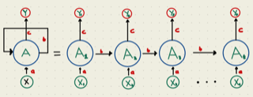

# Recurrent Neural Networks

Recurrent neural networks (RNNs) are a type of artificial neural network that are particularly well-suited for processing sequential data, such as time series, natural language, and speech. They are called "recurrent" because they perform the same task for every element in a sequence, with the output being dependent on the previous computations.

The idea of using neural networks to process sequential data dates back to the 1980s, but it wasn't until the late 1990s that RNNs began to see widespread use. One of the key developments in this period was the use of long short-term memory (LSTM) units, which are a type of "memory" cell that can store information for long periods of time and help prevent the vanishing gradients problem that can occur when training RNNs.  

The RNN processes the input data using a series of "neurons". Each neuron receives input from other neurons and from the input data, processes them using an activation function, and sends the output to other neurons as an input or to the final output of the network.  Hence, the output of a neuron at a given time step is used as the input to the same neuron at the next time step, allowing the network to incorporate information from previous time steps into its current computation. The RNN process can be illustrated as follows:

```{r, echo=FALSE, out.width = '65%', out.height='60%'}

```  

The network above is designed such that it takes input $X_t$ sequentially. Each $X_t$ feeds into a hidden layer that has a vector of activation functions, $A_t$.  Except for the first starting point, each activation function also feeds into the next activation function, $A_{t+1}$, sequentially.  The weight vectors are denoted $a$, $b$, and $c$.  As simple univariate RNN can be expressed below:

$$
\begin{aligned}

& A_1=g\left(\omega_0+\omega_1 X_1\right)\\
& A_2=g\left(\omega_0+\omega_1 X_2+\omega_2 A_1\right) \\
& =g\left(\omega_0+\omega_1 X_2+\omega_2 g\left(\omega_0+\omega_1 X_1\right)\right) \\
& A_3=g\left(\omega_0+\omega_1 X_3+\omega_2 A_2\right) \\
& =g\left(\omega_0+\omega_1 X_3+\omega_2 g\left(\omega_0+\omega_1 X_2+\omega_2 g\left(\omega_0+\omega_1 X_1\right)\right)\right. \\
& ~~~~~~~~~~~~~~~~\vdots\\
& A_t=g\left(\omega_0+\omega_1 X_t+\omega_2 A_{t-1}\right)
\end{aligned}
$$
Note that weights are the same in each sequence.  Although the output layer produces sequence of predictions, the final output is the network's prediction.  

$$
Y_{t}=\beta_0+ \beta_k A_{t}
$$

In case of multiple inputs at time $t$, $X_{t}=\left(X_{t1}, X_{t2}, \ldots, X_{tp}\right)$, and multiple units ($k$) in the hidden layer, $A_t = \left(A_{t1}, A_{t2}, \ldots, A_{tk}\right)$, the network at time $t$ becomes:

$$
A_{k, t}=g\left(\omega_{k 0}+\sum_{j=1}^p \omega_{k j} X_{t j}+\sum_{v=1}^k \theta_{k v} A_{v,t-1}\right).
$$
For example, for two units and two variables, $A_{k,t}$ will be

$$
A_{1,t}=g\left(\omega_{10}+ \omega_{1 1} X_{t,1}+\omega_{1 2} X_{t,2}+ 
\theta_{1 1} A_{1,t-1}+\theta_{1 2} A_{2,t-1}\right),\\
A_{2,t}=g\left(\omega_{20}+ \omega_{2 1} X_{t, 1}+\omega_{2 2} X_{t,2}+ 
\theta_{2 1} A_{1,t-1}+\theta_{2 2} A_{2,t-1}\right)
$$
and the output $O_{\ell}$ is computed as
$$
Y_{t}=\beta_0+\sum_{k=1}^2 \beta_k A_{k,t}
$$

## Keras

We will use the Keras deep-learning framework (<https://keras.rstudio.com>) and the package `keras`, which provides high-level building blocks for developing deep-learning models. Keras operates on several tensor libraries to tensor manipulations and differentiation, one of which is TensorFlow.  

Tensors are simply multidimensional arrays, which are a generalization of vectors and matrices to an arbitrary number of dimensions. For example, vectors are 1D tensors, matrices are used for 2D tensors, and arrays (which support any number of dimensions) are used for multi-dimensional objects.  Keras works on CPUs, but the most efficient implementations of Keras use NVIDIA GPUs and properly configured CUDA and cuDNN libraries.  For CPU-based installation of Keras, which is what we use in this chapter, we suggest the following steps after installing the `keras` package.

```{r}
# Sys.unsetenv ("RETICULATE_PYTHON")
# remotes : sinstall_github("Istudio/reticulate")
# reticulate::install_miniconda()
# keras::install_keras ()
```

The best source using Keras for artificial neural network projects with R is "Deep Learning with R" by Chollet and Allaire.  In this section, we will use the `keras` package (on CPU) for two main time series applications: RNN and LSTM. 

Let's set up our COVID-19 data and standardize each of the variables.

```{r, message=FALSE, warning=FALSE}
library(tsibble)
library(fpp3)

load("~/Dropbox/ToolShed_draft/toronto2.rds")
toronto2 <- data
df <- toronto2 %>%
  mutate(dcases = difference(cases),
         dmob = difference(mob),
         ddelay = difference(delay),
         dmale = difference(male),
         dtemp = difference(temp),
         dhum = difference(hum))

dft <- df[ ,-c(2:5,7,8)] #removing levels
dft <- dft[-1, c(3:7,2)] # reordering the columns
sdtf <- scale(dft) #
head(sdtf)
```
  
There are four stages in developing ANN models in Keras:
  
- Preparing the training set with input tensors and target tensors;
- Defining the model, that is a network of layers;
- Choosing the learning parameters: a loss function, an optimizer, and some metrics to monitor
- And finally fitting this model to the training set

## Input Tensors

We will define a three dimensional array that contains time series data.  First, let's see an array:

```{r}
# array
x1 = c(1, 2, 3)
x2 = c(4, 5, 6, 7, 8, 9)
adata <- array(c(x1, x2), dim = c(3,3,2))
dim(adata)
adata
adata[1,,]
```

Now, we create our data matrix:

```{r}
# Data
toydata <- matrix(c(1:100, 101:200, 201:300), 100)
colnames(toydata) <- c("y", "x1", "x2")
head(toydata)
```

Supposed that this is daily data and we try to make 1-day-ahead predictions.  In preparing the input tensor, we need to decide how many past days to predict the next day’s value.  Supposed that we decide on 5 days.  As we seen before, we transform the data by embedding to new structure:

```{r}
datam <- embed(toydata, 6)
datam <- datam[, -c(2:3)]
head(datam)
```

The second line in the code above removes the contemporaneous features. We should have $100 - 5 = 95$ samples, in each one we have 3 features and 5 timesteps.  The first two samples, each is a matrix of $5 \times 3$, are shown below:

```{r, echo=FALSE}
n <- nrow(datam)
f1 <- data.matrix(datam[, -1]) 
f2 <- array(f1, c(n, 3, 5))
f3 <- f2[,, 5:1]
f4 <- aperm(f3, c(1, 3, 2))
f4[1,,]
f4[2,,]
```
  
The outcome variable $y$ is 6 and 7 in the first and second samples.  Let's see how we can manipulate our embedded data `datam` to achieve it:

```{r}
n <- nrow(datam)
f1 <- data.matrix(datam[, -1]) # Removing Y
f2 <- array(f1, c(n, 3, 5))
f2[1,,]
```

We need reverse the order

```{r}
f3 <- f2[,, 5:1]
f3[1,,]
```

And, taking the transposition, 

```{r}
t(f3[1,,])
```

For the whole array of `datam` using array transposition:

```{r}
f4 <- aperm(f3, c(1, 3, 2))
f4[1,,]
```

Now, we are ready to apply all these steps to our toy data with a function:

```{r}
tensorin <- function(l, x){
  maxl = l+1
  xm <- embed(x, maxl)
  xm <- xm[, -c(2:3)] 
  n <- nrow(xm)
  f1 <- data.matrix(xm[, -1]) 
  y <- xm[, 1]
  f2 <- array(f1, c(n, ncol(x), l))
  f3 <- f2[,, l:1]
  f4 <- aperm(f3, c(1, 3, 2))
  list(f4, y)
} 

tensored <- tensorin(5, toydata)
X <- tensored[1]
y <- tensored[2]
X[[1]][1,,]
y[[1]][1]
```
  
We can apply it to our COVID-19 data for 7-day windows:

```{r}
trnt <- tensorin(7, sdtf)
X <- trnt[1]
y <- trnt[2]
X[[1]][1,,]
y[[1]][1]
```

Obviously, our choice of $l = 7$ here is arbitrary and should be decided with a proper validation.

## RNN

As we have the input tensor stored as an array of (258, 7, 6), we are ready to design our network for an RNN with one layer with 24 hidden units (neurons):

```{r, warning=FALSE, message=FALSE, cache=TRUE}
library(keras)
model <- keras_model_sequential() %>%
  layer_simple_rnn(units = 24,
                   input_shape = list(7, 6),
                   dropout = 0.1, recurrent_dropout = 0.1) %>%
  layer_dense(units = 1)

model %>% compile(optimizer = optimizer_rmsprop(),
loss = "mse")
```

As before, neural networks consist of layers and neurons in each layer.  Since we use sequence data stored in 3D tensors of shape (samples, timesteps, features) we will use recurrent layers for our RNN. The term `layer_dense` is the output layer. 

We also (arbitrarily) specify two types of dropout for the units feeding into the hidden layer. The first one is set for the input feeding into a layer.  The second one is for the previous hidden units feeding into the same layer. 

One of the tools to fight with overfitting is randomly removing inputs to a layer. Similar to Random Forest, this dropping out process has the effect of generating a large number of networks with different network structure and, in turn, breaking the possible correlation between the inputs that the layers are exposed to. These "dropped out" inputs may be variables in the data sample or activations from a previous layer.  This is a conventional regularization method to in ANN but how this can be applied to sequential data is a complex issue. Every recurrent layer in Keras has two dropout-related arguments: `dropout`, a float specifying the dropout rate for input units of the layer, and `recurrent_dropout`, specifying the dropout rate of the recurrent units. These are again additions to our hyperparameter grid.

It has the effect of simulating a large number of networks with very different network structure and, in turn, making nodes in the network generally more robust to the inputs.

Before fitting the model, we need to split the data.  We have 258 observations in total.  We will take the last 50 observations as our test set:

```{r}
dim(X[[1]])
```

```{r}
train <- 1:208
test <- 208:dim(X[[1]])[1]
```

And, finally we fit our RNN.  There are two hyperparameters that Keras use in fitting RNN: batch size and epoch.  They are both related to how and how many times the weights in the network will be updated

The batch size is the  number of observations ("samples") used in its gradient descent to update its internal parameters.  For example, a conventional (batch) gradient descent uses the entire data in one batch so that the batch size would be the number of samples in the data.  The stochastic gradient descent, on the other hand, uses randomly selected each observation.  While the batch gradient descent is efficient (fast) it is not as robust as the stochastic gradient descent.  Therefore, Keras uses a mini-batch gradient descent as a  parameter that balance the between efficiency and robustness.

The number of epochs is the number of times the algorithm works trough the complete training dataset. We need multiple passes through the entire data because updating the weights with gradient descent in a single pass (one epoch) is not enough.  But, when the number of epochs goes up, the algorithm updates the weights more. As a result, the  curve goes from underfitting (very few runs) to overfitting (too many runs).

Hence, these two parameters, batch size and epoch, should be used as hyperparameters.  Note that we pick arbitrary numbers below.

```{r, warning=FALSE, message=FALSE, cache=TRUE}
tensorflow::set_random_seed(432)
history <- model %>% fit(
  X[[1]][train,, ], y[[1]][train], batch_size = 12, epochs = 75,
  validation_data =
    list(X[[1]][test,, ], y[[1]][test]),
  verbose = 0
  )

plot(history)
```


```{r, warning=FALSE, message=FALSE}
y_act <- y[[1]][test]
var_y <- var(y_act)
yhat <- predict(model, X[[1]][test,, ])
1 - mean((yhat -y_act)^2) / var_y # R^2
sqrt(mean((yhat -y_act)^2)) # RMSPE
```

```{r}
plot(y[[1]][test], type ="l", col = "blue",
     ylab = "Actual (Blue) vs. Prediction (Red)",
     xlab = "Last 50 Days",
     main = "RNN Forecasting for Covid-19 Cases")
lines(yhat, col = "red", lwd = 2)
```
It looks like, our RNN without a proper training is capturing most ups downs correctly.  There are three groups of hyperparameters that we need to search by validation :

- How many days we need in the past to predict the next day’s value? We picked 7.
- The number of units per layer: we picked 24
- Regularization parameters: we picked `dropout` and `recurrent_dropout` as 0.1
- Stochastic gradient descent parameters: batch size (12) and the number of epoch (75)

All these parameters that we picked arbitrarily should be selected by a proper validations.  Model tuning in ANN is highly dependent on the package and its back-end software that we use in deep learning.  Keras with TensorFlow is one the top AI engines available.  The best source for learning more on deep learning using Keras is "Deep Learning with R" by Chollet and Allaire.   

## LSTM

One issue with RNN is that, although it is able to retain information trough time by its recurrent network, it quickly forgets long-term dependencies. This problem is called the *vanishing gradient problem* and can be easily seen here:

$$
\begin{aligned}
& A_3=g\left(\omega_0+\omega_1 X_3+\omega_2 A_2\right) \\
& =g\left(\omega_0+\omega_1 X_3+\omega_2 g\left(\omega_0+\omega_1 X_2+\omega_2 g\left(\omega_0+\omega_1 X_1\right)\right)\right. \\
\end{aligned}
$$

Although this has only two iterations, the function has $\omega_2^2$ (if $g()$ is ReLu). For example, if $\omega_2 = 0.5$, the effect of $A_5$ on $A_1$ will be regulated by $\omega_2^4 = 0.0625$.  We can argue that $\omega_2$ could be one (random walk). But, the first differencing will usually remove the unit root in the data $\omega_2$ will be bounded between 0 and 1.

Hence, the LSTM (Long Short-Term Memory) layers in RNN are designed to solve this problem.

