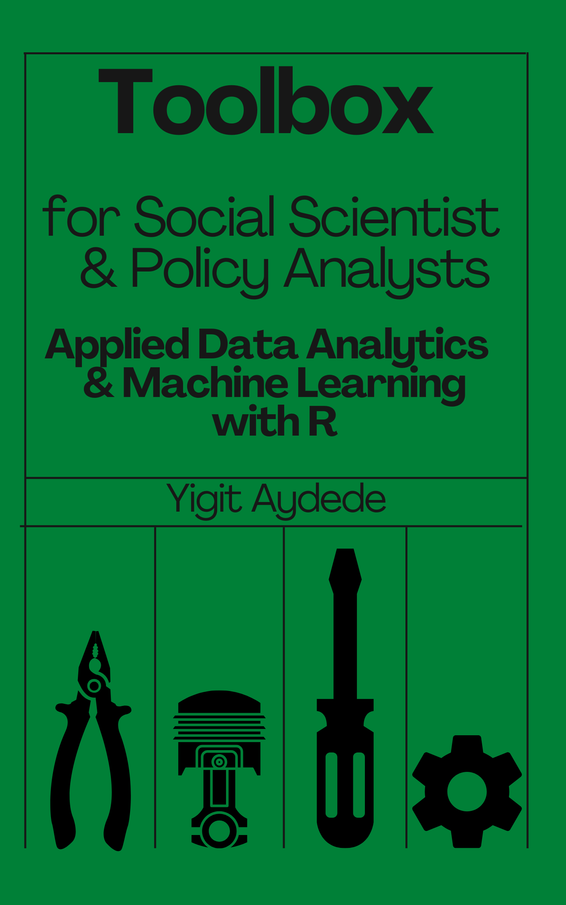
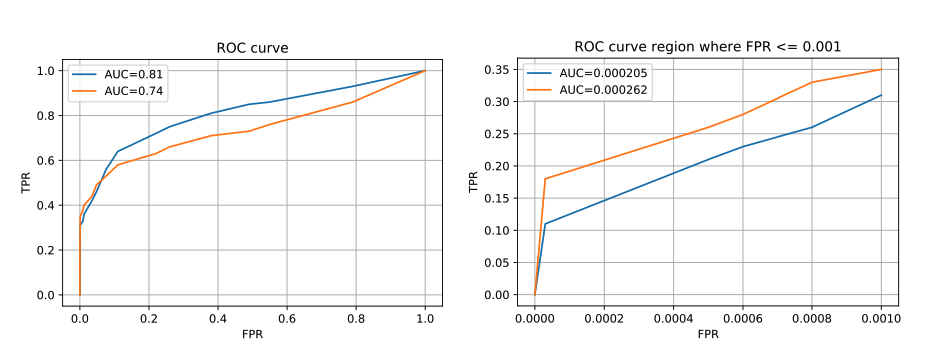
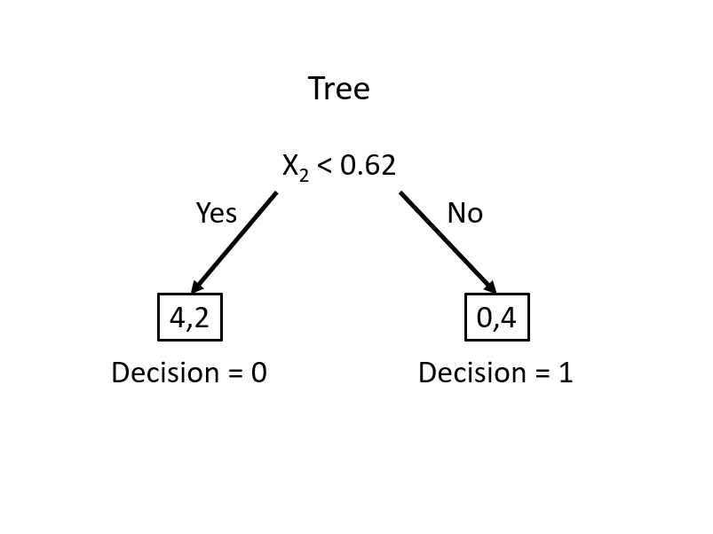

# Preface {.unnumbered}

Our lives are shaped by predictions that we make daily. The process of predicting is not static. We want to improve our predictions to avoid catastrophes in our lives ... We learn from our mistakes. We are all self-learning walking machines with a very limited processing capacity. Can we develop a self-learning algorithm for a high-capacity machine that can make prediction more efficiently and accurately for us? Yes, we can! With the well-developed statistical models programmed in very effective algorithms run by high-capacity computers.

This book takes on the first part, **statistical models**, without too much abstraction. It doesn't teach all aspects of **programming** but enough coding skills that you can find your way in building predictive algorithms with R. All gets into a computer. So, we also need to know enough about the "machines" with which we can facilitate a better efficiency. We have enough of it too ...

```{r, echo=FALSE}

```

According to Leo Breiman [@Breiman_2001], [Statistical Modeling: The Two Cultures](https://projecteuclid.org/download/pdf_1/euclid.ss/1009213726), there are two goals in analyzing the data:

> **Prediction**: To be able to predict what the responses are going to be to future input variables; **Information**: To extract some information about how nature is associating the response variables to the input variables.

And there are two approaches towards those goals:

**The Data Modeling Culture** : One assumes that the data are generated by a given stochastic data model (econometrics) ...\
**Algorithmic Modeling Culture**: One uses algorithmic models and treats the data mechanism as unknown (machine learning) ...

And he describes the current state:

> ...With the insistence on data models, multivariate analysis tools in statistics are frozen at discriminant analysis and logistic regression in classification and multiple linear regression in regression. Nobody really believes that multivariate data is multivariate normal, but that data model occupies a large number of pages in every graduate text book on multivariate statistical analysis...

Broadly speaking, many social scientists look at a statistical analysis from the window of causal inference. They don't focus on predictions, even if "ice cream sales predict crime rates" very well (Pearl et al. 2016). They know that a higher ice cream sales do not cause higher crime rates. What's missing here is that, although a predictive model that accurately predicts outcomes is great, most of the time we don't just need predictions but we want to be able to find the important predictors.  This is specially important when we have unconventional or high-dimensional data. For example, if you build a model of house prices, knowing which features are most predictive of price tells us which features people are willing to pay for. In fact, the use of machine learning models as a means of variable selection is growing in many classification tasks beyond those "*Netflix problems*". Bioinformatics is one the few scientific fields extensively using machine learning methods to select a subset of genetic markers relevant for the prediction of a certain disease, for example.   

Solving these problems requires more than an application of predictive model - a "function" in R or Python.  As I tried to look at predictions from economists' perspective, the book has become a "**tool shed**" for social scientists and policy analysts beyond machine learning "code" applications. It starts with describing a formal distinction between causal inference and prediction and adds many other tools that cannot be easily found in "econometrics" textbooks: nonparametric methods, unbiased variable importance measures, penalized regressions, model selection with sparsity, dimension reduction methods, nonparametric time-series predictions, graphical network analysis, algorithmic optimization methods, classification with imbalanced data, and so on. These are not new, but I collect and cover them from scratch in one book with less abstraction and more applications using R.

# Who {.unnumbered}

This book is targeted at *motivated* students and researchers who have no robust statistical background. It is applied because I skip many theoretical proofs and justifications that can easily be found elsewhere. I do not assume a previous experience with R but some familiarity with coding.

# Acknowledgements {.unnumbered}

This book was made possible by Mutlu Yuksel, Tolga Kaya, Mehmet Caner, Juri Marcucci, Atul Dar, Andrea Guisto and my wife Isik Aydede. This work is greatly inspired by following books and people:

1.  [Introduction to Statistical Learning](http://faculty.marshall.usc.edu/gareth-james/ISL/) by Gareth James, Daniela Witten, Trevor Hastie and Robert Tibshirani.
2.  [Introduction to Data Science](https://rafalab.github.io/dsbook/) by Rafael A. Irizarry.\
3.  [Applied Statistics with R](https://daviddalpiaz.github.io/appliedstats/) by David Dalpiaz
4.  [R for Statistical Learning](https://daviddalpiaz.github.io/r4sl/) by David Dalpiaz

I also benefited from my participation in the Summer School of [SiDe](https://www.side-iea.it/events/summer-schools) in 2019 on *Machine Learning Algorithms for Econometricians* by [Arthur Carpentier](https://freakonometrics.github.io) and [Emmanuel Flachaire](https://www.amse-aixmarseille.fr/fr/membres/flachaire) and in 2017 on *High-Dimensional Econometrics* by [Anders Bredahl Kock](https://sites.google.com/site/andersbkock/) and [Mehmet Caner](https://poole.ncsu.edu/people/mehmet-caner/).

Finally, I thank my research assistant Kyle Morton. Without him, this book wouldn't be possible.

```{r include=FALSE}
# automatically create a bib database for R packages
knitr::write_bib(c(
  .packages(), 'bookdown', 'knitr', 'rmarkdown'
), 'packages.bib')
```

<!--chapter:end:index.Rmd-->

# How we define Machine Learning {#intro}

The demand for skilled data science practitioners in industry, academia, and government is rapidly growing. This book introduces concepts and skills that can help you develop a foundation that is missing in many educational platforms for Machine Learning. This book is a collection of my lecture notes that I have developed in the past 10 years.  Therefore, its language is not formal and it leaves most theoretical proofs to carefully selected cited sources.  It feels like a written transcript of lectures more than a reference textbook that covers from A to Z.

As of today (August 29, 2022), more than 103,942 people have been enrolled in the **Machine Learning** course offered online by Stanford University at [Coursera](https://www.coursera.org/learn/machine-learning).  The course is offered multiple times in a month and can be completed in approximately 61 hours.

I had a hard time for finding a good title for the book on a field where the level of interest is jaw-dropping.  Even finding a good definition for Machine Learning has became a subtle job as "machine learning" seems increasingly an *overloaded* term implying that a robot-like *machine* predicts things by learning itself without being explicitly programmed.  

Ethem Alpaydin, who is a professor of computer engineering, defines machine learning in the $3^{rd}$ edition of his book, [*Introduction to Machine Learning*](https://mitpress.mit.edu/books/introduction-machine-learning-third-edition) [@alpaydin_2014] as follows:

> Machine learning is programming computers to optimize a performance criterion using example data or past experience.  We have a model defined up to some parameters, and learning is the execution of a computer program to optimize the parameters of the model using the training data of past experience. (...) Machine learning uses the ***theory of statistics in building mathematical models***, because the core task is making inference from sample.  The role of computer science is twofold: First, in training, we need efficient algorithms to solve the optimization problem, as well as to store and process the massive amount of data we generally have.  Second, once the model is learned, its representation and algorithmic solution for inference needs to be efficient as well.
>

Hence, there are no "mysterious" machines that are learning and acting alone. Rather, there are well-defined **statistical models** for predictions that are optimized by efficient algorithms, and executed by powerful machines that we know as computers.  

<!--chapter:end:01-Intro.Rmd-->

# Preliminaries

This chapter will review some basic concepts in statistics.  For now, don't stress about understanding the code chunks.  As you study and practice R more (See R Labs at the end of the book), the codes here will become clearer.

## Data and dataset types

R has a number of basic data types. 
  
- **Numeric** : Also known as Double. The default type when dealing with numbers. 1,1.0,42.5    
- **Integer**: 1L,2L,42L   
- **Complex**:  4 + 2i   
- **Logical**: Two possible values: TRUE and FALSE. `NA` is also considered logical.   
- **Character**: "a","Statistics","1plus2."   

Data can also be classified as **numeric** (what's your age?) and **categorical** (Do you have a car?)  

R also has a number of basic data structures. A data structure is either **homogeneous** (all elements are of the same data type) or **heterogeneous** (elements can be of more than one data type):  You can think each data structure as **data container** where you data is stored.  Here are the main "container" or data structures.  Think it as Stata or Excel spread-sheets.  
  
- **Vector**: 1 dimension (column OR row) and homogeneous. That is every element of the vector has to be the same type. Each vector can be thought of as a variable. 
- **Matrix**: 2 dimensions (column AND row) and homogeneous. That is every element of the matrix has to be the same type. 
- **Data Frame**: 2 dimensions (column AND row) and heterogeneous. That is every element of the data frame doesn't have to be the same type.  This is the main difference between a matrix and a data frame. Data frames are the most common data structure in any data analysis. 
- **List**: 1 dimension and heterogeneous. Data can be multiple data structures. 
- **Array**: 3+ dimensions and homogeneous. 

In this book, we most frequently work with data frames.

When using data, there are three things we like to do:   
  
- Look at the raw data.   
- Understand the data. (What are the variables?)   
- Visualize the data.   
  
To look at the data, we have two useful commands: `head()` and `str()`, as seen in the examples below. `head()` allows us to see the first few data points in a dataset. `str()` allows us to see the structure of the data, including what data types are used. Using `str()` we can identify the **mtcars** dataset only includes numeric variables, and is structured in a data frame structure.

**Cross-Sectional**
```{r stat1, message=FALSE, warning=FALSE}
library(datasets)

head(mtcars)
str(mtcars)
summary(mtcars)
plot(mtcars[,c(1, 3, 4)])
```

**Time-series**  
```{r stat2, message=FALSE, warning=FALSE}
head(airquality)
str(airquality)
summary(airquality)
```
  

```{r stat3, message=FALSE, warning=FALSE}
airquality$date <- airquality$Month*10+airquality$Day
plot(airquality$date, airquality$Ozone)
```

This was just a simple time-series data presentation.  In Part VIII, we will see more advance ways to handle time-series data.   Moreover, dates and times can be handled by various packages/functions in R, like `lubridate` (see <https://lubridate.tidyverse.org>).  

Here are some examples

```{r, message=FALSE, warning=FALSE}
library(lubridate)
# get current system date
Sys.Date() 

# get current system time
Sys.time()

#lubridate
now()
dates <- c("2022-07-11", "2012-04-19", "2017-03-08")

# extract years from dates
year(dates)

# extract months from dates
month(dates)

# extract days from dates
mday(dates)
```


  
**Panel**  
Panel data (also known as longitudinal data) is a dataset in which the behavior of multiple entities are observed across time. These entities could be states, companies, individuals, countries, etc. Note in the example below, two countries ("A", and "B") have variables observed over a time span between 1990 to 1999.
  
```{r stat4, message=FALSE, warning=FALSE}
library(foreign)
panel <- read.dta("http://dss.princeton.edu/training/Panel101.dta")
panel[1:20,1:7]
```

## Plots

Often, a proper visualization can illuminate features of the data that can inform further analysis.  We will look at four methods of visualizing data that we will use throughout the book:   
- **Histograms**   
- **Barplots**    
- **Boxplots**    
- **Scatterplots**    

We can use the vehicle data, `mpg` inside the `ggplot2` package. To begin, we can get a sense of the data by looking at the first few data points and some summary statistics.

```{r stat5, message=FALSE, warning=FALSE}
library(ggplot2)
head(mpg, n=20L)
summary(mpg)
```
  
When visualizing a single numerical variable, a histogram would be very handy:    

```{r stat6, message=FALSE, warning=FALSE}
hist(mpg$cty, xlab = "Miles Per Gallon (City)",
     main = "Histogram of MPG (City)", breaks = 12,
     col = "dodgerblue",cex.main=1, cex.lab=.75, cex.axis=0.75,
     border = "darkorange")
```
  
Similar to a histogram, a barplot provides a visual summary of a categorical variable, or a numeric variable with a finite number of values, like a ranking from 1 to 10.  

```{r stat7, message=FALSE, warning=FALSE}
barplot(table(mpg$drv), 
        xlab = "Drivetrain (f = FWD, r = RWD, 4 = 4WD)", ylab = "Frequency",
        main = "Drivetrains",
        col = "dodgerblue",cex.main=1, cex.lab=.75, cex.axis=0.75,
        border = "darkorange")
```
  
To visualize the relationship between a numerical and categorical variable, we will use a boxplot. In the `mpg` dataset, the `drv` variable takes a small, finite number of values. A car can only be front-wheel drive, 4-wheel drive, or rear-wheel drive.  

```{r stat8, message=FALSE, warning=FALSE}
boxplot(hwy ~ drv, data = mpg,
        xlab = "Drivetrain (f = FWD, r = RWD, 4 = 4WD)",
        ylab = "Miles Per Gallon (Highway)",
        main = "MPG (Highway) vs Drivetrain",
        pch = 20, cex =2,cex.main=1, cex.lab=.75, cex.axis=0.75,
        col = "darkorange", border = "dodgerblue")
```
  
Finally, to visualize the relationship between two numeric variables we will use a scatterplot.  

```{r stat9, message=FALSE, warning=FALSE}
plot(hwy ~ displ, data = mpg,
     xlab = "Engine Displacement (in Liters)",
     ylab = "Miles Per Gallon (Highway)",
     main = "MPG (Highway) vs Engine Displacement",
     pch = 20, cex = 2, cex.main=1, cex.lab=.75, cex.axis=0.75,
     col = "dodgerblue")
```
  
  
While visualization is not enough to draw definitive conclusions, it can help us identify insights that can inform our deeper analysis.  R is well-know for its graphical capabilities. The package `ggplot` is the main tool for more advance graphical representations that we will see later.  

  
## Probability Distributions with R

We often want to make probabilistic statements based on a distribution.  Typically, we will want to know one of four things:  
  
- The probability density function (pdf) at a particular value.   
- The cumulative probability distribution (cdf) at a particular value.    
- The quantile value corresponding to a particular probability.   
- A random draw of values from a particular distribution.   

The general naming structure of the relevant R functions is:   
  
- `dname` calculates density (pdf) at input $x$.   
- `pname` calculates distribution (cdf) at input $x$.   
- `qname` calculates the quantile at an input probability.    
- `rname` generates a random draw from a particular distribution.   
  
where `name` represents the name of the given distribution, like `rnorm` for a random draw from a normal distribution

For example, consider a random variable $X$:  

$$
X \sim N\left(\mu=2, \sigma^{2}=25\right)
$$
  
To calculate the value of the pdf at $x = 4$, that is, the height of the curve at $x = 4$, use `dnorm()`:

```{r stat10, message=FALSE, warning=FALSE}
dnorm(x = 4, mean = 2, sd = 5)
```
  
Note that R uses the standard deviation.    
  
To calculate the value of the cdf at $x = 4$, that is, $P(X \leq{4})$, the probability that $X$ is less than or equal to 4, use `pnorm()`:  

```{r stat11, message=FALSE, warning=FALSE}
pnorm(q = 4, mean = 2, sd = 5)
```
  
Or, to calculate the quantile for probability 0.975, use `qnorm()`:  

```{r stat12, message=FALSE, warning=FALSE}
qnorm(p = 0.975, mean = 2, sd = 5)
```
  
Lastly, to generate a random sample of size n = 10, use `rnorm()`   

```{r stat13, message=FALSE, warning=FALSE}
rnorm(n = 10, mean = 2, sd = 5)
```

These functions exist for many other distributions such as: `binom` (Binomial), `t` (Student's t), `pois` (Poisson), `f` (F), `chisq` (Chi-Squared).  
  
## Regressions

Regressions allow us to make estimations of the relationships between variables. Let’s consider a simple example of how the speed of a car affects its stopping distance. To examine this relationship, we will use the `cars` data set. We can start by getting some basic information about the data using `str()` and `summary()` again.

```{r stat14, message=FALSE, warning=FALSE}
str(cars)
summary(cars)
```

Note that the variable names are quite long. To make them easier to work with, we can change them. We do this first by making a new data frame so we don't alter the initial data when making changes. Then we apply new column names to it with the `colnames()` function. Our new names will be `speed` and `dist`.

```{r}
carsDF <- cars
colnames(carsDF) <- c("speed", "dist")
```

Finally, we can plot the speed and stopping distance in a scatterplot to get a sense of their relationship before proceeding with a formal regression.

```{r stat15, message=FALSE, warning=FALSE}
plot(dist ~ speed, data = carsDF,
     xlab = "Speed (in Miles Per Hour)",
     ylab = "Stopping Distance (in Feet)",
     main = "Stopping Distance vs Speed",
     pch = 20, cex = 2,cex.main=1,
     cex.lab=.75, cex.axis=0.75, col = "grey")
```

This visualization suggests there could be a relationship.

In this example, we are interested in using the predictor variable `speed` to predict and explain the response variable `dist`.  We could express the relationship between $X$ and $Y$ using the following "Data Generating Process" (DGP):  

\begin{equation}
Y=f(X)+\epsilon
  (\#eq:2-1)
\end{equation} 
  
Here $Y$ from 2.1 is the outcome determined by two parts: $f(X)$, which is the deterministic part (a.k.a Data Generating Model - DGM) and $\epsilon$ the random part that makes the outcome different for the same $X$ for each observation.  What's $f(X)$?  We will see later that this question is very important.  For now, however, we assume that $f(X)$ is linear as  

\begin{equation}
f(X)=\beta_{0}+\beta_{1} x_{i}.
  (\#eq:2-2)
\end{equation} 

  
And,

$$
\begin{array}{l}{\qquad Y_{i}=\beta_{0}+\beta_{1} x_{i}+\epsilon_{i}} \ {\text { where }} \ {\qquad \epsilon_{i} \sim N\left(0, \sigma^{2}\right)}\end{array}
$$
We could think that $Y$ has different distribution for each value of $X$. Hence, $f(x)$ becomes the conditional mean of $Y$ given $X$.  

$$
f(X) = \mathrm{E}\left[Y | X=x_{i}\right]=\beta_{0}+\beta_{1} x_{i},
$$

which means that $\mathrm{E}\left[\epsilon | X=x_{i}\right]=0$.  This model, which is also called as the population regression function (PRF), has three parameters to be estimated: $\beta_{0}$, $\beta_{1}$,  and $\sigma^{2}$, which are fixed but unknown constants. The coefficient $\beta_{1}$ defines the relationship between $X$ and $Y$. Inferential statistics deals with estimating these population parameters using a sample drawn from the population. The statistical inference requires an estimator of a population parameter to be BLUE (Best Linear Unbiased Estimator) which is usually challenging to satisfy. A BLU estimator also requires several assumptions on PRF. These include that:  
  
- The errors are **independent** (no serial correlation).    
- The errors are **identically** distributed (constant variance of $Y$ for different values of $X$)  .  

How do we actually find a line that represents the best relationship between $X$ and $Y$ best? We must find a line that minimizes the sum of squared "errors". This is the Ordinary Least Squares (OLS) method:  

\begin{equation}
\underset{\beta_{0}, \beta_{1}}{\operatorname{argmin}} \sum_{i=1}^{n}\left(y_{i}-\left(\beta_{0}+\beta_{1} x_{i}\right)\right)^{2}
  (\#eq:2-3)
\end{equation} 

Using R, we can apply this method very simply with a bit of code.

```{r stat16, message=FALSE, warning=FALSE}
model <- lm(dist ~ speed, data = carsDF)
b <- coef(model)
plot(carsDF, col = "blue", pch = 20)
abline(b, col = "red", lty = 5)
```
  
Although we can see here the red line which minimizes the sum of squared error using the OLS method, we can try understand this problem mathematically.

### Ordinary Least Squares (OLS)

The solution to this problem starts with defining the loss function, finding the first order conditions (F.O.C.) and solving them through **normal equations**.  


\begin{equation}
f\left(\beta_{0}, \beta_{1}\right)=\sum_{i=1}^{n}\left(y_{i}-\left(\beta_{0}+\beta_{1}
x_{i}\right)\right)^{2}=\sum_{i=1}^{n}\left(y_{i}-\beta_{0}-\beta_{1} x_{i}\right)^{2}
  (\#eq:2-4)
\end{equation} 


  
  
$$
\begin{aligned} \frac{\partial f}{\partial \beta_{0}} &=-2 \sum_{i=1}^{n}\left(y_{i}-\beta_{0}-\beta_{1} x_{i}\right) \\ \frac{\partial f}{\partial \beta_{1}} &=-2 \sum_{i=1}^{n}\left(x_{i}\right)\left(y_{i}-\beta_{0}-\beta_{1} x_{i}\right) \end{aligned}
$$
  
Here are 2 equations and 2 unknowns:  

$$
\begin{array}{c}{\sum_{i=1}^{n}\left(y_{i}-\beta_{0}-\beta_{1} x_{i}\right)=0} \end{array}
$$
  
$$
\begin{array}{c}{\sum_{i=1}^{n}\left(x_{i}\right)\left(y_{i}-\beta_{0}-\beta_{1} x_{i}\right)=0}\end{array}
$$
  
Which can be expressed:

\begin{equation}
\begin{array}{c}{n \beta_{0}+\beta_{1} \sum_{i=1}^{n} x_{i}=\sum_{i=1}^{n} y_{i}} \end{array}
  (\#eq:2-5)
\end{equation} 

\begin{equation}
\begin{array}{c}{\beta_{0} \sum_{i=1}^{n} x_{i}+\beta_{1} \sum_{i=1}^{n} x_{i}^{2}=\sum_{i=1}^{n} x_{i} y_{i}}\end{array}
  (\#eq:2-6)
\end{equation} 

These functions (2.5 and 2.6) are also called **normal equations**.  Solving them gives us:    

\begin{equation}
\beta_{1}=\frac{\text{cov}(Y,X)}{\text{var}(X)}
  (\#eq:2-7)
\end{equation} 

\begin{equation}
\beta_{0}=\overline{y}-\beta_{1} \overline{x}
  (\#eq:2-8)
\end{equation} 


As this is simply a review, it won't be covered in more depth here. Let's use these variance/covariance values to get the parameters.  

```{r stat17, message=FALSE, warning=FALSE}
x <- carsDF$speed
y <- carsDF$dist
Sxy <- sum((x - mean(x)) * (y - mean(y)))
Sxx = sum((x - mean(x)) ^ 2) #Here to show, "=" would work as well
Syy <- sum((y - mean(y)) ^ 2)

beta_1 <- Sxy / Sxx
beta_0 <- mean(y) - beta_1 * mean(x)
c(beta_0, beta_1)
```

Instead of coding each of the steps ourselves, we can also use the `lm()` function to achieve the same thing.

```{r stat18, message=FALSE, warning=FALSE}
model <- lm(dist ~ speed, data = carsDF)
model
```

  
The slope parameter ($\beta_1$) tells us that the stopping distance is predicted to increase by $3.93$ feet on average for an increase in speed of one mile per hour.  The intercept parameter tells us that when the car's speed is zero, it moves backwards. This indicates a modeling problem.  One way to handle it to remove the intercept from the model that starts from the origin.

```{r stat19, message=FALSE, warning=FALSE}
x <- carsDF$speed
y <- carsDF$dist

beta_1 <- sum(x*y) / sum(x^2)
beta_1

model <- lm(dist ~ speed - 1, data = carsDF)
model

```
  
As we can see changing the model affects the prediction.  Unfortunately the single-variable case is usually not a realistic model to capture the determination of the output. Let's use a better dataset, `mtcars`:  

```{r stat20, message=FALSE, warning=FALSE}
head(mtcars)
str(mtcars)
```

We may want to model the fuel efficiency (`mpg`) of a car as a function of its weight (`wt`) and horse power (`hp`). We can do this using our method of normal equations.

$$
Y_{i}=\beta_{0}+\beta_{1} x_{i 1}+\beta_{2} x_{i 2}+\epsilon_{i}, \quad i=1,2, \ldots, n
$$
  
$$
f\left(\beta_{0}, \beta_{1}, \beta_{2}\right)=\sum_{i=1}^{n}\left(y_{i}-\left(\beta_{0}+\beta_{1} x_{i 1}+\beta_{2} x_{i 2}\right)\right)^{2}
$$

$$
\begin{aligned} \frac{\partial f}{\partial \beta_{0}} &=0 \\ \frac{\partial f}{\partial \beta_{1}} &=0 \\ \frac{\partial f}{\partial \beta_{2}} &=0 \end{aligned}
$$
  
$$
\begin{array}{c}{n \beta_{0}+\beta_{1} \sum_{i=1}^{n} x_{i 1}+\beta_{2} \sum_{i=1}^{n} x_{i 2}=\sum_{i=1}^{n} y_{i}} \end{array}
$$
$$
\begin{array}{c}{\beta_{0} \sum_{i=1}^{n} x_{i 1}+\beta_{1} \sum_{i=1}^{n} x_{i 1}^{2}+\beta_{2} \sum_{i=1}^{n} x_{i 1} x_{i 2}=\sum_{i=1}^{n} x_{i 1} y_{i}} \end{array}
$$
  
$$
\begin{array}{c}{\beta_{0} \sum_{i=1}^{n} x_{i 2}+\beta_{1} \sum_{i=1}^{n} x_{i 1} x_{i 2}+\beta_{2} \sum_{i=1}^{n} x_{i 2}^{2}=\sum_{i=1}^{n} x_{i 2} y_{i}}\end{array}
$$
  
We now have three equations and three variables. While we could solve these ourselves, we can again let R solve them for us instead:

```{r stat21, message=FALSE, warning=FALSE}
mpg_model = lm(mpg ~ wt + hp, data = mtcars)
coef(mpg_model)
```

The details of these applications can be reviewed in the lab sessions at the end of the book. When the number of explanatory variables is too large, we have to apply a matrix approach to solve it.  

Up to this point we used OLS that finds the parameters minimizing the residual sum of squares (RSS - or the sum of squared errors).  The other method is called Maximum likelihood Estimator or MLE.

### Maximum Likelihood Estimators

To characterize the distribution of a continuous random variable, you can use the probability density function (pdf).  Recall that pdf of a random variable $X \sim N\left(\mu, \sigma^{2}\right)$ is given by:

$$
f_{x}\left(x ; \mu, \sigma^{2}\right)=\frac{1}{\sqrt{2 \pi \sigma^{2}}} \exp \left[-\frac{1}{2}\left(\frac{x_i-\mu}{\sigma}\right)^{2}\right]
$$
In R, you can use `dnorm(x, mean, sd)` to calculate the pdf of normal distribution.  

- The argument $x$ represent the location(s) at which to compute the pdf. 
- The arguments $\mu$ and $\sigma$ represent the mean and standard deviation of the normal distribution, respectively. 

For example, `dnorm (0, mean=1, sd=2)` computes the pdf at location 0 of $N(1,4)$, normal distribution with mean 1 and variance 4. Let’s see examples of computing the pdf at 2 locations for.

```{r}
dnorm(0, mean = 1, sd = 2)
dnorm(1, mean = 1, sd = 2)
```

In addition to computing the pdf at one location for a single normal distribution, `dnorm` also accepts vectors with more than one elements in all three arguments. For example, suppose that we have the following data, $x$.  We can now compute pdf values for each $x$.

```{r}
x <- seq(from=-10,to=+22,length.out=100)
pdfs <- dnorm(x, mean = 1, sd=2)
plot(x,pdfs)
```

We assume that our $x$ is $X \sim N\left(\mu = 1, \sigma^{2}=4\right)$.  There are two assumption made here: (1) $x$ is normally distributed (as you can see from the code it's a wrong assumption, but ignore it for now); (2) the distribution is defined by mean = 1 and sd = 2.  The main goal in defining the likelihood function is to find the distribution parameters (mean and sd in a normal distribution) that fit to the observed data best.

Let's have an example.  Pretend that we do not see and know the following data creation:

```{r}
x <- rnorm(1000, 2, 7)
```

Of course we can plot the data and calculate the parameters of its distribution (the mean and standard deviation of $x$).  However, how can we do it with likelihood function?  

```{r}
pdfs1 <- dnorm(x, mean = 1, sd=2)
pdfs2 <- dnorm(x, mean = 5, sd=7)
pdfs3 <- dnorm(x, mean = 2, sd=7)
par(mfrow=c(1,3))
plot(x,pdfs1)
plot(x,pdfs2)
plot(x,pdfs2)
```

Which one is the best distribution, representing the true distribution of the data?  This is the idea behind Maximum likelihood method.  Let's define the likelihood function for $x$:

It seems reasonable that a good estimate of the unknown parameter $\mu$ would be the value of $\mu$ that maximizes the the likelihood (not the probability!) of getting the data we observed. The probability density (or mass) function of each $x_{i}$ is $f\left(x_{i} ; \mu, \sigma^2\right)$. Then, the joint probability density function of $x_{1}, x_{2}, \cdots, x_{n}$, which we'll call $L(\mu, \sigma^2)$ is:

$$
L(\mu, \sigma^2)=P\left(X_{1}=x_{1}, X_{2}=x_{2}, \ldots, X_{n}=x_{n}\right)=f\left(x_{1} ; \mu,\sigma^2\right) \cdot f\left(x_{2} ; \mu,\sigma^2\right) \cdots f\left(x_{n} ; \mu, \sigma^2\right)=\prod_{i=1}^{n} f\left(x_{i} ; \mu, \sigma^2\right)
$$
The first equality is just the definition of the joint probability density function.  The second equality comes from that fact that we have a random sample, $x_i$, that are independent
are independent.  Hence, the likelihood function is:

$$
L(\mu, \sigma)=\sigma^{-n}(2 \pi)^{-n / 2} \exp \left[-\frac{1}{2 \sigma^{2}} \sum_{i=1}^{n}\left(x_{i}-\mu\right)^{2}\right]
$$

and therefore the log of the likelihood function:

$$
\log L\left(\mu, \theta_{2}\right)=-\frac{n}{2} \log \sigma^{2}-\frac{n}{2} \log (2 \pi)-\frac{\sum\left(x_{i}-\mu\right)^{2}}{2 \sigma^{2}}
$$
Now, upon taking the partial derivative of the log likelihood with respect to $\mu$ and setting to 0, we see that:

$$
\frac{\partial \log L\left(\theta_{1}, \theta_{2}\right)}{\partial \theta_{1}}=\frac{-\not 2 \sum\left(x_{i}-\mu\right)(-\not1)}{\not2 \sigma^{2}} \stackrel{\mathrm{SET}}{=} 0
$$
and we get

$$
\sum x_{i}-n \mu=0
$$
$$
\hat{\mu}=\frac{\sum x_{i}}{n}=\bar{x}
$$

We can solve for $sigma^2$ by the same way.

Now the regression. Since,  

$$
Y_{i} | X_{i} \sim N\left(\beta_{0}+\beta_{1} x_{i}, \sigma^{2}\right)
$$
  
$$
f_{y_{i}}\left(y_{i} ; x_{i}, \beta_{0}, \beta_{1}, \sigma^{2}\right)=\frac{1}{\sqrt{2 \pi \sigma^{2}}} \exp \left[-\frac{1}{2}\left(\frac{y_{i}-\left(\beta_{0}+\beta_{1} x_{i}\right)}{\sigma}\right)^{2}\right]
$$
  
Given $n$ data points $(x_i,y_i)$ we can write the likelihood as a function of the three parameters $\beta_0$, $\beta_1$, and $\sigma^2$.  

\begin{equation}
L\left(\beta_{0}, \beta_{1}, \sigma^{2}\right)=\prod_{i=1}^{n} \frac{1}{\sqrt{2 \pi \sigma^{2}}} \exp \left[-\frac{1}{2}\left(\frac{y_{i}-\beta_{0}-\beta_{1} x_{i}}{\sigma}\right)^{2}\right]
  (\#eq:2-9)
\end{equation} 

    
Our goal is to find values of $\beta_0$, $\beta_1$, and $\sigma^2$ which maximize Function 2.9. It is a straightforward multivariate calculus problem. First, let's re-write 2.9 as follows:  

\begin{equation}
L\left(\beta_{0}, \beta_{1}, \sigma^{2}\right)=\left(\frac{1}{\sqrt{2 \pi \sigma^{2}}}\right)^{n} \exp \left[-\frac{1}{2 \sigma^{2}} \sum_{i=1}^{n}\left(y_{i}-\beta_{0}-\beta_{1} x_{i}\right)^{2}\right]
  (\#eq:2-10)
\end{equation} 
  
We can make 2.10 linear by taking the log of this function, which is called as **the log-likelihood function**.  

\begin{equation}
\log L\left(\beta_{0}, \beta_{1}, \sigma^{2}\right)=-\frac{n}{2} \log (2 \pi)-\frac{n}{2} \log \left(\sigma^{2}\right)-\frac{1}{2 \sigma^{2}} \sum_{i=1}^{n}\left(y_{i}-\beta_{0}-\beta_{1} x_{i}\right)^{2}
  (\#eq:2-11)
\end{equation} 
  
The rest would be simple calculus:

$$
\frac{\partial \log L(\beta_{0}, \beta_{1}, \sigma^{2})}{\partial \beta_{0}}=\frac{1}{\sigma^{2}} \sum_{i=1}^{n}\left(y_{i}-\beta_{0}-\beta_{1} x_{i}\right),
$$
  
$$
\frac{\partial \log L\left(\beta_{0}, \beta_{1}, \sigma^{2}\right)}{\partial \beta_{1}}=\frac{1}{\sigma^{2}} \sum_{i=1}^{n}\left(x_{i}\right)\left(y_{i}-\beta_{0}-\beta_{1} x_{i}\right),
$$

and,  

$$
\frac{\partial \log L\left(\beta_{0}, \beta_{1}, \sigma^{2}\right)}{\partial \sigma^{2}}=-\frac{n}{2 \sigma^{2}}+\frac{1}{2\left(\sigma^{2}\right)^{2}} \sum_{i=1}^{n}\left(y_{i}-\beta_{0}-\beta_{1} x_{i}\right)^{2}
$$

These first order conditions yield the following three equations with three unknown parameters:  

$$
\begin{aligned} \sum_{i=1}^{n}\left(y_{i}-\beta_{0}-\beta_{1} x_{i}\right) &=0 \\ \sum_{i=1}^{n}\left(x_{i}\right)\left(y_{i}-\beta_{0}-\beta_{1} x_{i}\right) &=0 \\-\frac{n}{2 \sigma^{2}}+\frac{1}{2\left(\sigma^{2}\right)^{2}} \sum_{i=1}^{n}\left(y_{i}-\beta_{0}-\beta_{1} x_{i}\right)^{2} &=0 \end{aligned}
$$
  
We call these estimates the maximum likelihood estimates.  They are exactly the same as OLS parameters, except for the variance.

So we now have two different estimates of $\sigma^{2}$. 

$$
\begin{aligned} s_{e}^{2} &=\frac{1}{n-2} \sum_{i=1}^{n}\left(y_{i}-\hat{y}_{i}\right)^{2}=\frac{1}{n-2} \sum_{i=1}^{n} e_{i}^{2} \quad \text { Least Squares } \end{aligned}
$$
  
$$
\begin{aligned}  \hat{\sigma}^{2} &=\frac{1}{n} \sum_{i=1}^{n}\left(y_{i}-\hat{y}_{i}\right)^{2}=\frac{1}{n} \sum_{i=1}^{n} e_{i}^{2} \quad \text {MLE}\end{aligned}
$$

### Estimating MLE with R
  
How can we make estimations with MLE?  It is good to look at a simple example. Suppose the observations $X_1,X_2,...,X_n$ are from $N(\mu,\sigma^{2})$ distribution (2 parameters: the mean and the variance). The likelihood function is:

\begin{equation}
L(x)=\prod_{i=1}^{i=n} \frac{1}{\sqrt{2 \pi \sigma^{2}}} e^{-\frac{(x-\mu)^{2}}{2 \sigma^{2}}}
  (\#eq:2-12)
\end{equation} 

  
The objective is to find out the mean and the variance of the sample.  Of course this a silly example: instead of using MLE to calculate them, we can use our middle-school algebra and find them right away.  But the point here is to show how MLE works. And more importantly, we now have a different way to estimate the mean and the variance.  The question here is, **given the data, what parameters (mean and variance) would give us the maximum joint density**. Hence, **the likelihood function is a function of the parameter only, with the data held as a fixed constant**, which gives us an idea of how well the data summarizes these parameters.  Because we are interested in observing all the data points jointly, it can be calculated as a product of marginal densities of each observation assuming that observations are independent and identically distributed.

Here is an example:  

```{r stat22, message=FALSE, warning=FALSE}
#Let's create a sample of normal variables
set.seed(2019)
x <- rnorm(100)
# And the likelihood fo these x's is
prod(dnorm(x))
```
  
What's happening here?  One issue with the MLE method is that, as probability densities are often smaller than 1, the value of $L(x)$ would be very small.  Or very high, if the variance is very high.  This could be a worse problem for large samples and create a problem for computers in terms of storage and precision.  The solution would be the log-likelihood:  

\begin{equation}
\log (\mathcal{L}(\mu, \sigma))=-\frac{n}{2} \log \left(2 \pi \sigma^{2}\right)-\frac{1}{2 \sigma^{2}} \sum_{i=1}^{n}\left(x_{i}-\mu\right)^{2}
  (\#eq:2-13)
\end{equation} 

   
In a more realistic case we can only observe a sample of some data points and **assume** how it is distributed.  With this assumption we can have a log-likelihood function.  Hence, if it's a wrong assumption, our estimations will be wrong as well.  The fact that we have to make assumptions about pdf's will be very important issue when we cover nonparamateric estimations.
  
Let's assume that we have 100 $x$'s with $x\sim N\left(\mu, \sigma^{2}\right)$. We can now compute the derivatives of this log-likelihood and calculate the parameters.  However, instead of this manual analytic optimization procedure, we can use R packages or algorithmic/numerical optimization methods.  In fact, except for trivial models, the analytic methods cannot be applied to solve for the parameters. R has two packages `optim()` and `nlm()` that use **algorithmic optimization** methods, which we will see in the this book as a separate chapter.  For these optimization methods, it really does not matter how complex or simple the function is, as they will treat it as a black box.

Here we can re-write function 2.13 :  

\begin{equation}
-\sum\left(\frac{\left(x_{i}-\mu\right)^{2}}{2 \sigma^{2}}+1 / 2 \log 2 \pi+1 / 2 \log \sigma^{2}\right),
  (\#eq:2-14)
\end{equation} 
  
Instead of finding the parameters that minimize this **negative** function, we can find the maximum of the negative of this function. We can omit the term $-1/2\log2\pi$ and define the function to R as follows:

```{r stat23, message=FALSE, warning=FALSE}
#Here is our function f(x)
fn <- function(prmt){
  sum(0.5*(x - prmt[1])^2/prmt[2] + 0.5*log(prmt[2]))
}

#We have two packages nlm() and optim() to solve it
#We arbitrarily pick starting points for the parameters
sol1 <- nlm(fn, prmt <- c(1,2), hessian=TRUE)
sol2 <- optim(prmt <- c(0,1), fn, hessian=TRUE)
sol1
sol2
```

Let's check if these estimates are correct:  

```{r stat24, message=FALSE, warning=FALSE}
#mean
mean(x)
#sd
sum((x-mean(x))^2 )/length(x)
```

This is nice.  But we need to know little bit more about how `optim()` and `nlp()` works.  More specifically, what's an algorithmic optimization?  We leave it to **Algorithmic Optimization** in Appendix.


## BLUE

Statistical inference makes propositions about a population, using the sample data drawn from the population with some form of sampling. We use estimators on the sample to estimate the unknown population parameters.  If we want to estimate the population mean of $X$, $\mu_X$, we use $n^{-1}\Sigma x_i$ as an estimator on the sample.  The choice of $n^{-1}\Sigma x_i$ as an estimator seems commonsense, but why?  What's the criteria for a "good" estimator?  The answer to this question is the key subject in econometrics and causal analysis.  The requirement is that an estimator must be the best (B) linear (L) unbiased (U) estimator (E) of the population parameter for a proper statistical inference.    

The Gauss–Markov theorem states that the $\hat{\beta}_{0} \text { and } \hat{\beta}_{1}$ in the sample regression function ($Y_{i}=\hat{\beta}_{0}+\hat{\beta}_{1} x_{i}+\hat{\epsilon}_{i}$) are the best (B) linear (L) unbiased (U) estimators (E) of $\beta_{0} \text { and } \beta_{1}$ provided that  certain assumptions on the population regression function ($Y_{i}=\beta_{0}+\beta_{1} x_{i}+\epsilon_{i}$) are satisfied. We will now discuss U (unbiased) and B (best) as they relates to these estimators.

One measure of the “goodness” of an estimator is its unbiasedness, meaning that their expected value is the parameter being estimated. In the case of the regression estimates, we have:  

$$
\begin{array}{l}{\mathrm{E}\left[\hat{\beta}_{0}\right]=\beta_{0}} \\ {\mathrm{E}\left[\hat{\beta}_{1}\right]=\beta_{1}}\end{array}
$$
  
Recall the sampling distribution you've learned in statistics.  The idea is simple. You have a population, but its characteristics are unknown to us, usually because it is too large. However, we can use a random sample to estimate the parameters of interest for the population.  This generalization from the sample to the population requires the concept of sampling distribution.  

Suppose we want to estimate the average age of the local population.  You calculate the average age as 23 from a sample of 200 people randomly selected from the population.  But, if you keep sampling 1000 times (1000 samples, 200 people in each), each sample will give you a different estimate.  Which one should be used for the generalization (population)?  None of them.  We know that the average of all average ages calculated from 1000 samples will be the most correct average of the population, although only if the estimator is unbiased.  In a simple average, the proof is easy.  We will review a simulation now, which you will learn later (Section 2.8).  

In this exercise we will create our own sampling distribution for $\bar{x}$.  The population $x$ has the following probability distribution: $N\left(0, \sigma^{2}\right)$. Pretend that we do not know this  We will draw 1000 samples from this population. Each sample will have 200 $x$'s.  Thus, we will calculate 1000 $\bar{x}$'s. The objective is to see if  

$$
\mathbf E\left(\bar{x}\right)=\mu_x
$$
  
This is a simple exercise for R that we will learn in our lab sessions at the back of the book.  

There are multiple ways to do this simulation.

```{r MC2, echo=TRUE}
# population (1 million x's)
pop_x <- rnorm(1000000, mean = 5, sd = 1)

# Random Sampling
n <- 200 # number of x's in each sample
mcn <- 1000 # number of samples in the simulation

samp <- matrix(0, nrow = n, ncol = mcn) # a Container: matrix by 200 x 1000
for(i in 1: mcn){
  samp[,i] <- sample(pop_x, n, replace = TRUE)
}

xbar <- colMeans(samp) # We calculate the column means
mu <- mean(xbar) # the mean of xbars
round(mu, 2)

hist(xbar, breaks=20)
```
  
As we see, our estimator, $\sum_{i=1}^{n}\left(x_{i}\right)/n$, is an unbiased estimator of the population mean.  But is that enough?  

Now, if we are happy with our unbiased estimator, how do we choose one estimator among all other unbiased estimators?  How do we define the best estimator? The answer is simple: we choose the one with the minimum sampling variance. Why do we need the minimum variance?  Remember more variance means higher differences in $\hat{\beta}_{0} \text { and } \hat{\beta}_{1}$ from sample to sample. That means a very large confidence interval for the $\mu_x$.  Since we have only one sample in practice, the high sampling variance results in greater likelihood that we will get results further away from the **mean** of $\bar{x}$, which is captured by the confidence interval.   

First, note that it is very easy to create an estimator for $\beta_{1}$ that has very low variance, but is not unbiased. For example, define $\hat{\theta}_{B A D}=5$. Since $\hat{\theta}_{B A D}$ is constant,  

$$
\begin{array}{r}{\mathbf{Var}\left[\hat{\theta}_{B A D}\right]=0} \end{array}
$$
  
However since, $\mathbf{E}\left[\hat{\theta}_{B A D}\right]=5$, we can say that $\hat{\theta}_{B A D}$ is not a good estimator even though it has the smallest possible variance.  Hence two conditions, unbiasedness and minimum variance, have an order:  we look for an estimator with the minimum variance in unbiased estimators.    

**Omitted Variable Bias (OVB)**

One of the main reasons for a biased estimator in regression models is that the estimated model may "omit" some necessary variables.  Here is a more realistic example from Stock and Watson (2015, p. 196): Suppose we want to make an analysis of the relationship between test score and class size.  If we run this regression, we may face a major flaw: we ignore other determinants of the dependent variable (test score) that correlate with the regressor (class size). Remember that influences on the dependent variable which are not captured by the model are collected in the error term. As long as these omitted variables are correlated with the regressors ($x$) in the model, the conditional expectation on the error term becomes non-zero, $\text{E}(\epsilon|x)\neq0$. This leads to an estimation bias, i.e., the mean of the OLS estimator’s sampling distribution is no longer equals the true mean. This issue is called omitted variable bias (OVB).  

In the example of test score and class size, it is easy to come up with variables that may cause such a bias, if omitted from the model. In our case, a highly relevant variable could be the percentage of English learners in the school district: it is plausible that the ability to speak, read and write English is an important factor for successful learning. Therefore, students that are still learning English are likely to perform worse in tests than native speakers. Also, it is conceivable that the share of English learning students is bigger in school districts where class sizes are relatively large: think of poor urban districts where a lot of immigrants live. Hence the "true" model should look like equation 2.15:  

\begin{equation}
Test Score =\beta_{0}+\beta_{1}S T R+\beta_{2}PctEL+\epsilon_{i},
  (\#eq:2-15)
\end{equation} 

where *STR* and *PctEL* are correlated, that is $\rho_{str,~ pctel} \neq 0$. 

We can omit *PctEL* in 2.15 and estimate it as  

\begin{equation}
Test Score =\hat{\beta}_{0}+\hat{\beta}_{1}STR+v_{i}.
  (\#eq:2-16)
\end{equation} 
  
Intuitively, as the omitted variable, PctEL, joins to the residual ($v_i$), $\hat{\beta}_{1}$ will not reflect the true effect of changes in STR on the test score.  We can formally see the result of this omission as follows:    

$$
\hat{\beta}_{1}=\frac{\mathbf{Cov}\left(STR_{i},TestScore_{i}\right)}{\mathbf{Var}\left(STR_{i}\right)}=\frac{\sum_{i}\left(x_{i}-\bar{x}\right)\left(y_{i}-\bar{y}\right)}{\sum_{i}\left(x_{i}-\bar{x}\right)^{2}}=\frac{\sum_{i}\left(x_{i}-\bar{x}\right) y_{i}}{\sum_{i}\left(x_{i}-\bar{x}\right) x_{i}}
$$
  
We can substitute $y_i$ into the last term and simplify:  

$$
\begin{aligned} \hat{\beta}_{1} &=\frac{\sum_{i}\left(x_{i}-\bar{x}\right)\left(\beta_{0}+\beta_{1} x_{i}+\beta_{2} z_{i}+\epsilon_{i}\right)}{\sum_{i}\left(x_{i}-\bar{x}\right) x_{i}} =\beta_{1}+\beta_{2} \frac{\sum_{i}\left(x_{i}-\bar{x}\right) z_{i}}{\sum_{i}\left(x_{i}-\bar{x}\right) x_{i}}+\frac{\sum_{i}\left(x_{i}-\bar{x}\right) \epsilon_{i}}{\sum_{i}\left(x_{i}-\bar{x}\right) x_{i}}, \end{aligned}
$$
  
where $z$ is $PctEL$ (omitted variable), $x$ is $STR$, $y$ is $TestScore$. The second term is a result of our omission of variable *PctEL* ($z$).  If we take the expectation of the last line:  

$$
\begin{aligned} \mathbf{E}\left[\hat{\beta}_{1}\right] &=\mathbf{E}\left[\beta_{1}+\beta_{2} \frac{\sum_{i}\left(x_{i}-\bar{x}\right) z_{i}}{\sum_{i}\left(x_{i}-\bar{x}\right) x_{i}}+\frac{\sum_{i}\left(x_{i}-\bar{x}\right) \epsilon_{i}}{\sum_{i}\left(x_{i}-\bar{x}\right) x_{i}}\right] \\ &=\beta_{1}+\beta_{2} \mathbf{E}\left[\frac{\sum_{i}\left(x_{i}-\bar{x}\right) z_{i}}{\sum_{i}\left(x_{i}-\bar{x}\right) x_{i}}\right]+\mathbf{E}\left[\frac{\sum_{i}\left(x_{i}-\bar{x}\right) \epsilon_{i}}{\sum_{i}\left(x_{i}-\bar{x}\right) x_{i}}\right] \\ &=\beta_{1}+\beta_{2} [\text{cov}(x,z)/\text{var}(x)] \end{aligned}
$$
  
What this means is that on average, our regression estimate is going to miss the true population parameter by the second term.  Here is the OVB in action:  

```{r OVB1, echo=TRUE, warning=FALSE, message=FALSE}
# load the AER package
library(AER)

# load the data set
data(CASchools)
str(CASchools)

# define variables
CASchools$STR <- CASchools$students/CASchools$teachers       
CASchools$score <- (CASchools$read + CASchools$math)/2
```
  
Let us estimate both regression models and compare. Performing a multiple regression in R is straightforward. One can simply add additional variables to the right hand side of the formula argument of the function lm() by using their names and the + operator.  

```{r OVB2, echo=TRUE}
# estimate both regressions
model1 <- lm(score ~ STR, data = CASchools) # Underfitted model
model2 <- lm(score ~ STR + english, data = CASchools) # True model

model1
model2
```
  
Is the magnitude of the bias, $-1.1787 = -2.28 - (-1.1013)$, consistent with the formula, $\beta_{2} [\text{cov}(x,z)/\text{var}(x)]$?  

```{r}
cov(CASchools$STR, CASchools$english)/var(CASchools$STR)*model2$coefficients[3]
```


## Modeling the data

When modeling data, there are a number of choices that need to be made. 

What **family** of models will be considered? In linear regression, we specified models with parameters ($\beta{j}$) and fit the model by finding the best values of these parameters. This is a *parametric* approach. A *non-parametric* approach skips the step of specifying a model with parameters and are often described as more of an algorithm. Non-parametric models are often used in machine learning, which we will see in Part 2. 

If we define a parametric model, what **form** of the model will be used for $f(.)$ shown below?    

$$
y =f\left(x_{1}, x_{2}, x_{3}, \ldots, x_{p}\right)+\epsilon 
$$
Would it be linear or polynomial?  If we are going to add non-linear terms, which variables would be selected with what degree of polynomial terms?  Moreover, if there is no interaction between the predictors, one variable affects the response is the same for any values of the other predictors.  Hence, we need to assume what the "true" population model (DGM) would be when searching for a model.

How will the model be **fit**?  Although we have seen two of the most common techniques, OLS and MLE, there are more techniques in the literature.
  
Addressing these three questions are the fundamental steps in defining the relationships between variables and could be different in causal and predictive analyses.  

## Causal vs. Predictive Models

What is the purpose of fitting a model to data? Usually it is to accomplish one of two goals. We can use a model to **explain** the causal relationship between the response and the explanatory variables. Models can also be used to **predict** the response based on the predictors. 

### Causal Models
  
If the goal of a model is to explain the causal relationship between the response and one or more of the explanatory variables, we are looking for a model that is **small and interpretable**, but still fits the data well.   

Suppose we would like to identify the factors that explain fuel efficiency (mpg - miles per galon) based on a car’s attributes (`weight`, `year`, `hp`, etc.). If you are a car manufacturer trying to engineer a fuel efficient vehicle, you would like to know both which variables are useful for explaining mpg and how those variables affect fuel efficiency.  Don't forget: you are interested in a **small and interpretable** model.  

Note that linear models of any size are rather interpretable to begin with. Later, we will see more complicated models that may fit data better, but are much harder, if not impossible to interpret. Because of this, these models aren’t nearly as useful for explaining a relationship. This is another reason to always attempt a linear model.  

To find small and interpretable models, we use **inferential** techniques with additional assumptions about the error terms in a model:  

$$
\epsilon \sim N\left(0, \sigma^{2}\right)
$$
  
This assumption states that the the error is normally distributed with some common variance.  Also, this assumption states that the expected value of the error term is zero. This means that we should not have any OVB which, as we seen before, makes the expected error different than zero.  In order words, the model has to be correctly specified without any omitted variable.  These are the key to all of the inference we can make from a regression analysis.  

One very important issue to understand a causal relationship is to distinguish two terms often used to describe a relationship between two variables: **causation** and **correlation**, both of which **explain** the relationship between $Y$ and $X$.
  
Correlation is often also referred to as association. One good example is the empirical relationship between ice cream sales and the crime rate in a given region.  [It has been shown that](https://en.wikipedia.org/wiki/The_Book_of_Why) [@Pearl_Mackenzie_2018] the correlation between these two measures are strong and positive. Just because these two variables are correlated does not necessarily mean that one causes the other (as people eat more ice cream, they commit more crime?).  Perhaps there is a third variable that explains both!  And it is known that very hot weather is that third missing factor that causes both ice cream sales and crime rates to go up.  You can see many more absurd examples on the [Spurious Correlations website](http://tylervigen.com/spurious-correlations). 

Causation is distinct from correlation, because it reflects a relationship in which one variable directly effects another. Rather than just an association between variables that may be caused by a third hidden variable, causation implies a direct link between the two. Continuing the example from earlier, the very hot weather has a causal connection with both ice cream sales and crime, even though those two outcomes only share a correlation with each other.
  
### Prediction Models
  
If the goal of a model is to predict the response, then the only consideration is how well the model fits the data. Hence we do not need to have distributional assumptions as stated above.  More specifically, correlation and causation are not an issue here. If a predictor is correlated with the response, it would be useful for prediction. For example, in elementary school aged children their shoe size certainly doesn’t **cause** them to read at a higher level, however we could very easily use shoe size to make a prediction about a child’s reading ability. The larger their shoe size, the better they read because their shoe size reflects their age!  

However, as we see later, a word of caution is needed when using a model to predict an outcome. Mud on the ground would predict that we had a rain.  Or if a person has been hospitalized for the last 3 months, we can predict that the person was sick.  These types of predictions are useless and called usually **model or data leaking** in machine learning.
  
**What happens if we use a model built for causal analysis to predict the outcome?**  We will answer this question later. Keep this question in mind, because it will be a fundamental question to understand how machine learning or statistical learning would be different than a model that seeks a causation between $Y$ and $X$.  

Since we are not performing inference, life is relatively easier with predictive models.  Therefore, the extra assumptions about the errors are not needed. The only thing we must care about is how close the predicted outcomes are to the observed outcomes. Your results might be largely uninterpretable and useless for inference, but for prediction none of that matters.  For a specified model, it will find the values of the parameters which will **minimize the squared prediction error**, which is most often is the following root-mean-squared-error:  

$$
\text { RMSPE }=\sqrt{\frac{1}{n} \sum_{i=1}^{n}\left(y_{i}-\hat{y}_{i}\right)^{2}},
$$
  
where $y_i$ are the actual values of the response for the "given data" and $\hat{y}$ are the predicted values using the fitted model and the predictors from the data. While the choice between **RMSPE and MSPE** is arbitrary, RMSPE has the same unit as the response variable.  Later, we will see more performance metrics in addition to MSPE.

An important issue in calculating MSPE is which $y$'s are supposed to be predicted. If we use the "same" $y$'s that we also use to calculate $\hat{y}$'s, MSPE will tend to be lower for a larger and more complex models. Since we use a sample, when we use a larger and the most complex model possible, the model will fit and predict that sample very well.  However, it faces the "winner's curse": the model becomes too specific for that sample as it gets more complex.  This is called **overfitting**.

When the model overfits, it will be less "generalizable" for another sample. Consequently, these overly specific models would have very poor predictions for "out-of-sample" data. This topic will be covered in the next section.  But before that, lets have an example that shows an overfitting model:
  

```{r, warning=FALSE, message=FALSE}
# Simple OLS
model_ols <- lm(dist ~ speed, data = carsDF)
b <- coef(model_ols)

# A complex model
model_cmpx <- smooth.spline(carsDF$speed, carsDF$dist, df=19)

plot(carsDF, col = "blue", pch = 20)
abline(b, col = "red", lty = 5)
lines(model_cmpx,col='green', lwd=2)
```

Let's call two types of sample: *seen* (in-sample) and *unseen* (out-of-sample) data.  The figure above shows two models fitted by using "seen" data, the data that we have on hand. In terms of fitting the model (minimizing MSPE), the "complex" (non-linear with green line) model is the best.  The red dashed line is representing a simple linear model. If you use the "seen" data (sample you have) and the OLS criteria (minimizing MSE), the "complex" model should be chosen as a better model as it has the smallest MSPE. 

But if we use these two models on "unseen" (out-of-sample) data to calculate MSE, which one will give us the minimum MSPE?  

Suppose that you have two samples with the same variables.  You give me the first sample and I don't even know the existence of the second sample. You ask me to fit the model using the data you gave me.  I did it by the rule of minimizing the RMSPE (or MSPE).  And the complex model is the winner as it has the lower RMSPE.  Now you gave me the second sample that I haven't seen before.  You then ask me to calculate RMSPE on this unseen data.  Suppose I did.  Would it be possible to have the following results (consider only the order of the numbers)?  

| Type of Model | In-Sample RMSPE|Out-Sample RMSPE  |
|:-------------:|:--------------:|:----------------:|
|Simple model   |      1.71      |     1.45         |
|Complex model  |      1.41      |     2.07         |

We will answer it in coming chapters in details but, for now, let use our first simulation exercise.

## Simulation

Simulations are tools to see whether statistical arguments are true or not.  In simulations, the data generating process (DGP) is known. We will know the form of the model as well as the value of each of the parameters. In particular, we will often control the distribution and parameters which define the randomness, or noise, in the data. One of the biggest strengths of R is its ability to carry out simulations using built-in functions for generating random samples from certain distributions.  We'll see many examples in the R labs (see Appendix).  

Lets begin with an example.  We are going to generate a sample of observations on $Y$ from a model (a.k.a. DGM):

```{r, warning=FALSE, message=FALSE}
# Let create data
set.seed(1)
X <- seq(from = 0, to = 20, by = 0.1)
dgm <- 500 + 20*X - 90*sin(X) #This is our DGM
y = dgm + rnorm(length(X), mean = 10, sd = 100) #This is our DGP
data = data.frame(y,X)

plot(X, y, col='deepskyblue4',
     xlab='X', main='Observed data & DGM')
lines(X, dgm, col='firebrick1', lwd=2)
```
  
This is the plot of our simulated data. The simulated data points are the blue dots while the red line is the DGM or the systematic part. Now we have the data ($X$ and $Y$) and we also know the underlying data generating procedure (DGP) that produces these observations.  Let's pretend that we do not know DGP.  Our job is to estimate DGM.  We will use three alternative models to estimate the true DGM.

```{r, warning=FALSE, message=FALSE}
# linear model
model1 <- lm(y ~ X)
plot(X, y, col='deepskyblue4', xlab='X', main='Linear')
abline(lm(y ~ X, col = "blue"))

# Polynomial model (there is an easier way!)
model2 <- lm(y ~ X + I(X^2) + I(X^3) + I(X^4) +  I(X^5) + I(X^6) + I(X^7) + I(X^8)
             + I(X^9) + I(X^10) + I(X^11) + I(X^12) + I(X^13) + I(X^14)
             + I(X^15) + I(X^16) + I(X^17) + I(X^18), data=data)
plot(X, y, col= 'deepskyblue4', xlab='X', main='Polynomial')
lines(X, fitted(model2), col='firebrick1', lwd=2)

#Nonparametric Model
model3 <- smooth.spline(X,y,df=200)
plot(X,y,col='deepskyblue4',xlab='X',main='Spline')
lines(model3,col='firebrick1', lwd=2)
```
  
Which one do you think gives a better fit (the one with the smallest RMSPE)?  I would pick the last one, the nonparametric spline model (we'll see later what it is).  Let's calculate RMSPE for each.  

```{r, warning=FALSE, message=FALSE}
# Let create a function for RMSPE
rmse = function(actual, predicted) {
  sqrt(mean((actual - predicted) ^ 2))
}
```
  
Now we have to keep **predicted** $Y$'s in separate vectors for those 3 models:    

```{r, warning=FALSE, message=FALSE}
# Predicted values by the 3 models using the "seen" data
predicted1<- fitted(model1)
predicted2<- fitted(model2)
predicted3<- predict(model3, X)
```
  
Now lets use our RMSPE function:    

```{r, warning=FALSE, message=FALSE}
# RMSPE's calculated using the "seen" data
# Note that the actual y is the same for all models
rmse1_s <- rmse(predicted1, y)
rmse2_s <- rmse(predicted2, y)
rmse3_s <- rmse(predicted3$y, y)
seen <- c("RMSPE for model1 (linear)" = rmse1_s, "RMSPE for model2 (polynomial)" = rmse2_s,
          "RMSPE for model3 (nonparametric)" = rmse3_s )
seen
```
  
As expected, the the $3^{rd}$ model has the minimum RMSPE.  Now we have another sample that we haven't had before:  

```{r, warning=FALSE, message=FALSE}
# Here is the "unseen" using the same X's as in the "seen" data.

set.seed(2)
# So the only difference is the random error
y2 = dgm + rnorm(length(X), mean = 10, sd = 100) 
plot(X, y2,col='deepskyblue4',xlab='X',main='The "Unseen" 2nd Sample')
```
  
```{r, warning=FALSE, message=FALSE}
rmse1_us <- rmse(predicted1, y2)
rmse2_us<- rmse(predicted2, y2)
rmse3_us <- rmse(predicted3$y, y2)
unseen <- c("RMSPE for model1 (linear)" = rmse1_us,
            "RMSPE for model2 (polynomial)" = rmse2_us,
            "RMSPE for model3 (nonparametric)" = rmse3_us)
unseen
```
  
Let make a nice table:  

```{r, warning=FALSE, message=FALSE}
table <- matrix(NA, 2, 3)
row.names(table) <- c("Seen-data", "Unseen-data")
colnames(table) <- c("Linear", "Polynomial", "Spline")
table[1,1] <- seen[1]
table[1,2] <- seen[2]
table[1,3] <- seen[3]
table[2,1] <- unseen[1]
table[2,2] <- unseen[2]
table[2,3] <- unseen[3]
table
```
  
The last model estimated by spline has the minimum RMSPE using the seen data. It fits very well when we use the **seen** data but it is not so good at predicting the outcomes in the **unseen** data.  Even if our objective is to understand the causal relationship between $Y$ and $X$ by using the **seen** data to find a model, spline and polynomial models contain large numbers of variables.  Therefore, they are complex models and their interpretations are very difficult.  Moreover, a better fitting model using only the **seen** data could be worse in prediction.  This is called **overfitting**, which is what we will see in the next chapter.

<!--chapter:end:02-Preliminaries.Rmd-->

# (PART) Formal Look at Prediction {-}
# Learning Systems {-}
In learning problems, the task for a learning system can be summarized in several steps:

1. The learner has a sample of observations.  This is an arbitrary (random) set of objects or instances each of which has a set of features ($\mathbf{X}$ - features vector) and labels/outcomes ($y$).  We call this sequence of pairs as a training set: $S=\left(\left(\mathbf{X}_{1}, y_{1}\right) \ldots\left(\mathbf{X}_{m}, y_{m}\right)\right)$.  
2. We ask the learner to produce a **prediction rule** (a predictor or a classifier model), so that we can use it to predict the outcome of **new** domain points (observations/instances).  
3. We assume that the training dataset $S$ is generated by a data-generating model (DGM) or some "correct" labeling function, $f(x)$.  The learner does not know about $f(x)$.  In fact, we ask the learner to discover it.  
4. The learner will come up with a **prediction rule**, $\hat{f}(x)$, by using $S$, which will be different than $f(x)$.  Hence, we can measure the learning system's performance by a loss function:  $L_{(S, f)}(\hat{f})$, which is a kind of function that defines the difference between $\hat{f}(x)$ and $f(x)$. This is also called as the **generalization error** or the **risk**.  
5. The goal of the algorithm is to find $\hat{f}(x)$ that minimizes the error with respect to the unknown $f(x)$. The key point here is that, since the learner does not know $f(x)$, it cannot calculate the loss function.  However, it calculates the training error also called as the **empirical error** or the **empirical risk**, which is a function that defines the difference between $\hat{f}(x)$ and $y_i$.  
6. Hence, the learning process can be defined as coming up with a predictor $\hat{f}(x)$ that minimizes the empirical error.  This process is called **Empirical Risk Minimization** (ERM).  
7. Now the question becomes what sort of conditions would lead to bad or good ERM?  

If we use the training data (in-sample data points) to minimize the empirical risk, the process can lead to $L_{(S, f)}(\hat{f}) = 0$.  This problem is called **overfitting** and the only way to rectify it is to restrict the number of features in the learning model.  The common way to do this is to "train" the model over a subsection of the data ("seen" or in-sample data points) and apply ERM by using the test data ("unseen" or out-sample data points).  Since this process restrict the learning model by limiting the number of features in it, this procedure is also called **inductive bias** in the process of learning.  

There are always two "universes" in a statistical analysis: the population and the sample.  The population is usually unknown or inaccessible to us. We consider the sample as a random subset of the population.  Whatever the statistical analysis we apply almost always uses that sample dataset, which could be very large or very small.  Although the sample we have is randomly drawn from the population, it may not always be representative of the population.  There is always some risk that the sampled data happens to be very unrepresentative of the population.  Intuitively, the sample is a window through which we have partial information about the population.  We use the sample to **estimate** an unknown parameter of the population, which is the main task of **inferential statistics**.  Or, we use the sample to develop a **prediction rule** to predict unknown population outcomes.  

When we have a numeric outcome (non-binary), the lost function, which can be expressed as the **mean squared error** (MSE), assesses the quality of a **predictor** or an **estimator**. Note that we call $\hat{f}(x)$ as a predictor or estimator.  Can we use an **estimator** as a **predictor**?  Could a "good" estimator also be a "good" predictor.  We had some simulations in the previous chapter showing that the best estimator could be the worst predictor.  Why? In this section we will try to delve deeper into these questions to find answers.  

The starting point will be to define these two different but similar processes.  


# Bias-Variance Tradeoff


## Estimator and MSE


The task is to **estimate an unknown population parameter**, say $\theta$, which could be a simple mean of $X$, $\mu_x$, or more complex slope coefficient of an unknown DGM, $\beta$.  Since we have only a random sample from the population, and because that sample we have could be unrepresentative of the population, we cannot say that $\hat{\theta}$ is equal to $\theta$.  Hence, we call $\hat{\theta}$ as an estimator of $\theta$.  

We need to pick the best estimator to estimate $\theta$ among many possible estimators.  For example, if we want to estimate $\mu_x$, we could use,    

$$
\bar{X}=\frac{1}{n} \sum_{i=1}^{n} x_{i}
$$
or alternatively,

$$
\hat{X}=0.5 x_{1}+0.5x_{n}
$$
  
Therefore, we need to define what makes an estimator the "best" among others.  As we have seen before, the sampling distribution, which is the probability distribution of all possible **estimates** obtained from repeated sampling, would help us develop some principles. The first and the most important criteria should be that the expected mean of all estimates obtained from repeated samples should be equal to $\mu_x$.  Any estimator satisfying this condition is called as an **unbiased** estimator.  

However, if $x$'s are independently and identically distributed (i.i.d), it can be shown that those two estimators, $\bar{X}$ and $\hat{X}$ are both unbiased.  That is $\mathbf{E}(\bar{X})=\mu_x$ and $\mathbf{E}(\hat{X})=\mu_x$.  Although, it would be easy to obtain the algebraic proof, a simulation exercise can help us visualize it.  In fact, we can add a third estimator, $\tilde{X}=x_3$, which is also unbiased.  

```{r, warning=FALSE, message=FALSE}
# Here is our population
populationX <- c(0, 3, 12)

#Let's have a containers to have repeated samples (2000)
samples <- matrix(0, 2000, 3)
colnames(samples) <- c("FirstX", "SecondX", "ThirdX")

# Let's have samples (with replacement always)
set.seed(123)
for (i in 1:nrow(samples)) {
  samples[i,] <- sample(populationX, 3, replace = TRUE)
}
head(samples)
```
  
In this simulation the population has only 3 values (0, 3, 12) but our sample can draw the same number multiple times. Each row is displaying the first few results of 2000 random samples drawn from the population.  Each column shows the order of random draws, that is $x_1, x_2, x_3$.  This example may seem strange because of the population size, but for the sake of simplicity, it works fine in our experiment.  We know the population $\mu_x$ is 5, because this is the mean of our three values (0, 3, 12) in the population.  Knowing this, we can test the following points:  

1. Is $X$ i.i.d?  An identical distribution requires $\mathbf{E}(x_1)=\mathbf{E}(x_2)=\mathbf{E}(x_3)$ and $\mathbf{Var}(x_1)=\mathbf{Var}(x_2)=\mathbf{Var}(x_3)$.  And an independent distribution requires $\mathbf{Corr}(x_i,x_j)=0$ where $i\neq{j}$.  
2. Are the three estimators unbiased.  That is, whether $\mathbf{E}(\bar{X})= \mathbf{E}(\hat{X})= \mathbf{E}(\tilde{X}) = \mu_x$.  

Let's see:  
  
```{r, warning=FALSE, message=FALSE}
library(corrplot)

# Check if E(x_1)=E(x_2)=E(x_3)
round(colMeans(samples),2)
# Check if Var(x_1)=Var(x_2)=Var(x_3)
apply(samples, 2, var)
# Check correlation
cor(samples)

# Note that if you use only unique set of samples
# you can get exact results
uniqsam <- unique(samples)
colMeans(uniqsam)
apply(uniqsam, 2, var)
cor(uniqsam)
```

It seems that the i.i.d condition is satisfied.  Now we need to answer the second question, whether the estimators are unbiased. For this, we need to apply each estimator to each sample:  

```{r, warning=FALSE, message=FALSE}
# First Xbar
X_bar <- rep(0, nrow(samples)) #Container to have all Xbars
for(i in 1:nrow(samples)){
  X_bar[i] <- sum(samples[i,])/ncol(samples)
}

EX_bar <- sum(X_bar)/length(X_bar)
EX_bar

# Xhat
X_hat <- rep(0, nrow(samples))
for(i in 1:nrow(samples)){
  X_hat[i] <- 0.5*samples[i,1] + 0.5*samples[i,3]
}

EX_hat <- sum(X_hat)/length(X_hat)
EX_hat

# Xtilde
X_tilde <- rep(0, nrow(samples))
for(i in 1:nrow(samples)){
  X_tilde[i] <- samples[i,3]
}

EX_tilde <- sum(X_tilde)/length(X_tilde)
EX_tilde
```

Yes, they are unbiased because $\mathbf{E}(\bar{X})\approx \mathbf{E}(\hat{X}) \approx \mathbf{E}(\tilde{X}) \approx \mu_x \approx 5$.  

But this is not enough. Which estimator is better?  The answer is the one with the smallest variance.  The reason is that the confidence interval or the interval estimation of $\mu_x$ will be narrower when the sampling distribution has a smaller variance.  Let's see which one has the smallest variance:   

```{r, warning=FALSE, message=FALSE}
var(X_bar)
var(X_hat)
var(X_tilde)
```
  
The $\bar{X}$ has the smallest variance, which can be easily proven by algebra as well. As a reminder, the estimators are $\bar{X}=\frac{1}{n} \sum_{i=1}^{n} x_{i}$, $\hat{X}=0.5 x_{1}+0.5x_{n}$, and $\tilde{X}=x_3$.

In practice we have only one sample.  We know that if the sample size is big enough (more than 50, for example), the sampling distribution would be normal according to [the Central Limit Theorem (CLT)](https://en.wikipedia.org/wiki/Central_limit_theorem). In other words, if the number of observations in each sample large enough, $\bar{X} \sim N(\mu_x, \sigma^{2}/n)$ or when population variance is not known $\bar{X} \sim \mathcal{T}\left(\mu, S^{2}\right)$ where $S$ is the standard deviation of the sample and $\mathcal{T}$ is the Student's $t$-distribution.  

Why is this important?  Because it works like a magic: with only one sample, we can **generalize** the results for the population.  We will not cover the details of interval estimation here, but by knowing $\bar{X}$ and the sample variance $S$, we can have the following interval for the $\mu_{x}$:  

$$
\left(\bar{x}-t^{*} \frac{s}{\sqrt{n}}, \bar{x}+t^{*} \frac{s}{\sqrt{n}}\right)
$$
  
where $t^*$, the critical values in $t$-distribution, are usually around 1.96 for samples more than 100 observations and for the 95% confidence level.  This interval would be completely wrong or misleading if $\mathbf{E}(\bar{X}) \neq \mu_x$ and would be useless if it is very wide, which is caused by a large variance.  That's the reason why we don't like large variances.  

Let's summarize the important steps in estimations:  

1. The main task is to estimate the population parameter from a sample.
2. The requirement for a (linear) estimator is **unbiasedness**.
3. An **unbiased** estimator is called as the **B**est **L**inear **U**nbiased **E**stimator (BLUE) of a population parameter if it has the **minimum variance** among all other **unbiased** estimators.

These steps are also in line with using Mean Squared Error (MSE) to evaluate each estimator's performance. The MSE of an estimator $\hat{\theta}$ with respect to an unknown parameter $\theta$  is defined as  

$$
\mathbf{MSE}(\hat{\theta})=\mathbf{E}_{\hat{\theta}}\left[(\hat{\theta}-\theta)^{2}\right]=\mathbf{E}_{\hat{\theta}}\left[(\hat{\theta}-\mathbf{E}(\hat{\theta}))^{2}\right]
$$
  
Since we choose only unbiased estimators, $\mathbf{E}(\hat{\theta})=\theta$, this expression becomes $\mathbf{Var}(\hat{\theta})$.  Hence, evaluating the performance of all alternative **unbiased** estimators by MSE is actually comparing their variances and picking up the smallest one. More specifically,

\begin{equation}
\mathbf{MSE}\left(\hat{\theta}\right)=\mathbf{E}\left[\left(\hat{\theta}-\theta\right)^{2}\right]=\mathbf{E}\left\{\left(\hat{\theta}-\mathbf{E}\left(\hat{\theta}\right)+\mathbf{E}\left(\hat{\theta}\right)-\theta\right)^{2}\right\}
  (\#eq:3-1)
\end{equation} 

$$
=\mathbf{E}\left\{\left(\left[\hat{\theta}-\mathbf{E}\left(\hat{\theta}\right)\right]+\left[\mathbf{E}\left(\hat{\theta}\right)-\theta\right]\right)^{2}\right\}
$$


\begin{equation}
\begin{aligned}
=& \mathbf{E}\left\{\left[\hat{\theta}-\mathbf{E}\left(\hat{\theta}\right)\right]^{2}\right\}+\mathbf{E}\left\{\left[\mathbf{E}\left(\hat{\theta}\right)-\theta\right]^{2}\right\} \\
&+2 \mathbf{E}\left\{\left[\hat{\theta}-\mathbf{E}\left(\hat{\theta}\right)\right]\left[\mathbf{E}\left(\hat{\theta}\right)-\theta\right]\right\}
\end{aligned}
  (\#eq:3-2)
\end{equation} 
  
The first term in 3.2 is the variance.  The second term is outside of expectation, as $[\mathbf{E}(\hat{\theta})-\theta]$ is not random, which represents the bias.  The last term is zero.  This is because $[\mathbf{E}(\hat{\theta})-\theta]$ is not random, therefore it is again outside of expectations:  

$$
2\left[\mathbf{E}\left(\hat{\theta}\right)-\theta\right] \mathbf{E}\left\{\left[\hat{\theta}-\mathbf{E}\left(\hat{\theta}\right)\right]\right\},
$$
and the last term is zero since $\mathbf{E}(\hat{\theta})-\mathbf{E}(\hat{\theta}) = 0$.  Hence,  

$$
\mathbf{MSE}\left(\hat{\theta}\right)=\mathbf{Var}\left(\hat{\theta}\right)+\left[\mathbf{bias}\left(\hat{\theta}\right)\right]^{2}
$$

Because we choose only unbiased estimators, $\mathbf{E}(\hat{\theta})=\theta$, this expression becomes $\mathbf{Var}(\hat{\theta})$.  In our case, the estimator can be $\hat{\theta}=\bar{X}$ and what we try to estimate $\theta = \mu_x$.   

## Prediction - MSPE


Let's follow the same example. Our task is now different.  We want to **predict** the unobserved value of $X$ rather than to estimate $\mu_x$.  Therefore, we need a **predictor**, not an **estimator**.  What makes a good predictor?  Is unbiasedness one of them?  If we use a biased estimator such as  

$$
X^*=\frac{1}{n-4} \sum_{i=1}^{n} x_{i}
$$

to predict $x_0$, would being a biased estimator make it automatically a bad predictor?  To answer these questions, we need to look at MSE.  Since our task is prediction, we (usually) change its name to **mean square prediction error** (MSPE).  

\begin{equation}
\mathbf{MSPE}=\mathbf{E}\left[(x_0-\hat{f})^{2}\right]=\mathbf{E}\left[(f+\varepsilon_0-\hat{f})^{2}\right]
  (\#eq:3-3)
\end{equation} 

  
Similar to the best estimator, a predictor with the smallest MSPE will be our choice among other alternative predictors. Let's summarize some important facts about our MSPE here:  

1. $x_0$ is the number we want to predict and $\hat{f}$ is the predictor, which could be $\mathbf{E}(\bar{X})$, $\mathbf{E}(\hat{X})$, or $\mathbf{E}(\tilde{X})$ or any other predictor.
2. $x_0 = \mu_x + \varepsilon_0$, where $f = \mu_x$.  Hence, $\mathbf{E}[x_0]=f$ so that $\mathbf{E}[\varepsilon_0]=0$.
3. $\mathbf{E}[f]=f$.  In other words, the expected value of a constant is a constant: $\mathbf{E}[\mu_x]=\mu_x$.
4. $\mathbf{Var}[x_0]=\mathbf{E}\left[(x_0-\mathbf{E}[x_0])^{2}\right]=\mathbf{E}\left[(x_0-f)^{2}\right]=\mathbf{E}\left[(f+\varepsilon_0-f)^{2}\right]=\mathbf{E}\left[\varepsilon_0^{2}\right]=\mathbf{Var}[\varepsilon_0]=\sigma^{2}$. (Remember that $\mathbf{E}[\varepsilon]=0$).  

Note that we can use MSPE here because our example is not a classification problem.  When we have a binary outcome to predict, the loss function would have a different algebric structure.  We will see the performance evaluation in classification problems later.  

Before running a simulation, let's look at MSPE closer. We will drop the subscript $0$ to keep the notation simple.  With a trick, adding and subtracting $\mathbf{E}(\hat{f})$, MSPE becomes 

$$
\mathbf{MSPE}=\mathbf{E}\left[(x-\hat{f})^{2}\right]=\mathbf{E}\left[(f+\varepsilon-\hat{f})^{2}\right]=\mathbf{E}\left[(f+\varepsilon-\hat{f}+\mathbf{E}[\hat{f}]-\mathbf{E}[\hat{f}])^{2}\right]
$$
$$
=\mathbf{E}\left[(f-\mathbf{E}[\hat{f}])^{2}\right]+\mathbf{E}\left[\varepsilon^{2}\right]+\mathbf{E}\left[(\mathbf{E}[\hat{f}]-\hat{f})^{2}\right]+2 \mathbf{E}[(f-\mathbf{E}[\hat{f}]) \varepsilon]+2 \mathbf{E}[\varepsilon(\mathbf{E}[\hat{f}]-\hat{f})]+\\2 \mathbf{E}[(\mathbf{E}[\hat{f}]-\hat{f})(f-\mathbf{E}[\hat{f}])],
$$
  
which can be simplified with the following few steps:  

1. The first term, $\mathbf{E}\left[(f-\mathbf{E}[\hat{f}])^{2}\right]$, is $(f-\mathbf{E}[\hat{f}])^{2}$, because $(f-\mathbf{E}[\hat{f}])^{2}$ is a constant.
2. Similarly, the same term, $(f-\mathbf{E}[\hat{f}])^{2}$ is in the $4^{th}$ term.  Hence, $2 \mathbf{E}[(f-\mathbf{E}[\hat{f}]) \varepsilon]$ can be written as $2(f-\mathbf{E}[\hat{f}]) \mathbf{E}[\varepsilon]$.    
3. Finally, the $5^{th}$ term, $2 \mathbf{E}[\varepsilon(\mathbf{E}[\hat{f}]-\hat{f})]$ can be written as $2 \mathbf{E}[\varepsilon] \mathbf{E}[\mathbf{E}[\hat{f}]-\hat{f}]$.  (Note that $\varepsilon$ and $\hat{f}$ are independent)

As a result we have:  
$$
=(f-\mathbf{E}[\hat{f}])^{2}+\mathbf{E}\left[\varepsilon^{2}\right]+\mathbf{E}\left[(\mathbf{E}[\hat{f}]-\hat{f})^{2}\right]+2(f-\mathbf{E}[\hat{f}]) \mathbf{E}[\varepsilon]+2 \mathbf{E}[\varepsilon] \mathbf{E}[\mathbf{E}[\hat{f}]-\hat{f}]+\\2 \mathbf{E}[\mathbf{E}[\hat{f}]-\hat{f}](f-\mathbf{E}[\hat{f}])
$$

The $4^{th}$ and the $5^{th}$ terms are zero because $\mathbf{E}[\varepsilon]=0$.  The last term is also zero because $\mathbf{E}[\mathbf{E}[\hat{f}]-\hat{f}]$ is $\mathbf{E}[\hat{f}]-\mathbf{E}[\hat{f}]$.  Hence, we have:  

$$
=(f-\mathbf{E}[\hat{f}])^{2}+\mathbf{E}\left[\varepsilon^{2}\right]+\mathbf{E}\left[(\mathbf{E}[\hat{f}]-\hat{f})^{2}\right]
$$

Let's look at the second term first.  It's **irreducible error** because it comes with the data.  Thus, we can write:

\begin{equation}
\mathbf{MSPE}=(\mu_x-\mathbf{E}[\hat{f}])^{2}+\mathbf{E}\left[(\mathbf{E}[\hat{f}]-\hat{f})^{2}\right]+\mathbf{Var}\left[x\right]
  (\#eq:3-4)
\end{equation} 


The first term of 3.4 is the bias squared.  It would be zero for an unbiased estimator, that is, if $\mathbf{E}[\hat{f}]=\mu_x.$  The second term is the variance of the estimator.  For example, if the predictor is $\bar{X}$ it would be $\mathbf{E}\left[(\bar{X} -\mathbf{E}[\bar{X}])^{2}\right]$.  Hence the variance comes from the sampling distribution.

$$
\mathbf{MSPE}=\mathbf{Bias}[\hat{f}]^{2}+\mathbf{Var}[\hat{f}]+\sigma^{2}
$$

These two terms, the bias-squared and the variance of $\hat{f}$ is called **reducible error**.  Hence, the MSPE can be written as 

$$
\mathbf{MSPE}=\mathbf{Reducible~Error}+\mathbf{Irreducible~Error}
$$

Now, our job is to pick a **predictor** that will have the minimum MSPE among alternatives.  Obviously, we can pick $\bar{X}$ because it has a zero-bias.  But now, unlike an **estimator**, we can accept some bias as long as the MSPE is lower.  More specifically, we can allow a predictor to have a bias if it reduces the variance more than the bias itself. Unlike estimations, this shows that, in predictions, we can have a reduction in MSPE by allowing a **trade-off between variance and bias**. How can we achieve it?  For example, our predictor would be a constant, say 4, which, although it's a biased estimator, has **a zero variance**.  However, the MSPE would probably increase because the bias would be much larger than the reduction in the variance.

#### Trade-off {-}

Although conceptually the variance-bias trade-off seems intuitive, at least mathematically, we need to ask another practical question: how can we calculate MSPE?  How can we see the segments of MSPE in a simulations?  

We will use the same example we worked with before.  We have three numbers: 0, 3, and 12.  We sample from this "population" multiple times. Now the task is to use each sample and come up with a predictor (a prediction rule) to predict a number or multiple numbers drawn from the same population.

```{r, warning=FALSE, message=FALSE, cache=TRUE}
# The same example here again
populationX <- c(0, 3, 12)

# A container to have 2000 samples
Ms <- 2000 
samples <- matrix(0, Ms, 3)
colnames(samples) <- c("FirstX", "SecondX", "ThirdX")

# All samples (with replacement always)
set.seed(123)
for (i in 1:nrow(samples)) {
  samples[i,] <- sample(populationX, 3, replace = TRUE)
}
head(samples)
```
  
Now suppose that we come up with 2 predictors: $\hat{f}_1 = 9$ and $\hat{f}_2 = \bar{X}$:  

```{r, warning=FALSE, message=FALSE, cache=TRUE}
# Container to record all predictions
predictions <- matrix(0, Ms, 2)

# fhat_1 = 9
for (i in 1:Ms) {
  predictions[i,1] <- 9
}

# fhat_2 - mean
for (i in 1:Ms) {
  predictions[i,2] <- sum(samples[i,])/length(samples[i,])
}

head(predictions)
```
  
Now let's have our MSPE decomposition:

```{r, warning=FALSE, message=FALSE, cache=TRUE}
# MSPE
MSPE <- matrix(0, Ms, 2)
for (i in 1:Ms) {
  MSPE[i,1] <- mean((populationX-predictions[i,1])^2)
  MSPE[i,2] <- mean((populationX-predictions[i,2])^2)
}
head(MSPE)

# Bias
bias1 <- mean(populationX)-mean(predictions[,1])
bias2 <- mean(populationX)-mean(predictions[,2])

# Variance (predictor)
var1 <- var(predictions[,1])
var1
var2 <- var(predictions[,2])
var2

# Variance (epsilon)
var_eps <- mean((populationX-mean(populationX))^2)
var_eps
```

Let's put them in a table:

```{r, warning=FALSE, message=FALSE}
VBtradeoff <- matrix(0, 2, 4)
rownames(VBtradeoff) <- c("fhat_1", "fhat_2")
colnames(VBtradeoff) <- c("Bias", "Var(fhat)", "Var(eps)", "MSPE")
VBtradeoff[1,1] <- bias1^2
VBtradeoff[2,1] <- bias2^2
VBtradeoff[1,2] <- var1
VBtradeoff[2,2] <- var2
VBtradeoff[1,3] <- var_eps
VBtradeoff[2,3] <- var_eps
VBtradeoff[1,4] <- mean(MSPE[,1])
VBtradeoff[2,4] <- mean(MSPE[,2])
round(VBtradeoff, 3)
```
  
This table clearly shows the decomposition of MSPE. The first column is the contribution to the MSPE from the bias, and the second column is the contribution from the variance of the predictor. These together make up the reducible error. The third column is the variance that comes from the data, the irreducible error. The last column is, of course, the total MSPE, and we can see that $\hat{f}_2$ is the better predictor because of its lower MSPE.  This decomposition would be checked with 

```{r}
colMeans(MSPE)
```


## Biased estimator as a predictor


We saw earlier that $\bar{X}$ is a better estimator. But if we have some bias in our predictor, can we reduce MSPE?  That is, if the decline in variance would be more than then the bias. Let's define a biased estimator of $\mu_x$:

$$
\hat{X}_{biased} = \hat{\mu}_x=\alpha \bar{X}
$$
  
The sample mean $\bar{X}$ is an unbiased estimator of $\mu_x$. The magnitude of the bias is $\alpha$ and as it goes to 1, the bias becomes zero.  As before, we are given one sample with three observations from the same distribution (population). We want to guess the value of a new data point from the same distribution.  We will make the prediction with the best predictor which has the minimum MSPE.   By using the same decomposition we can show that:  

$$
\hat{\mu}_x=\alpha \bar{X}
$$
  
$$
\mathbf{E}[\hat{\mu}_x]=\alpha \mu_x
$$
  
$$
\mathbf{MSPE}=[(1-\alpha) \mu_x]^{2}+\frac{1}{n} \alpha^{2} \sigma_{\varepsilon}^{2}+\sigma_{\varepsilon}^{2}
$$
  
Our first observation is that when $\alpha$ is one, the bias will be zero.  Since it seems that MSPE is a convex function of $\alpha$, we can search for $\alpha$ that minimizes MSPE.  The first-order-condition would give us the solution:

$$
\frac{\partial \mathbf{MSPE}}{\partial \alpha} =0 \rightarrow ~~ \alpha = \frac{\mu^2_x}{\mu^2_x+\sigma^2_\varepsilon/n}<1
$$
  
Let's see if this level of bias would improve MSPE that we found earlier:

```{r, warning=FALSE, message=FALSE, cache=TRUE}
pred <-rep(0, Ms)

# The magnitude of bias
alpha <- (mean(populationX))^2/((mean(populationX)^2+var_eps/3))
alpha

# Biased predictor
for (i in 1:Ms) {
  pred[i] <- alpha*predictions[i,2]
}
# Check if E(alpha*Xbar) = alpha*mu_x
mean(pred)
alpha*mean(populationX)

# MSPE
MSPE_biased <- rep(0, Ms)
for (i in 1:Ms) {
  MSPE_biased[i] <- mean((populationX-pred[i])^2)
}
mean(MSPE_biased)
```
  
Let's add this predictor into our table:  

```{r, warning=FALSE, message=FALSE}
VBtradeoff <- matrix(0, 3, 4)
rownames(VBtradeoff) <- c("fhat_1", "fhat_2", "fhat_3")
colnames(VBtradeoff) <- c("Bias", "Var(fhat)", "Var(eps)", "MSPE")
VBtradeoff[1,1] <- bias1^2
VBtradeoff[2,1] <- bias2^2
VBtradeoff[3,1] <- (mean(populationX)-mean(pred))^2
VBtradeoff[1,2] <- var1
VBtradeoff[2,2] <- var2
VBtradeoff[3,2] <- var(pred)
VBtradeoff[1,3] <- var_eps
VBtradeoff[2,3] <- var_eps
VBtradeoff[3,3] <- var_eps
VBtradeoff[1,4] <- mean(MSPE[,1])
VBtradeoff[2,4] <- mean(MSPE[,2])
VBtradeoff[3,4] <- mean(MSPE_biased)
round(VBtradeoff, 3)
```

This table shows that, when we allow some bias in our predictor (1.537) the variance drops from 8.490 to 4.682. Since the decrease  in variance is bigger than the increase in bias, the MSPE decreases.  This example shows the difference between estimation and prediction for a simplest predictor, the mean of $X.$  We will see a more complex example when we have a regression later.   

Before moving on to the next section, let's ask a question: what if we use in-sample data points to calculate MSPE. In our simple case, suppose you have the $3^{rd}$ sample, {3, 3, 12}. Would you still choose $\bar{X}$ as your predictor? In most cases, we want to find the best predictor that can be used to predict unknown outcomes.  Earlier, we calculated our predictors' performance, MSPE, by using out-sample data points.  When you try to find the best predictor, if you use the same sample to calculate the MSPE, the predictor will **over-fit** to in-sample data points.  

Suppose you calculate MSPE by in-sample data points using the $3^{rd}$ sample. Would $\hat{f}(x) = \bar{X}$ be still your choice of predictor?  If we use it, the MSPE would be 18, which is not bad and may be much lower than that of some arbitrary number, say 9, as a predictor. In search of a better predictor, however, $\hat{f}(x) = {x_i}$, will give us a lower MSPE, which will be zero. In other words, it interpolates the data. This is called the **overfitting** problem because the predictor could have the worst MSPE (due to a very large variance) if it's tested on out-sample data points.  
  

## Dropping a variable in a regression


We can assume that the outcome $y_i$ is determined by the following function:

$$
y_{i}=\beta_0+\beta_1 x_{i}+\varepsilon_{i}, ~~~~ i=1, \ldots, n
$$
where $\varepsilon_{i} \sim N\left(0, \sigma^{2}\right)$, $\mathbf{Cov}\left(\varepsilon_{i}, \varepsilon_{j}\right)=0$ for $i\neq j.$  Although unrealistic, for now we assume that $x_i$ is **fixed** (non-stochastic) for simplicity in notations. That means in each sample we have same $x_i$.  We can write this function as

$$
y_{i}=f(x_i)+\varepsilon_{i}, ~~~~ i=1, \ldots, n
$$

As usual, $f(x_i)$ is the deterministic part (DGM) and $\varepsilon_i$ is the random part in the function that together determine the value of $y_i$.  Again, we are living in two universes: the population and a sample.  Since none of the elements in population is known to us, we can only **assume** what $f(x)$ would be.  Based on a sample and the assumption about DGM, we choose an estimator of $f(x)$,

$$
\hat{f}(x) = \hat{\beta}_0+\hat{\beta}_1 x_{i},
$$
  
which is BLUE of $f(x)$, when it is estimated with OLS given the assumptions about $\varepsilon_i$ stated above.  Since the task of this estimation is to satisfy the **unbiasedness** condition, i.e. $\mathbf{E}[\hat{f}(x)]=f(x)$, it can be achieved only if $\mathbf{E}[\hat{\beta_0}]=\beta_0$ and $\mathbf{E}[\hat{\beta_1}]=\beta_1$.  At the end of this process, we can understand the effect of $x$ on $y$, signified by the unbiased slope coefficient $\hat{\beta_1}$.  This is not as an easy job as it sounds in this simple example.  Finding an unbiased estimator of $\beta$ is the main challenge in the field of econometrics.   

In **prediction**, on the other hand, our main task is **not** to find unbiased estimator of $f(x)$.  We just want to **predict** $y_0$ given $x_0$.  The subscript $0$ tells us that we want to predict $y$ for a specific value of $x$.  Hence we can write it as,  

$$
y_{0}=\beta_0+\beta_1 x_{0}+\varepsilon_{0}, 
$$
   
In other words, when $x_0=5$, for example, $y_0$ will be determined by $f(x_0)$ and the random error, $\varepsilon_0$, which has the same variance, $\sigma^2$, as $\varepsilon_i$.  Hence, when $x_0=5$, although $f(x_0)$ is fixed, $y_0$ will vary because of its random part, $\varepsilon_0$.  This in an irreducible uncertainty in predicting $y_0$ given $f(x_0)$.  We do not know about the population.  Therefore, we do not know what $f(x_0)$ is.  We can have a sample from the population and build a model $\hat{f}(x)$ so that $\hat{f}(x_0)$ would be as close to $f(x_0)$ as possible.  But this introduces another layer of uncertainty in predicting $y_0$. Since each sample is random and different, $\hat{f}(x_0)$ will be a function of the sample: $\hat{f}(x_0, S_m)$. Of course, we will have one sample in practice.  However, if this variation is high, it would be highly likely that our predictions, $\hat{f}(x_0, S_m)$, would be far off from $f(x_0)$.  

We can use an **unbiased** estimator for prediction, but as we have seen before, we may be able to improve MSPE if we allow some **bias** in $\hat{f}(x)$.  To see this potential trade-off, we look at the decomposition of MSPE with a simplified notation:

$$
\mathbf{MSPE}=\mathbf{E}\left[(y_0-\hat{f})^{2}\right]=\mathbf{E}\left[(f+\varepsilon-\hat{f})^{2}\right]
$$
$$
\mathbf{MSPE}=\mathbf{E}\left[(f+\varepsilon-\hat{f}+\mathbf{E}[\hat{f}]-\mathbf{E}[\hat{f}])^{2}\right]
$$

We have seen this before. Since we calculate MSPE for $x_i = x_0$, we call it the conditional MSPE, which can be expressed as $\mathbf{MSPE}=\mathbf{E}\left[(y_0-\hat{f})^{2}|x=x_0\right]$.  We will see unconditional MSPE, which is the average of all possible data points later in last two sections.  The simplification will follow the same steps, and we will have:  

$$
\mathbf{MSPE}=(f-\mathbf{E}[\hat{f}])^{2}+\mathbf{E}\left[(\mathbf{E}[\hat{f}]-\hat{f})^{2}\right]+\mathbf{E}\left[\varepsilon^{2}\right]
$$

Let's look at the first term first:  

$$
\left(f-\mathbf{E}[\hat{f}]\right)^{2}=\left(\beta_0+\beta_1 x_{0}-\mathbf{E}[\hat{\beta}_0]-x_{0}\mathbf{E}[\hat{\beta}_1]\right)^2=\left((\beta_0-\mathbf{E}[\hat{\beta}_0])+x_{0}(\beta_1-\mathbf{E}[\hat{\beta}_1])\right)^2.
$$
  
Hence it shows the bias (squared) in parameters.  The second term is the variance of $\hat{f}(x)$:  

$$
\mathbf{E}\left[(\mathbf{E}[\hat{f}]-\hat{f})^{2}\right]=\mathbf{Var}[\hat{f}(x)]=\mathbf{Var}[\hat{\beta}_0+\hat{\beta}_1 x_{0}]=\mathbf{Var}[\hat{\beta}_0]+x_{0}^2\mathbf{Var}[\hat{\beta}_1]+2x_{0}\mathbf{Cov}[\hat{\beta}_0,\hat{\beta}_1]
$$
  
As expected, the model's variance is the sum of the variances of estimators and their covariance.  Again, the variance can be thought of variation of $\hat{f}(x)$ from sample to sample.  

With the irreducible prediction error $\mathbf{E}[\varepsilon^{2}]=\sigma^2$,  

$$
\mathbf{MSPE}=(\mathbf{bias})^{2}+\mathbf{Var}(\hat{f})+\sigma^2.
$$
  
Suppose that our OLS estimators are **unbiased** and that $\mathbf{Cov}[\hat{\beta}_0,\hat{\beta}_1]=0$.  In that case,  

$$
\mathbf{MSPE}_{OLS}  =\mathbf{Var}(\hat{\beta}_{0})+x_{0}^2\mathbf{Var}(\hat{\beta}_{1})+\sigma^2
$$

Before going further, let's summarize the meaning of this measure.  The mean squared prediction error of unbiased $\hat{f}(x_0)$, or how much $\hat{f}(x_0)$ deviates from $y_0$ is defined by two factors: First, $y_0$ itself varies around $f(x_0)$ by $\sigma^2$. This is irreducible. Second, $\hat{f}(x_0)$ varies from sample to sample.  The model's variance is the sum of variations in estimated coefficients from sample to sample, which can be reducible.  
  
Suppose that $\hat{\beta}_{1}$ has a large variance.  Hence, we can ask what would happen if we dropped the variable:  

$$
\mathbf{MSPE}_{Biased~OLS}  = \mathbf{Bias}^2+\mathbf{Var}(\hat{\beta}_{0})+\sigma^2
$$

When we take the difference:  

$$
\mathbf{MSPE}_{OLS} -\mathbf{MSPE}_{Biased~OLS} =x_{0}^2\mathbf{Var}(\hat{\beta}_{1}) - \mathbf{Bias}^2 
$$
  
This expression shows that dropping a variable would decrease the expected prediction error if:  

$$
x_{0}^2\mathbf{Var}(\hat{\beta}_{1}) > \mathbf{Bias}^2 ~~\Rightarrow~~  \mathbf{MSPE}_{Biased~OLS} < \mathbf{MSPE}_{OLS} 
$$
  
**This option, omitting a variable, is unthinkable if our task is to obtain an unbiased estimator** of ${f}(x)$, but improves the prediction accuracy if the condition above is satisfied.  Let's expand this example into a two-variable case:  

$$
y_{i}=\beta_0+\beta_1 x_{1i}+\beta_2 x_{2i}+\varepsilon_{i}, ~~~~ i=1, \ldots, n.
$$
  
Thus, the bias term becomes  

$$
\left(f-\mathbf{E}[\hat{f}]\right)^{2}=\left((\beta_0-\mathbf{E}[\hat{\beta}_0])+x_{10}(\beta_1-\mathbf{E}[\hat{\beta}_1])+x_{20}(\beta_2-\mathbf{E}[\hat{\beta}_2])\right)^2.
$$
  
And let's assume that $\mathbf{Cov}[\hat{\beta}_0,\hat{\beta}_1]=\mathbf{Cov}[\hat{\beta}_0,\hat{\beta}_2]=0$, but $\mathbf{Cov}[\hat{\beta}_1,\hat{\beta}_2] \neq 0$. Hence, the variance of $\hat{f}(x)$:  

$$
\mathbf{Var}[\hat{f}(x)]=\mathbf{Var}[\hat{\beta}_0+\hat{\beta}_1 x_{10}+\hat{\beta}_2 x_{20}]=\mathbf{Var}[\hat{\beta}_0]+x_{10}^2\mathbf{Var}[\hat{\beta}_1]+x_{20}^2\mathbf{Var}[\hat{\beta}_2]+\\2x_{10}x_{20}\mathbf{Cov}[\hat{\beta}_1,\hat{\beta}_2].
$$
  
This two-variable example shows that as the number of variables rises, the covariance between variables inflates the model's variance further. This fact captured by Variance Inflation Factor ([VIF](https://en.wikipedia.org/wiki/Variance_inflation_factor)) in econometrics is a key point in high-dimensional models for two reasons:  First, dropping a variable highly correlated with other variables would reduce the model's variance substantially.  Second, a highly correlated variable also has limited new information among other variables.  Hence dropping a highly correlated variable (with a high variance) would have a less significant effect on the prediction accuracy while reducing the model's variance substantially.   

Suppose that we want to predict $y_0$ for $\left[x_{10},~ x_{20}\right]$ and $\mathbf{Var}[\hat{\beta}_2] \approx 10~\text{x}~\mathbf{Var}[\hat{\beta}_1]$.  Hence, we consider dropping $x_2$.  To evaluate the effect of this decision on MSPE, we take the difference between two MSPE's:  

$$
\mathbf{MSPE}_{OLS} -\mathbf{MSPE}_{Biased~OLS} =x_{20}^2\mathbf{Var}(\hat{\beta}_{2}) + 2x_{10}x_{20}\mathbf{Cov}[\hat{\beta}_1,\hat{\beta}_2] - \mathbf{Bias}^2 
$$
  
Thus, dropping $x_2$ would decrease the prediction error if  

$$
x_{20}^2\mathbf{Var}(\hat{\beta}_{2}) + 2x_{10}x_{20}\mathbf{Cov}[\hat{\beta}_1,\hat{\beta}_2]> \mathbf{Bias}^2 ~~\Rightarrow~~  \mathbf{MSPE}_{Biased~OLS} < \mathbf{MSPE}_{OLS} 
$$
  
We know from Elementary Econometrics that $\mathbf{Var}(\hat{\beta}_j)$ increases by $\sigma^2$, decreases by the $\mathbf{Var}(x_j)$, and rises by the correlation between $x_j$ and other $x$'s.  Let's look at   $\mathbf{Var}(\hat{\beta}_j)$ closer:  

$$
\mathbf{Var}\left(\hat{\beta}_{j}\right)=\frac{{\sigma}^{2}}{\mathbf{Var}\left(x_{j}\right)} \cdot \frac{1}{1-R_{j}^{2}},
$$
  
where $R_j^2$ is $R^2$ in the regression on $x_j$ on the remaining $(k-2)$ regressors ($x$'s).  The second term is called the variance-inflating factor (VIF).  As usual, a higher variability in a particular $x$ leads to proportionately less variance in the corresponding coefficient estimate. Note that, however, as $R_j^2$ get closer to one, that is, as the correlation between $x_j$ with other regressors approaches to unity, $\mathbf{Var}(\hat{\beta}_j)$ goes to infinity.   

The variance of $\varepsilon_i$, $\sigma^2$, indicates how much $y_i$'s deviate from the $f(x)$.  Since $\sigma^2$ is typically unknown, we estimate it from **the sample** as  

$$
\widehat{\sigma}^{2}=\frac{1}{(n-k+1)} \sum_{i=1}^{n}\left(y_{i}-\hat{f}(x)\right)^{2}
$$
  
Remember that we have multiple samples, hence if our estimator is **unbiased**, we can prove that $\mathbf{E}(\hat{\sigma}^2)=\sigma^2$.  The proof is not important now.  However, $\mathbf{Var}(\hat{\beta}_j)$ becomes  

$$
\mathbf{Var}\left(\hat{\beta}_{j}\right)=\frac{\sum_{i=1}^{n}\left(y_{i}-\hat{f}(x)\right)^{2}}{(n-k+1)\mathbf{Var}\left(x_{j}\right)} \cdot \frac{1}{1-R_{j}^{2}},
$$

It is clear now that a greater sample size, $n$, results in a proportionately less variance in the coefficient estimates.  On the other hand, as the number of regressors, $k$, goes up, the variance goes up.  In large $n$ and small $k$, the trade-off by dropping a variable would be insignificant, but as $k/n$ rises, the trade-off becomes more important.  

Let's have a simulation example to conclude this section.  Here are the steps for our simulation:  

1. There is a random variable, $y$, that we want to predict.
2. $y_{i}=f(x_i)+\varepsilon_{i}$.
3. DGM is $f(x_i)=\beta_0+\beta_1 x_{1i}+\beta_2 x_{2i}$
4. $\varepsilon_{i} \sim N(0, \sigma^2)$.
5. The steps above define the **population**.  We will withdraw $M$ number of **samples** from this population.
6. Using each sample ($S_m$, where $m=1, \ldots, M$), we will estimate two models: **unbiased** $\hat{f}(x)_{OLS}$ and **biased** $\hat{f}(x)_{Biased~OLS}$
7. Using these models we will predict $y'_i$ from a different sample ($T$) drawn from the same population.  We can call it the "unseen" dataset or the "test" dataset, which contains out-of-sample data points, $(y'_i, x_{1i}, x_{2i})$., where $i=1, \ldots, n$.  
  
Before we start, we need to be clear how we define MSPE in our simulation. Since  we will predict every $y'_i$ with corresponding predictors $(x_{1i}, x_{2i})$ in test set $T$ by each $\hat{f}(x_{1i}, x_{2i}, S_m))$ estimated by each sample, we calculate the following **unconditional** MSPE:   

$$
\mathbf{MSPE}=\mathbf{E}_{S}\mathbf{E}_{S_{m}}\left[(y'_i-\hat{f}(x_{1i}, x_{2i}, S_m))^{2}\right]=\\\mathbf{E}_S\left[\frac{1}{n} \sum_{i=1}^{n}\left(y_{i}^{\prime}-\hat{f}(x_{1i}, x_{2i}, S_m)\right)^{2}\right],~~~~~~~~~ m=1, \ldots, M
$$
  
We first calculate MSPE for all data points in the test set using $\hat{f}(x_{1T}, x_{2T}, S_m)$, and then take the average of $M$ samples.  

Below, we will show the sensitivity of trade-off by the size of irreducible error.  The simulation below plots $diff= \mathbf{MSPE}_{OLS}-\mathbf{MSPE}_{Biased~OLS}$ against $\sigma$.  

```{r, warning=FALSE, message=FALSE, cache=TRUE}
# Function for X - fixed at repeated samples
# Argument l is used for correlation and with 0.01
# Correlation between x_1 and x_2 is 0.7494
xfunc <- function(n, l){
  set.seed(123)
  x_1 <- rnorm(n, 0, 25) 
  x_2 <- l*x_1+rnorm(n, 0, 0.2)
  X <- data.frame("x_1" = x_1, "x_2" = x_2)
  return(X)
}

# Note that we can model dependencies with copulas in R
# More specifically by using mvrnorn() function.  However, here
# We want one variable with a higher variance. which is easier to do manaully
# More: https://datascienceplus.com/modelling-dependence-with-copulas/ 

# Function for test set - with different X's but same dist.
unseen <- function(n, sigma, l){
  set.seed(1)
  x_11 <- rnorm(n, 0, 25) 
  x_22 <- l*x_11+rnorm(n, 0, 0.2)
  f <- 0 + 2*x_11 + 2*x_22   
  y_u <- f + rnorm(n, 0, sigma) 
  un <- data.frame("y" = y_u, "x_1" = x_11, "x_2" = x_22)
  return(un)
}

# Function for simulation (M - number of samples)
sim <- function(M, n, sigma, l){
  
  X <- xfunc(n, l) # Repeated X's in each sample
  un <- unseen(n, sigma, l) # Out-of sample (y, x_1, x_2)

  # containers
  MSPE_ols <- rep(0, M)
  MSPE_b <- rep(0, M)
  coeff <- matrix(0, M, 3)
  coeff_b <- matrix(0, M, 2)
  yhat <- matrix(0, M, n)
  yhat_b <- matrix(0, M, n)
  
  # loop for samples
  for (i in 1:M) {
    f <- 0 + 2*X$x_1 + 2*X$x_2   # DGM
    y <- f + rnorm(n, 0, sigma)
    samp <- data.frame("y" = y, X)
    ols <- lm(y~., samp) # Unbaised OLS
    ols_b <- lm(y~x_1, samp) #Biased OLS
    coeff[i,] <- ols$coefficients
    coeff_b[i,] <- ols_b$coefficients
    yhat[i,] <- predict(ols, un)
    yhat_b[i,] <- predict(ols_b, un)
    MSPE_ols[i] <- mean((un$y-yhat[i])^2)
    MSPE_b[i] <- mean((un$y-yhat_b[i])^2)
  }
  d = mean(MSPE_ols)-mean(MSPE_b)
  output <- list(d, MSPE_b, MSPE_ols, coeff, coeff_b, yhat, yhat_b)
  return(output)
}

# Sensitivity of (MSPE_biased)-(MSPE_ols)
# different sigma for the irreducible error
sigma <- seq(1, 20, 1)
MSPE_dif <- rep(0, length(sigma))
for (i in 1: length(sigma)) {
  MSPE_dif[i] <- sim(1000, 100, sigma[i], 0.01)[[1]]
}

plot(sigma, MSPE_dif, col="red", main = "Difference in MSPE vs. sigma",
     cex = 0.9, cex.main= 0.8, cex.lab = 0.7, cex.axis = 0.8)
```
  
The simulation shows that the **biased** $\hat{f}(x)$ is getting a better precision in prediction as the "noise" in the data gets higher.  The reason can be understood if we look at $\mathbf{Var}(\hat{\beta}_{2}) + 2\mathbf{Cov}[\hat{\beta}_1,\hat{\beta}_2]$ closer:  

$$
\mathbf{Var}\left(\hat{\beta}_{2}\right)=\frac{\sigma^{2}}{\mathbf{Var}\left(x_{2}\right)} \cdot \frac{1}{1-r_{1,2}^{2}},
$$
  
where $r_{1,2}^{2}$ is the coefficient of correlation between $x_1$ and $x_2$.  And,  

$$
\mathbf{Cov}\left(\hat{\beta}_{1},\hat{\beta}_{2}\right)=\frac{-r_{1,2}^{2}\sigma^{2}}{\sqrt{\mathbf{Var}\left(x_{1}\right)\mathbf{Var}\left(x_{2}\right)}} \cdot \frac{1}{1-r_{1,2}^{2}},
$$
  
Hence,  

$$
\begin{aligned}
\mathbf{MSPE}_{O L S}-& \mathbf{MSPE}_{Biased~OLS}=\mathbf{V} \mathbf{a r}\left(\hat{\beta}_{2}\right)+2 \mathbf{C} \mathbf{o} \mathbf{v}\left[\hat{\beta}_{1}, \hat{\beta}_{2}\right]-\mathbf{Bias}^{2}=\\
& \frac{\sigma^{2}}{1-r_{1,2}^{2}}\left(\frac{1}{\mathbf{V a r}\left(x_{2}\right)}+\frac{-2 r_{1,2}^{2}}{\sqrt{\mathbf{V a r}\left(x_{1}\right) \mathbf{V a r}\left(x_{2}\right)}}\right)-\mathbf{Bias}^{2}
\end{aligned}
$$
  
Given the bias due to the omitted variable $x_2$, this expression shows the difference as a function of $\sigma^2$ and $r_{1,2}^{2}$ and explains why the biased-OLS estimator have increasingly better predictions.  

As a final experiment, let's have the same simulation that shows the relationship between correlation and trade-off. To create different correlations between $x_1$ and $x_2$, we use the `xfunc()` we created earlier.  The argument $l$ is used to change the the correlation and can be seen below. In our case, when $l=0.01$ $r_{1,2}^{2}=0.7494$.  
  
```{r, warning=FALSE, message=FALSE, cache=TRUE}
# Function for X for correlation
X <- xfunc(100, 0.001)
cor(X)
X <- xfunc(100, 0.0011)
cor(X)
# We use this in our simulation
X <- xfunc(100, 0.01)
cor(X)
```

Now the simulation with different levels of correlation:  
  
```{r, warning=FALSE, message=FALSE, cache=TRUE}
# Sensitivity of (MSPE_biased)-(MSPE_ols)
# different levels of correlation when sigma^2=7
l <- seq(0.001, 0.011, 0.0001)
MSPE_dif <- rep(0, length(l))
for (i in 1: length(l)) {
  MSPE_dif[i] <- sim(1000, 100, 7, l[i])[[1]]
}

plot(l, MSPE_dif, col="red", main= "Difference in MSPE vs Correlation b/w X's",
     cex=0.9, cex.main= 0.8, cex.lab = 0.7, cex.axis = 0.8)
```

  
As the correlation between $x$'s goes up, $\mathbf{MSPE}_{OLS}-\mathbf{MSPE}_{Biased~OLS}$ rises.  Later we will have a high-dimensional dataset (large $k$) to show the importance of correlation. We will leave the calculation of bias and how the sample size affects trade-off to labs.  


## Uncertainty in estimations and predictions


When we look back how we built our estimation and prediction simulations, we can see one thing:  we had withdrawn 2000 samples and applied our estimators and predictors to each sample.  More specifically, we had 2000 estimates from the estimator $\bar{X}$ and 2000 predictions by $\hat{f}$. Hence, we have a sampling uncertainty that is captured by the variance of the distribution of estimates, which is also known as the sampling distribution.  

Sampling distributions are probability distributions that provide the set of possible values for the estimates and will inform us of how appropriately our current estimator is able to explain the population data.  And if the estimator is BLUE of $\mu_x$, the sampling distribution of $\bar{X}$ can be defined as $\bar{X}\sim \mathcal{T}\left(\mu, S^{2}\right)$ where $S$ is the standard deviation of the sample and $\mathcal{T}$ is the Student's $t$-distribution.  This concept is the key point in inferential statistics as it helps us build the interval estimation of the true parameter, $\mu_x$.  The variation of $\bar{X}$ from sample to sample is important as it makes the interval wider or narrower.

Similar to estimation, we make predictions in each sample by the best $\hat{f}$.  Since each sample is a random pick from the population, the prediction would be different from sample to sample. Unlike estimations, however, we allow bias in predictors in exchange with a reduction in variance, which captures the variation of predictions across samples.  Although it was easy to calculate the variance of our predictions across samples with simulations, in practice, we have only one sample to calculate our prediction.  While we can consider developing a theoretical concept similar to sampling distribution to have an **interval prediction**,  since we allow a variance-bias trade-off in predictions, it would not be as simple as before to develop a confidence interval around our predictions.  This is one of the drawbacks in machine learning and the subject of the recent research. [One of the posts](https://forecasting.svetunkov.ru/en/2019/10/18/how-confident-are-you-assessing-the-uncertainty-in-forecasting/) from Ivan Svetunkov (the builder of R package **smooth()**) describes the situation: (...)*capturing the uncertainty is a difficult task, and there is still a lot of things that can be done in terms of model formulation and estimation. But at least, when applying models on real data, we can have an idea about their performance in terms of the uncertainty captured*(...) [@Svetunkov_2019].

It is tempting to come to an idea that, when we are able to use an unbiased **estimator** as a **predictor**, perhaps due to an insignificant difference between their MSPEs, we may have a more reliable interval prediction, which quantifies the uncertainty in predictions. However, although machine learning predictions are subject to a lack of reliable interval predictions, finding an **unbiased** estimator specifically in regression-based models is not a simple task either. There are many reasons that the condition of unbiasedness, $\mathbf{E}(\hat{\theta})=\theta$, may be easily violated. Reverse causality, simultaneity, endogeneity, unobserved heterogeneity, selection bias, model misspecification, measurement errors in covariates are some of the well-known and very common reasons for biased estimations in the empirical world and the major challenges in the field of econometrics today. 

This section will summarize the forecast error, **F**, and the prediction interval when we use an **unbiased estimator** as a predictor.  Here is the definition of forecast error, which is the difference between $x_0$ and the predicted $\hat{x}_0$ in our case:


$$
F=x_0-\hat{x}_0=\mu_x+\varepsilon_0-\bar{X}
$$
  
If we construct a standard normal variable from $F$:  

$$
z= \frac{F-\mathbf{E}[F]}{\sqrt{\mathbf{Var}(F)}}=\frac{F}{\sqrt{\mathbf{Var}(F)}}=\frac{x_0-\hat{x}_0}{\sqrt{\mathbf{Var}(F)}}\sim N(0,1)
$$
  
where $\mathbf{E}[F]=0$ because $\mathbf{E}[\bar{X}]=\mu_x$ and $\mathbf{E}[\varepsilon]=0$.  

We know that approximately 95% observations of any standard normal variable can be between $\pm{1.96}\mathbf{sd}$ Since the standard deviation is 1:  

$$
\mathbf{Pr} = (-1.96 \leqslant z \leqslant 1.96) = 0.95.
$$
Or,  

$$
\mathbf{Pr} = \left(-1.96 \leqslant \frac{x_0-\hat{x}_0}{\mathbf{sd}(F)} \leqslant 1.96\right) = 0.95.
$$
  
With a simple algebra this becomes,  

$$
\mathbf{Pr} \left(\hat{x}_0-1.96\mathbf{sd}(F) \leqslant x_0 \leqslant \hat{x}_0+1.96\mathbf{sd}(F)\right) = 0.95.
$$
  
This is called a 95% **confidence interval** or **prediction interval** for $x_0$.  We need to calculate $\mathbf{sd}(F)$. We have derived it before, but let's repeat it here again:  

$$
\mathbf{Var}(F) = \mathbf{Var}\left(\mu_x+\varepsilon_0-\bar{X}\right)=\mathbf{Var}\left(\mu_x\right)+\mathbf{Var}\left(\varepsilon_0\right)+\mathbf{Var}\left(\bar{X}\right)\\ = \mathbf{Var}\left(\varepsilon_0\right)+\mathbf{Var}\left(\bar{X}\right)\\=\sigma^2+\mathbf{Var}\left(\bar{X}\right)
$$
  
What's $\mathbf{Var}(\bar{X})$? With the assumption of i.i.d.  

$$
\mathbf{Var}(\bar{X}) = \mathbf{Var}\left(\frac{1}{n}\sum_{i=1}^{n} x_{i}\right) =\frac{1}{n^2} \sum_{i=1}^{n}\mathbf{Var}(x_{i})=\frac{1}{n^2} \sum_{i=1}^{n}\sigma^2=\frac{1}{n^2} n\sigma^2=\frac{\sigma^2}{n}.
$$
  
We do not know $\sigma^2$ but we can approximate it by $\hat{\sigma}^2$, which is the variance of the sample.  

$$
\mathbf{Var}(\bar{X}) = \frac{\hat{\sigma}^2}{n}~~\Rightarrow~~ \mathbf{se}(\bar{X}) = \frac{\hat{\sigma}}{\sqrt{n}}
$$
  
Note that the terms, standard deviation and standard error, often lead to confusion about their interchangeability. We use the term standard error for the sampling distribution (standard error of the mean - SEM): the standard error measures how far the sample mean is likely to be from the population mean. Whereas the standard deviation of the sample (population) is the degree to which individuals within the sample (population) differ from the sample (population) mean.  

Now we can get $\mathbf{sd}(F)$:  

$$
\mathbf{sd}(F) =\hat{\sigma}+\frac{\hat{\sigma}}{\sqrt{n}}=\hat{\sigma}\left(1+\frac{1}{\sqrt{n}}\right)
$$
  
Therefore, $\mathbf{se}(\bar{X})$ changes from sample to sample, as $\hat{\sigma}$ will be different in each sample.  As we discussed earlier, when we use $\hat{\sigma}$ we should use $t$-distribution, instead of standard normal distribution.  Although they have the same critical vaules for 95% intervals, which is closed to 1.96 when the sample size larger than 100, we usually use critical $t$-values for the interval estimations.  

Note that when $\mathbf{E}[\bar{X}]\neq\mu_x$ the whole process of building a prediction interval collapses at the beginning.  Moreover, confidence or prediction intervals require data that must follow a normal distribution.  If the sample size is large enough (more than 35, roughly) the central limit theorem makes sure that the sampling distribution would be normal regardless of how the population is distributed.  In our example, since our sample sizes 3, the CLT does not hold.  Let's have a more realistic case in which we have a large population and multiple samples with $n=100$.

```{r, warning=FALSE, message=FALSE, cache=TRUE}
# Better example
set.seed(123)
popx <- floor(rnorm(10000, 10, 2))
summary(popx)

samples <- matrix(0, 1000, 200)
set.seed(1)
for (i in 1:nrow(samples)) {
  samples[i,] <- sample(popx, ncol(samples), replace = TRUE)
}
head(samples[, 1:10])
hist(rowMeans(samples), breaks = 20, cex.main=0.8,
     cex.lab = 0.8, main = "Histogram of X_bar's",
     xlab = "X_bar")
summary(rowMeans(samples))
mean(popx)
```

As you can see, the sampling distribution of $\bar{X}$ is almost normal ranging from 9 to 9.94 with mean 9.486.  We can see also that it's an unbiased estimator of $\mu_x$.  

When we use $\bar{X}$ from a sample to predict $x$, we can quantify the uncertainty in this prediction by building a 95% confidence interval.  Let's use sample 201 to show the interval.

```{r, warning=FALSE, message=FALSE}
# Our sample
sample_0 <- samples[201,]
mean(sample_0)

# sd(F)
sdF <- sqrt(var(sample_0))*(1+1/sqrt(length(sample_0))) 

upper <- mean(sample_0) + 1.96*sdF
lower <- mean(sample_0) - 1.96*sdF
c(lower, upper)
```
  
The range of this 95% prediction interval quantifies the prediction accuracy when we use 9.35 as a predictor, which implies that the value of a randomly picked $x$ from the same population could be predicted to be between those numbers.  When we change the sample, the interval changes due to differences in the mean and the variance of the sample.


## Prediction interval for unbiased OLS predictor 

We will end this chapter by setting up a confidence interval for predictions made by an unbiased $\hat{f}(x)$.  We follow the same steps as in section 4.  Note that the definition of the forecast error,  

$$
F=y_0-\hat{f}(x_0)=f(x_0)+\varepsilon_0-\hat{f}(x_0),
$$

is the base in MSPE. We will have here a simple textbook example to identify some important elements in prediction interval. Our model is, 

$$
y_{i}=\beta_0+\beta_1 x_{1i}+\varepsilon_{i}, ~~~~ i=1, \ldots, n
$$
  
where $\varepsilon_{i} \sim N\left(0, \sigma^{2}\right)$, $\mathbf{Cov}\left(\varepsilon_{i}, \varepsilon_{j}\right)=0$ for $i\neq j$.  We can write this function as  

$$
y_{i}=f(x_i)+\varepsilon_{i}, ~~~~ i=1, \ldots, n
$$

Based on a sample and the assumption about DGM, we choose an estimator of $f(x)$,  

$$
\hat{f}(x) = \hat{\beta}_0+\hat{\beta}_1 x_{1i},
$$
  
which is BLUE of $f(x)$, when it is estimated with OLS given the assumptions about $\varepsilon_i$ stated above.  Then the forecast error is  

$$
F=y_0-\hat{f}(x_0)=\beta_0+\beta_1 x_{0}+\varepsilon_{0}-\hat{\beta}_0+\hat{\beta}_1 x_{0},
$$

Since our $\hat{f}(x)$ is an unbiased estimator of $f(x)$, $\mathbf{E}(F)=0$.  And, given that $\varepsilon_{0}$ is independent of $\hat{\beta}_0$ and $\hat{\beta}_1$ and $\beta_0$ as well as $\beta_1 x_{0}$ are non-stochastic (i.e. they have variance zero), then  

$$
\mathbf{Var}(F)=\mathbf{Var}\left(\varepsilon_{0}\right)+\mathbf{Var}\left(\hat{\beta_0}+\hat{\beta_1} x_{0}\right),
$$

which is  

$$
\mathbf{Var}(F)=\sigma^{2}+\mathbf{Var}(\hat{\beta}_0)+x_{0}^{2} \mathbf{Var}(\hat{\beta}_1)+2 x_{0} \mathbf{Cov}(\hat{\beta}_0, \hat{\beta}_1).
$$
More specifically,  

$$
\mathbf{Var}(F)=\sigma^{2}+\sigma^{2}\left(\frac{1}{n}+\frac{\bar{x}^{2}}{\sum\left(x_{i}-\bar{x}\right)^{2}}\right)+x_{0}^{2}\left( \frac{\sigma^{2}}{\sum\left(x_{i}-\bar{x}\right)^{2}}\right)-2 x_{0}\left( \sigma^{2} \frac{\bar{x}}{\sum\left(x_{i}-\bar{x}\right)^{2}}\right).
$$
   
After simplifying it, we get the textbook expression of the forecast variance:  

$$
\mathbf{Var}(F)=\sigma^{2}\left(1+\frac{1}{n}+\frac{\left(x_{0}-\bar{x}\right)^{2}}{\sum\left(x_{i}-\bar{x}\right)^{2}}\right)
$$

We have seen it before: as the noise in the data ($\sigma^2$) goes up, the variance increases.  More importantly, as $x_0$ moves away from $\bar{x}$,  $\mathbf{Var}(F)$ rises further.  Intuitively, rare incidence in data should have less uncertainty in predicting the outcome.  The rarity of $x_0$ will be quantified by $x_0-\bar{x}$ and the uncertainty in prediction is captured by $\mathbf{Var}(F)$.   

Finally, using the fact that $\varepsilon$ is normally distributed, with $\mathbf{E}(F)=0$, we just found that $F \sim  N(0, \mathbf{Var}(F))$. Hence, the 95% prediction interval for $n>100$ will approximately be:  

$$
\mathbf{Pr} \left(\hat{f}_0-1.96\mathbf{sd}(F) \leqslant y_0 \leqslant \hat{f}_0+1.96\mathbf{sd}(F)\right) = 0.95.
$$

When we replace $\sigma^2$ with $\hat{\sigma}^2$, $F$ will have a Student's $t$ distribution and the critical values (1.96) will be different specially if $n<100$.  Since this interval is for $x_0$, we can have a range of $x$ and have a nice plot showing the conficence interval around the point predictions for each $x$.

Let's have a simulation with a simple one-variable regression to see the uncertainty in prediction.  We need one sample and one out-sample dataset for prediction.

```{r, warning=FALSE, message=FALSE, cache=TRUE}
# Getting one-sample.
set.seed(123)
x_1 <- rnorm(100, 0, 1) 
f <- 1 - 2*x_1 # DGM
y <- f + rnorm(100, 0, 1)
inn <- data.frame(y, x_1)

# Getting out-of-sample data points.
set.seed(321)
x_1 <- rnorm(100, 0, 10) # sd =10 to see the prediction of outlier X's
f <- 1 - 2*x_1 # DGM
y <- f + rnorm(100, 0, 1) 
out <- data.frame(y, x_1)

# OLS
ols <- lm(y~., inn)
yhat <- predict(ols, out)

# Let's have a Variance(f) function
# since variance is not fixed and changes by x_0

v <- function(xzero){
  n <- nrow(inn)
  sigma2_hat <- sum((inn$y -yhat)^2)/(n-2) #we replace it with sample variance
  num= (xzero-mean(inn$x_1))^2
  denom = sum((inn$x_1-mean(inn$x_1))^2)
  var <- sigma2_hat*(1 + 1/n + num/denom)
  x0 <- xzero
  outcome <- c(var, x0)
  return(outcome)
}

varF <- matrix(0, nrow(out), 2)
for (i in 1:nrow(out)) {
  varF[i, ] <- v(out$x_1[i])
}

data <- data.frame("sd" = c(sqrt(varF[,1])), "x0" = varF[,2], "yhat" = yhat,
                   "upper" = c(yhat + 1.96*sqrt(varF[,1])),
                    "lower" = c(yhat - 1.96*sqrt(varF[,1])))

require(plotrix)
plotCI(data$x0, data$yhat , ui=data$upper,
       li=data$lower, pch=21, pt.bg=par("bg"), scol = "blue", col="red",
       main = "Prediction interval for each y_0", ylab="yhat(-)(+)1.96sd",
       xlab="x_0", cex.main = 0.8, cex.lab = 0.8, cex.axis = 0.7)
```

As the $x_0$ moves away from the mean, which is zero in our simulation, the prediction uncertainty captured by the range of confidence intervals becomes larger.   

<!--chapter:end:03-Bias-VarianceTradeoff.Rmd-->

# Overfitting

Although it seems that overfitting is a prediction problem, it is also a serious problem in estimations, where the unbiasedness is the main objective.  Before going further, we need to see the connection between MSPE and MSE in a regression setting:  


\begin{equation}
\mathbf{MSPE}=\mathbf{E}\left[(y_0-\hat{f})^{2}\right]=(f-\mathbf{E}[\hat{f}])^{2}+\mathbf{E}\left[(\mathbf{E}[\hat{f}]-\hat{f})^{2}\right]+\mathbf{E}\left[\varepsilon^{2}\right]
  (\#eq:4-1)
\end{equation} 


Equation 4.1 is simply an expected prediction error of predicting $y_0$ using $\hat{f}(x_0)$.  The estimate $\hat{f}$ is random depending on the sample we use to estimate it.  Hence, it varies from sample to sample.  We call the sum of the first two terms as "reducible error", as we have seen before.   

The MSE of the estimator $\hat{f}$ is, on the other hand, shows the expected squared error loss of estimating $f(x)$ by using $\hat{f}$ at a fixed point $x$.  

$$
\mathbf{MSE}(\hat{f})=\mathbf{E}\left[(\hat{f}-f)^{2}\right]=\mathbf{E}\left\{\left(\hat{f}-\mathbf{E}(\hat{f})+\mathbf{E}(\hat{f})-f\right)^{2}\right\}
$$
$$
=\mathbf{E}\left\{\left(\left[\hat{f}-\mathbf{E}\left(\hat{f}\right)\right]+\left[\mathbf{E}\left(\hat{f}\right)-f\right]\right)^{2}\right\}
$$

\begin{equation}
  =\mathbf{E}\left\{\left[\hat{f}-\mathbf{E}(\hat{f})\right]^{2}\right   \}+\mathbf{E}\left\{\left[\mathbf{E}(\hat{f})-f\right]^{2}\right\}+2 \mathbf{E}\left\{\left[\hat{f}-\mathbf{E}(\hat{f})\right]\left[\mathbf{E}(\hat{f})-f\right]\right\}
  (\#eq:4-2) 
\end{equation} 

The first term is the variance.  The second term is outside of expectation, as $[\mathbf{E}(\hat{f})-f]$ is not random, which represents the bias.  The last term is zero.  Hence,  

\begin{equation}
\mathbf{MSE}(\hat{f})=\mathbf{E}\left\{\left[\hat{f}-\mathbf{E}(\hat{f})\right]^{2}\right\}+\mathbf{E}\left\{\left[\mathbf{E}(\hat{f})-f\right]^{2}\right\}=\mathbf{Var}(\hat{f})+\left[\mathbf{bias}(\hat{f})\right]^{2}
(\#eq:4-3)
\end{equation} 
  
We can now see how MSPE is related to MSE.  Since the estimator $\hat{f}$ is used in predicting $y_0$, MSPE should include MSE:  

$$
\mathbf{MSPE}=(f-\mathbf{E}[\hat{f}])^{2}+\mathbf{E}\left[(\mathbf{E}[\hat{f}]-\hat{f})^{2}\right]+\mathbf{E}\left[\varepsilon^{2}\right]=\mathbf{MSE}(\hat{f})+\mathbf{E}\left[\varepsilon^{2}\right]
$$

The important difference between estimation and prediction processes is the data points that we use to calculate the mean squared error loss functions.  In estimations, our objective is to find the estimator that minimizes the MSE, $\mathbf{E}\left[(\hat{f}-f)^{2}\right]$.  However, since $f$ is not known to us, we use $y_i$ as a proxy for $f$ and calculate MSPE using in-sample data points.  Therefore, using an estimator for predictions means that we use in-sample data points to calculate MSPE in predictions, which may result in overfitting and a poor out-of-sample prediction accuracy.  

Let's start with an example:  

```{r, warning=FALSE, message=FALSE, cache=TRUE}
# Getting one-sample.
set.seed(123)
x_1 <- rnorm(100, 0, 1) 
f <- 1 + 2*x_1 - 2*(x_1^2) + 3*(x_1^3) # DGM
y <- f + rnorm(100, 0, 8)
inn <- data.frame(y, x_1)

# OLS
ols1 <- lm(y~ poly(x_1, degree = 1), inn)
ols2 <- lm(y~ poly(x_1, degree = 2), inn)
ols3 <- lm(y~ poly(x_1, degree = 3), inn)
ols4 <- lm(y~ poly(x_1, degree = 20), inn)
ror <- order(x_1)
plot(x_1, y, col="darkgrey")
lines(x_1[ror], predict(ols1)[ror], col="pink", lwd = 1.5)
lines(x_1[ror], predict(ols2)[ror], col="blue", lwd = 1.5)
lines(x_1[ror], predict(ols3)[ror], col="green", lwd = 1.5)
lines(x_1[ror], predict(ols4)[ror], col="red" , lwd = 1.5)
legend("bottomright", c("ols1", "ols2", "ols3", "ols4"),
       col = c("pink", "blue", "green", "red"), lwd = 2)
```
  
The "true" estimator, $f(x)$, which is the "green" line, is:  

$$
f(x_i)=\beta_0+\beta_1 x_{1i}+\beta_2 x_{1i}^2+\beta_2 x_{1i}^3 = 1+2x_{1i}-2x_{1i}^2+3 x_{1i}^3.
$$

Now we can calculate in-sample **empirical** MSPE:  
$$~$$
```{r, warning=FALSE, message=FALSE, cache=TRUE}
# MSE
MSPE1 <- mean((predict(ols1)-y)^2) # which is also mean(ols1$residuals^2)
MSPE2 <- mean((predict(ols2)-y)^2)
MSPE3 <- mean((predict(ols3)-y)^2)
MSPE4 <- mean((predict(ols4)-y)^2)
all <- c(MSPE1, MSPE2, MSPE3, MSPE4)
MSPE <- matrix(all, 4, 1)
row.names(MSPE) <- c("ols1", "ols2", "ols3", "ols4")
colnames(MSPE) <- "In-sample MSPE's"
MSPE
```
  
As we see, the **overfitted** $\hat{f}(x)$, the $4^{th}$ model, has a lower **empirical in-sample** MSPE.  If we use nonparametric models, we can even find a better fitting model with a lower empirical in-sample MSPE.  We call these MSPE's **empirical** because they are not calculated based on repeated samples, which would give an **expected value** of squared errors over all samples.  In practice, however, we have only one sample. Therefore, even if our objective is to find an **unbiased** estimator of ${f}(x)$, not a prediction of $y$, since we choose our estimator, $\hat{f}(x)$, by the **empirical** in-sample MSPE, we may end up with an **overfitted** $\hat{f}(x)$, such as the $4^{th}$ estimator.  

Would an overfitted model create a biased estimator?  We will see the answer in a simulation later.  However, in estimations, our objective is not only to find an unbiased estimator but also to find the one that has the minimum variance.  We know that our $3^{rd}$ model is unbiased estimator of $f(x)$ as is the overfitted $4^{th}$ estimator.  Which one should we choose?  We have answered this question at the beginning of this chapter: the one with the minimum variance. Since overfitting would create a greater variance, our choice must be the $3^{rd}$ model.  

That is why we do not use the **empirical** in-sample MSPE as a "cost" or "risk" function in finding the best estimator.  This process is called a "data mining" exercise based on one sample without any theoretical justification on what the "true" model would be.  This is a general problem in **empirical risk minimization** specially in finding unbiased estimators of population parameters.

To see all these issues in actions, let's have a simulation for the decomposition of in-sample unconditional MSPE's.  

```{r, warning=FALSE, message=FALSE, cache=TRUE}
# Function for X - fixed at repeated samples
xfunc <- function(n){
  set.seed(123)
  x_1 <- rnorm(n, 0, 1) 
  return(x_1)
}
  
# Function for simulation (M - number of samples)
simmse <- function(M, n, sigma, poldeg){
  
  x_1 <- xfunc(n) # Repeated X's in each sample

  # Containers
  MSPE <- rep(0, M)
  yhat <- matrix(0, M, n)
  olscoef <- matrix(0, M, poldeg+1)
  ymat <- matrix(0, M, n)
  
  # Loop for samples
  for (i in 1:M) {
    f <- 1 + 2*x_1 - 2*I(x_1^2) # DGM
    y <- f + rnorm(n, 0, sigma)
    samp <- data.frame("y" = y, x_1)
    # Estimator
    ols <- lm(y ~ poly(x_1, degree = poldeg, raw=TRUE), samp)
    olscoef[i, ] <- ols$coefficients
    # Yhat's
    yhat[i,] <- predict(ols, samp)
    # MSPE - That is, residual sum of squares
    MSPE[i] <- mean((ols$residuals)^2)
    ymat[i,] <- y
  }
  output <- list(MSPE, yhat, sigma, olscoef, f, ymat)
  return(output)
}

# running different fhat with different polynomial degrees
output1 <- simmse(2000, 100, 7, 1)
output2 <- simmse(2000, 100, 7, 2) #True model (i.e fhat = f)
output3 <- simmse(2000, 100, 7, 5) 
output4 <- simmse(2000, 100, 7, 20)

# Table
tab <- matrix(0, 4, 5)
row.names(tab) <- c("ols1", "ols2", "ols3", "ols4")
colnames(tab) <- c("bias^2", "var(yhat)", "MSE", "var(eps)", "In-sample MSPE")

f <- output1[[5]]

# Var(yhat) -  We use our own function instead of "var()"
tab[1,2] <- mean(apply(output1[[2]], 2, function(x) mean((x-mean(x))^2)))
tab[2,2] <- mean(apply(output2[[2]], 2, function(x) mean((x-mean(x))^2)))
tab[3,2] <- mean(apply(output3[[2]], 2, function(x) mean((x-mean(x))^2)))
tab[4,2] <- mean(apply(output4[[2]], 2, function(x) mean((x-mean(x))^2)))

# Bias^2 = (mean(yhat))-f)^2
tab[1,1] <- mean((apply(output1[[2]], 2, mean) - f)^2)
tab[2,1] <- mean((apply(output2[[2]], 2, mean) - f)^2)
tab[3,1] <- mean((apply(output3[[2]], 2, mean) - f)^2)
tab[4,1] <- mean((apply(output4[[2]], 2, mean) - f)^2)

# MSE
fmat <- matrix(f, nrow(output1[[6]]), length(f), byrow = TRUE)
tab[1,3] <- mean(colMeans((fmat - output1[[2]])^2))
tab[2,3] <- mean(colMeans((fmat - output2[[2]])^2))
tab[3,3] <- mean(colMeans((fmat - output3[[2]])^2))
tab[4,3] <- mean(colMeans((fmat - output4[[2]])^2))

# # MSPE - This can be used as well, which is RSS
# tab[1,5] <- mean(output1[[1]])
# tab[2,5] <- mean(output2[[1]])
# tab[3,5] <- mean(output3[[1]])
# tab[4,5] <- mean(output4[[1]])

# MSPE
tab[1,5] <- mean(colMeans((output1[[6]] - output1[[2]])^2))
tab[2,5] <- mean(colMeans((output2[[6]] - output2[[2]])^2))
tab[3,5] <- mean(colMeans((output3[[6]] - output3[[2]])^2))
tab[4,5] <- mean(colMeans((output4[[6]] - output4[[2]])^2))

# Irreducable error - var(eps) = var(y)
tab[1,4] <- mean(apply(output1[[6]], 2,  function(x) mean((x-mean(x))^2)))
tab[2,4] <- mean(apply(output2[[6]], 2,  function(x) mean((x-mean(x))^2)))
tab[3,4] <- mean(apply(output3[[6]], 2,  function(x) mean((x-mean(x))^2)))
tab[4,4] <- mean(apply(output4[[6]], 2,  function(x) mean((x-mean(x))^2)))

round(tab, 4)
```


The table verifies that $\mathbf{MSE}(\hat{f})=\mathbf{Var}(\hat{f})+\left[\mathbf{bias}(\hat{f})\right]^{2}.$  However, it seems that the MSPE (in-sample) of each model is "wrong", which is not the sum of MSE and $\mathbf{Var}(\varepsilon)$.  We will come back to this point, but before going further, to make the simulation calculations more understandable, I put here simple illustrations for each calculation.  
  
Think of a simulation as a big matrix: each row contains one sample and each column contains one observation of $x_i$.  For example, if we have 500 samples and each sample we have 100 observations, the "matrix" will be 500 by 100.  The figures below show how the simulations are designed and each term is calculated
  
```{r bias, echo=FALSE, out.width = '130%', out.height='130%'}
knitr::include_graphics("png/bias.png")
```
  
```{r, echo=FALSE, out.width = '80%', out.height='80%'}
knitr::include_graphics("png/var.png")
``` 
  
```{r, echo=FALSE, out.width = '130%', out.height='130%'}
knitr::include_graphics("png/mse.png")
```    
  
```{r, echo=FALSE, out.width = '130%', out.height='130%'}
knitr::include_graphics("png/mspe.png")
```    
  
Now, back to our question:  Why is the in-sample MSPE not the sum of MSE and $\sigma^2$?  Let's look at MSPE again but this time with different angle.  We define MSPE over some data points, as we did in our simulation above, and re-write it as follows:

$$
\mathbf{MSPE}_{out}=\mathbf{E}\left[\frac{1}{n} \sum_{i=1}^{n}\left(y'_{i}-\hat{f}(x_i)\right)^{2}\right],~~~~~~\text{where}~~y'_i=f(x_i)+\varepsilon'_i
$$
  
This type of MSPE is also called as **unconditional** MSPE.  Inside of the brackets is the "prediction error" for a range of out-of-sample data points.  The only difference here is that we distinguish $y'_i$ as out-of-sample data points.  Likewise, we define MSPE for in-sample data points $y_i$ as  

$$
\mathbf{MSPE}_{in}=\mathbf{E}\left[\frac{1}{n} \sum_{i=1}^{n}\left(y_{i}-\hat{f}(x_i)\right)^{2}\right],~~~~~~\text{where}~~y_i=f(x_i)+\varepsilon_i.
$$
  
Note that $\varepsilon'_i$ and $\varepsilon_i$ are independent but identically distributed. Moreover $y'_i$ and $y_i$ has the same distribution.  Let's look at $\mathbf{E}\left[(y'_i-\hat{f}(x_i))^{2}\right]$ closer.  By using the definition of variance,  

$$
\begin{aligned}
\mathbf{E}\left[(y'_i-\hat{f}(x_i))^{2}\right]
&=\mathbf{Var}\left[y'_{i}-\hat{f}(x_i)\right]+\left(\mathbf{E}\left[y'_{i}-\hat{f}(x_i)\right]\right)^{2}\\
&=\mathbf{Var}\left[y'_{i}\right]+\mathbf{Var}\left[\hat{f}(x_i)\right]-2 \mathbf{Cov}\left[y'_{i}, \hat{f}(x_i)\right]+\left(\mathbf{E}\left[y'_{i}\right]-\mathbf{E}\left[\hat{f}(x_i)\right]\right)^{2}
\end{aligned}
$$

Similarly,  

$$
\begin{aligned}
\mathbf{E}\left[(y_i-\hat{f}(x_i))^{2}\right]
&=\mathbf{Var}\left[y_{i}-\hat{f}(x_i)\right]+\left(\mathbf{E}\left[y_{i}-\hat{f}(x_i)\right]\right)^{2}\\
&=\mathbf{Var}\left[y_{i}\right]+\mathbf{Var}\left[\hat{f}(x_i)\right]-2 \mathbf{Cov}\left[y_{i}, \hat{f}(x_i)\right]+\left(\mathbf{E}\left[y_{i}\right]-\mathbf{E}\left[\hat{f}(x_i)\right]\right)^{2}
\end{aligned}
$$

Remember our earlier derivation of variance-bias decomposition:  When we predict out-of-sample data points, we know that $y_0$ and $\hat{f}(x_0)$ are independent.  We had stated it differently: $\varepsilon_0$ is independent from $\hat{f}(x_0)$.  In other words, how we estimate our estimator is an independent process from $y'_i$.  Hence, $\mathbf{Cov}\left[y'_{i}, \hat{f}(x_i)\right]=0$.  The critical point here is to understand is $\mathbf{Cov}\left[y_{i}, \hat{f}(x_i)\right]$, is **not zero**.  This is because the estimator $\hat{f}(x_i)$ is chosen in a way that its difference from $y_i$ should be minimum.  Hence, our estimator is not an independent than in-sample $y_i$ data points, on the contrary, we use them to estimate $\hat{f}(x_i)$.  In fact, we can even choose $\hat{f}(x_i) = y_i$ where the MSPE would be zero.  In that case correlation between $\hat{f}(x_i)$ and $y_i$ would be 1.

Using the fact that $\mathbf{E}(y'_i) = \mathbf{E}(y_i)$ and $\mathbf{Var}(y'_i) = \mathbf{Var}(y_i)$, we can now re-write $\mathbf{E}\left[(y'_i-\hat{f}(x_i))^{2}\right]$ as follows:    

$$
\mathbf{E}\left[(y'_i-\hat{f}(x_i))^{2}\right]=\mathbf{Var}\left[y_{i}\right]+\mathbf{Var}\left[\hat{f}(x_i)\right]+\left(\mathbf{E}\left[y_{i}\right]-\mathbf{E}\left[\hat{f}(x_i)\right]\right)^{2}\\ =\mathbf{E}\left[(y_i-\hat{f}(x_i))^{2}\right]+2 \mathbf{Cov}\left[y_{i}, \hat{f}(x_i)\right].
$$
  
Averaging over data points,  

$$
\mathbf{E}\left[\frac{1}{n} \sum_{i=1}^{n}\left(y_{i}^{\prime}-\hat{f}(x_i)\right)^{2}\right]=\mathbf{E}\left[\frac{1}{n} \sum_{i=1}^{n}\left(y_{i}-\hat{f}(x_i)\right)^{2}\right]+\frac{2}{n} \sum_{i=1}^{n} \mathbf{Cov}\left[y_{i}, \hat{f}(x_i)\right].
$$

For a linear model, it can be shown that    

$$
\frac{2}{n} \sum_{i=1}^{n} \mathbf{Cov}\left[y_{i}, \hat{f}(x_i)\right]=\frac{2}{n} \sigma^{2}(p+1).
$$
Hence,   

$$
\mathbf{MSPE}_{out} =\mathbf{MSPE}_{in}+\frac{2}{n} \sigma^{2}(p+1).
$$
  
The last term quantifies the **overfitting**, the the amount by which the in-sample MSPE systematically underestimates its true MSPE, i.e. out-of-sample MSPE.  Note also that the overfitting  

1. **grows** with the "noise" ($\sigma^2$) in the data, 
2. **shrinks** with the sample size ($n$),
3. **grows** with the number of variables ($p$).  

Hence, as we had stated earlier, the overfitting problem gets worse as $p/n$ gets bigger.  Minimizing the in-sample MSPE completely ignores the overfitting by picking models which are too large and with a very poor out-of-sample prediction accuracy.  

Now we can calculate the size of overfitting in our simulation.

```{r, warning=FALSE, message=FALSE, cache=TRUE}
# New Table
tabb <- matrix(0, 4, 3)
row.names(tabb) <- c("ols1", "ols2", "ols3", "ols4")
colnames(tabb) <- c("Cov(yi, yhat)","True MSPE", "TrueMSPE-Cov")

#COV
tabb[1,1] <- 2*mean(diag(cov(output1[[2]], output1[[6]])))
tabb[2,1] <- 2*mean(diag(cov(output2[[2]], output2[[6]])))
tabb[3,1] <- 2*mean(diag(cov(output3[[2]], output3[[6]])))
tabb[4,1] <- 2*mean(diag(cov(output4[[2]], output4[[6]])))

#True MSPE
tabb[1,2] <- tab[1,3] + tab[1,4]
tabb[2,2] <- tab[2,3] + tab[2,4]
tabb[3,2] <- tab[3,3] + tab[3,4]
tabb[4,2] <- tab[4,3] + tab[4,4]

#True MSPE - Cov (to compare with the measures in the earlier table)
tabb[1,3] <- tabb[1,2] - tabb[1,1]
tabb[2,3] <- tabb[2,2] - tabb[2,1]
tabb[3,3] <- tabb[3,2] - tabb[3,1]
tabb[4,3] <- tabb[4,2] - tabb[4,1]

t <- cbind(tab, tabb)
round(t, 4)
```
  
Let's have a pause and look at this table:


1. We know that the "true" model is "ols2" in this simulation. However, we cannot know the true model and we have only one sample in practice. 
2. If we use the in-sample MSPE to choose a model, we pick "ols4" as it has the minimum MSPE. 
3. Not only "ols4" is the worst **predictor** among all models, it is also the worst **estimator** among the **unbiased** estimators "ols2", "ols3", and "ols4", as it has the highest MSE. 
4. If our task is to find the best predictor, we cannot use in-sample MSPE, as it give us "ols4", the worst predictor.  

As a side note: when we compare the models in terms their out-sample prediction accuracy, we usually use the root MSPE (RMSPE), which gives us the prediction error in original units.  

When we calculate empirical in-sample MSPE with one sample, we can asses its out-of-sample prediction performance by the Mallows $C_P$ statistics, which just substitutes the feasible estimator of $\sigma^2$ into the overfitting penalty.  That is, for a linear model with $p + 1$ coefficients fit by OLS,  

$$
C_{p}=\frac{1}{n} \sum_{i=1}^{n}\left(y_{i}-\hat{f}(x_i)\right)^{2}+\frac{2 \widehat{\sigma}^{2}}{n}(p+1),
$$
  
which becomes a good proxy for the our-of-sample error. That is, a small value of $C_p$ means that the model is relatively precise. For comparing models, we really care about differences in empirical out-sample MSPE's:  

$$
\Delta C_{p}=\mathbf{MSPE}_{1}-\mathbf{MSPE}_{2}+\frac{2}{n} \widehat{\sigma}^{2}\left(p_{1}-p_{2}\right),
$$
  
where we use $\hat{\sigma}^2$ from the largest model.  

How are we going to find the best predictor? In addition to $C_p$, we can also use **Akaike Information Criterion (AIC)**, which also has the form of “in-sample performance plus penalty”. AIC can be applied whenever we have a likelihood function, whereas $C_p$ can be used when we use squared errors.  We will see later AIC and BIC (Bayesian Information Criteria) in this book.  With these measures, we can indirectly estimate the test (out-of-sample) error by making an adjustment to the training (in-sample) error to account for the bias due to overfitting.  Therefore, these methods are **ex-post** tools to **penalize** the overfitting.  

On the other hand, we can directly estimate the test error (out-sample) and choose the model that minimizes it.  We can do it by directly validating the model using a cross-validation approach.  Therefore, cross-validation methods provide **ex-ante** penalization for overfitting and are the main tools in selecting predictive models in machine learning applications as they have almost no assumptions.  

<!--chapter:end:04-Overfitting.Rmd-->

# (PART) Nonparametric Estimations{-}

# Parametric vs. Nonparametric methods {-}

Leo Breiman [@Breiman_2001]: [Statistical Modeling: The Two Cultures](https://projecteuclid.org/download/pdf_1/euclid.ss/1009213726):

> For instance, in the Journal of the American Statistical Association (JASA), virtually every article contains a statement of the form: *Assume that the data are generated by the following model:... I am deeply troubled by the current and past use of data models in applications, where quantitative conclusions are drawn and perhaps policy decisions made.*
>
>... assume the data is generated by independent draws from the model*
>
>$$
>y=b_{0}+\sum_{1}^{M} b_{m} x_{m}+\varepsilon
>$$
>
>where the coefficients are to be estimated. The error term is N(0, $\sigma^2$) and $\sigma^2$ is to be estimated. Given that the data is generated this way, elegant tests of hypotheses,confidence intervals,distributions of the residual sum-of-squares and asymptotics can be derived. This made the model attractive in terms of the mathematics involved. This theory was used both by academics statisticians and others to derive significance levels for coefficients on the basis of model (R), with little consideration as to whether the data on hand could have been generated by a linear model. Hundreds, perhaps thousands of articles were published claiming proof of something or other because the coefficient was significant at the 5% level...
>
>...With the insistence on data models, multivariate analysis tools in statistics are frozen at discriminant analysis and logistic regression in classification and multiple linear regression in regression. Nobody really believes that multivariate data is multivariate normal, but that data model occupies a large number of pages in every graduate text book on multivariate statistical analysis...
>

According to Breiman, there are two "cultures":  
**The Data Modeling Culture** : One assumes that the data are generated by a given stochastic data model (econometrics) ...  
**Algorithmic Modeling Culture**: One uses algorithmic models and treats the data mechanism as unknown (machine learning) ...    

He argues that the focus in the statistical community on data models has:
  
- Led to irrelevant theory and questionable scientific conclusions; 
- Kept statisticians from using more suitable algorithmic models; 
- Prevented statisticians from working on exciting new problems.  

In **parametric econometrics** we assume that the data come from a generating process that takes the following form:

$$
y=X \beta+\varepsilon
$$

Model ($X$'s) are determined by the researcher and probability theory is a foundation of econometrics


In **Machine learning** we do not make any assumption on how the data have been generated:

$$
y \approx m(X)
$$

Model ($X$'s) is not selected by the researcher and probability theory is not required

Nonparametric econometrics makes the link between the two: **Machine Learning: an extension of nonparametric econometrics**
   
To see the difference between two "cultures", we start with parametric modeling in classification problems.

# Parametric Estimations

So far we have only considered models for numeric response variables. What happens if the response variable is categorical? Can we use linear models in these situations? Yes, we can.  To understand how, let's look at the model that we have been using, ordinary least-square (OLS) regression, which is actually a specific case of the more general, generalized linear model (GLM).  So, in general, GLMs relate the mean of the response to a linear combination of the predictors, $\eta(x)$, through the use of a link function, $g()$. That is,  

\begin{equation}
\eta(\mathbf{x})=g(\mathrm{E}[Y | \mathbf{X}=\mathbf{x}]),
  (\#eq:5-1)
\end{equation} 

Or,  

\begin{equation}
\eta(\mathbf{x})=\beta_{0}+\beta_{1} x_{1}+\beta_{2} x_{2}+\ldots+\beta_{p-1} x_{p-1} = g(\mathrm{E}[Y | \mathbf{X}=\mathbf{x}])
  (\#eq:5-2)
\end{equation} 
  
In the case of a OLS,  

$$
g(\mathrm{E}[Y | \mathbf{X}=\mathbf{x}]) = E[Y | \mathbf{X}=\mathbf{x}],
$$
  
To illustrate the use of a GLM we’ll focus on the case of binary responses variable coded using 0 and 1. In practice, these 0 and 1s will code for two classes such as yes/no, committed-crime/not, sick/healthy, etc.  

$$
Y=\left\{\begin{array}{ll}{1} & {\text { yes }} \\ {0} & {\text { no }}\end{array}\right.
$$

## Linear Probability Models (LPM)

Let's use the same dataset, **Vehicles**, that we used in the lab sections and create a new variable, `mpg`:  

```{r, warning=FALSE, message=FALSE}
#Inspect the data before doing anything
library(fueleconomy)  #install.packages("fueleconomy")
data(vehicles)
df <- as.data.frame(vehicles)

#Keep only observations without NA
dim(df)
data <- df[complete.cases(df), ]
dim(data)

#Let's create a binary variable, mpg = 1 if hwy > mean(hwy), 0 otherwise
mpg <- c(rep(0, nrow(data))) #Create vector mpg
data2 <- cbind(data, mpg) # add it to data
data2$mpg[data2$hwy > mean(data2$hwy)] <- 1
```
  
We are going to have a model that will predict whether the vehicle is a high mpg (i.e. `mpg` = 1) or low mpg (`mpg` = 0) car. As you notice, we have lots of character variables. Our model cannot accept character variables, but we can convert them into factor variables that give each unique character variable a number. This allows our model to accept our data. Let's convert them to factor variables now:  
  
```{r, warning=FALSE, message=FALSE}
for (i in 1:ncol(data2)) {
  if(is.character(data2[,i])) data2[,i] <- as.factor(data2[,i])
}
str(data2)
```

Done! We are ready to have a model to predict `mpg`.  For now, we'll use only `fuel`.  

```{r, warning=FALSE, message=FALSE}
model1 <- lm(mpg ~ fuel + 0, data = data2) #No intercept
summary(model1)
```
  
What we estimated is LPM.  Since $Y$ is 1 or 0,  

$$
E[Y | \mathbf{X}=\mathbf{Regular}]) = Probability(Y|X = \mathbf{Regular}),
$$
  
In this context, the link function is called "identity" because it directly “links” the probability to the linear function of the predictor variables. Let's see if we can verify this:  

```{r, warning=FALSE, message=FALSE}
tab <- table(data2$fuel, data2$mpg)
ftable(addmargins(tab))
prop.table(tab, 1)
```
  
Yes!  That's why OLS with a binary $Y$ is actually LPM.  That is,  

$$
Pr[Y = 1 | x=\mathbf{Regular}]) = \beta_{0}+\beta_{1} x_{i}.
$$
  
A more formal explanation is related to how $Y$ is distributed.  Since $Y$ has only 2 possible outcomes (1 and 0), it has a specific probability distribution.  First, let's refresh our memories about Binomial and Bernoulli distributions.  In general, if a random variable, $X$, follows the **binomial distribution** with parameters $n \in \mathbb{N}$ and $p \in [0,1]$, we write $X \sim B(n, p)$. The probability of getting exactly $k$ successes in $n$ trials is given by the probability mass function:  

\begin{equation}
\operatorname{Pr}(X=k)=\left(\begin{array}{l}{n} \\ {k}\end{array}\right) p^{k}(1-p)^{n-k}
  (\#eq:5-3)
\end{equation} 
for $k = 0, 1, 2, ..., n$, where  

$$
\left(\begin{array}{l}{n} \\ {k}\end{array}\right)=\frac{n !}{k !(n-k) !}
$$
  
Formula 5.3 can be understood as follows: $k$ successes occur with probability $p^k$ and $n-k$ failures occur with probability $(1-p)^{n−k}$. However, the $k$ successes can occur anywhere among the $n$ trials, and there are $n!/k!(n!-k!)$ different ways of distributing $k$ successes in a sequence of $n$ trials. Suppose a *biased coin* comes up heads with probability 0.3 when tossed. What is the probability of achieving 4 heads after 6 tosses?  
  
$$
\operatorname{Pr}(4 \text { heads})=f(4)=\operatorname{Pr}(X=4)=\left(\begin{array}{l}{6} \\ {4}\end{array}\right) 0.3^{4}(1-0.3)^{6-4}=0.059535
$$
  
The **Bernoulli distribution** on the other hand, is a discrete probability distribution of a random variable which takes the value 1 with probability $p$ and the value 0 with probability $q = (1 - p)$, that is, the probability distribution of any single experiment that asks a yes–no question.  The **Bernoulli distribution** is a special case of the **binomial distribution**, where $n = 1$. Symbolically, $X \sim B(1, p)$ has the same meaning as $X \sim Bernoulli(p)$. Conversely, any binomial distribution, $B(n, p)$, is the distribution of the sum of $n$ Bernoulli trials, $Bernoulli(p)$, each with the same probability $p$.  

$$
\operatorname{Pr}(X=k) =p^{k}(1-p)^{1-k} \quad \text { for } k \in\{0,1\}
$$
  
Formally, the outcomes $Y_i$ are described as being Bernoulli-distributed data, where each outcome is determined by an unobserved probability $p_i$ that is specific to the outcome at hand, but related to the explanatory variables. This can be expressed in any of the following equivalent forms:  

\begin{equation}
\operatorname{Pr}\left(Y_{i}=y | x_{1, i}, \ldots, x_{m, i}\right)=\left\{\begin{array}{ll}{p_{i}} & {\text { if } y=1} \\ {1-p_{i}} & {\text { if } y=0}\end{array}\right.
  (\#eq:5-4)
\end{equation} 
  
The expression 5.4 is the probability mass function of the Bernoulli distribution, specifying the probability of seeing each of the two possible outcomes. Similarly, this can be written as follows, which avoids having to write separate cases and is more convenient for certain types of calculations. This relies on the fact that $Y_{i}$ can take only the value 0 or 1. In each case, one of the exponents will be 1, which will make the outcome either $p_{i}$ or 1−$p_{i}$, as in 5.4.^[Intuitively, when $n=1$, achieving head once ($k=1$) is $P(head)= p^{k}(1-p)^{1-k}=p$ or $P(tail)= p^{k}(1-p)^{1-k}=1-p.$]  

$$
\operatorname{Pr}\left(Y_{i}=y | x_{1, i}, \ldots, x_{m, i}\right)=p_{i}^{y}\left(1-p_{i}\right)^{(1-y)}
$$
  
Hence this shows that  

$$
\operatorname{Pr}\left(Y_{i}=1 | x_{1, i}, \ldots, x_{m, i}\right)=p_{i}=E[Y_{i}  | \mathbf{X}=\mathbf{x}])
$$

Let's have a more complex model:  

```{r 5, echo=TRUE}
model2 <- lm(mpg ~ fuel + drive + cyl, data = data2)
summary(model2)
```
  
Since OLS is a "Gaussian" member of GLS family, we can also estimate it as GLS. We use glm() and define the family as "gaussian".  

```{r, warning=FALSE, message=FALSE}
model3 <- glm(mpg ~ fuel + drive + cyl, family = gaussian, data = data2)
#You can check it by comparing model2 above to summary(model3)
#Let's check only the coefficients  
identical(round(coef(model2),2), round(coef(model3),2))
```
  
With this LPM model, we can now predict the classification of future cars in term of high (`mpg` = 1) or low (`mpg` = 0), which was our objective.  Let's see how successful we are in identifying cars with `mpg` = 1 in our own sample.  

```{r, warning=FALSE, message=FALSE}
#How many cars we have with mpg = 1 and mpg = 0 in our data
table(data2$mpg) 

#In-sample fitted values or predicted probabilities for mpg = 1
#Remember our E(Y|X) is Pr(Y=1|X)
mpg_hat <- fitted(model2)

#If you think that any predicted mpg above 0.5 should be consider 1 then
length(mpg_hat[mpg_hat > 0.5]) 
length(mpg_hat[mpg_hat <= 0.5])
```
  
This is Problem 1: we are using 0.5 as our threshold (discriminating) probability to convert predicted probabilities to predicted "labels". When we use 0.5 as our threshold probability though, our prediction is significantly off:  we predict many cars with `mpg` = 0 as having `mpg` = 1.  

And here is Problem 2:  

```{r, warning=FALSE, message=FALSE}
summary(mpg_hat)
```
  
The predicted probabilities (of `mpg` = 1) are not bounded between 1 and 0.  We will talk about these issues later.  First let's see our next classification model or GLM.  

## Logistic Regression
Linear vs. Logistic Probability Models, which is better and when?  We will briefly talk about it here. You can find a nice summary by Paul Von Hippel here as well (<https://statisticalhorizons.com/linear-vs-logistic>) [@Hippel_2015].  

First, let's define some notation that we will use throughout. (Note that many machine learning texts use $p$ as the number of parameters.  Here we use as a notation for probability.  You should be aware of it.)  

$$
p(\mathbf{x})=P[Y=1 | \mathbf{X}=\mathbf{x}]
$$

With a binary (Bernoulli) response, we will mostly focus on the case when $Y = 1$, since, with only two possibilities, it is trivial to obtain probabilities when $Y = 0$.  

$$
\begin{array}{c}{P[Y=0 | \mathbf{X}=\mathbf{x}]+P[Y=1 | \mathbf{X}=\mathbf{x}]=1} \\\\ {P[Y=0 | \mathbf{X}=\mathbf{x}]=1-p(\mathbf{x})}\end{array}
$$
  
An explanation of logistic regression can begin with an explanation of the standard logistic function. The logistic function is a sigmoid function, which takes any real input $z$, and outputs a value between zero and one. The standard logistic function is defined as follows:  

\begin{equation}
\sigma(z)=\frac{e^{z}}{e^{z}+1}=\frac{1}{1+e^{-z}}
  (\#eq:5-5)
\end{equation} 

Let's see possible $\sigma(z)$ values and plot them against $z$.  

```{r, warning=FALSE, message=FALSE}
set.seed(1)
n <- 500
x = rnorm(n, 0,2)
sigma <- 1/(1+exp(-x))
plot(sigma ~ x, col ="blue", cex.axis = 0.7)
```

This logistic function is nice because: (1) whatever the $x$'s are $\sigma(z)$ is always between 0 and 1, (2) The effect of $x$ on $\sigma(z)$ is not linear.  That is, there is lower and upper thresholds in $x$ that before and after those values (around -2 and 2 here) the marginal effect of $x$ on $\sigma(z)$ is very low.  Therefore, it seems that if we use a logistic function and replace $\sigma(z)$ with $p(x)$, we can solve issues related to these 2 major drawbacks of LPM.  

Let us assume that $z = y = \beta_{0}+\beta_{1} x_{1}$, the general logistic function can now be written as:  

\begin{equation}
p(x)=P[Y=1|\mathbf{X}=\mathbf{x}]=\frac{1}{1+e^{-\left(\beta_{0}+\beta_{1} x\right)}}
  (\#eq:5-6)
\end{equation} 


To understand why nonlinearity would be a desirable future in some probability predictions, let's imagine we try to predict the effect of saving ($x$) on home ownership ($p(x)$).  If you have no saving now ($x=0$), additional \$10K saving would not make a significant difference in your decision to buy a house ($P(Y=1|x)$).  Similarly, when you have \$500K ($x$) saving but without having house,  additional \$10K ($dx$) saving should not make you buy a house (with \$500K, you could've bought a house already, had you wanted one).  That is why flat lower and upper tails of $\sigma(z)$ are nice futures reflecting very low marginal effects of $x$ on the probability of having a house in this case.  

After a simple algebra, we can also write the same function as follows,  

\begin{equation}
\ln \left(\frac{p(x)}{1-p(x)}\right)=\beta_{0}+\beta_{1} x,
  (\#eq:5-7)
\end{equation}

where $p(x)/[1-p(x)]$ is called *odds*, a ratio of success over failure.  The natural log (ln) of this ratio is called, **log odds**, or **Logit**, usually denoted as $\mathbf(L)$.  Let's see if this expression is really linear. 
  

```{r, warning=FALSE, message=FALSE}
p_x <- sigma
Logit <- log(p_x/(1-p_x)) #By defult log() calculates natural logarithms
plot(Logit ~ x, col ="red", cex.axis = 0.7)
```

In many cases, researchers use a logistic function, when the outcome variable in a regression is dichotomous.  Although there are situations where the linear model is clearly problematic (as described above), there are many common situations where the linear model is just fine, and even has advantages.  Let’s start by comparing the two models explicitly. If the outcome $Y$ is dichotomous with values 1 and 0, we define $P[Y=1|X] = E(Y|X)$ as proved earlier, which is just the probability that $Y$ is 1, given some value of the regressors $X$. Then the linear and logistic probability models are:  

$$
P[Y = 1|\mathbf{X}=\mathbf{x}]=E[Y | \mathbf{X}=\mathbf{x}] = \beta_{0}+\beta_{1} x_{1}+\beta_{2} x_{2}+\ldots+\beta_{k} x_{k},
$$
$~$

$$
\ln \left(\frac{P[Y=1|\mathbf{X}]}{1-P[Y=1|\mathbf{X}]}\right)=\beta_{0}+\beta_{1} x_{1}+\ldots+\beta_{k} x_{k}
$$

$~$

The linear model assumes that the probability $P$ is a linear function of the regressors, while the logistic model assumes that the natural log of the odds $P/(1-P)$ is a linear function of the regressors.  Note that applying the inverse logit transformation allows us to obtain an expression for $P(x)$.  With LPM you don't need that transformation to have $P(x)$.  While LPM can be estimated easily with OLS, the Logistic model needs MLE.  

$$
p(\mathbf{x})=E[Y | \mathbf{X}=\mathbf{x}]=P[Y=1 | \mathbf{X}=\mathbf{x}]=\frac{1}{1+e^{-(\beta_{0}+\beta_{1} x_{1}+\cdots+\beta_{p-1} x_{(p-1)})}}
$$
$~$

The major advantage of LPM is its interpretability. In the linear model, if $\beta_{2}$ is (say) 0.05, that means that a one-unit increase in $x_{2}$ is associated with a 5-percentage point increase in the probability that $Y$ is 1. Just about everyone has some understanding of what it would mean to increase by 5 percentage points their probability of, say, voting, or dying, or becoming obese.  The logistic model is less interpretable. In the logistic model, if $\beta_{1}$ is 0.05, that means that a one-unit increase in $x_{1}$ is associated with a 0.05 "unit" increase in the log odds, $\text{log}(P/{(1-P)})$, that $Y$ is 1. And what does that mean? I’ve never had any intuition for log odds.  So you have to convert it to the odd ratio (OR) or use the above equation to calculate fitted (predicted) probabilities.  Not a problem with R, Stata, etc.  

But the main question is when we should use the logistic model?  The logistic model is unavoidable if it fits the data much better than the linear model. And sometimes it does. But in many situations the linear model fits just as well, or almost as well, as the logistic model. In fact, in many situations, the linear and logistic model give results that are practically indistinguishable except that the logistic estimates are harder to interpret.  Here is the difference: **For the logistic model to fit better than the linear model, it must be the case that the log odds are a linear function of X, but the probability is not.**  


Lets review these concepts in a simulation exercise: 

```{r, warning=FALSE, message=FALSE}
#Creating random data
set.seed(1) # In order to get the same data everytime 
n <- 500 # number of observation
x = rnorm(n) # this is our x
z = -2 + 3 * x

#Probablity is defined by a logistic function
#Therefore it is not a linear function of x!
p = 1 / (1 + exp(-z))

#Remember Bernoulli distribution defines Y as 1 or 0 
#Bernoulli is the special case of the binomial distribution with size = 1
y = rbinom(n, size = 1, prob = p)

#And we create our data
data <-  data.frame(y, x)
head(data)
table(y)
```

We know that probablity is defined by a logistic function (see above).  What happens if we fit it as LPM, which is $Pr[Y = 1 | x=\mathbf{x}]) = \beta_{0}+\beta_{1} x_{i}$?

```{r, warning=FALSE, message=FALSE}
lpm <- lm(y ~ x, data = data)
summary(lpm)

#Here is the plot Probabilities (fitted and DGM) vs x. 
plot(x, p, col = "green", cex.lab = 0.7, cex.axis = 0.8)
abline(lpm, col = "red")
legend("topleft", c("Estimated Probability by LPM", "Probability"), lty = c(1, 1),
pch = c(NA, NA), lwd = 2, col = c("red", "green"), cex = 0.7)
```

How about a logistic regression?

```{r, warning=FALSE, message=FALSE}
logis <- glm(y ~ x, data = data, family = binomial)
summary(logis)
#Here is the plot Probabilities (fitted and DGM) vs x. 

plot(x, p, col = "green", cex.lab = 0.8, cex.axis = 0.8)
curve(predict(logis, data.frame(x), type = "response"), add = TRUE, col = "red", lty = 2)
legend("topleft", c("Estimated Probability by GLM", "Probability"), lty = c(1, 1),
pch = c(NA, NA), lwd = 2, col = c("red", "green"), cex = 0.7)
```

As you can see, the estimated logistic regression coefficients are in line with our DGM coefficients (-2, 3).
  
$$
\log \left(\frac{\hat{p}(\mathbf{x})}{1-\hat{p}(\mathbf{x})}\right)=-1.8253+2.7809 x
$$
Here again: **For the logistic model to fit better than the linear model, it must be the case that the log odds are a linear function of X, but the probability is not.**  

### Estimating Logistic Regression

Since Logit is a linear function:  

\begin{equation}
Logit_i = \log \left(\frac{p\left(\mathbf{x}_{\mathbf{i}}\right)}{\left.1-p\left(\mathbf{x}_{\mathbf{i}}\right)\right)}\right)=\beta_{0}+\beta_{1} x_{i 1}+\cdots+\beta_{p-1} x_{i(p-1)},
  (\#eq:5-8)
\end{equation} 

it seems that we can estimate it by a regular OLS.  But, we only observe $Y=1$ or $Y=0$ not $p(\mathbf{x})$. To estimate the $\beta$ parameters, we apply the maximimum likelihood estimation method.  First, we write the likelihood function, $L(\beta)$, given the observed data, which is technically a joint probability density function that can be written a product of $n$ individual density functions:    

$$
L(\boldsymbol{\beta})=\prod_{i=1}^{n} P\left[Y_{i}=y_{i} | \mathbf{X}_{\mathbf{i}}=\mathbf{x}_{\mathbf{i}}\right]
$$
With some rearrangement, we make it more explicit:  

$$
\begin{aligned} L(\boldsymbol{\beta}) &=\prod_{i=1}^{n} p\left(\mathbf{x}_{\mathbf{i}}\right)^{y_{i}}\left(1-p\left(\mathbf{x}_{\mathbf{i}}\right)\right)^{\left(1-y_{i}\right)}  \end{aligned}
$$
With a logarithmic transformation of this function, it becomes a log-likelihood function, which turns products into sums.  Hence, it becomes a linear function:  

\begin{equation} 
\begin{split}
\begin{aligned}
\ell\left(\beta_{0}, \beta\right) &=\sum_{i=1}^{n} y_{i} \log p\left(x_{i}\right)+\left(1-y_{i}\right) \log (1-p\left(x_{i}\right)) \\
&=\sum_{i=1}^{n} \log (1-p\left(x_{i}\right))+\sum_{i=1}^{n} y_{i} \log \frac{p\left(x_{i}\right)}{1-p\left(x_{i}\right)} \\
&=\sum_{i=1}^{n} \log (1-p\left(x_{i}\right))+\sum_{i=1}^{n} y_{i}\left(\beta_{0}+\beta x_{i} \right) \\
&=\sum_{i=1}^{n} \log 1/(1+e^{z_i})+\sum_{i=1}^{n} y_{i}\left(z_i\right) \\
&=\sum_{i=1}^{n} -\log (1+e^{z_i})+\sum_{i=1}^{n} y_{i}\left(z_i\right),
\end{aligned}
\end{split}
(\#eq:5-9)
\end{equation} 
  

where $z_i = \beta_{0}+\beta_{1} x_{1i}+\cdots$.  

Now that we have a function for log-likelihood, we simply need to chose the values of $\beta$ that maximize it. Typically, to find them we would differentiate the log-likelihood with respect to the parameters ($\beta$), set the derivatives equal to zero, and solve.

$$
\begin{aligned}
\frac{\partial \ell}{\partial \beta_{j}} &=-\sum_{i=1}^{n} \frac{1}{1+e^{\beta_{0}+x_{i} \cdot \beta}} e^{\beta_{0}+x_{i} \cdot \beta} x_{i j}+\sum_{i=1}^{n} y_{i} x_{i j} \\
&=\sum_{i=1}^{n}\left(y_{i}-p\left(x_{i} ; \beta_{0}, \beta\right)\right) x_{i j}
\end{aligned}
$$
Unfortunately, there is no closed form for the maximum. However, we can find the best values of $\beta$ by using algorithm (numeric) optimization methods (See Appendix).  

### Cost functions

The cost functions represent optimization objectives in estimations and predictions.  In linear regression, it's a simple sum of squared errors, i.e.  

\begin{equation}
\mathbf{SSE}= \sum{(\hat{y}_i-y_i)^2} 
  (\#eq:5-10)
\end{equation} 
  
If we use a similar cost function of the linear regression in *Logistic Regression* we would have a non-convex function with many local minimum points so that it would be hard to locate the global minimum.  In logistic regression, as we have just seen, the log-likelihood function becomes the cost function. In the machine learning literature notation changes slightly:

\begin{equation}
J(\theta)=-\frac{1}{m}\sum_{i=1}^{m} y_{i} \log(h_{\theta}(x_{i}))+\left(1-y_{i}\right) \log (1-\log(h_{\theta}(x_{i}))),
  (\#eq:5-11)
\end{equation} 

where for each observation,  

$$
h_{\theta}\left(\mathbf{x}_{\mathbf{i}}\right)=\frac{e^{\beta_{0}+\beta. x_{i}}}{1+e^{\beta_{0}+\beta. x_{i}}}
$$

This loss function is also called as [logistic loss](https://en.wikipedia.org/wiki/Loss_functions_for_classification#Logistic_loss) commonly used to optimize logistic regression models.  Because it is more common to minimize a function in practice, the log likelihood function is inverted by adding a negative sign to the front. For classification problems, “log loss“, “cross-entropy” and “negative log-likelihood” are used interchangeably.  Hence, equation 5.11, the negative log-likelihood, is also called as "cross-entropy" error function.  The cross-entropy loss function can be used other nonparametric classification problems, as we will see later.  

Now that we have a cost function, we simply need to chose the values of $\beta$ that minimize it. Due to difficulties in multi-dimensional analytic solutions, we use gradient descent and some other types of algorithmic optimization methods.  

The same cost function can be written when $y_i \in \{+1,-1\}$

$$
g_i(\mathbf{w})= \begin{cases}-\log \left(p\left({\mathbf{x}_i}^{T} \mathbf{w}\right)\right) & \text { if } y_{i}=+1 \\ -\log \left(1-p\left({\mathbf{x}_i}^{T} \mathbf{w}\right)\right) & \text { if } y_{i}=-1\end{cases}
$$
  
We can then form the *Softmax* cost for Logistic regression by taking an average of these Log Error costs as
  
$$
g(\mathbf{w})=\frac{1}{n} \sum_{i=1}^{n} g_{i}(\mathbf{w}) .
$$
  
It is common to express the Softmax cost differently by re-writing the Log Error in a equivalent way as follows. Notice that with $z = \mathbf{x}^{T} \mathbf{w}$
    
$$
1-p(z)=1-\frac{1}{1+e^{-z}}=\frac{1+e^{-z}}{1+e^{-z}}-\frac{1}{1+e^{-z}}=\frac{e^{-z}}{1+e^{-z}}=\frac{1}{1+e^{z}}=p(-z)
$$
  
Hence, the point-wise cost function can be written as

$$
g_{i}(\mathbf{w})= \begin{cases}-\log \left(p\left({\mathbf{x}}_{i}^{T} \mathbf{w}\right)\right) & \text { if } y_{i}=+1 \\ -\log \left(p\left(-{\mathbf{x}}_{i}^{T} \mathbf{w}\right)\right) & \text { if } y_{i}=-1\end{cases}
$$

Now notice that because we are using the *label* values $\pm 1$ we can move the label value in each case inside the inner most parenthesis, 

$$
g_{i}(\mathbf{w})=-\log \left(p\left(y_{i} {\mathbf{x}}_{i}^{T} \mathbf{w}\right)\right)
$$
Finally since $-\log (x)=\frac{1}{x}$, we can re-write the point-wise cost above equivalently as
  
$$
g_{i}(\mathbf{w})=\log \left(1+e^{-y_{i} \mathbf{x}_{i}^{T} \mathbf{w}}\right)
$$
  
The average of this point-wise cost over all $n$ points we have the common Softmax cost for logistic regression: 
  
$$
g(\mathbf{w})=\frac{1}{n} \sum_{i=1}^{n} g_{i}(\mathbf{w})=\frac{1}{n} \sum_{i=1}^{n} \log \left(1+e^{-y_{i} \mathbf{x}_{i}^{T} \mathbf{w}}\right)
$$
  
This will be helpful when we make the comparisons between logistic regression and support vector machines in Chapter 15.  
  
### Deviance
You have probably noticed that the output from `summary()` reports the “deviance” measures. The "Null deviance" is the deviance for the null model, that is, a model with no predictors. The null deviance shows how well the response variable is predicted by a model that includes only the intercept (grand mean).  What is **deviance**? (See also <https://bookdown.org/egarpor/SSS2-UC3M/logreg-deviance.html>) [@Eduardo_LabNotes].  

It is defined as the difference of likelihoods between the fitted model and the saturated model:  

\begin{equation}
D=-2 \ell(\hat{\beta})+2 \ell(\text { saturated model })
  (\#eq:5-12)
\end{equation} 
  
This is also known as the *Likelihood Ratio Test* (LRT) that has been used to compare two nested models.  

\begin{equation}
\mathbf{L R T}=-2 \log\left(\frac{L_{s}(\hat{\theta})}{L_{g}(\hat{\theta})}\right)
  (\#eq:5-13)
\end{equation} 
  
where $L_s$ in 5.13 is the likelihood for the null model and $L_g$ is the likelihood for the alternative model.  

The perfect model, known as the saturated model, denotes an abstract model that fits perfectly the sample, that is, the model such that $P[Y=1 | \mathbf{X}=\mathbf{x}]=Y_{i}$.  Since the likelihood (LH) of the saturated model is exactly one, then the deviance is simply another expression of the likelihood:  

$$
D=-2 \ell(\hat{\beta})
$$
As a consequence, the deviance is always larger than or equal to zero, being zero only if the fit is perfect. Hence higher numbers always indicates bad fit. A benchmark for evaluating the magnitude of the deviance is the null deviance,  

$$
D_{0}=-2 \ell\left(\hat{\beta}_{0}\right)
$$
which is the deviance of the worst model, the one fitted without any predictor, to the perfect model. The null deviance serves for comparing how much the model has improved by adding the predictors. This can be done by means of the (Pseudo) $R^{2}$ statistic, which is a generalization of the determination coefficient in multiple linear regression:  

\begin{equation}
R^{2}=1-\frac{D}{D_{0}}=1-\frac{\text { deviance (fitted logistic, saturated model) }}{\text { deviance (null model, saturated model) }}
  (\#eq:5-14)
\end{equation} 
  
This global measure of fit shares some important properties with the determination coefficient in linear regression: It is a quantity between 0 and 1. If the fit is perfect, then $D = 0$ and $R^{2}=1$.  

Keep in mind that these are available for parametric models.

### Predictive accuracy

Another way of evaluating the model's fit is to look at its predictive accuracy. When we are interested simply in classifying, that is the value of $Y$ as either 0 or 1, but not in predicting the value of $p(x)$, such as  

$$
\hat{Y}=\left\{\begin{array}{ll}{1,} & {\hat{p}\left(x_{1}, \ldots, x_{k}\right)>\frac{1}{2}} \\ {0,} & {\hat{p}\left(x_{1}, \ldots, x_{k}\right)<\frac{1}{2}}\end{array}\right.
$$
then, the overall predictive accuracy can be summarized with a matrix,  

$$
\begin{array}{ccc}{\text { Predicted vs. Reality}} & {{Y}=1} & {{Y}=0} \\ {\hat{Y}=1} & {\text { TP }_{}} & {\text { FP }_{}} \\ {\hat{Y}=0} & {\text { FN }_{}} & {\text { TN }_{}}\end{array}
$$

where, TP, FP, FN, TN are **"True positives", "False Positives", "False Negatives", "True Negatives"**, respectively.  This table is also know as **Confusion Table**.  There are many metrics that can be calculated from this table to measure the accuracy of our classifier.  We will spend more time on this this subject under Chapter 10 later.


<!--chapter:end:05-ParametricEstimations.Rmd-->

# Nonparametric Estimations - Basics

The models we see in the previous chapters are parametric, which means that they have to assume a certain structure on the regression function $m$ controlled by parameters before the estimations. Therefore, the results from parametric models are the best for estimating $m$, if and only if their model specifications are correct.  Avoiding this assumption is the strongest point of nonparametric methods, which do not require any hard-to-satisfy pre-determined regression functions.  

Before talking about a nonparametric estimator for the regression function $m$, we should first look at a simple nonparametric density estimation of the predictor $X$. This estimator is aimed to estimate $f(x)$, the density of $X$, from a sample and without assuming any specific form for $f$. That is, without assuming, for example, that the data is normally distributed.  Therefore, we first start with nonparametric density estimations.

## Density Estimations

We are only going to look at one-variable Kernel density estimation.  Let's assume that a sample of $n$ observations, $y_1,...,y_n$, is drawn from a parametric distribution $f(y,\theta)$. If the data are i.i.d., the joint density function is:  

\begin{equation}
f(y;\theta)=\prod_{i=1}^{n} f\left(y_{i} ; \theta\right)
  (\#eq:6-1)
\end{equation} 


To estimate the parameters that maximize this density function ("likelihood"), or more easily, its logarithmic transformation:  

\begin{equation}
\ell(y ; \theta)=\log f(y ; \theta)=\sum_{i=1}^{n} \log f\left(y_{i} ; \theta\right)
  (\#eq:6-2)
\end{equation} 
   
We use MLE to estimate $\theta$.  This is called **parametric estimation**  and if our pre-determined density model is not right, that is, if $f$ is misspecified, we will have biased estimators on $\theta$.  To avoid this problem, we can use **nonparametric estimation**.  The starting point for a density estimation is a histogram.  We define the intervals by choosing a number of bins and a starting value for the first interval.  Here, we use 0 as a starting value and 10 bins:  

```{r, warning=FALSE, message=FALSE}
#Random integers from 1 to 100
set.seed(123)
data <- sample(1:100, 100, replace = TRUE)
stem(data)
foo <- hist(data, nclass = 10,
            col = "lightblue",
            cex.main = 0.80, cex.axis = 0.75)
foo$counts
foo$density
sum(foo$density)
```


Not that the sum of these densities is not one.  The vertical scale of a 'frequency histogram' shows the number of observations in each bin. From above, we know that the tallest bar has 14 observations, so this bar accounts for relative frequency 14/100=0.14 of the observations. As the relative frequency indicate probability their total would be 1.  We are looking for a density function which gives the "height" of each observation.  Since the width of this bar is 10, the density of each observation in the bin is 0.014. 
  
Can we have a formula that we calculate the density for each bin?

\begin{equation}
\hat{f}(y)=\frac{1}{n} \times \frac{\text{ number of observations in the interval of } y}{\text { width of the interval }}
  (\#eq:6-3)
\end{equation} 

Here is the pdf on the same data with binwidth = 4 for our example:

```{r, warning=FALSE, message=FALSE}
# to put pdf and X's on the same graph, we scale the data
foo <- hist(data/(10*mean(data)), nclass = 25,
            cex.main = 0.80, cex.axis = 0.75, xlim = c(0, 0.2))
lines(foo$mids, foo$density, col="blue", lwd = 2) #Naive
```
   
The number of bins defines the degree of smoothness of the histogram.  We can have the following general expression for a nonparametric density estimation:

\begin{equation}
f(x) \cong \frac{k}{n h} \text { where }\left\{\begin{array}{ll}{h} & {\text { binwidth }} \\ {n} & {\text { total } \text { number of observation points }} \\ {k} & {\text { number of observations inside } h}\end{array}\right.
  (\#eq:6-4)
\end{equation} 

Note that, in practical density estimation problems, two basic approaches can be adopted: (1) we can fix $h$ (width of the interval) and determine $k$ in each bin from the data, which is the subject of this chapter and called **kernel density estimation (KDE)**; or (2) we can fix $k$ in each bin and determine $h$ from the data. This gives rise to the **k-nearest-neighbors (kNN)** approach, which we cover in the next chapters.

The global density is obtained with a *moving window* (intervals with intersections).  This also called as **Naive estimator** (a.k.a. Parzen windows), which is not sensitive to the position of bins, but it is not smooth either. We can rewrite it as  

\begin{equation}
\hat{f}(y)=\frac{1}{n h} \sum_{i=1}^{n} I\left(y-\frac{h}{2}<y_{i}<y+\frac{h}{2}\right),
  (\#eq:6-5)
\end{equation} 
  
where $I(.)$ is an indicator function, which results in value of 1 if the expression inside of the function is satisfied (0 otherwise). Hence it counts the number of observations in a given window.  The binwidth ($h$) defines the bin range by adding and subtracting $h/2$ from $y$.  Let's rearrange 6.5 differently:  

$$
\hat{f}(y)=\frac{1}{2n h} \sum_{i=1}^{n} I\left(y-h<y_{i}<y+h\right)
$$

If we rewrite the inequality by subtracting $y$ and divide it by $h$:  

$$
\hat{f}(y)=\frac{1}{2n h} \sum_{i=1}^{n} I\left(-1<\frac{y-y_{i}}{h}<1\right)
$$
which can be written more compactly,  
  
\begin{equation}
\hat{f}(y)=\frac{1}{2nh} \sum_{i=1}^{n} w\left(\frac{y-y_{i}}{h}\right) \quad \text { where } \quad w(x)=\left\{\begin{array}{ll}{1} & {\text { if }|x|<1} \\ {0} & {\text { otherwise }}\end{array}\right.
  (\#eq:6-6)
\end{equation} 
  
Consider a sample $\left\{X_{i}\right\}_{i=1}^{10}$, which is 4, 5, 5, 6, 12, 14, 15, 15, 16, 17.  And the bin width is $h=4$.  What's the density of 3, i.e, $\hat{f}(3)$?  Note that there is not 3 in the data.  

$$
\begin{aligned} \hat{f}(3) &=\frac{1}{2*10*4}\left\{w\left(\frac{3-4}{4}\right)+w\left(\frac{3-5}{4}\right)+\ldots+w\left(\frac{3-17}{4}\right)\right\} \\ &=\frac{1}{80}\left\{1+1+1+1+0+\ldots+0\right\} \\ &=\frac{1}{20} \end{aligned}
$$

This "naive" estimator yields density estimates that have discontinuities and weights equal at all points $x_i$ regardless of their distance to the estimation point $x$.  In other words, in any given bin, $x$'s have a uniform distribution.  That's why, $w(x)$ is commonly replaced with a smooth kernel function $K(x)$. Kernel replaces it with usually, but not always, with a radially symmetric and unimodal pdf, such as the Gaussian.  You can choose **"gaussian", "epanechnikov", "rectangular", "triangular", "biweight", "cosine", "optcosine"** distributions in the R's `density()` function. With the Kernel density estimator replacing $w$ by a kernel function $K$:  

\begin{equation}
\hat{f}(y)=\frac{1}{2n h} \sum_{i=1}^{n} K\left(\frac{y-y_{i}}{h}\right),
  (\#eq:6-7)
\end{equation} 
  
Here are the samples of kernels, $K(x)$:  

$$
\text { Rectangular (Uniform): } ~~ K(x)=\left\{\begin{array}{ll}{\frac{1}{2}} & {|x|<1} \\ {0} & {\text { otherwise }}\end{array}\right.
$$
$$
\text { Epanechnikov: } ~~ K(x)=\left\{\begin{array}{cc}{\frac{3}{4}\left(1-\frac{1}{5} x^{2}\right) / \sqrt{5}} & {|x|<\sqrt{5}} \\ {0} & {\text { otherwise }}\end{array}\right.
$$
$$
\text { Gaussian: } ~~ K(x)=\frac{1}{\sqrt{2 \pi}} e^{(-1 / 2) x^{2}}
$$
  
Although the kernel density estimator depends on the choices of the kernel function $K$, it is very sensitive to $h$, not to $K$.  

In R, the standard kernel density estimation is obtained by `density()`, which uses **Silverman rule-of-thumb** to select the optimal bandwidth, $h$, and the **Gaussian kernel**.  Here is an example with our artificial data:  

```{r, warning=FALSE, message=FALSE}
X <- readRDS("fes73.rds")
X <- X/mean(X)
hist(X[X<3.5], nclass = 130 , probability = TRUE, col = "white",
     cex.axis = 0.75, cex.main = 0.8)
lines(density(X, adjust = 1/4), col = "red") # bw/4
lines(density(X, adjust = 1), col = "blue") # bw
lines(density(X, adjust = 4), col = "green") # bw * 4
lines(density(X, kernel = "rectangular", adjust = 1/4), col = "black") # bw * 4

#Here is the details of the last one
density(X, adjust = 4)
```
  
Bigger the bandwidth $h$ smoother the pdf.  Which one is better?  Here, we again have a *bias-variance tradeoff*.  As we will see later, $h$ can be found by cross-validation methods. An example of cross-validation methods on KDE can be found [here](https://bookdown.org/egarpor/PM-UC3M/npreg-npdens.html#npreg-npdens-kde) [@Garcia-Portugues2022].

Why do we estimate pdf with KDE?  Note that, when you explore our density object by `str()`, you'll see that $Y$ will get you the pdf values of density for each value of $X$ you have in our data. Of course pdf is a function: the values of pdf are $Y$ and the input values are $X$.  Hence, given a new data point on $X$, we may want to find the outcome of $Y$ (the value of pdf for that data point) based on the function, the kernel density estimator that we have from the `density()` function result. How can we do that? Lets look at an example. 

```{r, warning=FALSE, message=FALSE}
poo <- density(X, adjust = 4)

dens <- with(poo, approxfun(x, y, rule=1))
# Here y is the pdf of a specified x.
dens(1.832)
```
  
This is a predicted value of pdf when $x=1.832$ estimated by KDE without specifying the model apriori, which is like a magic!  Based on the sample we have, we just predicted $Y$ without explicitly modeling it. Keep in mind that our objective here is not to estimate probabilities.  We can do it if we want.  But then, of course we have to remember that values of a density curve are not the same thing as probabilities. As with any continuous distribution, the probability that $X$ is exactly 1.832, for example, is 0.  Taking the integral of the desired section in the estimated pdf would give us the corresponding probability.

## Kernel regressions  

Theoretically, nonparametric density estimation can be easily extended to several dimensions (multivariate distributions).  For instance, suppose you are interested in the relationship between one endogenous variable $Y$ and a few exogenous variables of $X$. The ultimate goal is forecasting new realizations of $Y$ given new realizations of $X$'s. You have little clue what functional form the relationship could take. Suppose you have a sufficiently large sample, so that you may obtain a reasonably accurate estimate of the joint probability density (by kernel density estimation or similar) of $Y$ and the $X$'s.  

In practice, however, you rarely actually have a good enough sample to perform highly accurate density estimation. As the dimension increases, KDE rapidly needs many more samples.  Hence, KDE is rarely useful beyond the order of 10 dimensions.  Even in low dimensions, a density estimation-based model has essentially no ability to generalize; if your test set has any examples outside the support of your training distribution, you're likely in trouble.

In regression functions, the outcome is the conditional mean of $Y$ given $X$'s.  Unlike linear regression, nonparametric regression is agnostic about the functional form between the outcome and the covariates and is *therefore not subject to misspecification error*.  In nonparametric regression, you do not specify the functional form. You specify the outcome variable and the covariates. In traditional parametric regression models, the functional form of the model is specified before the model is fit to data, and the objective is to estimate the parameters of the model. In nonparametric regression, in contrast, the objective is to estimate the regression function directly without specifying its form explicitly ^[For more theoretical explanations, see the link [here](https://socialsciences.mcmaster.ca/jfox/Books/Companion/appendices/Appendix-Nonparametric-Regression.pdf) to one of the good sources) [@Fox_2018]].  

The traditional regression model fits the model:  

\begin{equation}
y=m(\mathbf{x}, \boldsymbol{\theta})+\varepsilon
  (\#eq:6-8)
\end{equation} 
  
where $\theta$ is a vector of parameters to be estimated, and **x** is a vector of predictors. The errors, $\varepsilon$ are assumed to be normally and independently distributed with mean 0 and constant variance $\sigma^2$. The function $m(\mathbf{x},\theta)$, relating the average value of the response $y$ to the predictors, is specified in advance, as it is in a linear regression model.  The general nonparametric regression model is written in a similar manner, but the function $m$ is left unspecified for the $p$ predictors:  

$$
\begin{aligned} y &=m(\mathbf{x})+\varepsilon \\ &=m\left(x_{1}, x_{2}, \ldots, x_{p}\right)+\varepsilon \end{aligned}
$$
Moreover, the objective of nonparametric regression is to estimate the regression function $m(\mathbf{x})$ directly, rather than to estimate parameters. Most methods of nonparametric regression implicitly assume that $m$ is a smooth, continuous function.  As in nonlinear regression, it is standard to assume that error is normally and identically distributed $\varepsilon \sim NID(0, \sigma^2)$.  

An important special case of the general model is nonparametric simple regression, where there is only one predictor:  

$$
y=m(x)+\varepsilon
$$
  
Because it is difficult to fit the general nonparametric regression model when there are many predictors, and because it is difficult to display the fitted model when there are more than two or three predictors, more restrictive models have been developed. One such model is the additive regression model,  

\begin{equation}
y=\beta_{0}+m_{1}\left(x_{1}\right)+m_{2}\left(x_{2}\right)+\cdots+m_{p}\left(x_{p}\right)+\varepsilon
  (\#eq:6-9)
\end{equation} 


Variations on the additive regression model include semiparametric models, in which some of the predictors enter linearly or interactively.^[Without theoretical background, which can be found at [@Fox_2018] and [@Garcia-Portugues2022]. We will see several important applications later.]

Let's consider the simplest situation with one continuous predictor, $X$. Due to its definition, we can rewrite $m$ as  

\begin{equation}
\begin{split}
\begin{aligned} m(x) &=\mathbb{E}[Y | X=x] \\ &=\int y f_{Y | X=x}(y) \mathrm{d} y \\ &=\frac{\int y f(x, y) \mathrm{d} y}{f_{X}(x)} \end{aligned}
  \end{split}
  (\#eq:6-10)
\end{equation} 
    
This shows that the regression function can be computed from the joint density $f(x,y)$ and the marginal $f(x)$. Therefore, given a sample $\left\{\left(X_{i}, Y_{i}\right)\right\}_{i=1}^{n}$, a nonparametric estimate of $m$ may follow by replacing the previous densities by their kernel density estimators, which we've just seen in the previous section.

A limitation of the bin smoothing approach in kernel density estimations is that we need small windows for the approximately constant assumptions to hold. As a result, we end up with a small number of data points to average and obtain imprecise estimates of $f(x)$. Local weighted regression (`loess`) permits us to consider larger window sizes. `loess()` is a nonparametric approach that fits multiple regressions in local neighborhood.  It is called local regression because, instead of assuming the function is approximately constant in a window, it fits a local regression at the "neighborhood" of $x_0$.  The distance from $x_0$ is controlled by the span setting, which determines the width of the moving (sliding) window when smoothing the data. `span` (also defined as alpha) represents the proportion of the data (size of the sliding window) that is considered to be neighboring $x_0$ ^[if N is the number of data points and span= 0.5, then for a given x, loess will use the 0.5*N closest points to x for the fit. Usually span should be between 0 and 1.  When its larger than 1, then the regression will be over-smoothed]. Moreover, the weighting in the regression is proportional to $1-(\text{distance}/\text{maximum distance})^3)^3$, which is called the Tukey tri-weight.  Different than the Gaussian kernel, the Tukey tri-weight covers more points closer to the center point.

We will not see the theoretical derivations of kernel regressions but an illustration of local polynomial of order 0, 1 and 2, below. (Examples from Ahamada and Flachaire) [-@Ibrahim_2011]. The Nadaraya–Watson estimator is a local polynomial of order 0, which estimates a local mean of $Y_1...Y_n$ around $X=x_0$.

```{r, warning=FALSE, message=FALSE}
#Simulating our data
n = 300
set.seed(1)
x <- sort(runif(n)*2*pi)
y <- sin(x) + rnorm(n)/4
plot(x, y)

#Estimation
loe0 <- loess(y~x, degree=0, span = 0.5) #Nadaraya-Watson
loe1 <- loess(y~x, degree=1, span = 0.5) #Local linear
loe2 <- loess(y~x, degree=2, span = 0.5) #Locally quadratic

#To have a plot, we first calculate the fitted values on a grid,
t <- seq(min(x), max(x), length.out = 100)
fit0 <- predict(loe0, t)
fit1 <- predict(loe1, t)
fit2 <- predict(loe2, t)
plot(x, y, col = "gray", cex.main = 0.80, cex.axis = 0.75)
lines(t, fit0, col = "green", lwd = 3)
lines(t, fit1, col = "red")
lines(t, fit2, col = "blue")
```
  
Let's see sensitivity of local quadratic to the bandwidth:
  
```{r, warning=FALSE, message=FALSE}
fit0 <- predict(loess(y~x, degree=2, span = 0.05)) #minimum, 5%*300 = 14 obs. 
fit1 <- predict(loess(y~x, degree=2, span = 0.75)) #default
fit2 <- predict(loess(y~x, degree=2, span = 2)) 

plot(x, y, col = "gray", cex.main = 0.80, cex.axis = 0.75)
lines(x, fit0, lwd = 2, col = "green")
lines(x, fit1, lwd = 2, col = "red")
lines(x, fit2, lwd = 2, col = "blue")
```
  
As we have seen in the concept of bias-variance trade off before, which bandwidth we choose will be determined by the prediction accuracy.  This subject is related to **cross-validation**, which we will see later as a whole chapter.

## Regression Splines

In a model, non-linearity can be captured by estimating a linear regression through several intervals, which is called as **piecewise linear model**.   

\begin{equation}
\begin{split}
\begin{array}{ll}{y=\alpha_{1}+\beta_{1} x+\varepsilon_{1}} & {\text { if } \quad x \in\left[z_{0} ; z_{1}\right]} \\ {y=\alpha_{2}+\beta_{2} x+\varepsilon_{2}} & {\text { if } \quad x \in\left[z_{1} ; z_{2}\right]} \\ {\cdots} \\ {y=\alpha_{k}+\beta_{k} x+\varepsilon_{k}} & {\text { if } \quad x \in\left[z_{k-1} ; z_{k}\right]}\end{array}
  \end{split}
  (\#eq:6-11)
\end{equation} 
  
However, the function is not smoothed at the knots, $z.$  Hence, regression **spline is a piecewise regression model** with a smooth transition at the knots.  Further, smoothing spline is to reduce the influence of the number of knots chosen, the criterion function is penalized.  

First, let's see how a piecewise regression works with an example.  To show evidence of nonlinearity between short and long-term interest rates, [Pfann et al (1996)](https://www.sciencedirect.com/science/article/abs/pii/0304407695017542) estimates the following piecewise linear model:  

\begin{equation}
y=\beta_{0}+\beta_{1} x+\beta_{2}(x-\kappa)_{+}+\varepsilon
  (\#eq:6-12)
\end{equation} 
  
Here in 6.12 the $\kappa$ is called as *knot* where the relationship between $Y$ and $x$ changes. (Subscript $+$ means that the term will be zero when it is not positive).  
  
```{r, warning=FALSE, message=FALSE}
data <- read.table("irates.dat", header = TRUE)
y <- data$GS10
x <- data$TB3MS
xk <- (x - 10.8)*(x > 10.8)
summary(lm(y ~ x + xk))

reorder <- order(x) # to avoid messy lines
plot(x[reorder], fitted(lm(y ~ x + xk))[reorder], type="l", col = "red",
     cex.main = 0.80, cex.axis = 0.75, xlab = "TB3MS", ylab = "GS10")
points(x, y, col = "grey")
abline(v = 10.8, lty = 2, col = "darkgreen")
```
  
When the model is extended to $q$ knots, it becomes a piecewise regression:  

\begin{equation}
y=\beta_{0}+\beta_{1} x+\sum_{j=1}^{q} \beta_{1 j}\left(x-\kappa_{j}\right)_{+}+\varepsilon
  (\#eq:6-13)
\end{equation} 
  
```{r, warning=FALSE, message=FALSE}
#5 knots
k <- c(2.8, 4.8, 6.8, 8.8, 10.8)
Xk <- x - matrix(k, NROW(x), NROW(k), byrow = TRUE)

#nrow and ncol return the number of rows or columns present in a matrix.
#NCOL and NROW do the same treating a vector as 1-column matrix.
#Try these: nrow(x) and NROW(x) to see the difference.
#you can use lenght() instead of NROW/NCOL in vectors, though.

Xk <- Xk*(Xk > 0)

reorder <- order(x) # to avoid messy lines
plot(x, y, col = "gray", ylim = c(2.5, 14.5),
     cex.main = 0.80, cex.axis = 0.75, xlab = "TB3MS", ylab = "GS10")
lines(x[reorder], fitted(lm(y ~ x + Xk))[reorder], lwd = 2, col = "red")
abline(v = k, lty = 2, col = "darkgreen")
```

The piecewise linear model is not smooth at the knots.  To get a smooth estimator, we replace the basis of linear functions by a basis of spline functions, which is defined as  
  
$$
b_{0}(x, \kappa), \ldots, b_{r}(x, \kappa)
$$
Hence, regression spline is defined as:  

\begin{equation}
y=\sum_{j=0}^{r} \beta_{j} b_{j}(x, \kappa)+\varepsilon
  (\#eq:6-14)
\end{equation} 
  
Hence, once the knots are fixed, it becomes essentially a parametric regression.  For example, spline regression model at order $p$ can be expressed as  

$$
y=\beta_{0}+\beta_{1} x+\cdots+\beta_{p} x^{p}+\sum_{j=1}^{q} \beta_{p j}\left(x-\kappa_{j}\right)_{+}^{p}+\varepsilon
$$

Suppose that an estimation with cubic splines gives:  

$$
\hat{m}(x)=2+x-2 x^{2}+x^{3}+(x-0.4)_{+}^{3}-(x-0.8)_{+}^{3}
$$

It means that coordinates of $y$ in the basis of cubic splines are (2; 1;-2; 1; 1;-1), with knots 0:4 and 0:8.  This estimation can be rewritten:

$$
\hat{m}(x)=\left\{\begin{aligned} 2+x-2 x^{2}+x^{3} & \text { if } & x<0.4 \\ 2+x-2 x^{2}+x^{3}+(x-0.4)^{3} & \text { if } & 0.4 \leq x<0.8 \\ 2+x-2 x^{2}+x^{3}+(x-0.4)^{3}-(x-0.8)^{3} & \text { if } & x \geq 0.8 \end{aligned}\right.
$$

In short **a spline is a piecewise polynomial function**.  Now the question is how we are supposed to choose the basis and the knots?  For the knots, spline estimation is sensitive to the choice of the number of knots and their position.  A knot can have an economic interpretation such as a specific date or structural change in the data, thus some information is required.  There are two common approaches for choosing the position of the knots: **quantiles** - intervals with the same number of observations and **equidistant** - intervals with the same width.  As for the number of knots, if it's too small, the potential bias can be large in the estimator, so a larger number is preferred.    

Let's use the same data and apply regression spline.  Here is the example for equidistant knots:  

```{r, warning=FALSE, message=FALSE}
library(splines)

#equidistant knots
nknots <- 5
k = seq(min(x), max(x), length.out = nknots + 2)[2:(nknots + 1)]
model1 <- lm(y ~ bs(x, degree = 3, knots = k)) #check ?bs
#Generate the B-spline basis matrix for a polynomial spline.
summary(model1)

u <- seq(min(x), max(x), length.out = 100)
pred <- predict(model1, newdata = list(x=u), se = TRUE) #see ?predict for arguments

reorder <- order(u) # to avoid messy lines
plot(x, y, col = "gray", ylim = c(2.5, 14.5),
     cex.main = 0.80, cex.axis = 0.75)
lines(u, pred$fit, lwd = 2, col = "red")
lines(u[reorder], pred$fit[reorder] + 1.96*pred$se, lty = "dashed")
lines(u[reorder], pred$fit[reorder] - 1.96*pred$se, lty = "dashed")
abline(v = k, lty = 2, col = "darkgreen")
```

And, an example for quantile knots:  

```{r, warning=FALSE, message=FALSE}
model2 <- lm(y ~ bs(x, degree = 3, df = 8))
#In regression spline, df (degree of freedom)
#is the number of components of the basis. Thus,
#with cubic spline, df=6 defines 3 knots (quartiles q:25; q:5; q:75)
#Since we have df= 8, we have 5 knots, so is the quantile of 20%
u <- seq(min(x), max(x), length.out = 100)
pred <- predict(model2, newdata = list(x=u), se = TRUE) #see ?predict for arguments

reorder <- order(u) # to avoid messy lines
plot(x, y, col = "gray", ylim = c(2.5, 14.5),
     cex.main = 0.80, cex.axis = 0.75)
lines(u, pred$fit, lwd = 2, col = "red")
lines(u[reorder], pred$fit[reorder] + 1.96*pred$se, lty = "dashed")
lines(u[reorder], pred$fit[reorder] - 1.96*pred$se, lty = "dashed")
k <- attr(bs(x, degree = 3, df = 8), "knots") 
#These functions provide access to a single attribute of an object.
abline(v = k, lty = 2, col = "darkgreen")
```
  
Is bad or good for prediction to have a very large number of knots? See <https://freakonometrics.hypotheses.org/47681> [@Charpentier_SplineReg], for the argument about the number of knots. Here is Arthur Charpentier's conclusion:

>So, it looks like having a lot of non-significant components in a spline regression is not a major issue. And reducing the degrees of freedom is clearly a bad option.  
>

Let's see how sensitive the results to the number of knots ^[see <https://www.rdocumentation.org/packages/freeknotsplines/versions/1.0.1/topics/fit.search.numknots> for knot location selection]:

```{r, warning=FALSE, message=FALSE}

pred1 <- predict(lm(y ~ bs(x, degree = 3, df = 6)))   #quartiles
pred2 <- predict(lm(y ~ bs(x, degree = 3, df = 12)))  #deciles
pred3 <- predict(lm(y ~ bs(x, degree = 3, df = 102))) #percentile

reorder <- order(x) 
plot(x, y, col = "gray", ylim = c(2.5, 14.5),
     cex.main = 0.80, cex.axis = 0.75)
lines(x[reorder], pred1[reorder], lwd = 2, col = "red")
lines(x[reorder], pred2[reorder], lwd = 2, col = "blue")
lines(x[reorder], pred3[reorder], lwd = 2, col = "green")
```

There is a method called as **smoothing spline**, a spline basis method that avoids the knot selection problem.  It uses a maximal set of knots, at the unique values of the each $X$ values and control for the fit by **regularization**. Similar to OLS, it selects $\beta_j$ to minimize the residual sum of squares but with a penalization on the curvature in the function:  

\begin{equation}
\sum_{i=1}^{n}\left[y_{i}-m\left(x_{i}\right)\right]^{2}+\lambda \int\left[m^{\prime \prime}(x)\right]^{2} d x
  (\#eq:6-15)
\end{equation} 
  
The first term minimizes the closeness to the data with a constraint (the second term) on the curvature in the function.  If $\lambda=0$, $m(x_i)$ could be any function that fits the data very closely (interpolates the data).  If $\lambda > 0$ and goes infinity, it makes the penalization so high that the algorithm fits a simple least squares line without any curvature.  The penalty term, or bandwidth $\lambda$, restricts fluctuations of $\hat{m}$ and the optimum $\lambda$ minimizes the distance between $m$, which is unknown, and $\hat{m}$.  The method used to find the optimal $\lambda$ is called as *generalized cross-validation*.  Here is a simulation:  

```{r, warning=FALSE, message=FALSE}
set.seed(1)
n <- 200
x <- runif(n)
dgm <- sin(12*(x + 0.2))/(x + 0.2) # our dgm
y <- dgm + rnorm(n)
plot(x, y, col = "gray", cex.main = 0.80, cex.axis = 0.75)

lines(x[order(x)], dgm[order(x)], lwd = 2, col = "black") # DGM
lines(smooth.spline(x,y, df = 20), lwd = 2, col = "red")
lines(smooth.spline(x,y, df = 40), lwd = 2, col = "blue")
```

And when we use automated selection of knots: 
  
```{r}
plot(x, y, col = "gray", cex.main = 0.80, cex.axis = 0.75)
lines(x[order(x)], dgm[order(x)], lwd = 2, col = "black") # DGM
#lines(smooth.spline(x,y, cv = FALSE), lwd = 2, col = "blue") # With GCV
lines(smooth.spline(x,y), lwd = 2, col = "red") # With LOOCV
```
  
Note that there are other packages for smoothing splines like `npreg` that uses `ss()`^[see: <http://users.stat.umn.edu/~helwig/notes/smooth-spline-notes.html>.].  
  
In theory, nonparametric regression estimations can be easily extended to several regressors but in practice, good precision may require a huge number of observations without any graphical tools to make interpretation.  However, there are two common methods that have been used in multivariable settings: GAM (generalized additive regression splines) and MARS (multivariate adaptive regression splines).   

## MARS - Multivariate Adaptive Regression Splines

Linear models can be adapted to nonlinear patterns in the data by manually adding model terms (i.e. squared terms, interaction effects). However, to do so you must know the specific nature of the nonlinearity a priori. Alternatively, there are numerous algorithms that are inherently nonlinear. When using these models, the exact form of the nonlinearity does not need to be known explicitly or specified prior to model training. Rather, these algorithms will search for, and discover, nonlinearities in the data that help maximize predictive accuracy^[See more on MARS: <http://uc-r.github.io/mars>.].

As we have seen before, we can extend linear models to capture non-linear relationships by including polynomial parameters.  However, it is generally unusual to use degree greater than 3 or 4, and even if we use higher degrees, with multiple interactions and polynomials, the dimension of the model goes out of control.  Although useful, the typical implementation of polynomial regression requires the user to explicitly identify and incorporate which variables should have what specific degree polynomials and interactions.  With data sets that can easily contain 50, 100, or more variables today, this would require an enormous time to determine the explicit structure of non-linear nature of the model^[See the discussion on this here <https://freakonometrics.hypotheses.org/19424> [@Charpentier_Alternatives].]. 

Multivariate adaptive regression splines (MARS) can be a solution to capture the nonlinearity aspect of polynomial regression by assessing cutpoints (knots) like in a piecewise regression model. The procedure first looks for the single point across the range of $X$ values where two different linear relationships between $Y$ and $X$ achieve the smallest error. For example, consider a simple one-variable model of $Y$ ~ $X$. The MARS procedure will first look for the single point across the range of $X$ values where two different linear relationships between $Y$ and $X$ achieve the smallest error. The results is known as a hinge function $h(x−a)$ where a is the cutpoint value. Once the first knot has been found, the search continues for a second knot, which results in three linear models.  This procedure can continue until many knots are found, producing a highly non-linear pattern.  Once the full set of knots have been created, we can sequentially remove knots that do not contribute significantly to predictive accuracy. This process is known as *pruning* and can be done by cross-validation, as we will see later in this text, to find the optimal number of knots.

Here is a simple application as our first example with the longley dataset that describes 7 economic variables observed from 1947 to 1962 used to predict the number of people employed yearly. 

```{r, warning=FALSE, message=FALSE, cache=TRUE}
library(earth)

# load data
data(longley)
summary(longley)

# fit model
fit1 <- earth(Employed ~ ., longley)
summary(fit1)

# summarize the importance of input variables
evimp(fit1)

#plot
plot(fit1, which = 1, cex.main = 0.80, cex.axis = 0.75)

# make predictions
predictions1 <- predict(fit1, longley)

# summarize accuracy for fit1
mse <- mean((longley$Employed - predictions1)^2)
mse
#Remember this an in-sample fit. We need to use an out-sample MSE
#We'll see that later in the book
```

The figure illustrates the model selection plot that graphs the GCV (generalized cross-validation) R2 (left-hand y-axis and solid black line) based on the number of terms retained in the model (x-axis) which are constructed from a certain number of original predictors (right-hand y-axis). The vertical dashed lined at 5 tells us the optimal number of non-intercept terms retained where marginal increases in GCV R2 are less than 0.001.

Let's use another data, Ames Housing data [@Cock_2019], which is available by `AmesHousing` package.

```{r, warning=FALSE, message=FALSE, cache=TRUE}
library(AmesHousing)

# Fit a basic MARS model
amesdata <- make_ames()
ames1 <- earth(Sale_Price ~ .,  data = amesdata)
ames2 <- earth(Sale_Price ~ .,  data = amesdata, degree = 2)

# In addition to pruning the number of knots,
# we can also assess potential interactions between different hinge functions.
# In the 2nd model, "degree = 2" argument allows level-2 interactions. 

summary(ames1)
summary(ames2)

# predictions
predictions1 <- predict(ames1, amesdata)
predictions2 <- predict(ames2, amesdata)

# summarize accuracy for ames1 and ames2
mse <- mean(sqrt((amesdata$Sale_Price - predictions1)^2))
mse
mse <- mean(sqrt((amesdata$Sale_Price - predictions2)^2))
mse
```

Now the second model includes interaction terms between multiple hinge functions.  For example, $h(Year\_Built-2003)*h(Gr\_Liv\_Area-2274)$ is an interaction effect for those houses built prior to 2003 and have less than 2,274 square feet of living space above ground.

There are two tuning parameters with a MARS model: the `degree` of interactions and `nprune` - the number of retained terms. These parameters are called *hyperparameters* and we need to perform a grid search to find their optimal combination that maximizes the prediction accuracy. We will have chapter on this subject and examples later.  We will learn to built our own syntax for grid search and learn about how to present our results using variable importance plots, like `vip()`, later.   

Here is our simple grid search with **Caret** library^[Caret package provides the most comprehensive machine learning library in R.  Although we will not see the details of this library, we will show some examples using Caret.].

```{r, warning=FALSE, message=FALSE, cache=TRUE}
library(caret)
library(ggplot2)
library(vip)

# create a tuning grid
grid <- expand.grid(   #see ?expand.grid
  degree = 1:3, 
  nprune = seq(2, 100, length.out = 10) %>% floor()
  )
head(grid)


set.seed(123)
# cross validated model
mars <- train(
  x = subset(amesdata, select = -Sale_Price),
  y = amesdata$Sale_Price,
  method = "earth",
  metric = "RMSE",
  trControl = trainControl(method = "cv", number = 10),
  tuneGrid = grid
)

# best model
mars$bestTune
# plot results
ggplot(mars)
# variable importance plots
vip(mars, num_features = 40, bar = FALSE, value = "gcv") + ggtitle("GCV")
```

How does this compare to some other linear models for the Ames housing data? That's the main question that we will ask in related chapters covering other machine learning models.  

## GAM - Generalized Additive Model

This is another method for discovering non-linear relationships in a multivariate setting with a nonparametric method.  The performance difference between MARS and GAM is well explained by Leathwich, Elith, and Hastie [-@Leath_2006].  Here is an excerpt from their paper (Page 189):

> Two other commonly used techniques capable of fitting non-linear relationships (...) are neural nets and classification and regression trees.  A third alternative, multivariate adaptive regression splines (MARS), has shown promise in recent comparative studies. This technique combines the strengths of regression trees and spline fitting by replacing the step functions normally associated with regression trees with piecewise linear basis functions. This allows the modelling of complex relationships between a response variable and its predictors. In practical terms, MARS has exceptional analytical speed, and its simple rule-based basis functions facilitate the prediction of species distributions using independent data.  
>

And from their abstract:  

> Results indicate little difference between the performance of GAM and MARS models, even when MARS models included interaction terms between predictor variables. Results from MARS models are much more easily incorporated into other analyses than those from GAM models. The strong performance of a MARS multiresponse model, particularly for species of low prevalence, suggests that it may have distinct advantages for the analysis of large datasets. 
>

GAM uses an iterative estimation process to the following generalized additive model by assuming $m$ can be decompose as a sum of several functions of dimension one or two (or more):    
\begin{equation}
y=m_{1}\left(x_{1}\right)+m_{2}\left(x_{2}\right)+\cdots+m_{k}\left(x_{k}\right)+\varepsilon
  (\#eq:6-16)
\end{equation}

The estimation to this 2-variable additive model $y=m_{1}\left(x_{1}\right)+m_{2}\left(x_{2}\right)+\varepsilon$ can be done by the following iterative procedure:  

$$
\begin{array}{l}{\text { (1) Select initial estimates } m_{1}^{(0)} \text { and } m_{2}^{(0)}} \\ {\text { (2) Obtain } \hat{m}_{1}^{(i)} \text { by regressing } y-\hat{m}_{2}^{(i-1)} \text { on } x_{1}} \\ {\text { (3) Obtain } \hat{m}_{2}^{(i)} \text { by regressing } y-\hat{m}_{1}^{(i-1)} \text { on } x_{2}} \\ {\text { (4) Repeat steps } 2 \text { an } 3 \text { until no significant changes }}\end{array}
$$
   
Initial estimates can be equal to 0 or obtained by OLS.  Extension to more than 2 functions does not lead to the curse of dimensionality problem. Kernel or spline methods can be used for $m(x)$.  Let's consider the following estimation using a housing data set described below:  

$$
\log (\text { price })=X \beta+m_{1}(\text { green })+m_{2}(\text { coord } 1)+m_{3}(\text { coord } 2)+\varepsilon,
$$
  
where `price` is the housing price - 1135 observations, 1995 in Brest; $X$ dummies: `Studio`, `T1`, `T2`, `T3`, `T4`, `T5`, `house`, `parking` are indicator variables defining the type of building and whether the parking lot exits or not; `green` is the distance to the closest green park; and `coord1`, `coord2` are geographical coordinates (location).  This model is also known as a partially linear model.  

```{r, warning=FALSE, message=FALSE, cache=TRUE}
data <- read.table("hedonic.dat", header = TRUE)
attach(data) # note that this is not advisable but I use it in this example
library(mgcv)

# Note that a nonlinear transformation of a dummy variable is still a dummy.
# let's add them in X vector
X <- cbind(T1, T2, T3, T4, T5, HOUSE, PARKING)
semip <- gam(LPRIX ~ X + s(GREEN) + s(COORD1) + s(COORD2))

# s() defines smooths in GAM formulae
summary(semip)
```
  
From these results, we can make standard interpretations: with similar other characteristics: (1) on average, a Studio costs 120.421 francs ($e^{4.791}$); (2) a T2 is expected to cost 38.4\% more than a Studio; (3) a house is expected to cost 23.9\% more than an apartment.  We also have results on the nonparametric components.  The $p$-values correspond to test $H_0$ : linear vs. $H_1$ : nonlinear relationship.  We can plot the nonparametric components, $m_1$, $m_2$ and $m_3$:  

```{r, warning=FALSE, message=FALSE, cache=TRUE}
data <- read.table("hedonic.dat", header = TRUE)
attach(data)
semip <- mgcv::gam(LPRIX ~ X + s(GREEN) + s(COORD1) + s(COORD2))
par(mfrow = c(1, 3))
plot(semip, shade = TRUE, shade.col = "pink", ylim = c(-0.5, 0.7))
```

These figures do not suggest simple parametric modeling.  The main problem with the model above is that important interactions can be missed.  For example, if geographical location is assumed highly nonlinear, we should consider a more flexible model:

$$
\log (\text { price })=X \beta+m_{1}(\text { green })+m_{2}(\text { coord } 1, \text { coord } 2)+\varepsilon
$$
where spatial dependence is specified fully nonparametrically.  

```{r, warning=FALSE, message=FALSE, cache=TRUE}
semip2 <- gam(LPRIX ~ X + s(GREEN) + s(COORD1, COORD2))
summary(semip2)
vis.gam(semip, view =c("COORD1", "COORD2"), phi = 20)
```

GAMs provide a useful compromise between linear and fully nonparametric models:  

```{r, warning=FALSE, message=FALSE, cache=TRUE}
semip3 <- gam(LPRIX ~ X + GREEN + COORD1 + COORD2)
summary(semip3)
```
  
As you can see from these examples, GAM becomes an important tool to understand of the model should be estimated as a linear function or a complex non-linear function.  We can even see if a specific variable should have a non-linear part.  For example, if we want to know coordinates should be included additively, linear , or nonparametrically, we can use GAM and then compare performances of those different models and make a decision.   

```{r, warning=FALSE, message=FALSE, cache=TRUE}
semip4 <- gam(LPRIX ~ X + GREEN + COORD1 + COORD2)
summary(semip3)
detach(data)
```

GAMs are based on a hypothesis of additive separability. They are helpful for reduction of the dimension of the model and they don't have the curse of dimensionality problem.  But, unlike MARS, **they miss possible important interactions** (we can add them manually, though).  Therefore, although a strong nonlinearity between $x_i$ and $y$ can be captured, it is identical for all values of other regressors.  

<!--chapter:end:06-Basics.Rmd-->

# Smoothing

We can define $Y_i$ with a following model:

$$
Y_{i}=f\left(x_{i}\right)+\varepsilon_{i}
$$
  
We do not want to (and cannot) predict $Y_i$ as we don't know the random part, the "noise" $\epsilon_i$.  If we predict $f(x)$ well, it would give us a good approximation about $Y_i$.  Hence we need to know the best $f(x)$. Nonparametric estimations can also be used for recovering $f(x)$, which is called "smoothing" when the outcome variable is quantitative.  In general, the purposes of smoothing is two-fold: building a forecasting model by smoothing and learning the shape of the trend embedded in the data ($Y$).  You can think of smoothing as process that reduces the effect of noise in the data.  

We will use several datasets from `MASS`. The `mcycle` dataset (from the `MASS` package) contains $n=133$ pairs of time points (in ms) and observed head accelerations (in g) that were recorded in a simulated motorcycle accident. We will several smoothing methods to explore the relationship between time and acceleration. Fist, let's visualize the relationship between time $(X)$ and acceleration $(Y)$ and see if we can assume that $f(x_i)$ is a linear function of time:  


```{r , message=FALSE, warning=FALSE}
library(tidyverse)
library(MASS)
data(mcycle)
head(mcycle)

plot(mcycle$times, mcycle$accel,
      cex.axis = 0.75, cex.main = 0.8)

#Let’s use linear regression
lines(mcycle$times,  predict(lm(accel ~ times, mcycle)), lwd = 2, col = "red")
```
  
The line does not appear to describe the trend very well. Let's try an alternative model:  

## Using bins

As we have seen before, the main idea is to group data points into bins (equal size) in which the value of $f(x)$ can be assumed to be constant. We can consider this assumption realistic because we consider $f(x)$ is almost constant in small windows of time. After deciding the window size (say, 10ms), we find out how many observations ($Y_i$) we have in those 10-ms windows.  We can calculate the number of observations in a 10-ms window centered around $x_i$ satisfying the following condition:

$$
\left(x-\frac{10}{2}<x_{i}<x+\frac{10}{2}\right)
$$
When we apply condition such as this for each observation of $x_i$, we create a moving 10-ms window. Note that the window is established by adding half of 10ms to $x_i$ to get the forward half and subtracting it from $x_i$ to get the backward half.  When we identify all the observations in each window, we estimate $f(x)$ as the average of the $Y_i$ values in that window.   If we define $A_0$ as the set of indexes in each window and $N_0$ as the number of observation in each window, with our data, computing $f(x)$ can be expressed as, 

\begin{equation}
\hat{f}\left(x_{0}\right)=\frac{1}{N_{0}} \sum_{i \in A_{0}} Y_{i},
  (\#eq:7-1)
\end{equation} 
  
We build an estimate of the underlying curve.  Here is its application to our data:  

```{r, message=FALSE, warning=FALSE}
#With ksmooth() Pay attention to "box"
fit1 <- with(mcycle, ksmooth(times, accel, kernel = "box", bandwidth = 7))
fit2 <- with(mcycle, ksmooth(times, accel, kernel = "box", bandwidth = 10))
fit3 <- with(mcycle, ksmooth(times, accel, kernel = "box", bandwidth = 21))


plot(mcycle$times, mcycle$accel, 
     xlab = "Time (ms)", ylab = "Acceleration (g)")
lines(mcycle$times,  fit1$y, lwd = 2, col = "blue")
lines(mcycle$times,  fit2$y, lwd = 2, col = "red")
lines(mcycle$times,  fit3$y, lwd = 2, col = "green")
```
  
As you can see, even if we use a shorter bandwidth, the lines are quite wiggly.

## Kernel smoothing

We can take care of this by taking weighted averages that give the center points more weight than far away points.  

```{r , message=FALSE, warning=FALSE}
#With ksmooth() Pay attention to "box"
fit1 <- with(mcycle, ksmooth(times, accel, kernel = "normal", bandwidth = 7))
fit2 <- with(mcycle, ksmooth(times, accel, kernel = "normal", bandwidth = 10))
fit3 <- with(mcycle, ksmooth(times, accel, kernel = "normal", bandwidth = 21))


plot(mcycle$times, mcycle$accel, 
     xlab = "Time (ms)", ylab = "Acceleration (g)")
lines(mcycle$times,  fit1$y, lwd = 2, col = "blue")
lines(mcycle$times,  fit2$y, lwd = 2, col = "red")
lines(mcycle$times,  fit3$y, lwd = 2, col = "green")
```
  
Now they look smoother.  There are several functions in R that implement bin smoothers. One example is `ksmooth`, shown above. In practice, however, we typically prefer methods that are slightly more complex than fitting a constant. Methods such as `loess`, which we explain next, improve on this.

## Locally weighted regression `loess()`

A limitation of the bin smoother approach by `ksmooth()` is that we need small windows for the approximately constant assumptions to hold.  Now `loess()` permits us to consider larger window sizes.  

```{r, message=FALSE, warning=FALSE}
#With loess()
fit1 <- loess(accel ~ times, degree = 1, span = 0.1, mcycle)
fit2 <-loess(accel ~ times, degree = 1, span = 0.9, mcycle)

summary(fit1)
```
  
```{r, message=FALSE, warning=FALSE}
plot(mcycle$times, mcycle$accel, 
     xlab = "Time (ms)", ylab = "Acceleration (g)")
lines(mcycle$times,  fit1$fitted, lwd = 2, col = "blue")
lines(mcycle$times,  fit2$fitted, lwd = 2, col = "red")
```
  
It seems the "blue" line is better than the "red" line.  We can make our windows even larger by fitting parabolas instead of lines.  

```{r, message=FALSE, warning=FALSE}
fit1 <- loess(accel ~ times, degree = 1, span = 0.1, data = mcycle)
fit2 <-loess(accel ~ times, degree = 2, span = 0.1, data = mcycle)

plot(mcycle$times, mcycle$accel, 
     xlab = "Time (ms)", ylab = "Acceleration (g)")
lines(mcycle$times,  fit1$fitted, lwd = 2, col = "blue")
lines(mcycle$times,  fit2$fitted, lwd = 2, col = "green")
```


## Smooth Spline Regression
We can also use `npreg` package with `ss()` function for automated smooth splines

```{r, message=FALSE, warning=FALSE}
library(npreg)

mod.ss <- with(mcycle, ss(times, accel))
mod.ss
summary(mod.ss)
```
```{r}
plot(mod.ss, xlab = "Time (ms)", ylab = "Acceleration (g)", col = "orange")
rug(mcycle$times)  # add rug to plot for the precise location of each point
```
  
The gray shaded area denotes a 95% Bayesian “confidence interval” for the unknown function.

## Multivariate Loess
Loess can handle up to 4 predictor variables.  But when it's more than two, it's always advisable to use additive models either GAM or MARS.  Let's try `loess()` with 3 variables.  This dataset was produced from US economic time series data available [from St.Louis Federal Reserve](http://research.stlouisfed.org/fred2).  It's a data frame with 478 rows and 6 variables: `psavert`, personal savings rate; `pce`, personal consumption expenditures, in billions of dollars; `unemploy`, number of unemployed in thousands, `uempmed` median duration of unemployment, in weeks; and `pop` total population, in thousands.  Although we have a time variable, `date`, let's create an index for time.

```{r, message=FALSE, warning=FALSE}
data(economics, package="ggplot2")  
str(economics)

economics$index <- 1:nrow(economics)
fit1 <- loess(uempmed ~ index, data=economics, span=0.5) # 40% smoothing span

plot(economics$index, economics$uempmed,
      cex.axis = 0.75, cex.main = 0.8)
lines(economics$index,  fit1$fitted, lwd = 2, col = "red")

#Now more predictors
fit2 <- loess(uempmed ~ pce + psavert +pop,
              data=economics, span=1) 

RRSS_2 <- sqrt(sum((fit2$residuals)^2))
RRSS_2
```


<!--chapter:end:07-Smoothing.Rmd-->

# Nonparametric Classifier - kNN

We complete this section, Nonparametric Estimations, with a nonparametric classifier and compare its performance with parametric classifiers, LPM and Logistic.

## `mnist` Dataset

Reading hand-written letters and numbers is not a big deal nowadays.  For example, In Canada Post, computers read postal codes and robots sorts them for each postal code groups.  This application is mainly achieved by machine learning algorithms.  In order to understand how, let's use a real dataset, Mnist. Here is the description of the dataset by Wikipedia: 

> The MNIST database (Modified National Institute of Standards and Technology database) is a large database of handwritten digits that is commonly used for training various image processing systems. The MNIST database contains 60,000 training images and 10,000 testing images. Half of the training set and half of the test set were taken from NIST's training dataset, while the other half of the training set and the other half of the test set were taken from NIST's testing dataset. There have been a number of scientific papers on attempts to achieve the lowest error rate; one paper, using a hierarchical system of convolutional neural networks, manages to get an error rate on the MNIST database of 0.23\%.
>

```{r, echo=FALSE, out.width = '130%', out.height='130%'}
knitr::include_graphics("png/digits.png")
```  

These images are converted into $28 \times 28 = 784$ pixels and, for each pixel, there is a measure that scales the darkness in that pixel, a grey scale intensity, between 0 (white) and 255 (black).  Hence, for each digitized image, we have an outcome variable $Y$ between 0 and 9, and we have 784 variables that indentifies each pixel in the digitized image. Let's download the data.  ([More details about the data](http://yann.lecun.com/exdb/mnist/)).     

```{r, message=FALSE, warning=FALSE}
#loading the data
library(tidyverse)
library(dslabs)
#Download the data to your directory.  It's big!
#mnist <- read_mnist() 
#save(mnist, file = "mnist.Rdata")
load("mnist.Rdata")
str(mnist)
```

As you see, the data is given as a list and already divided into train and test sets.  We have 60,000 images in the train set, which is the list item 1, 10,000 images in the test set, which is the second item in the list. For the train set (list 1), we have two nested sets: `images`, which contains all 784 features for 60,000 images.  Hence, it's a $60000 \times 784$ matrix. And, `labels`, which contains the outcomes (from 0 to 9) for each image. Later in this book we will use this data set to build an algorithm that is going to understand hand-written numbers from 0 to 9.  The digitizing can be understood from this image better:

```{r, echo=FALSE, out.width = '130%', out.height='130%'}
knitr::include_graphics("png/mnist.png")
``` 

Each image has $28 \times 28$ = 784 pixels.  For each image, these pixels are features ($X$ variables) with a label, $Y$, that shows the true number between 0 and 9.  For now, we will use a smaller version of this data set given in the `dslabs` package^[[Book by Rafael A. Irizarry](https://rafalab.github.io/dsbook/) [@Irizarry_2022]], which is a random sample of 1,000 images (only for 2 and 7 digits), 800 in the training set and 200 in the test set, with only 2 features: the proportion of dark pixels that are in the upper left quadrant, $X_1$, and the lower right quadrant, $X_2$. 

```{r, message=FALSE, warning=FALSE}
#loading the data
data("mnist_27")
str(mnist_27)
```
  
## Linear classifiers (again) 

A linear classifier (like LPM and Logistic) is one where a "hyperplane" is formed by taking a linear combination of the features, such that one side of the hyperplane predicts one class and the other side predicts the other.  What's a hyperplane? To answer this question, let’s try building an algorithm using LPM. The model in our case is simply:  
  
\begin{equation}
p\left(x_{1}, x_{2}\right)=\operatorname{Pr}\left(Y=1 | X_{1}=x_{1}, X_{2}=x_{2}\right)=\beta_{0}+\beta_{1} x_{1}+\beta_{2} x_{2}
  (\#eq:8-1)
\end{equation} 
  
```{r, message=FALSE, warning=FALSE}
y10 = ifelse(mnist_27$train$y==7, 1, 0)
train <- data.frame(mnist_27$train, y10)
model <- lm(y10 ~ x_1 + x_2, train)
```

Now that we have ran model 8.1, we can review how good the fit is.  The usual way to visualize the fit is little different in classification problems.  Here is the first step:

```{r, message=FALSE, warning=FALSE}
plot(train$x_1, train$x_2, col = train$y10 + 1, cex = 0.5)
```
  
Here, the black dots are 2 and red dots are 7.  Note that if we use 0.5 as a decision rule such that it separates pairs ($x_1$, $x_2$) for which $p(x_1, x_2) < 0.5$ then we can have a hyperplane as  

$$
\hat{\beta}_{0}+\hat{\beta}_{1} x_{1}+\hat{\beta}_{2} x_{2}=0.5 \Longrightarrow x_{2}=\left(0.5-\hat{\beta}_{0}\right) / \hat{\beta}_{2}-\hat{\beta}_{1} / \hat{\beta}_{2} x_{1}.
$$
  
If we incorporate this into our plot for the train data:  

```{r, message=FALSE, warning=FALSE}
y10 = ifelse(mnist_27$train$y==7, 1, 0)
train <- data.frame(mnist_27$train, y10)

tr <- 0.5
a <- tr - model$coefficients[1]
a <- a/model$coefficients[3]
b <- -model$coefficients[2]/model$coefficients[3]
plot(train$x_1, train$x_2, col = train$y10 + 1, cex = 0.72)
abline(a,b, col="blue", lwd = 2.8)
```

Play with the (discriminating) threshold and see how the hyperplane moves.  It seems that when we change it to different numbers between 0 and 1, the number of correct and wrong predictions (a better separation of red and black dots located in different sides) changes as well.  This will be our next topic, but we can see it when we set it to 0.30, for example. We will investigate this topic, the selection of an optimal threshold, later.  However, there is another issue here: **the line is linear**.  That's why LPM is called a linear classifier.  

Would that line be better placed to improve the classification prediction?  Would logistic regression make it better?  Would including interactions and polynomials (nonlinear parts) would place the line such a way that separation of these dots (2s and 7s) would be better?  

Let's see if adding a polynomial to our LPM improves this.

```{r, message=FALSE, warning=FALSE}
model2 <- lm(y10 ~ x_1 + I(x_1^2) + x_2, train)
summary(model2)
tr <- 0.5
s <- model2$coefficients
a = tr/s[3]
b = s[1]/s[3]
d = s[2]/s[3]
e = s[4]/s[3]
x22 = a-b-d*train$x_1-e*(train$x_1^2)
plot(train$x_1, train$x_2, col = train$y10 + 1, cex = 0.72)
lines(train$x_1[order(x22)], x22[order(x22)], lwd = 2.8)
```

The coefficient of the polynomial is barely significant and very negligible in magnitude.  And in fact the classification seems worse than the previous one.  Would a logistic regression give us a better line?  We don't need to estimate it here but here is how we can get the hyperplane function for the logistic regression:

Remember,
  
$$
P(Y=1 | x)=\frac{\exp \left(w_{0}+\sum_{i} w_{i} x_{i}\right)}{1+\exp \left(w_{0}+\sum_{i} w_{i} x_{i}\right)}
$$
  
And,  

$$
P(Y=0 | x)=1-P(Y=1 | x)= \frac{1}{1+\exp \left(w_{0}+\sum_{i} w_{i} x_{i}\right)}
$$
  
if we take the ratio of success over failure, $P/1-P$,  

$$
\frac{P}{1-P}=\exp \left(w_{0}+\sum_{i} w_{i} x_{i}\right)
$$
  
If this ratio is higher than 1, we think that the probability for $Y=1$ is higher than the probability for $Y=0$.  And this only happens when $P>0.5$.  Hence, the condition to classify the observation as $Y=1$ is:

$$
\frac{P}{1-P}=\exp \left(w_{0}+\sum_{i} w_{i} x_{i}\right) > 1
$$
  
If we take the log of both sides,  

$$
w_{0}+\sum_{i} w_{i} X_{i}>0
$$

From here, the hyperplane function in our case becomes,  

$$
\hat{\beta}_{0}+\hat{\beta}_{1} x_{1}+\hat{\beta}_{2} x_{2}=0 \Longrightarrow x_{2}=-\hat{\beta}_{0} / \hat{\beta}_{2}-\hat{\beta}_{1} / \hat{\beta}_{2} x_{1}.
$$
  
Thus, we see that the decision boundary is again linear. **This is good only if the problem on hand is a linearly separable case**.  Would it be possible to have a nonlinear boundary condition so that we can get a better classification for our predicted probabilities?  

## k-Nearest Neighbors

With k-nearest neighbors (kNN) we estimate $p(x_1, x_2)$ by using a method similar to *bin smoothing*. kNN is a nonparametric method used for classification or regression. That's why sometimes it is called as a *black-box* method, as it does not return an explicit model but the direct classified outcome.  In *kNN classification*, the output is a class membership. An object is assigned to the class most common among its k nearest neighbors. In *kNN regression*, the output is the property value for the object. This value is the average of the values of k nearest neighbors, which we've seen in bin smoothing applications.  Here are the steps to understand it:    

```{r, echo=FALSE}
knitr::include_graphics("png/kNN1.png")
``` 
  
Suppose we have to classify (identify) the red dot as 7 or 2.  Since it's a nonparametric approach, we have to define bins.  If the number of observations in bins set to 1 ($k = 1$), then we need to find one observation that is nearest to the red dot.  How?  Since we know to coordinates ($x_1, x_2$) of that red dot, we can calculate find its nearest neighbors by some distance functions for all points (observations) in the data.  A popular choice is the Euclidean distance given by  

$$
d\left(x, x^{\prime}\right)=\sqrt{\left(x_{1}-x_{1}^{\prime}\right)^{2}+\ldots+\left(x_{n}-x_{n}^{\prime}\right)^{2}}.
$$
  
Other measures are also available and can be more suitable in different settings including the Manhattan, Chebyshev and Hamming distance.  The last one is used if the features are binary.  In our case the features are continuous so we can use the Euclidean distance.  We now have to calculate this measure for every point (observation) in our data.  In our graph we have 10 points, and we have to have 10 distance measures from the red dot.  Usually, in practice, we calculate all distance measures between each point, which becomes a symmetric matrix with $n$x$n$ dimensions.  When $k=1$, the observation that has the shortest distance is going to be the one to predict what the red dot could be. This is shown in the figure below:     

```{r, echo=FALSE}
knitr::include_graphics("png/kNN2.png")
``` 
  
If we define the bin as $k=3$, we look for the 3 nearest points to the red dot and then take an average of the 1s (7s) and 0s (2s) associated with these points.  Here is an example:  

```{r, echo=FALSE}
knitr::include_graphics("png/kNN3.png")
``` 
  
Using $k$ neighbors to estimate the probability of $Y=1$ (the dot is 7), that is  

\begin{equation}
\hat{P}_{k}(Y=1 | X=x)=\frac{1}{k} \sum_{i \in \mathcal{N}_{k}(x, D)} I\left(y_{i}=1\right)
  (\#eq:8-2)
\end{equation} 
  
With this predicted probability, we classify the red dot to the class with the most observations in the $k$ nearest neighbors (we assign a class at random to one of the classes tied for highest).  Here is the rule in our case:  

$$
\hat{C}_{k}(x)=\left\{\begin{array}{ll}{1} & {\hat{p}_{k 0}(x)>0.5} \\ {0} & {\hat{p}_{k 1}(x)<0.5}\end{array}\right.
$$
  
Suppose our red dot has $x=(x_1,x_2)=(4,3)$  

$$
\begin{aligned} \hat{P}\left(Y=\text { Seven } | X_{1}=4, X_{2}=3\right)=\frac{2}{3} \\ \hat{P}\left(Y=\text { Two} | X_{1}=4, X_{2}=3\right)=\frac{1}{3} \end{aligned}
$$
  
Hence,  

$$
\hat{C}_{k=4}\left(x_{1}=4, x_{2}=3\right)=\text { Seven }
$$
  
As it's clear from this application, $k$ is our hyperparameter and we need to tune it as to have the best predictive kNN algorithm.  The following section will show its application.  But before that, let's see the hyperplane to understand its nonparametric structure.  We will use `knn3()` from the *Caret* package.  We will not train a model but only see how the separation between classes will be nonlinear and different for different $k$.  

```{r, message=FALSE, warning=FALSE, cache=TRUE}
library(tidyverse)
library(caret)
library(dslabs)

#With k = 50
model1 <- knn3(y ~ ., data = mnist_27$train, k = 2)

x_1 <- mnist_27$true_p$x_1
x_2 <- mnist_27$true_p$x_2
df <- data.frame(x_1, x_2) #This is whole data 22500 obs.

p_hat <- predict(model1, df, type = "prob") # Predicting probabilities in each bin
p_7 <- p_hat[,2] #Selecting the p_hat for 7

df <- data.frame(x_1, x_2, p_7)

my_colors <- c("black", "red")

p1 <- ggplot() +
  geom_point(data = mnist_27$train, aes(x = x_1, y = x_2, colour = factor(y)),
             shape = 21, size = 1, stroke = 1) +
  stat_contour(data = df, aes(x = x_1, y = x_2, z = p_7), breaks=c(0.5), color="blue") +
  scale_color_manual(values = my_colors)
plot(p1)

#With k = 5
model2 <- knn3(y ~ ., data = mnist_27$train, k = 400)

p_hat <- predict(model2, df, type = "prob") # Prediciting probabilities in each bin
p_7 <- p_hat[,2] #Selecting the p_hat for 7

df <- data.frame(x_1, x_2, p_7)

p1 <- ggplot() +
  geom_point(data = mnist_27$train, aes(x = x_1, y = x_2, colour = factor(y)),
             shape = 21, size = 1, stroke = 1) +
  stat_contour(data = df, aes(x = x_1, y = x_2, z = p_7), breaks=c(0.5), color="blue") +
  scale_color_manual(values = my_colors)
plot(p1)
```

One with $k=2$ shows signs for overfitting, the other one with $k=400$ indicates oversmoothing or underfitting.  We need to tune $k$ such a way that it will be best in terms of prediction accuracy.  

## kNN with caret

There are many different learning algorithms developed by different authors and often with different parametric structures.  The `caret`, **Classification And Regression Training** package tries to consolidate these differences and provide consistency. It currently includes 237 (and growing) different methods which are summarized in the caret [package manual](https://topepo.github.io/caret/available-models.html) [@Kuhn_2019]. Here, we will use `mnset_27` to illustrate this efficient package, `caret`. However, each model requires different packages downloaded before running the script.  So it's always advisable to to check the manual for the method to see whether the required package(s) is installed or not.   We will use the caret's `train()` function that lets us train different algorithms using similar syntax.

More specifically, the `train()` function can be used to  
  
- evaluate, using resampling, the effect of model tuning parameters on performance, 
- choose the “optimal” model across these parameters, 
- estimate model performance from a training set.  

This is basically an automated version of cross-validation, which we will see in detail next chapter.  

### `mnist_27`

Since, our data, `mnist_27`, is already split to train and test sets, we do not need to do it again. Here is the starting point:

```{r, message=FALSE, warning=FALSE, cache=TRUE}
library(caret)

#Training/Model building
model_knn <- train(y ~ ., method = "knn", data = mnist_27$train)
model_knn
```

By default, the cross validation is performed by taking 25 bootstrap samples comprised of 25% of the observations.  Moreover, the default is to try $k=5,7,9$. We need to expand it.

```{r, message=FALSE, warning=FALSE, cache=TRUE}
#Training/Model building with our own grid
set.seed(2008)
model_knn1 <- train(y ~ ., method = "knn", data = mnist_27$train,
                   tuneGrid = data.frame(k=seq(9,71,2))) #example
ggplot(model_knn1, highlight = TRUE)
model_knn1$bestTune
model_knn1$finalModel
```

We can change its tuning to it to cross-validation:

```{r, message=FALSE, warning=FALSE, cache=TRUE}
#Training/Model building with 10-k cross validation
cv <- trainControl(method = "cv", number = 10, p = 0.9)
model_knn2 <- train(y ~ ., method = "knn", data = mnist_27$train,
                   tuneGrid = data.frame(k=seq(9,71,2)),
                   trControl = cv)
ggplot(model_knn2, highlight = TRUE)
model_knn2$bestTune
model_knn2$finalModel
```
  
It seems like $k=27$ ($k=29$ with CV) gives us the best performing prediction model? Let's see how is the "best" kNN selected:

```{r , message=FALSE, warning=FALSE, cache=TRUE}
caret::confusionMatrix(predict(model_knn1, mnist_27$test, type = "raw"),
                mnist_27$test$y)
caret::confusionMatrix(predict(model_knn2, mnist_27$test, type = "raw"),
                mnist_27$test$y)
```

What are these measures?  What is a "Confusion Matrix"?  We will see them in the next section.  But for now, let's use another example.  

### Adult dataset
This dataset provides information on income and attributes that may effect it. Information on the dataset is give at its [website](https://archive.ics.uci.edu/ml/datasets/Adult) [@Kohavi_1996]: 

>Extraction from 1994 US. Census database. A set of reasonably clean records was extracted using the following conditions: ((`AAGE`>16) && (`AGI`>100) && (`AFNLWGT`>1)&& (`HRSWK`>0)).
>

The prediction task is to determine whether a person makes over 50K a year. 

```{r, message=FALSE, warning=FALSE}
# Download adult income data
# SET YOUR WORKING DIRECTORY FIRST

# url.train <- "http://archive.ics.uci.edu/ml/machine-learning-databases/adult/adult.data"
# url.test <- "http://archive.ics.uci.edu/ml/machine-learning-databases/adult/adult.test"
# url.names <- "http://archive.ics.uci.edu/ml/machine-learning-databases/adult/adult.names"
# download.file(url.train, destfile = "adult_train.csv")
# download.file(url.test, destfile = "adult_test.csv")
# download.file(url.names, destfile = "adult_names.txt")

# Read the training set into memory
train <- read.csv("adult_train.csv", header = FALSE)
str(train)

# Read the test set into memory
test <- read.csv("adult_test.csv", header = FALSE)
```

The data doesn't have the variable names.  That's bad because we don't know which one is which.  Check the **adult_names.txt** file.  The list of variables is given in that file.  Thanks to [Matthew Baumer](https://rpubs.com/mbaumer/knn) [@Baumer_2015], we can write them manually:

```{r, message=FALSE, warning=FALSE}
varNames <- c("Age", 
              "WorkClass",
              "fnlwgt",
              "Education",
              "EducationNum",
              "MaritalStatus",
              "Occupation",
              "Relationship",
              "Race",
              "Sex",
              "CapitalGain",
              "CapitalLoss",
              "HoursPerWeek",
              "NativeCountry",
              "IncomeLevel")
names(train) <- varNames
names(test) <- varNames
str(train)
```

Since the dataset is large we are not going to use the test set but split the train set into our own test and train sets. Note that, however, if we had used the original test set, we would have had to make some adjustments/cleaning before using it.  For example, if you look at `Age` variable, it seems as a factor variable.  It's an integer in the training set.  We have to change it first. Moreover, our $Y$ has two levels in the train set, it has 3 levels in the test set.  We have to go over each variable and make sure that the test and train sets have the same features and class types.  This task is left to you if you want to use the original train and test sets.  A final tip: remove the first row in the original test set!  
  
```{r, message=FALSE, warning=FALSE, cache=TRUE}
#Caret needs some preparations!
table(train$IncomeLevel)
# this is b/c we will use it the same data for LPM later in class examples
train$Y <- ifelse(train$IncomeLevel==" <=50K", 0, 1) 
train <- train[, -15]
# kNN needs Y to be a factor variable
train$Y <- as.factor(train$Y)
levels(train$Y)[levels(train$Y)=="0"] <- "Less"
levels(train$Y)[levels(train$Y)=="1"] <- "More"
levels(train$Y)

#kNN
set.seed(3033)
train_df <- caret::createDataPartition(y = train$Y, p= 0.7, list = FALSE)
training <- train[train_df,]
testing <- train[-train_df,]

#Training/Model building with 10-k cross validation
#It will take a long time.  If you want to run it
#make sure that you have something to read:-)
cv <- caret::trainControl(method = "cv", number = 10, p = 0.9)
model_knn3 <- caret::train(Y ~ ., method = "knn", data = training,
                   tuneGrid = data.frame(k=seq(9, 41 ,2)),
                   trControl = cv)
ggplot(model_knn3, highlight = TRUE)
```

Now we are going to use the test set to see the model's performance. 

```{r, message=FALSE, warning=FALSE, cache=TRUE}
caret::confusionMatrix(predict(model_knn3, testing, type = "raw"),
                testing$Y)
```

Next, as you can guess, we will delve into these performance measures.  But before that, let's ask some questions.  

Why would you go with kNN? LPM may be as good as kNN.  How can you see the individual effect of each feature on this classification?  It seems that there is no way that we can interpret the results by looking at each feature.  A learning algorithm may not be evaluated only by its predictive capacity. We may want to interpret the results by identifying the important predictors and their importance in predicting the outcome.  **There is always a trade-off between interpretability and predictive accuracy**.  Here is a an illustration.  We will talk about this later in the book.

```{r, echo=FALSE, out.width = '130%', out.height='130%'}
knitr::include_graphics("png/tradeoff.png")
``` 

<!--chapter:end:08-Nonparametric_kNN.Rmd-->

# (PART) Self-Learning {-}

# Hyperparameter Tuning 

In general, there are multiple **tuning** parameters or so-called **hyperparameters** associated with each prediction method. The value of the hyperparameter has to be set before the learning process begins because those tuning parameters are external to the model and their value cannot be estimated from data.
  
Therefore, we usually need to perform a grid search to identify the optimal combination of these parameters that minimizes the prediction error. For example, $k$ in kNN, the number of hidden layers in Neural Networks, even the degree of of polynomials in a linear regression have to be tuned before the learning process starts.  In contrast, a parameter (in a paramteric model) is an internal characteristic of the model and its value can be estimated from data for any given hyperparameter.
  
For example, $\lambda$, the penalty parameter that shrinks the number of variables in Lasso, which we will see in Section 5, is a hyperparameter and has to be set before the estimation.  When it's set, the coefficients of Lasso are estimated from the process.  We start with **k-fold cross validation** process and perform a cross-validated grid search to identify the optimal mix of those parameters.

Here, we will learn the rules and simple application how to set up a grid serach that evaluates many different combinations of hyperparameters.  This chapter covers the key concept in modern machine learning applications and many learning algorithms.

## Training, validation, and test datasets

Before learning how to split the data into subsections randomly, we need to know what these sets are for and how we define them properly.  This section is inspired by the article, [*What is the Difference Between Test and Validation Datasets?*](https://machinelearningmastery.com/difference-test-validation-datasets/), by Jason Brownlee [-@Brownlee_2017]. The article clarifies how validation and test datasets are different, which can be confusing in practice.

Let's define them formally first:
  
- **Training Dataset**: The sample of data used to fit (train) the predictive model.  
- **Validation Dataset**: The sample of data used for tuning model hyperparameters, and selecting variables (feature selection).  
- **Test Dataset**: The sample of data reserved to provide an unbiased evaluation of a final model fit on the training dataset.  

However, in practice, validation and test datasets are not named separately.  Let's summarize a usual process in modern machine learning applications:
  
1. You have a dataset for building a predictive model. 
2. Given the data and the prediction problem on your hand, you usually have multiple alternatives or *competing* models to start with.  
3. Each model needs a training, which is a process of tuning their hyperparameters and selecting their features (variables) for the best predictive performance.

Therefore, this process requires two different datasets: **training** and **validation** datasets. The intuition behind this split is very simple: the prediction is an out-of-sample problem.  If we use the same sample that we use to fit the model for assessing the prediction accuracy of our model, we face the infamous overfitting problem.  Since we usually don't have another unseen dataset available to us, we split the data and leave one part out of our original dataset.  We literally pretend that one that is left out is "unseen" by us.  Now the question is how we do this split.  Would it be 50-50?.  The general approach is k-fold cross validation with a grid search.  Here are the main steps:  
  
1. Suppose Model 1 requires to pick a value for $\lambda$, perhaps it is a degree of polynomials in the model.  
2. We establish a grid, a set of sequential numbers, that is a set of possible values of $\lambda$.  
3. We split the data into $k$ random sections, let's say 10 proportionally equal sections. 
4. We leave one section out and use 9 sections.  The combination of these 9 sections is our **training set**. The one that is left out is our **validation set**.  
5. We fit the model using each value in the set of possible values of $\lambda$.  For example, if we have 100 values of $\lambda$, we fit the model to the training set 100 times, once for each possible value of $\lambda$. 
6. We evaluate each of 100 models by using their predictive accuracy on the validation set, the one that is left out. We pick a $\lambda$ that gives the highest prediction accuracy.  
7. We do this process 10 times (if it is 10-fold cross validation) with each time using a different section of the data as the validation set.  So, note that each time our training and validation sets are going to be different.  At the end, in total we will have 10 best $\lambda$s.    
8. We pick the average or modal value of $\lambda$ as our optimal hyperparameter that tunes our predictive model for its best performance.  
    
Note that the term *validation* is sometimes is mixed-up with *test* for the dataset we left out from our sample.  This point often confuses practitioners.  So what is the **test set**?  
  
We have now Model 1 tuned with the optimal $\lambda$.  This is Model 1 among several alternative models (there are more than 300 predictive models and growing in practice).  Besides, the steps above we followed provides a limited answer whether if Model 1 has a good or "acceptable" prediction accuracy or not.  In other words, tuning Model 1 doesn't mean that it does a good or a bad job in prediction.  How do we know and measure its performance in prediction?
  
Usually, if the outcome that we try to predict is quantitative variable, we use root mean squared prediction error (RMSPE).  There are several other metrics we will see later.  If it's an indicator outcome, we have to apply some other methods, one of which is called as Receiver Operating Curve (ROC).  We will see and learn all of them all in detail shortly.  But, for now, let's pretend that we know a metric that measures the prediction accuracy of Model 1 as well as other alternative models.  

The only sensible way to do it would be to test the "tuned" model on a new dataset.  In other words, you need to use the trained model on a real and new dataset and calculate the prediction accuracy of Model 1 by RMSPE or ROC.  But, we do not have one.  **That's why we have to go the beginning and create a split before starting the training process: training and test datasets. We use the training data for the feature selection and tuning the parameter.**  After you "trained" the model by validation, we can use the **test set** to see its performance. 

Finally, you follow the same steps for other alternative learning algorithms and then pick the winner.  Having trained each model using the training set, and chosen the best model using the validation set, the test set tells you how good your final choice of model is. 

Here is a visualization of the split:

```{r, echo=FALSE, out.width = '130%', out.height='130%'}

```  


Before seeing every step with an application in this chapter, let's have a more intuitive and simpler explanation about "training" a model.  First, what's learning?  We can summarize it this way: **observe the facts, do some generalizations, use these generalizations to predict previously unseen facts, evaluate your predictions, and adjust your generalizations (knowledge) for better predictions**.  It's an infinite loop.

Here is the basic paradigm:

 - Observe the facts (**training data**),
 - Make generalizations (**build prediction models**), 
 - Adjust your prediction to make them better (**train your model with validation data**), 
 - Test your predictions on unseen data to see how they hold up (**test data**)

As the distinction between validation and test datasets is now clear, we can conclude that, even if we have the best possible predictive model given the training dataset, our generalization of the seen data for prediction of unseen facts would be fruitless in practice. In fact, we may learn nothing at the end of this process and remain unknowledgeable about the unseen facts.  Why would this happen?  The main reason would be the lack of enough information in training set. If we do not have enough data to make and test models that are applicable to real life, our predictions may not be valid.  The second reason would be modeling inefficiencies in a sense that it requires a very large computing power and storage capacity.  This subject is also getting more interesting everyday.  The Google's quantum computers are one of them. 
 
## Splitting the data randomly

We already know how to sample a set of observation by using `sample()`.  We can use this function again to sort the data into k-fold sections.  Here is an example with just 2 sections:  

```{r, message=FALSE, warning = FALSE}
#We can create a simple dataset with X and Y using a DGM
set.seed(2)
n <- 10000
X <- rnorm(n, 3, 6)
Y <- 2 + 13*X + rnorm(n, 0, 1)
data <- data.frame(Y, X)

#We need to shuffle it
random <- sample(n, n, replace = FALSE)
data <- data[random, ]
#Now we have a dataset shuffled randomly.

#Since the order of data is now completely random,
#we can divide it as many slices as we wish
k <- 2 #2-fold (slices-sections)
nslice <- floor(n/k) #number of observations in each fold/slice

#Since we have only 2 slices of data
#we can call one slice as a "validation set" the other one as a "training set"
train <- data[1:nslice, ]
str(train)

val <- data[(nslice+1):n,]
str(val)
```
This is good, we now have it split into a 2-fold with 50-50% splitting. But what if we want a slicing that gives a 10% validation set and a 90% training set? How can we do that? One of the most common ways to do 10%-90% splitting is 10-fold slicing.  Here is how:

```{r, message=FALSE, warning = FALSE}
#Again, first, we need to shuffle it
set.seed(2)
random <- sample(n, n, replace = FALSE)
data <- data[random, ]

#number of folds
k <- 10
nslice <- floor(n/k) #number of observations in each fold/slice

#Now we have  10 slices of data and each slice has 10% of data.
#We can call one slice as a "validation set"
#And we group the other 9 slices as a "training set"

val <- data[1:nslice, ]
str(val)

train <- data[(nslice+1):n, ]
str(train)
```

How can we use this method to *tune* a model?  Let's use Kernel regressions applied by `loess()` that we have seen before.

```{r, message=FALSE, warning = FALSE}
#Let's simulate our data
n = 1000
set.seed(1)
x <- sort(runif(n)*2*pi)
y <- sin(x) + rnorm(n)/4
data2 <- data.frame(y, x)
plot(x, y)
```


```{r, message=FALSE, warning = FALSE}
#Estimation with degree = 2 (locally quadratic)
loe0 <- loess(y~x, degree=2, span = 0.02)
loe1 <- loess(y~x, degree=2, span = 0.1) 
loe2 <- loess(y~x, degree=2, span = 1) 

#Plots
t <- seq(min(x), max(x), length.out = 700)
fit0 <- predict(loe0, t)
fit1 <- predict(loe1, t)
fit2 <- predict(loe2, t)
plot(x, y, col = "gray", cex.main = 0.80, cex.axis = 0.75)
lines(t, fit0, col = "green")
lines(t, fit1, col = "red")
lines(t, fit2, col = "blue")
```

The sensitivity of kernel regression estimations (with the locally quadratic `loess()`) to the bandwidth (`span`) is obvious from the plot.  Which bandwidth should we choose for the best prediction accuracy?  There are actually 2 hyperparameters in `loess()`: `degree` and `span`.  We can tune both of them at the same time, but for the sake of simplicity, let's set the `degree = 2` (locally polynomial) and tune only the bandwidth.

```{r, message=FALSE, warning = FALSE}
#Again, first, we need to shuffle it
set.seed(2)
random <- sample(n, n, replace = FALSE)
data2 <- data2[random, ]

#number of folds
k <- 10
nslice <- floor(n/k) #number of observations in each fold/slice

val <- data2[1:nslice, ]
train <- data2[(nslice+1):n, ]
```

Our validation and train sets are ready.  We are going to use the train set to train our models with different values of `span` in each one.  Then, we will validate each model by looking at the RMSPE of the model results against our validation set.  The winner will be the one with the lowest RMSPE.  That's the plan.  Let's use the set of `span` = 0.02, 0.1, and 1.

```{r, message=FALSE, warning = FALSE}
#Estimation with degree = 2 (locally quadratic) by training set
loe0 <- loess(y~x, degree=2, span = 0.02, data = train)
loe1 <- loess(y~x, degree=2, span = 0.1, data = train) 
loe2 <- loess(y~x, degree=2, span = 1, data = train)

#Predicting by using validation set
fit0 <- predict(loe0, val$x)
fit1 <- predict(loe1, val$x)
fit2 <- predict(loe2, val$x)
```

We must also create our performance metric, RMSPE;  

```{r, message=FALSE, warning = FALSE}
#Estimation with degree = 2 (locally quadratic) by training set
rmspe0 <- sqrt(mean((val$y-fit0)^2))
rmspe1 <- sqrt(mean((val$y-fit1)^2))
rmspe2 <- sqrt(mean((val$y-fit2)^2))

c(paste("With span = 0.02", "rmspe is ", rmspe0),
paste("With span = 0.1", "rmspe is ", rmspe1),
paste("With span = 1", "rmspe is ", rmspe2))
```

We are now able to see which bandwidth is better.  When we set `span` = 0.1, RMSPE is the lowest.  But we have several problems with this algorithm.  First, we only used three arbitrary values for `span`.  If we use 0.11, for example, we don't know if its RMSPE could be better or not.  Second, we only see the differences across RMSPE's by manually comparing them.  If we had tested for a large set of span values, this would have been difficult.  Third, we have used only one set of validation and training sets. If we do it multiple times, we may have different results and different rankings of the models.  How are we going to address these issues? 

Let's address this last issue, about using more than one set of training and validation sets, first:  

## k-fold cross validation

We can start here with the following figure about k-fold cross-validation.  It shows 5-fold cross validation. It splits the data into k-folds, then trains the data on k-1 folds and validation on the one fold that was left out. Although, this type cross validation is the most common one, there are also several different cross validation methods, such as leave-one-out (LOOCV), leave-one-group-out, and time-series cross validation methods, which we will see later.  
  
    
```{r, echo=FALSE, out.width = '130%', out.height='130%'}
knitr::include_graphics("png/grid3.png")
```  

This figure illustrates 5-k CV.  We have done this with the 10-fold version for only one split and did not repeat it 10 times.  The only job now is to create a loop that does the first slicing 10 times.  If we repeat the same `loess()` example with 10-k cross validation, we will have 10 RMSPE's for each `span` value.  To evaluate which one is the lowest, we take the average of those 10 RSMPE's for each model.

Before that, however, let's start with a simple example of building a loop.  Suppose we have a random variable $X$ and we need to calculate means of $X$ in training and validation sets to see if they are similar or not.  A 10-k cross-validation example is here:

```{r, message=FALSE, warning = FALSE}
#data
n <- 10000
X <- rnorm(n, 2, 5)

#Shuffle the order of observations by their index
mysample <- sample(n, n, replace = FALSE)

#Since we will have 10 means from each set
#we need empty "containers" for those values
fold <- 10
means_validate <- c()
means_train <- c()

#Here is the loop
nvalidate <- round(n/fold) #number of observation in each set

for(i in 1:fold){
  cat("K-fold loop: ", i, "\r") #This tells us which fold we are at the moment
                                #No need to have it as it slows the loop speed 

  if(i < fold) validate <- mysample[((i-1)*nvalidate+1):(i*nvalidate)]
        else validate <- mysample[((i-1)*nvalidate+1):n]
  train <- seq(1, n)[-validate]
  
  X_validate <- X[validate]
  X_train <- X[-validate]
  
  means_validate[i] <- mean(X_validate)
  means_train[i] <- mean(X_train)
}

means_validate
mean(means_validate)
means_train
mean(means_train)
```
  
This is impressive.  The only difference between this simple example and a more complex one is some adjustments that we need to make in the type of calculations.  Let's do it with our `loess()` example:  

```{r, message=FALSE, warning = FALSE, cache=TRUE}
#Let's simulate our data
n = 10000
set.seed(1)
x <- sort(runif(n)*2*pi)
y <- sin(x) + rnorm(n)/4

data <- data.frame(y, x)

#Shuffle the order of observations by their index
mysample <- sample(n, n, replace = FALSE)

fold <- 10 #10-k CV

RMSPE <- c() # we need an empty container to store RMSPE from validate set

#loop
nvalidate <- round(n/fold)
for(i in 1:fold){
  if(i < fold) validate <- mysample[((i-1)*nvalidate+1):(i*nvalidate)]
        else validate <- mysample[((i-1)*nvalidate+1):n]
  train <- seq(1, n)[-validate]
  
  data_validate <- data[validate,]
  data_train <- data[-validate,]
  
  model <- loess(y ~ x, control=loess.control(surface="direct"), 
                       degree=2, span = 0.1, data = data_train)
  #loess.control() is used for the adjustment
  #for x values that are outside of x values used in training
  fit <- predict(model, data_validate$x)
  RMSPE[i] <- sqrt(mean((data_validate$y-fit)^2))
}

RMSPE
mean(RMSPE)
```

How can we use this k-fold cross validation in tuning the parameters by 3 possible values of `span` = 0.02, 0.1, and 1:
  
```{r, message=FALSE, warning = FALSE}
#Using the same data
mysample <- sample(n, n, replace = FALSE)
fold <- 10 #10-k CV

#Possible values for span, GRID!
span <- c(0.02, 0.1, 1)

#We need a container to store RMSPE from validate set
#but we have to have a matrix now with 3 columns for each paramater in span
RMSPE <- matrix(0, nrow = fold, ncol = length(span)) 

#Loop
nvalidate <- round(n/fold)
for(i in 1:fold){
  if(i < fold) validate <- mysample[((i-1)*nvalidate+1):(i*nvalidate)]
        else validate <- mysample[((i-1)*nvalidate+1):n]
  train <- seq(1, n)[-validate]
  
  data_validate <- data[validate,]
  data_train <- data[-validate,]
  
  #We need another loop running each value in span:
  for (j in 1:length(span)) {
    #cat("K-fold loop: ", i, j,  "\r") 
    model <- loess(y ~ x, control=loess.control(surface="direct"), 
                       degree=2, span = span[j], data = data_train)
  
    fit <- predict(model, data_validate$x)
    RMSPE[i,j] <- sqrt(mean((data_validate$y-fit)^2))
  }
}
RMSPE
#Here are the values you compare to choose an optimal span
colMeans(RMSPE)
```

## Grid search

The traditional way of performing hyperparameter optimization has been *grid search*, or a *parameter sweep*, which is simply an **exhaustive searching** through a manually specified subset of the hyperparameter space of a learning algorithm. This is how *grid search* is defined by Wikipedia.

Although we did not call it as grid search, we have already done it in the last example.  It was a simple search for optimal `span` with three arbitrary numbers, 0.02, 0.1 and 1.  Besides, we didn't search for `degree`, which is another hyperparamater in `loess()`.  

Hence the first job is to set the hyperparameter grid.  In each hyperparameter, we need to know the maximum and the minimum values of this subset.  For example, `span` in `loess()` sets the size of the neighborhood, which ranges between 0 to 1. This controls the degree of smoothing. So, the greater the value of span, smoother the fitted curve is.  For example, if $n$ is the number of data points and `span` = 0.5, then for a given $X$, loess will use the 0.5 * $n$ closest points to $X$ for the fit.

Additionally the `degree` argument in `loess()` is defined as *the degree of the polynomials to be used, normally 1 or 2. (Degree 0 is also allowed, but see the ‘Note’. in `?loess`)*. For each learning algorithm, the number of tuning parameters and their ranges will be different.  Before running any grid search, therefore, we need to understand their function and range.  
  
Let's use our example again **without** cross validation first:  

```{r, message=FALSE, warning = FALSE, cache=TRUE}
#Using the same data with reduced size 
n = 1000
set.seed(1)
x <- sort(runif(n)*2*pi)
y <- sin(x) + rnorm(n)/4
data <- data.frame(y, x)

#Creating a set of possible values for span: GRID
span <- seq(from = 0.01, to = 1, by = 0.02) #this creates 50 options
degree <- c(1,2)

#We need a (span x degree) matrix to store RMSPE 
RMSPE <- matrix(0, nrow = length(span), ncol = length(degree)) 

#loop for grid search over span
for(i in 1:length(span)){
  
  #loop for grid search for degree
  for (j in 1:length(degree)) {
  #cat("Loops: ", i, j,  "\r")   
  model <- loess(y ~ x, control=loess.control(surface="direct"), 
                       degree=degree[j], span = span[i], data = data)
  
  fit <- predict(model, data$x)
  RMSPE[i,j] <- sqrt(mean((data$y-fit)^2))
  }
}
```

The RMSPE matrix is a $50 \times 2$ matrix.  Each row gives us RMSPE calculated for each `span` parameter for 2 different `degree` parameters.  Note that this is not a *correct* RSMPE as it uses only one sample and calculates *in-sample* RMSPE.  Moreover, it is not efficient way to search a grid as it uses double loops.  We will improve it step by step.  

Now our job is to find the smallest RMSPE in the matrix.

```{r, message=FALSE, warning = FALSE}
head(RMSPE)
#Here are the values you compare for an optimal degree
which(RMSPE == min(RMSPE), arr.ind = TRUE)
```

We will the same method in tuning our model, `loess()`, with cross validation

## Cross-validated grid search

All we need to do is to put our grid search algorithm inside the cross-validation loop.  We will improve two things: we will have a "better" grid so that the number of loops will be fewer.  Here is an example:  

```{r, message=FALSE, warning = FALSE}
#Creating a set of possible values for span: GRID
grid <- expand.grid(seq(from = 0.01, to = 1, by = 0.02), c(1,2))
head(grid)

#or
span <- seq(from = 0.01, to = 1, by = 0.02)
degree <- c(rep(1,length(span)), rep(2,length(span)))
grid_mine <- cbind(span, degree)
head(grid)
```

Now we need to go through each row of `grid` that contains two tuning parameters in each CV: the first column is `span` and the second column is `degree`.  

```{r, message=FALSE, warning = FALSE, cache=TRUE}
#Using the same data with reduced size 
n = 1000
set.seed(1)
x <- sort(runif(n)*2*pi)
y <- sin(x) + rnorm(n)/4
data <- data.frame(y, x)

#Setting CV
mysample <- sample(n, n, replace = FALSE)
fold <- 10 #10-fold CV

#Since we will do the same tuning 10 times
#we need to have a container that stores 
#10 optimal sets of span and degree values
OPT <- c()

#loop
nvalidate <- round(n/fold)

for(i in 1:fold){
  #cat("K-fold loop: ", i, "\r") 
  
  if(i < fold) validate <- mysample[((i-1)*nvalidate+1):(i*nvalidate)]
        else validate <- mysample[((i-1)*nvalidate+1):n]
  train <- seq(1, n)[-validate]
  
  data_validate <- data[validate,]
  data_train <- data[-validate,]
  
  #we need a vector to store RMSPE of each row in the grid 
  RMSPE <- c()
  
  #we need to have another loop running each row in grid:
    for(s in 1:nrow(grid)){
      model <- loess(y ~ x, control=loess.control(surface="direct"), 
      degree=grid[s,2], span = grid[s,1], data = data_train)
   
      fit <- predict(model, data_validate$x)
      RMSPE[s] <- sqrt(mean((data_validate$y-fit)^2))
    }
  OPT[i] <- which(RMSPE == min(RMSPE), arr.ind = TRUE)
}
opgrid <- grid[OPT,]
colnames(opgrid) <- c("span", "degree")
rownames(opgrid) <- c(1:10)
opgrid
```

These results are good but how are we going to pick one set, the coordinates of the optimal `span` and `degree`?  It seems that most folds agree that we should use `degree` = 2, but which `span` value is the optimal?  If the hyperparameter is a discrete value, we can use majority rule with the modal value, which is just the highest number of occurrences in the set. This would be appropriate for `degree` but not for `span`. Instead, we should use the mean of all 10 optimal `span` values, each of which is calculated from each fold.

```{r 13, echo=TRUE, message=FALSE}
library(raster)
opt_degree <- modal(opgrid[,2])
opt_span <- mean(opgrid[,1])

opt_degree
opt_span
```

Now, the last job is to use them in predictions to see how good they are.  Remember, we used the whole sample to tune our hyperparameters.  At the outset, we said that this type of application should be avoided.  Therefore, we need to create a test set at the beginning and put that subset a side, and use only the remaining data to tune our hyperparameters.  Here is an illustration about this process:

```{r, echo=FALSE, out.width = '140%', out.height='140%'}
knitr::include_graphics("png/grid.png")
```  

Let's do it:  

```{r, echo=TRUE, message=FALSE, cache=TRUE}
# Using the same data
n = 1000
set.seed(1)
x <- sort(runif(n)*2*pi)
y <- sin(x) + rnorm(n)/4
data <- data.frame(y, x)

# Creating a set of possible values for span: GRID
grid <- expand.grid(seq(from = 0.01, to = 1, by = 0.02), c(1,2))

# Train - Test Split
set.seed(321)
shuf <- sample(nrow(data), nrow(data), replace = FALSE)
k <- 10 
indx <- shuf[1:(nrow(data)/k)]
testset <- data[indx, ] #10% of data set a side
trainset <- data[-indx,] 

# k-CV, which is the same as before
set.seed(123)
mysample <- sample(nrow(trainset), nrow(trainset), replace = FALSE)
fold <- 10

OPT <- c()

# CV loop
nvalid <- round(nrow(trainset)/fold)
for(i in 1:fold){
  if(i < fold) valid <- mysample[((i-1)*nvalid+1):(i*nvalid)] # Simpler version
        
  data_valid <- trainset[valid, ]
  data_train <- trainset[-valid, ]
  
  RMSPE <- c()
  
  for(s in 1:nrow(grid)){
      model <- loess(y ~ x, control=loess.control(surface="direct"), 
      degree=grid[s,2], span = grid[s,1], data = data_train)
   
      fit <- predict(model, data_valid$x)
      RMSPE[s] <- sqrt(mean((data_valid$y-fit)^2))
    }
  OPT[i] <- which(RMSPE == min(RMSPE))
}

# Hyperparameters
opgrid <- grid[OPT,]
colnames(opgrid) <- c("span", "degree")
rownames(opgrid) <- c(1:10)
opt_degree <- modal(opgrid[,2])
opt_degree
opt_span <- mean(opgrid[,1])
opt_span

# **** Using the test set for final evaluation ******
model <- loess(y ~ x, control=loess.control(surface="direct"), 
  degree=opt_degree, span = opt_span, data = trainset)
fit <- predict(model, testset$x)
RMSPE_test <- sqrt(mean((testset$y-fit)^2))
RMSPE_test
```

What we have built is an algorithm that **learns** by trial-and-error.  However, we need one more step to finalize this process: instead of doing only one 90%-10% train split, we need to do it multiple times and use the average `RMSPE_test` and the uncertainty (its variation) associated with it as our final performance metrics.  Here again:

```{r, echo=TRUE, message=FALSE, cache=TRUE}
#Using the same data
n = 1000
set.seed(1)
x <- sort(runif(n)*2*pi)
y <- sin(x) + rnorm(n)/4
data <- data.frame(y, x)

#Creating a set of possible values for span: GRID
grid <- expand.grid(seq(from = 0.01, to = 1, by = 0.02), c(1,2))

# loop for Train - Test split 100 times

t = 100 # number of times we loop
RMSPE_test <- c() # container for 100 RMSPE's

for (l in 1:t) {
  set.seed(10+l)
  shuf <- sample(nrow(data), nrow(data), replace = FALSE)
  k <- 10
  indx <- shuf[1:(nrow(data)/k)]
  testset <- data[indx, ] #10% of data set a side
  trainset <- data[-indx,] 

  # k-CV, which is the same as before
  set.seed(5*l)
  mysample <- sample(nrow(trainset), nrow(trainset), replace = FALSE)
  fold <- 10

  OPT <- c()

  #CV loop
  nvalid <- round(nrow(trainset)/fold)
  for(i in 1:fold){
    if(i < fold) valid <- mysample[((i-1)*nvalid+1):(i*nvalid)]
        
    data_valid <- trainset[valid, ]
    data_train <- trainset[-valid, ]
  
    RMSPE <- c()
  
    for(s in 1:nrow(grid)){
        model <- loess(y ~ x, control=loess.control(surface="direct"), 
        degree=grid[s,2], span = grid[s,1], data = data_train)
   
        fit <- predict(model, data_valid$x)
        RMSPE[s] <- sqrt(mean((data_valid$y-fit)^2))
     }
   OPT[i] <- which(RMSPE == min(RMSPE))
  }

  # Hyperparameters
  opgrid <- grid[OPT,]
  colnames(opgrid) <- c("span", "degree")
  rownames(opgrid) <- c(1:10)
  opt_degree <- modal(opgrid[,2])
  opt_span <- mean(opgrid[,1])

  # **** Using the test set for final evaluation ******
  model <- loess(y ~ x, control=loess.control(surface="direct"), 
                 degree=opt_degree, span = opt_span, data = trainset)
  fit <- predict(model, testset$x)
  RMSPE_test[l] <- sqrt(mean((testset$y-fit)^2))
}  
```

We can now see the average RMSPE and its variance:

```{r, warning=FALSE, message=FALSE}
plot(RMSPE_test, col = "red")
abline(a=mean(RMSPE_test), b= 0, col = "green")
mean(RMSPE_test)
var(RMSPE_test)
```

What happens when the data is time-series?

## When the data is time-series

How can we develop a learning algorithm that uses time-series data?  The main difference between time-series and cross-sectional datasets is that we cannot randomly shuffle time series.  

We will use the `EuStockMarkets` dataset pre-loaded in R. The data contains the daily closing prices of major European stock indices: Germany DAX (Ibis), Switzerland SMI, France CAC, and UK FTSE. The data are sampled in business time, i.e., weekends and holidays are omitted. We will focus on the FTSE. Below, the data and its plot:  

```{r, warning=FALSE, message=FALSE}
#Data
str(EuStockMarkets)
data <- as.data.frame(EuStockMarkets)
day_index <- seq(1, nrow(data), by = 1)
data <- cbind(data, day_index)
head(data)

plot(data$day_index, data$FTSE, col = "orange",
     cex.main = 0.80, cex.axis = 0.75, type = "l")
```

As we have seen before, we can use smoothing methods to detect trends in the presence of noisy data especially in cases where the shape of the trend is unknown.  We can visually see the trend in our plot below. When we assume that the trend is smooth as opposed to the noise, or deviation from the trend, which is **unpredictable** and wobbly.  Here is an illustration for the FTSE:  

```{r, warning=FALSE, message=FALSE}
tsd <- EuStockMarkets
dctsd <- decompose(tsd[,4])
plot(dctsd, col = "red")
```
  
We will see more about time-series applications later.

Separating the trend from the noise will enable us to predict the future values better.  One way to extract the trend is to estimate a linear trend, but in many cases, we do not know a non-linear trend line reflects the movement better in the data.  Having learnt how to model a learning algorithm, we can now train `loess()` for extracting the trend in FTSE.  Let's see different smoothing lines to visualize differences:   

```{r, warning=FALSE, message=FALSE}
plot(data$day_index, data$FTSE, type ="l", col = "red",
     cex.main = 0.80, cex.axis = 0.75, ldw = 2)
lines(data$day_index,  predict(lm(FTSE ~ day_index, data)), lwd = 1, col = "green")
lines(data$day_index, predict(loess(data$FTSE ~ data$day_index, degree=1, span = 0.01)),
      lwd = 2, col = "grey")
lines(data$day_index, predict(loess(data$FTSE ~ data$day_index, degree=1, span = 0.1)),
      lwd = 2, col = "blue")
lines(data$day_index, predict(loess(data$FTSE ~ data$day_index, degree=1, span = 0.9)),
      lwd = 2, col = "yellow")
```
  
It seems that a linear trend is not appropriate as it underfits to predict. Although a smoothing method like `loess()` would be a good choice, but which `loess()` would be a good fit?  We could now use a **self-learning** algorithm by using a k-fold cross-validated grid search, but the data is time-series: we cannot shuffle it.
  
If we use the whole data overfitting would be a major concern since our training data could contain information from the future. One way of validating time series data is to keep the time order in the data when we use k-fold cross validation so that in each fold the training data takes place before the test data.
  
This type of cross validation is called as **h-step-ahead rolling cross-validation**. (There is also a method called as **sliding-window-cross-validation**). Below we can see an illustration of this kind of cross validation:

```{r, echo=FALSE, out.width = '130%', out.height='130%'}

```  

We are going to split the data without a random shuffle: 

```{r, warning=FALSE, message=FALSE}
#We are going to train the model only with span
span <- seq(from = 0.05, to = 1, by = 0.05) #this creates 25 options

# *****h-step-rolling-CV********
h <- 10
opt <- c() 

#CV loop
nvalid <- round(nrow(data)/h)

#This gives the 10 cutoff points in rows
cut<- c(1)
for(j in 1:h){cut <- c(cut, nvalid*j)}

for(i in 1:h){
  if(i < h)  train <- data[(cut[1]:cut[i+1]),]
  else train <- data[cut[1]:cut[i],]
  if(i+2 < h)  valid <- data[(cut[i+1]:cut[i+2]),]
  
  RMSPE <- c(rep(0), length(span)) #Matrix to store RMSPE 
   
  for(s in 1:length(span)){
      model <- loess(FTSE ~ day_index, control=loess.control(surface="direct"), 
                     degree=2, span = span[s], data = train)
      fit <- predict(model, valid$day_index)
      RMSPE[s] <- sqrt(mean((valid$FTSE-fit)^2))
      }
opt[i] <- which(RMSPE == min(RMSPE), arr.ind = TRUE)
}

#Hyperparameters
opt_span <- mean(span[opt])
opt_span

plot(data$day_index, data$FTSE, type ="l", col = "gray",
     cex.main = 0.80, cex.axis = 0.75)
lines(data$day_index, predict(loess(data$FTSE ~ data$day_index,
                                    degree=2, span = opt_span)),
      lwd = 2, col = "red")
```

Note that we did not start this algorithm with the initial split for testing.  For the full train-validate-test routine the initial split has to be added into this cross-validation script.
  
Moreover, we started the validation after the first 10\% split.  We can also decide on this starting point.  For example, we can change the code and decide to train the model after 30\% training set.  That flexibility is specially important if we apply **Day Forward-Chaining Nested Cross-Validation**, which is the same method *rolling windows* are the days. The following figure helps demonstrate this method


```{r, echo=FALSE, out.width = '130%', out.height='130%'}
knitr::include_graphics("png/grid4.png")
```  

Although it is designed for a day-chained cross validation, we can replace *days* with weeks, months or 21-day windows.  In fact, our algorithm that uses 10\% splits can be considered a **10\% Split Forward-Chaining Nested Cross-Validation**.  
  
Before concluding this section, notice that as the sample size rises, the learning algorithms take a longer time to complete, specially for cross sectional data.  That's why there are some other cross-validation methods that use only a subsample randomly selected from the original sample to speed up the validation and the test procedures. You can think how slow the conventional cross validation would be if the dataset has 200 million observations, for example.

There are some methods to accelerate the training process.  One method is to increase the delta (the increments) in our grid and identify the range of hyperparameters where the RMSPE becomes the lowest.  Then we reshape our grid with finer increments targeting that specific range.  Another method is called random grid search.  In this method, instead of the exhaustive enumeration of all combinations, we select them randomly.  This can be found in [Random Search for Hyper-Parameter Optimization](https://jmlr.csail.mit.edu/papers/volume13/bergstra12a/bergstra12a.pdf) by James Bergstra and
Yoshua Bengio [-@Berg_2012].  Finally, we also use parallel processing so that each loop will be assigned to a separate core in capable computers.  We will see several application using these options later in the book.  Both methods are covered in Chapter 14.

Although, each learning model has its own package in R with a very efficient tuning process for some of their hyperparameters, we may still need to adjust some other parameters.  For example, although in Lasso-elastic net (we will see it later), the penalization parameter, $\lambda$ is tuned by `glmnet()`, $\alpha$, that is the weight for the linear combination of Lasso and Ridge penalties, has to be decided before the estimations.

Finally, we did not use functions in our algorithms.  We should create functions for each major process in algorithms and compile them in one clean "source" script.


<!--chapter:end:09-HyperTuning.Rmd-->

# Tuning in Classification

What metrics are we going to use when we *train* our classification models?  In other words, how are we going to compare the performance of different classification models when we tune our hyperparameters?  In kNN, for example, our hyperparameter is $k$, the number of observations in each bin.  In our applications with *mnist_27* and *Adult* datasets, it seems that $k$ was determined by a metric called as **accuracy**.  What is it? If the choice of $k$ depends on what metrics we use in tuning, can we improve our prediction performance by using a different metric?  These are important questions in machine learning and we will begin answering them in this chapter.

In our first classification models, LPM and logistic regressions in Chapter 5, we were not training them as they didn't have any tuning parameters.  Remember, we estimated the model parameters that were internal characteristics of the model such that their value can be estimated from data. The value of the hyperparameter, on the other hand, has to be set before the learning process begins because those tuning parameters are external to the model and their value cannot be estimated from data.  In LPM, the set of parameters is chosen by OLS such that the model with that set parameters has the minimum RMSE.  In logistic regressions, we use MLE.  The optimal parameters are the ones that minimize the residual deviance.  We has seen them earlier chapters.  

In general, whether it's for training or not, measuring the performance of a classification model is an important issue and has to be well understood before fitting or training a model.  

## Confusion matrix

To evaluate a model's fit, we can look at its predictive accuracy. In classification problems, this requires predicting $Y$, as either 0 or 1, from the predicted value of $p(x)$, such as    

$$
\hat{Y}=\left\{\begin{array}{ll}{1,} & {\hat{p}\left(x_{1}, \ldots, x_{k}\right)>\frac{1}{2}} \\ {0,} & {\hat{p}\left(x_{1}, \ldots, x_{k}\right)<\frac{1}{2}}\end{array}\right.
$$
  
From this transformation of $\hat{p}(x)$ to $\hat{Y}$, the overall predictive accuracy can be summarized with a matrix,  

$$
\begin{array}{ccc}{\text { Predicted vs. Reality}} & {{Y}=1} & {{Y}=0} \\ {\hat{Y}=1} & {\text { TP }_{}} & {\text { FP }_{}} \\ {\hat{Y}=0} & {\text { FN }_{}} & {\text { TN }_{}}\end{array}
$$
  
where, TP, FP, FN, TN are True positives, False Positives, False Negatives, True Negatives, respectively.  This table is also know as **Confusion Table** or confusion matrix. The name, *confusion*, is very intuitive because it makes it easy to see how the system is **confusing** two classes.
  
There are many metrics that can be calculated from this table.  Let's use an example given in  [Wikipedia](https://en.wikipedia.org/wiki/Confusion_matrix)

$$
\begin{array}{ccc}{\text { Predicted vs. Reality}} & {{Y}=Cat} & {{Y}=Dog} \\ {\hat{Y}=Cat} & {\text { 5 }_{}} & {\text { 2 }_{}} \\ {\hat{Y}=Dog} & {\text { 3 }_{}} & {\text { 3 }_{}}\end{array}
$$
  
According to this confusion matrix, there are 8 actual cats and 5 actual dogs (column totals). The learning algorithm, however, predicts only 5 cats and 3 dogs correctly. The model predicts 3 cats as dogs and 2 dogs as cats. All correct predictions are located in the diagonal of the table, so it is easy to visually inspect the table for prediction errors, as they will be represented by values outside the diagonal.  

In predictive analytics, this table (matrix) allows more detailed analysis than mere proportion of correct classifications (accuracy). **Accuracy** ($(TP+TN)/n$) is not a reliable metric for the real performance of a classifier, when the dataset is unbalanced in terms of numbers of observations in each class.  It can be seen how misleading the use of $(TP+TN)/n$ could be, if there were 95 cats and only 5 dogs in our example.  If we choose *accuracy* as the performance measure in our training,  our learning algorithm might classify all the observations as cats, because the overall accuracy would be 95%.  In that case, however, all the dog would be misclassified as cats.

## Performance measures

Which metrics should we be using in training our classification models?  These questions are more important when the classes are not in balance.  Moreover, in some situation, false predictions would be more important then true predictions.  In a situation that you try to predict, for example, cancer, minimizing false negatives (the model misses cancer patients) would be more important than minimizing false positives (the model wrongly predicts cancer).  When we have an algorithm to predict spam emails, however, false positives would be the target to minimize rather than false negatives.  

Here is the full picture of various metrics using the same confusion table from [Wikipedia](https://en.wikipedia.org/wiki/Evaluation_of_binary_classifiers): 

```{r, echo=FALSE, out.width = '140%', out.height='140%'}
knitr::include_graphics("png/confusion.png")
```  

Let's summarize some of the metrics and their use with examples for detecting cancer:  
  
- **Accuracy**: the number of correct predictions (with and without cancer) relative to the number of observations (patients). This can be used when the classes are balanced with not less than a 60-40% split. $(TP+TN)/n$.  
- **Balanced Accuracy**: When the class balance is worse than 60-40% split, $(TP/P + TN/N)/2$.  
- **Precision**: Proportion of patients that we predict as having cancer, actually have cancer, $TP/(TP+FP)$.  
- **Sensitivity**: Proportion of patients that actually have cancer was correctly predicted by the algorithm as having cancer, $TP/(TP+FN)$.  This measure is also called as *True Positive Rate* or as *Recall*. 
- **Specificity**:  Proportion of patients that do not have cancer, are predicted by the model as non-cancerous, $TN/(TN+FP)$.  

Here is the summary:  

$$
\begin{array}{ccc}{\text { Predicted vs. Reality}} & {{Y}=Cat} & {{Y}=Dog} \\ {\hat{Y}=Cat} & {\text {TPR or Sensitivity }_{}} & {\text { FNR or Fall-out }_{}} \\ {\hat{Y}=Dog} & {\text { FNR or Miss Rate }_{}} & {\text { TNR or Specificity }_{}}\end{array}
$$

**Kappa** is also calculated in most cases. It is an interesting measure because it compares the actual performance of prediction with what it would be if a random prediction was carried out. For example, suppose that your model predicts $Y$ with 95% accuracy. How good your prediction power would be if a random choice would also predict 70% of $Y$s correctly? Let's use an example:   

$$
\begin{array}{ccc}{\text { Predicted vs. Reality}} & {{Y}=Cat} & {{Y}=Dog} \\ {\hat{Y}=Cat} & {\text { 22 }_{}} & {\text { 9 }_{}} \\ {\hat{Y}=Dog} & {\text { 7 }_{}} & {\text { 13 }_{}}\end{array}
$$
  
In this case the accuracy is $(22+13)/51 = 0.69$  But how much of it is due the model's performance itself?  In other words, the distribution of cats and dogs can also give a predictive clue such that a certain level of prediction accuracy can be achieved by chance without any learning algorithm.  For the TP cell in the table this can be calculated as the difference between observed accuracy (OA) and expected accuracy (EA), 

$$
\mathrm{(OA-EA)_{TP}}=\mathrm{Pr}(\hat{Y}=Cat)[\mathrm{Pr}(Y=Cat |\hat{Y}= Cat)-\mathrm{P}(Y=Cat)],
$$
  
Remember from your statistics class, if the two variables are independent, the conditional probability of $X$ given $Y$ has to be equal to the marginal probability of $X$.  Therefore, inside the brackets, the difference between the conditional probability, which reflects the probability of predicting cats due to the model, and the marginal probability of observing actual cats reflects the *true* level of predictive power of the model by removing the randomness in prediction.   

$$
\mathrm{(OA-EA)_{TN}}=\mathrm{Pr}(\hat{Y}=Dog)[\mathrm{Pr}(Y=Dog |\hat{Y}= Dog)-\mathrm{P}(Y=Dog)],
$$
  
If we use the joint and marginal probability definitions, these can be written as:  

$$
OA-EA=\frac{m_{i j}}{n}-\frac{m_{i} m_{j}}{n^{2}}
$$
  
Here is the calculation of **Kappa** for our example:  

Total, $n = 51$,  
$OA-EA$ for $TP$ = $22/51-31*29/51^2 = 0.0857$  
$OA-EA$ for $TN$ = $13/51-20*21/51^2 = 0.0934$  
  
And we normalize it by $1-EA = 1- 31*29/51^2 + 20*21/51^2 = 0.51$, which is the value if the prediction was 100% successful.

Hence, **Kappa**:  $(0.0857+0.0934) / (1 - 0.51) = 0.3655$  
  
Finally, **Jouden's J statistics** also as known as **Youden's index** or **Informedness**, is a single statistics that captures the performance of prediction. It's simply $J=TPR+TNR-1$ and ranges between 0 and 1 indicating useless and perfect prediction performance, respectively.  This metric is also related to **Receiver Operating Curve (ROC)** analysis, which is the subject of the next section.

## ROC - Reciever Operating Curve

Here is a good definition for ROC by [Wikipedia](https://en.wikipedia.org/wiki/Receiver_operating_characteristic):

>A receiver operating characteristic curve, or ROC curve, is a graphical plot that illustrates the diagnostic ability of a binary classifier system as its discrimination threshold is varied.  The ROC curve is created by plotting the true positive rate (TPR) against the false positive rate (FPR) at various threshold settings.  
>

Here is a visualization:
  
```{r, echo=FALSE, out.width = '140%', out.height='140%'}
knitr::include_graphics("png/ROC1.png")
```    
  
Let's start with an example, where we have 100 individuals, 50 $y_i=1$ and 50 $y_i=0$, which is well-balanced.  If we use a discriminating threshold (0\%) that puts everybody into Category 1 or a threshold (100\%) that puts everybody into Category 2, that is,

$$
\hat{Y}=\left\{\begin{array}{ll}{1,} & {\hat{p}\left(x_{1}, \ldots, x_{k}\right)>0 \%} \\ {0,} & {\hat{p}\left(x_{1}, \ldots, x_{k}\right)\leq0 \%}\end{array}\right.
$$
  
And,  

$$
\hat{Y}=\left\{\begin{array}{ll}{1,} & {\hat{p}\left(x_{1}, \ldots, x_{k}\right)>100 \%} \\ {0,} & {\hat{p}\left(x_{1}, \ldots, x_{k}\right)\leq100 \%}\end{array}\right.
$$

this would have led to the following tables, respectively: 

$$
\begin{array}{ccc}{\text { Predicted vs. Reality}} & {{Y}=1} & {{Y}=0} \\ {\hat{Y}=1} & {\text { 50 }_{}} & {\text { 50 }_{}} \\ {\hat{Y}=0} & {\text { 0 }_{}} & {\text { 0 }_{}}\end{array}
$$
$$
\begin{array}{ccc}{\text { Predicted vs. Reality}} & {{Y}=1} & {{Y}=0} \\ {\hat{Y}=1} & {\text { 0 }_{}} & {\text { 0 }_{}} \\ {\hat{Y}=0} & {\text { 50 }_{}} & {\text { 50 }_{}}\end{array}
$$
  
In the first case, $TPR = 1$ and $FPR = 1$; and in the second case, $TPR = 0$ and $FPR = 0$.  So when we calculate all possible confusion tables with different values of thresholds ranging from 0\% to 100\%, we will have the same number of ($TPR, FPR$) points each corresponding one threshold.  **The ROC curve is the curve that connects these points**.

Let's use an example with the *Boston Housing Market* dataset to illustrate ROC:  

```{r, warning=FALSE, message=FALSE}
library(MASS)
?Boston
str(Boston)
data(Boston)
```
  
Let's estimate it with a logistic regression to see what characteristics are associated with whether the suburb (town) is a "wealthy" town evaluated by its median house price higher than $25K.  

```{r, message=FALSE, warning=FALSE}
data <- Boston[, -14] #Dropping "medv"
data$dummy <- c(ifelse(Boston$medv > 25, 1, 0))
model <- glm(dummy ~ ., data = data, family = "binomial")
summary(model)
```
  
And our prediction (in-sample):

```{r, message=FALSE, warning=FALSE}
# Classified Y's by TRUE and FALSE
yHat <- model$fitted.values > 0.5
conf_table <- table(yHat, data$dummy)
conf_table

#let's change the order of cells
ctt <- as.matrix(conf_table)
ct <- matrix(0, 2, 2)
ct[1,1] <- ctt[2,2]
ct[2,2] <- ctt[1,1]
ct[1,2] <- ctt[2,1]
ct[2,1] <- ctt[1,2]

rownames(ct) <- c("Yhat = 1", "Yhat = 0")
colnames(ct) <- c("Y = 1", "Y = 0")
ct
```

It would be much easier if we create our own function to rotate a matrix/table:  

```{r, message=FALSE, warning=FALSE}
rot <- function(x){
  t <- apply(x, 2, rev)
  tt <- apply(t, 1, rev)
  return(t(tt))
}
ct <- rot(conf_table)
rownames(ct) <- c("Yhat = 1", "Yhat = 0")
colnames(ct) <- c("Y = 1", "Y = 0")
ct
```

Now we calculate our TPR, FPR, and J-Index:  

```{r, message=FALSE, warning=FALSE}
#TPR
TPR <- ct[1,1]/(ct[1,1]+ct[2,1])
TPR
#FPR
FPR <- ct[1,2]/(ct[1,2]+ct[2,2])
FPR
#J-Index
TPR-FPR
```

These rates are calculated for the threshold of 0.5.  Now we have to have all pairs of  $TPR$ and $FPR$ for possible discrimination thresholds.  What's the possible set?  We will use our $\hat{P}$ values for this.

```{r, message=FALSE, warning=FALSE, cache=TRUE}
#We create an ordered grid from our fitted values
summary(model$fitted.values)
phat <- model$fitted.values[order(model$fitted.values)]
length(phat)

#We need to have containers for the pairs of TPR and FPR
TPR <- c()
FPR <- c()

#Now the loop
for (i in 1:length(phat)) {
  yHat <- model$fitted.values > phat[i]
  conf_table <- table(yHat, data$dummy)
  ct <- as.matrix(conf_table) #No need to change the table for calculations
  if(sum(dim(ct))>3){ #here we ignore the thresholds 0 and 1
    TPR[i] <- ct[2,2]/(ct[2,2]+ct[1,2])
    FPR[i] <- ct[2,1]/(ct[1,1]+ct[2,1])
  }
}
plot(FPR, TPR, col= "blue", type = "l", main = "ROC", lwd = 3)
abline(a = 0, b = 1, col="red")
```
  
There are a couple of things on this curve to talk about.  First, it shows that there is a trade-off between TPF and FPR.  Approximately, after 70% of TPR, an increase in TPF can be achieved by increasing FPR.  That means that if we care more about the possible lowest FPR, we can fix the discriminating rate at that point, although marginal gain on TPR would be higher than FPR at higher thresholds.

Second, we can identify the best discriminating threshold that makes the distance between TPR and FPR largest.  In other words, we can identify the threshold where the marginal gain on TPR would be equal to the marginal cost of FPR.  This can be achieved by the **Jouden's J statistics**, $J=TPR+TNR-1$, which identifies the best discriminating threshold.  Note that $TNR= 1-FPR$. Hence $J = TPR-FPR$.    

```{r, message=FALSE, warning=FALSE}
# Youden's J Statistics
J <- TPR - FPR
# The best discriminating threshold
phat[which.max(J)]
#TPR and FPR at this threshold
TPR[which.max(J)]
FPR[which.max(J)]
J[which.max(J)]
```
  
This simple example shows that the best (in-sample) fit can be achieved by   

$$
\hat{Y}=\left\{\begin{array}{ll}{1,} & {\hat{p}\left(x_{1}, \ldots, x_{k}\right)>17.86863 \%} \\ {0,} & {\hat{p}\left(x_{1}, \ldots, x_{k}\right)\leq17.86863 \%}\end{array}\right.
$$
Earlier, we have seen that, when we use an arbitrary threshold, 0.5, the J-index was 0.76456.  For more on ROC see Fawcett [-@Fawcett_2006], [An Introduction to ROC Analysis](https://www.sciencedirect.com/science/article/abs/pii/S016786550500303X).  The summary about the origin of ROC can be found in [Wikipedia](https://en.wikipedia.org/wiki/Receiver_operating_characteristic#History)
  
>The ROC curve was first used during World War II for the analysis of radar signals before it was employed in signal detection theory. Following the attack on Pearl Harbor in 1941, the United States army began new research to increase the prediction of correctly detected Japanese aircraft from their radar signals. For these purposes they measured the ability of a radar receiver operator to make these important distinctions, which was called the Receiver Operating Characteristic.
>

## AUC - Area Under the Curve
Finally, we measure the accuracy by the area under the ROC curve. An area of 1 represents a perfect performance; an area of 0.5 represents a worthless prediction. This is because an area of 0.5 suggests its performance is no better than random chance. 

```{r, echo=FALSE, out.width = '130%', out.height='130%'}
knitr::include_graphics("png/AUC.png")
```  

A rough guide for classifying the accuracy of a diagnostic test in medical procedures is given by Thomas G. Tape at [Interpreting Diagnostic Tests](http://gim.unmc.edu/dxtests/Default.htm):

> 0.90-1.00 = excellent (A)  
> 0.80-0.90 = good (B)  
> 0.70-0.80 = fair (C)  
> 0.60-0.70 = poor (D)  
> 0.50-0.60 = fail (F)   
>
>The area measures discrimination, that is, the ability of the test to correctly classify those with and without the disease. Consider the situation in which patients are already correctly classified into two groups. You randomly pick on from the disease group and one from the no-disease group and do the test on both. The patient with the more abnormal test result should be the one from the disease group. The area under the curve is the percentage of randomly drawn pairs for which this is true (that is, the test correctly classifies the two patients in the random pair).
>

In addition to AUC,  Gini's $\gamma$ is also used in measuring the performance of a classification:  
$$
\gamma=2 \mathrm{AUC}-1
$$
  
$AUC=  \gamma = 1$ is an indicator for a perfect classifier while $AUC= 1/2$ and $\gamma = 0$ for a random classifier.  Since the formula and its derivation is beyond the scope of this chapter, we will use the package `ROCR` to calculate it.  

```{r, message=FALSE, warning=FALSE}
library(ROCR)

data$dummy <- c(ifelse(Boston$medv > 25, 1, 0))
model <- glm(dummy ~ ., data = data, family = "binomial")
phat <- model$fitted.values

phat_df <- data.frame(phat, "Y" = data$dummy)
pred_rocr <- prediction(phat_df[,1], phat_df[,2])
perf <- performance(pred_rocr,"tpr","fpr")

plot(perf, colorize=TRUE)
abline(a = 0, b = 1)
  
auc_ROCR <- performance(pred_rocr, measure = "auc")
AUC <- auc_ROCR@y.values[[1]]
AUC
```

As we said at the outset, we used only one dataset. Hence, we did not train a model by using cross validation.  If our objective to build a prediction model, we must choose the optimal threshold with a proper training process.  We will leave this to cover in the labs.

However, when we train a model, in each run (different train and test sets) we will obtain a different AUC.  This difference in AUC in each sample of train and validation sets creates an uncertainty about AUC.  This issue has been a subject of discussions in the literature.

A nice summary about the issue can be found in a recent blog at Statistical Odd & Ends: [What is the DeLong test for comparing AUCs?](https://statisticaloddsandends.wordpress.com/2020/06/07/what-is-the-delong-test-for-comparing-aucs/) [@Ken_2020].

Another important point is that AUC represents the entire area under the curve.  However, our interest is often on a specific location of TPR or FPR.  Hence it's possible that, for any given two competing algorithms, while one prediction algorithm has a higher overall AUC, the other one could have a better AUC in that specific location.  This issue can be seen in the following figure taken from [Bad practices in evaluation methodology relevant to class-imbalanced problems](https://arxiv.org/pdf/1812.01388.pdf) by Jan Brabec and Lukas Machlica [-@Brab_2018].

```{r, echo=FALSE, out.width = '140%', out.height='140%'}

```    

>For example, in the domain of network traffic intrusion-detection, the imbalance ratio is often higher than 1:1000, and the cost of a false alarm for an applied system is very high. This is due to increased analysis and remediation costs of infected devices. In such systems, the region of interest on the ROC curve is for false positive rate at most 0.0001. If AUC was computed in the usual way over the complete ROC curve then 99.99% of the area would be irrelevant and would represent only noise in the final outcome. We demonstrate this phenomenon in Figure 1.
>
>If AUC has to be used, we suggest to discuss the region of interest, and eventually compute the area only at this region. This is even more important if ROC curves are not presented, but only AUCs of the compared algorithms are reported.
>

# Classification Example

We can conclude this section by using a real dataset for an applied classification example. The information on the dataset we will be using is given at the [Machine Learning Repository at UCI](https://archive.ics.uci.edu/ml/datasets/Adult) [@Kohavi_1996]:

>Extraction from 1994 US. Census database. A set of reasonably clean records was extracted using the following conditions: ((`AAGE`>16) && (`AGI`>100) && (`AFNLWGT`>1) && (`HRSWK`>0)).
>

The prediction task is to determine whether a person makes over \$50K a year.  This question would be similar to the question of *whether the person makes less than 50K*.  However, we need to be careful in defining which class will be **positive** or **negative**.  Suppose we have $Y$, 0 and 1, and we define 1 as a *positive* class:  

$$
\begin{array}{ccc}{\text { Predicted vs. Reality}} & {{Y}=1+} & {{Y}=0-} \\ {\hat{Y}=1+} & {\text { TP }_{}} & {\text { FP }_{}} \\ {\hat{Y}=0-} & {\text { FN }_{}} & {\text { TN }_{}}\end{array}
$$
Now suppose we define 1 as a negative class:  
  
$$
\begin{array}{ccc}{\text { Predicted vs. Reality}} & {{Y}=0+} & {{Y}=1-} \\ {\hat{Y}=0+} & {\text { TP }_{}} & {\text { FP }_{}} \\ {\hat{Y}=1-} & {\text { FN }_{}} & {\text { TN }_{}}\end{array}
$$
Of course this is just a notational difference and nothing changes in calculations.  But some performance measures, especially, sensitivity (TPR) and fall-out (FPR) will be different.  Here, we will use an example to illustrate this by intentionally picking 1 as a positive class while we try to evaluate the performance of our models by 1s.    

We are going to use the original train set again to avoid some data cleaning jobs that we mentioned in Chapter 5.

```{r, message=FALSE, warning=FALSE}
# Download adult income data

# setwd("~/Dropbox/Documents/Courses/ML/Lectures_R")
# url.train <- "http://archive.ics.uci.edu/ml/machine-learning-databases/adult/adult.data"
# url.names <- "http://archive.ics.uci.edu/ml/machine-learning-databases/adult/adult.names"
# download.file(url.train, destfile = "adult_train.csv")
# download.file(url.names, destfile = "adult_names.txt")

# Read the training set into memory
train <- read.csv("adult_train.csv", header = FALSE)

varNames <- c("Age", 
              "WorkClass",
              "fnlwgt",
              "Education",
              "EducationNum",
              "MaritalStatus",
              "Occupation",
              "Relationship",
              "Race",
              "Sex",
              "CapitalGain",
              "CapitalLoss",
              "HoursPerWeek",
              "NativeCountry",
              "IncomeLevel")

names(train) <- varNames
data <- train
```
  
In each machine learning application, the data preparation stage (i.e. cleaning the data, organizing the columns and rows, checking out the columns' names, checking the types of each feature, identifying and handling the missing observations, etc) is a very important step and should be dealt with a good care.  We will see it later in our Data Exploration chapter.

First, let's see if the data balanced or not:
  
```{r}
tbl <- table(data$IncomeLevel)
tbl
tbl[2]/tbl[1]
```

There are multiple variables that are `chr` in the data.

```{r}
str(data)
summary(data)
table(data$WorkClass)
table(data$NativeCountry)
```

You can see that there is only one observation in `Holand-Netherlands`.  This is a problem because it will be either in the training set or the test set.  Therefore, when you estimate without taking care of it, it will give this error if it is not in the training set but in the test set: 

`Error in model.frame.default(Terms, newdata, na.action = na.action, xlev = object$xlevels) : factor NativeCountry has new levels Holand-Netherlands`
  
We will see later how to take care of these issues in a loop with several error handling options, like "try-and-catch".  But now, let's drop this observation:

```{r}
ind <- which(data$NativeCountry==" Holand-Netherlands")
data <- data[-ind, ]
```

Although some packages like `lm()` and `glm()` can use character variables, they should be taken care of properly before any type of data analysis.  In this case, it happens to be that all character variables should be factor variables.  Here is an example:  

```{r, warning=FALSE, message=FALSE}
df <- data
#converting by a loop
for (i in 1:ncol(df)) {
  if(is.character(df[,i])) df[,i] <- as.factor(df[,i])
}

df <- data
#Converting with `apply()` family
df[sapply(df, is.character)] <- lapply(df[sapply(df, is.character)],
                                       as.factor)
```
  
The job is to use LPM, Logistic and kNN models and see which one could be a better predictive model for the data.  In LPM and Logistic, we do not yet have any parameter to tune for a better prediction.  Although we could use a degree of polynomials for selected features, we will set aside that option for now. We will later see regularization methods for parametric models, which will make LPM and logistic models "trainable".  In kNN, $k$ is the hyperparameter to train the model. For our examples we are going to use our own training algorithm for all models, instead of using caret.

There are several key points to keep in mind in this classification practice:
  
- What performance metric(s) are we going to use for comparing the alternative models?
- How are we going to transform the predicted probabilities to classes (0's and 1's) so that we can have the confusion matrix?

Let's start with LPM first.  

## LPM 

```{r, message=FALSE, warning=FALSE}
#Check the data for NA's and remove them
anyNA(data)
#data <- data[complete.cases(data), ] #otherwise, we could've used this

#We need to have Y numeric with  0 and 1.
#Our LPM calculates Pr(Y=1)
data$Y <- ifelse(data$IncomeLevel==" <=50K", 0, 1)

#Remove `IncomeLevel`
data <- data[, -15]
```

Now we are ready. We will use ROC and AUC for comparing the models.

```{r, message=FALSE, warning = FALSE, cache=TRUE}
library(ROCR)

AUC <- c()
t = 100 # number of times we loop

for (i in 1:t) {
  set.seed(i)
  shuffle <- sample(nrow(data), nrow(data), replace = FALSE)
  k <- 5
  testind <- shuffle[1:(nrow(data)/k)]
  trainind <- shuffle[-testind]
  trdf<- data[trainind, ] #80% of the data 
  tsdf <- data[testind, ] #20% of data set a side

  #LPM
  model1 <- glm(Y ~ ., data = trdf, family = "gaussian")
  phat <- predict(model1, tsdf)
  phat[phat < 0] <- 0
  phat[phat > 1] <- 1
  
  # ROC & AUC (from ROCR)
  phat_df <- data.frame(phat, "Y" = tsdf$Y)
  pred_rocr <- prediction(phat_df[,1], phat_df[,2])
 
  auc_ROCR <- performance(pred_rocr, measure = "auc")
  AUC[i] <- auc_ROCR@y.values[[1]]
}

plot(AUC, col = "grey")
abline(a=mean(AUC), b=0, col = "red")
mean(AUC)
sqrt(var(AUC))
```

Let's see the ROC curve from the last run.  

```{r, message=FALSE, warning=FALSE, cache=TRUE}
# ROC from the last run by `ROCR`
perf <- performance(pred_rocr,"tpr","fpr")
plot(perf, colorize=TRUE)
abline(a = 0, b = 1)

# And our "own" ROC (we will use ROCR in this book, though)
phator <- phat[order(phat)]
phator[phator < 0] <- 0
phator[phator > 1] <- 1
phator <- unique(phator)

TPR <- c()
FPR <- c()

for (i in 1:length(phator)) {
  yHat <- phat > phator[i]
  conf_table <- table(yHat, tsdf$Y)
  ct <- as.matrix(conf_table) 
  if(sum(dim(ct))>3){ #here we ignore the min and max thresholds
    TPR[i] <- ct[2,2]/(ct[2,2]+ct[1,2])
    FPR[i] <- ct[2,1]/(ct[1,1]+ct[2,1])
  }
}

# Flat and vertical sections are omitted
plot(FPR, TPR, col= "blue", type = "l", main = "ROC")
abline(a = 0, b = 1, col="red")
```
  
What's the confusion table at the "best" discriminating threshold?  The answer is the one where the difference between TPR and FPR is maximized: **Youden's J Statistics**.  Note that this answers would be different if we have different weights in TPR and FPR.  We may also have different targets, maximum FPR, for example.   
   
```{r, message=FALSE, warning=FALSE}
# Youden's J Statistics
J <- TPR - FPR

# The best discriminating threshold
opt_th <- phator[which.max(J)]
opt_th

#TPR and FPR at this threshold
TPR[which.max(J)]
FPR[which.max(J)]
J[which.max(J)]
```

And the confusion table (from the last run):  
  
```{r}
yHat <- phat > opt_th
conf_table <- table(yHat, tsdf$Y)

# Function to rotate the table (we did before)
rot <- function(x){
  t <- apply(x, 2, rev)
  tt <- apply(t, 1, rev)
  return(t(tt))
}

# Better looking table
ct <- rot(conf_table)
rownames(ct) <- c("Yhat = 1", "Yhat = 0")
colnames(ct) <- c("Y = 1", "Y = 0")
ct
```

Note that the optimal threshold is almost the ratio of cases in the data around 31\%.  We will come back to this issue later.

## Logistic Regression

```{r, message=FALSE, warning = FALSE, cache=TRUE}
library(ROCR)

AUC <- c()
t = 10 # number of times we loop

for (i in 1:t) {
  set.seed(i)
  shuffle <- sample(nrow(data), nrow(data), replace = FALSE)
  k <- 5
  testind <- shuffle[1:(nrow(data)/k)]
  trainind <- shuffle[-testind]
  trdf<- data[trainind, ] #80% of the data 
  tsdf <- data[testind, ] #20% of data set a side

  #Logistic
  model2 <- glm(Y ~ ., data = trdf, family = "binomial")
  #Note "response".  It predicts phat. Another option "class" 
  #which predicts yhat by using 0.5
  phat <- predict(model2, tsdf, type = "response") 
  phat[phat < 0] <- 0
  phat[phat > 1] <- 1
  
  # ROC & AUC (from ROCR)
  phat_df <- data.frame(phat, "Y" = tsdf$Y)
  pred_rocr <- prediction(phat_df[,1], phat_df[,2])
 
  auc_ROCR <- performance(pred_rocr, measure = "auc")
  AUC[i] <- auc_ROCR@y.values[[1]]
}

plot(AUC, col = "grey")
abline(a=mean(AUC), b=0, col = "red")
mean(AUC)
sqrt(var(AUC))
```
  
Both LPM and Logistic methods are linear classifiers.  We can add polynomials and interactions manually to capture possible non-linearities in the data but that would be an impossible job as the features grow exponentially.  This brings us to a non-parametric classifier, kNN.  

## kNN

We can use our own algorithm with kNN, then compare it with caret.  We will train kNN with the choice of $k$, as before, and also we will use AUC as our performance criteria in choosing $k$.

### kNN 10-fold CV

There are several packages in R for kNN applications: `knn()` from the `class` package and `knn3()` in the `caret` package.  We will use `knn3()` in the caret package.  The main reason is that `knn()` does not accept categorical predictors and has to be dummy coded manually, whereas `knn3()` can handle the factor variables itself.  This has been discussed by [here](https://daviddalpiaz.github.io/stat432sp18/supp/knn_class_r.html) by David Dalpiaz [-@Dal_2017].  

Since kNN use distances, we should scale the numerical variables first to make their magnitudes on the same scale.

```{r}
rm(list = ls())

train <- read.csv("adult_train.csv", header = FALSE)

varNames <- c("Age", 
              "WorkClass",
              "fnlwgt",
              "Education",
              "EducationNum",
              "MaritalStatus",
              "Occupation",
              "Relationship",
              "Race",
              "Sex",
              "CapitalGain",
              "CapitalLoss",
              "HoursPerWeek",
              "NativeCountry",
              "IncomeLevel")

names(train) <- varNames
df <- train

# Dropping single observation
ind <- which(df$NativeCountry==" Holand-Netherlands")
df <- df[-ind, ]

#Scaling the numerical variables
for(i in 1:ncol(df))
   if(is.integer(df[,i])) df[,i] <- scale(df[,i])

#Converting the character variables to factor
df[sapply(df, is.character)] <- lapply(df[sapply(df, is.character)],
                                       as.factor)
str(df)
```

Now we are ready.  Here is our kNN training:  

```{r foox, message=FALSE, warning=FALSE, cache=TRUE}
library(caret)
library(ROCR)

set.seed(123) #for the same results, no need otherwise
sh <- sample(nrow(df), nrow(df), replace = FALSE)
h <- 10

ind_test <- sh[1:(nrow(df)/h)]
ind_train <- sh[-ind_test]

# Put 10% a side as a test set
trdf <- df[ind_train, ]
tsdf <- df[ind_test, ]

# h - fold CV
nval <- floor(nrow(trdf)/h)
k <- seq(from = 3, to = 50, by = 2)

AUC <- c()
MAUC2 <- c()
k_opt <- c()

for(i in 1:h){
 ind_val <- c(((i-1)*nval+1):(i*nval))
 ind_train <- c(1:nrow(trdf))[-ind_val]

 df_train<- trdf[ind_train, ]
 df_val <- trdf[ind_val, ]

 for(s in 1:length(k)){
     model <- knn3(IncomeLevel ~., data = df_train, k = k[s])
     phat <- predict(model, df_val, type = "prob")

     #AUC
     pred_rocr <- prediction(phat[,2], df_val$IncomeLevel)
     auc_ROCR <- performance(pred_rocr, measure = "auc")
     AUC[s] <- auc_ROCR@y.values[[1]]
 }
 MAUC2[i] <- AUC[which.max(AUC)]
 k_opt[i] <- k[which.max(AUC)]
}
```

Note that kNN would best fit on data sets with true numeric variables.  Now we can find the tuned kNN (i.e.the best "k") and apply the trained kNN for prediction using the test data we split at the beginning

```{r}
cbind(k_opt, MAUC2)
mean(k_opt)
mean(MAUC2)
```

We can compare kNN with LPM (and Logistic) by AUC (not the one given above!) but "k" is not stable.  Although, we can go with the mean of "k" or the mode of "k", we can address this problem by changing the order of loops and using bootstrapping in our training instead of 10-fold CV, which would also increase the number or loops hence the running time.

Before jumping into this possible solution, we need to think about what we have done so far.  We trained our kNN. That is, we got the value of our hyperparameter.  We should use our tuned kNN to test it on the test data that we put aside at the beginning.  The proper way to that, however, is to have several loops, instead of one like what we did here, and calculate the test AUC for comparison, which is similar to what we did in LPM and Logistic before.  We will not do it here as the running time would be very long, which, by the way, shows the importance of having fast "machines" as well as efficient algorithms. We will return to this issue in Chapter 21.1.

A more stable, but much longer, suggestion for tuning our kNN application is using a bootstrapping method.  It runs multiple loops and takes the average of AUC with the same "k".  The example below is restricted to 20 runs for each "k". Note that bootstrapping (See Chapter 37.5)  is a process of resampling with replacement (all values in the sample have an equal probability of being selected, including multiple times, so a value could have duplicates).

```{r foo1x, message=FALSE, warning=FALSE, cache=TRUE}
 #### Test/Train split - as before!########
 # however, this is done only once here.
 # Should be done in a loop multiple times

 set.seed(123)
 sh <- sample(nrow(df), nrow(df), replace = FALSE)
 h <- 10

 ind_test <- sh[1:(nrow(df)/h)]
 ind_train <- sh[-ind_test]

 # Put 10% a side as a test set
 trdf <- df[ind_train, ]
 tsdf <- df[ind_test, ]

 ########## Bootstrapping ############
 # Note that we use `by=2` to reduce the running time
 # With a faster machine, that could be set to 1.

 k <- seq(from = 3, to = 50, by = 2)
 m <- 20 # number of bootstrap loops (could be higher to, like 50)

 MAUC <- c()
 k_opt <- c()

 for(i in 1:length(k)){
   AUC <- c()
   for(l in 1:m){
     #Here is the heart of bootstrapped tuning
     set.seed(l) 
     bind <- sample(nrow(trdf), nrow(trdf), replace = TRUE)
     uind <- unique(bind)
     df_train <- df[uind, ]
     df_val <- df[-uind, ]

     model <- knn3(IncomeLevel ~., data = df_train, k = k[i])
     phat <- predict(model, df_val, type = "prob")

     #AUC
     pred_rocr <- prediction(phat[,2], df_val$IncomeLevel)
     auc_ROCR <- performance(pred_rocr, measure = "auc")
     AUC[l] <- auc_ROCR@y.values[[1]]
   }
   MAUC[i] <- mean(AUC)
 }
```

OK ... now finding the optimal "k"

```{r}
plot(k, MAUC, col = "red", type = "o")
MAUC[which.max(MAUC)]
k[which.max(MAUC)]
```

This algorithm can be more efficient with parallel processing using multicore loop applications, which we will see In Chapter 14 (14.4.2).  The other way to reduce the running time is to make the increments in the grid (for "k") larger, like 10, and then find the region where AUC is highest.  Then, we can have a finer grid for that specific region to identify the best "k".      
  
Before concluding this chapter, note that `knn3()` handles factor variables itself.  This is an internal process and a good one.  Remember, `knn()` could not do that and requires all features to be numeric.  How could we do that? One way to handle it is to convert all factor variables to dummy (binary numerical) codes as shown below.  This is also called as "one-hot encoding" in practice.  This type of knowledge, what type of data handling is required by a package and how we can achieve it, is very important in data analytics.

```{r, message=FALSE, warning=FALSE, cache=TRUE}
dftmp <- df[,-15]

ind <- which(sapply(dftmp, is.factor)==TRUE)
fctdf <- dftmp[,ind]
numdf <- dftmp[, -ind]

#dummy coding
fctdum <- model.matrix(~. - 1, data = fctdf)

#Binding
df_dum <- cbind(Y = df$IncomeLevel, numdf, fctdum)
```

Now, it can also be used with `knn()` for the `class` package.  Note that kNN gets unstable as the number of variables increases.  We can see it by calculating test AUC multiple times by adding an outer loop to our algorithm.

### kNN with `caret`

```{r foo2, message=FALSE, warning=FALSE, cache=TRUE}
# kNN needs a proper levels with caret!
levels(df$IncomeLevel)[levels(df$IncomeLevel)==" <=50K"] <- "Less"
levels(df$IncomeLevel)[levels(df$IncomeLevel)==" >50K"] <- "More"
levels(df$IncomeLevel)

#### Test/Train split ########
set.seed(123)
sh <- sample(nrow(df), nrow(df), replace = FALSE)
h <- 10

ind_test <- sh[1:(nrow(df)/h)]
ind_train <- sh[-ind_test]

trdf <- df[ind_train, ]
tsdf <- df[ind_test, ]

########## CARET SET-UP ##################
# Here we use class probabilities, which is required for ROC training
#`twoClassSummary` will compute the sensitivity, specificity, AUC, ROC
cv <- trainControl(method = "cv", number = 10, p = 0.9, classProbs = TRUE,
                   summaryFunction = twoClassSummary)

#The main training process
set.seed(5) # for the same results, no need otherwise
model_knn3 <- train(IncomeLevel ~ ., method = "knn", data = trdf,
                   tuneGrid = data.frame(k=seq(3, 50, 2)),
                   trControl = cv,
                   metric = "ROC") #Here is the key difference.
                                   #we are asking caret to use ROC
                                   #as our main performance criteria

#Optimal k
ggplot(model_knn3, highlight = TRUE)

model_knn3
model_knn3$results
```

Confusion matrix:  

```{r, message=FALSE, warning=FALSE, cache=TRUE}
# Performance metrics
confusionMatrix(predict(model_knn3, tsdf, type = "raw"),
                tsdf$IncomeLevel)

# If we don't specify "More" as our positive results, the first level
# "Less" will be used as the "positive" result.

confusionMatrix(predict(model_knn3, tsdf, type = "raw"),
                tsdf$IncomeLevel, positive = "More")
```
  
This example was our first self-learning nonparametric application using kNN.  We now know two things: (1) how good the prediction is with kNN; (2) how good it is relative to LPM and Logistic.  These two questions must be answered every time to evaluate the prediction performance of a machine learning algorithm.  But when we answer these questions in this practice, although we didn't calculate the test AUC in our own kNN algorithm, we can accept that kNN performance is good with AUC that is close to 90\%.  However, it is not significantly better than LPM and Logistic, which we can think of as our base prediction methods.  

We will leave it here with kNN, which was our first .

<!--chapter:end:10-TuningClass.Rmd-->

# (PART) Tree-based Models {-}

# CART

Tree-based learning algorithms are considered to be one of the best and most used supervised learning methods. Unlike linear models, they handle non-linear relationships quite well. They are adaptable at solving classification or regression problems, which gives its name: **C**lassification **A**nd **R**egression **T**rees.
  
Decision tree learning algorithms are based on a decision tree, which is a flowchart where each internal **node** represents a decision point (goes left or right), each **branch** represents those decisions, and each **leaf** at the end of a branch represents the outcome of the decision.  Here is a simple decision tree about a gamble:  

```{r, echo=FALSE, out.width = '130%', out.height='130%'}
knitr::include_graphics("png/DT.png")
```  

How can we use a decision tree in a learning algorithm?  Let's start with a classification problem:  

## CART - Classification Tree

Let's start with a very simple example: suppose we have the following data:  

```{r, message = FALSE, warning=FALSE}
y <- c(1,1,1,0,0,0,1,1,0,1)
x1 <- c(0.09, 0.11, 0.17, 0.23, 0.33, 0.5, 0.54, 0.62, 0.83, 0.88) 
x2 <- c(0.5, 0.82, 0.2, 0.09, 0.58, 0.5, 0.93, 0.8, 0.3, 0.83)

data <- data.frame(y = y, x1 = x1, x2 = x2)
plot(data$x1, data$x2, col = (data$y+1), lwd = 4,
     ylab = "x2", xlab = "x1")
```
  
What's the best rule on $x_2$ to classify black ($0$) and red balls ($1$)? **Find a cutoff point on $x_2$ such that the maximum number of observations is correctly classified**  

To minimize the misclassification, we find that the cutoff point should be between $(0.6; 0.79)$.  Hence the rule is $x_2 < k$, where $k \in(0.6,0.79)$  

```{r, warning=FALSE, message=FALSE}
plot(data$x1, data$x2, col = (data$y+1), lwd = 4)
abline(h = 0.62, col = "blue", lty = 5, lwd = 2)
```

```{r, echo=FALSE, out.width = '130%', out.height='130%'}

```  

From this simple rule, we have two misclassified balls.  We can add a new rule in the area below the horizontal blue line:    

```{r, warning=FALSE, message=FALSE}
plot(data$x1, data$x2, col = (data$y+1), lwd = 4)
abline(h = 0.62, v = 0.2, col = c("blue", "darkgreen"),
       lty = 5, lwd = 2)
```
  
```{r, echo=FALSE, out.width = '130%', out.height='130%'}
knitr::include_graphics("png/tree2.png")
```    

Using these two rules, we correctly classified all balls ($Y$).  We did the classification manually by looking at the graph.  How can we do it by an algorithm?
  
First, we need to create an index that is going to measure the **impurity** in each node.  Instead of counting misclassified $y$'s, the **impurity** index will give us a continuous metric.  The first index is the **Gini Index**, which can be defined at some node $\mathcal{N}$:

$$
G(\mathcal{N}) = \sum_{k=1}^{K} p_{k}\left(1-p_{k}\right) = 1-\sum_{k=1}^{K} p_{k}^{2}
$$
where, with $p_k$ is the fraction of items labeled with class $k$ in the node. If we have a binary outcome $(k=2)$, when $p_k = 1$, $G(\mathcal{N})=0$ and when $p_k = 0.5,$ $G(\mathcal{N})=0.5$.  The former implies the minimal impurity (diversity), the latter shows the maximal impurity. A small $G$ means that a node contains predominantly observations from a single class.  As in the previous example, when we have a binary outcome with two classes, $y_i \in (0,1)$, this index can be written as:

$$
G(\mathcal{N})=\sum_{k=1}^{2} p_{k}\left(1-p_{k}\right)=2p\left(1-p\right)
$$
  
If we split the node into two leaves, $\mathcal{N}_L$ (left) and $\mathcal{N}_R$ (right), the $G$ will be:

$$
G\left(\mathcal{N}_{L}, \mathcal{N}_{R}\right)=p_{L} G\left(\mathcal{N}_{L}\right)+p_{R} G\left(\mathcal{N}_{R}\right)
$$
  
Where $p_L$, $p_R$ are the proportion of observations in $\mathcal{N}_L$ and $\mathcal{N}_R$.
  
  
Remember, we are trying to find the rule that gives us the best cutoff point. Now we can write the rule:  

$$
\Delta=G(\mathcal{N})-G\left(\mathcal{N}_{L}, \mathcal{N}_{R}\right)>\epsilon
$$
  
When the impurity is reduced substantially, the difference will be some positive number ($\epsilon$).  Hence, we find the cutoff point on a single variable that minimizes the impurity.  

Let's use a dataset^[[freakonometrics](https://freakonometrics.hypotheses.org/52776) [@Charpentier_scratch]], which reports about heart attacks and fatality (our binary variable).

```{r, warning=FALSE, message=FALSE}
#Data
#myocarde = read.table("http://freakonometrics.free.fr/myocarde.csv",head=TRUE, sep=";")
myocarde <- read_delim("myocarde.csv", delim = ";" ,
                       escape_double = FALSE, trim_ws = TRUE,
                       show_col_types = FALSE)
myocarde <- data.frame(myocarde)
str(myocarde)
```

The variable definitions are as follows: `FRCAR` (heart rate), `INCAR` (heart index), `INSYS` (stroke index), `PRDIA` (diastolic pressure), `PAPUL` (pulmonary arterial pressure), `PVENT` (ventricular pressure), `REPUL` (lung resistance), `PRONO`, which is our outcome variable (death "DECES", survival "SURVIE").  We are ready to calculate $G$-index:  

```{r, warning=FALSE, message=FALSE}
# Recode PRONO
y <- ifelse(myocarde$PRONO=="SURVIE", 1, 0)

# Find G(N) without L and R
G <- 2*mean(y)*(1-mean(y))
G
```

This is the level of "impurity" in our data.  Now, we need to pick one variable and find a cutoff point in the variable.  Then, we will calculate the same $G$ for both left and right of that point.  The goal is the find the best cutoff point that reduces the "impurity".  Let's pick `FRCAR` arbitrarily for now.  Later we will see how to find the variable that the first split (left and right) should start from so that the reduction in "impurity" will be maximized.

```{r, warning=FALSE, message=FALSE}
# Let's pick FRCAR to start
x_1 <- myocarde$FRCAR

# Put x and y in table
tab = table(y,x_1)
tab
```
  
Let's see how we can calculate 

$$
G\left(\mathcal{N}_{L}, \mathcal{N}_{R}\right)=p_{L} G\left(\mathcal{N}_{L}\right)+p_{R} G\left(\mathcal{N}_{R}\right),
$$
when $x = 60$, for example.

```{r, warning=FALSE, message=FALSE}
# Let's pick an arbitrary x value, x = 60 to see if (GL + GR > GN)
GL <- 2*mean(y[x_1 <= 60])*(1-mean(y[x_1 <= 60]))
GR <- 2*mean(y[x_1 > 60])*(1-mean(y[x_1 > 60]))
pL <- length(x_1[x_1 <= 60])/length(x_1) #Proportion of obs. on Left 
pR <- length(x_1[x_1 > 60])/length(x_1) #Proportion of obs. on Right
```

How much did we improve $G$?
  
```{r, warning=FALSE, message=FALSE}
# How much did we improve G?
delta  = G - pL*GL - pR*GR
delta
```

We need go trough each number on $x_1$ and identify the point that maximizes delta.  A function can do that:
  
```{r, warning=FALSE, message=FALSE}
GI <- function(x){
  GL <- 2*mean(y[x_1 <= x])*(1-mean(y[x_1 <= x])) 
  GR <- 2*mean(y[x_1 > x])*(1-mean(y[x_1 > x]))
  pL <- length(x_1[x_1 <= x])/length(x_1)
  pR <- length(x_1[x_1 > x])/length(x_1)
  del = G - pL*GL - pR*GR
  return(del)
}

# Let's test it
GI(60)
```

It works!  Now, we can use this function in a loop that goes over each unique $x$ and calculate their delta.     
    
```{r, warning=FALSE, message=FALSE}
xm <- sort(unique(x_1))
delta <- c() 

# Since we don't split at the last number
for (i in 1:length(xm)-1) {
  delta[i] <- GI(xm[i])
}

delta
```

Let's see the cutoff point that gives us the highest delta.

```{r, warning=FALSE, message=FALSE}
max(delta)
xm[which.max(delta)]
```
  
Although this is a simple and an imperfect algorithm, it can show us how we can build a learning system based on a decision tree.  On one variable, `FRCAR` and with only one split we improved the Gini index by 2.5\%.  Obviously this is not good enough.  Can we do more splitting?
  
Since we now have two nodes (Left and Right at $x_1 = 86$), we can think of each of them as one node and apply the same formula to both left and right nodes.  As you can guess, this may give us a zero-$G$, as we end up with splitting at every $x_{1i}$.  How can we prevent this overfitting?  We will see this mechanism later, which is called **pruning**.  

Let's continue our example.  Wouldn't it be a good idea if we check all seven variables and start with the one that has a significant improvements in delta when we split?  We can do it easily with a loop:  

```{r, warning=FALSE, message=FALSE}
# Adjust our function a little: add "tr", the cutoff
GI <- function(x, tr){
  G <- 2*mean(y)*(1-mean(y))
  GL <- 2*mean(y[x <= tr])*(1-mean(y[x <= tr])) 
  GR <- 2*mean(y[x > tr])*(1-mean(y[x > tr]))
  pL <- length(x[x <= tr])/length(x)
  pR <- length(x[x > tr])/length(x)
  del = G - pL*GL - pR*GR
  return(del)
}

# The loop that applies GI on every x
d <- myocarde[, 1:7]
split <- c()
maxdelta <- c()

for (j in 1:ncol(d)) {
  xm <- sort(unique(d[,j]))
  delta <- c()
  for (i in 1:length(xm)-1) {
    delta[i] <- GI(d[,j], xm[i])
  }
maxdelta[j] <- max(delta)
split[j] <- xm[which.max(delta)]
}

data.frame(variables = colnames(d), delta = maxdelta)
```
  
This is good.  We can identify that `INSYS` should be our first variable to split, as it has the highest delta.
  
```{r, warning=FALSE, message=FALSE}
round(split[which.max(maxdelta)],0) # round it b/c the cutoff is x=18.7
```
  
We now know where to split on `INSYS`, which is 19.  Next, we can split on `INSYS`, Left and Right and move on to the next variable to split, which would be the second best: `REBUL`.

For a better interpretabilty, we can rank the importance of each variable by **their gain in Gini**.   Without using `rpart()`, we can approximately order them by looking at our delta:   

```{r, warning=FALSE, message=FALSE}
# Variable importance
dm <- matrix(maxdelta, 7, 1)
rownames(dm) <- c(names(myocarde[1:7]))
dm <- dm[order(dm[,1]),]
barplot(dm, horiz = TRUE, col = "darkgreen", xlim = c(0, 0.3),
        cex.names = 0.5, cex.axis = 0.8, main = "Variable Importance at the 1st Split")
```

## `rpart()` - Recursive Partitioning

The R package `rpart` implements **R**ecursive **PART**itioning. It is easy to use.
  
As in our case, when the response variable is categorical,  the resulting tree is called **classification tree**.  The default criterion, which is maximized in each split is the **Gini coefficient**.  The method-argument can be switched according to the type of the response variable. It is `class` for categorical, `anova` for numerical, `poisson` for count data and `exp` for survival data. If the outcome variable is a factor variable, as in our case, we do not have to specify the method.
  
The tree is built by the following process in `rpart`: first the single variable is found that **best splits** the data into two groups. After the data is separated, this process is applied separately to each sub-group.  This goes on recursively until the subgroups either reach a **minimum size** or until no improvement can be made.  

Details can be found in this [vignette](https://cran.r-project.org/web/packages/rpart/vignettes/longintro.pdf) [@Atkinson_2022].

Here, we apply `rpart` to our data without any modification to its default arguments:  
  
```{r, warning=FALSE, message=FALSE}
library(rpart)
tree = rpart(PRONO ~., data = myocarde, method = "class")

# Plot it
library(rpart.plot) # You can use plot() but prp() is much better
prp(tree, type = 2, extra = 1, split.col = "red",
    split.border.col = "blue", box.col = "pink")
```
  
This shows that the left node (`DECES`) cannot be significantly improved by a further split on `REPUL`.  But the right node (`SURVIE`) can be improved.  

Note that we haven't trained our model explicitly. There are two ways to **control** the growth of a tree:
  
1. We can limit the growth of our tree by using its control parameters and by checking if the split is worth it, which is, as a default, what `rpart()` is doing with 10-fold cross-validation;
2. We can grow the tree without any limitation and then `prune` it.  
  
Since we use the default control parameters with 10-fold CV, our first tree was grown by the first strategy.  Before going further, let's spend some time on the main arguments of `rpart()`:  

`rpart(formula, data, weights, subset, na.action = na.rpart, method, model = FALSE, x = FALSE, y = TRUE, parms, control, cost, ...)`      
  
We briefly describe some of its arguments based on [An Introduction to Recursive Partitioning Using the RPART Routines](https://www.mayo.edu/research/documents/rpartminipdf/doc-10027257) by Atkinson et.al. [-@Atkinson_2000]:
  
- `formula`: the model formula, as in `lm()`. If the outcome $y$ has more than two levels, then categorical predictors must be fit by exhaustive enumeration, which can take a very long time.  
- `data, weights, subset`: as in other models.  
- `parms`: There are three parameters: prior (the vector of prior probabilities), loss (the loss matrix - for different weights for misclassification, split (could be "Gini" or "information Entropy").  
- `na.action`: default is `na.part`, which removes only those rows for which either the response or ALL of the predictors are missing.  Hence `rpart()` retains partially missing observations. This is the single most useful feature of rpart models.  
- `control`: a list of control parameters, usually the result of the `rpart.control` function:  

`rpart.control(minsplit = 20, minbucket = round(minsplit/3), cp = 0.01, maxcompete = 4, maxsurrogate = 5, usesurrogate = 2, xval = 10, surrogatestyle = 0, maxdepth = 30, ...)`   
  
- `minsplit`: The minimum number of observations in a node for which the routine will even try to compute a split. The default is 20. This parameter can save computation time since smaller nodes are almost always pruned away by cross-validation. 
- `minbucket`: The minimum number of observations in a terminal node: This defaults to `minsplit`/3.
- `maxcompete`: This parameter controls the number that will be printed. The default is 5.
- `xval`: The number of cross-validations to be done.  Default is 10.
- `maxsurrogate`: The maximum number of surrogate variables to retain at each node. Surrogates give different information than competitor splits. The competitor list asks **which other splits would have as many correct classifications** surrogates ask **which other splits would classify the same subjects in the same way** which is a harsher criteria.
- `usesurrogate`: If the value is 0, then a subject (observation) who is missing the primary split variable does not progress further down the tree.
- `cp`: The threshold complexity parameter. Default is 0.01. 


**What are the surrogates?** They have two primary functions: first, to split the data when the primary splitter is missing. Remember, `rpart()` does not drop the subject if it has a missing observation on a variable.  When the observation missing on the primary split on that variable, `rpart()` find a surrogate for the variable so that it can carry out the split.  As in our case, the primary splitter ($x$ variable) may never have been missing in the training data. However, when it comes time to make predictions on future data, we have no idea whether that particular splitter will always be available for each observations. When it is missing, then the surrogates will be able to take over and take on the work that the primary splitter accomplished during the initial building of the tree.  

We can see the the growth of the tree by looking at its CV table:  

```{r, warning=FALSE, message=FALSE}
printcp(tree)
```

The `rel error` of each iteration of the tree is the fraction of mislabeled elements in the iteration relative to the fraction of mislabeled elements in the root. Hence it's 100\% (1.000000 in the table) in the root node. The **relative** improvement, or gain, due to a split is given by `CP` (cost complexity pruning), which is 0.724138 in the first split on `INSYS`.  Therefore, the first split on `INSYS` reduces (improves) this error by 72.4138\% to 27.5862\% (1.000000 `rel error` - 0.724138 `CP`).  This relative gain (`CP`) can be calculated as follows:

$$
\frac{\Delta}{G(\mathcal{N})}=\frac{G(\mathcal{N})-G\left(\mathcal{N}_{L}, \mathcal{N}_{R}\right)}{G(\mathcal{N})}.
$$

If this gain exceeds 1\% - the default value -  `rpart()` splits in two on a variable.  As you can see from the table above, since there is no significant relative gain at the $3^{rd}$ split exceeding the default parameter 0.01, `rpart()` decides to stop growing the tree after the $2^{nd}$ split.  

Note that, we also calculated both the nominator and the denominator in our own algorithm: $\Delta = 0.2832801$ and $G(\mathcal{N}) = 0.4832375$.  Hence the relative gain was $\frac{\Delta}{G(\mathcal{N})}=0.586213$ in our case.  We can replicate the same results if we change our outcome from factor to numeric: 

```{r, warning=FALSE, message=FALSE}
myocarde_v2 <- myocarde
myocarde_v2$PRONO = (myocarde_v2$PRONO=="SURVIE")*1
cart = rpart(PRONO~.,data=myocarde_v2)
printcp(cart)
```

It is not so easy to follow the `rpart` calculations for classification. Although the explanations in the [vignette](https://cran.r-project.org/web/packages/rpart/vignettes/longintro.pdf) [@Atkinson_2022] suggests that Gini is used for classification, it seems that cost complexity pruning (`cp`) is reported based on accuracy (misclassification error) [rather than Gini](https://stats.stackexchange.com/q/223211) [@Alan_2016].
  
As you see, when the outcome is not a factor variable, `rpart` applies a **regression tree** method, which minimizes the sum of squares, $\sum_{i=1}^{n}\left(y_i-f(x_i)\right)^2$. However, when $y_i$ is a binary number with two values 0 and 1, the sum of squares becomes $np(1-p)$, which gives the same relative gain as Gini.  This is clear as both relative gains (our calculation and the calculation by `rapart() `above) are the same.  

What's the variable importance of `rpart()`?    

```{r, warning=FALSE, message=FALSE}
# Variable Importance
vi <- tree$variable.importance
vi <- vi[order(vi)]
barplot(vi/100, horiz = TRUE, col = "lightgreen",
        cex.names = 0.5, cex.axis = 0.8, main = "Variable Importance - rpart()")
```

It seems that the order of variables are similar, but magnitudes are slightly different due to the differences in calculating methods.  In `rpart()`, the value is calculated:

>(...) as the sum of the decrease in impurity both when the variable appear as a primary split and when it appears as a surrogate.
>
  
## Pruning 

We can now apply the second method to our case by removing the default limits in growing our tree.  We can do it by changing the parameters of the `rpart` fit.  Let's see what happens if we override these parameters:   

```{r, warning=FALSE, message=FALSE}
# let's change the minsplit and minbucket
tree2 = rpart(PRONO ~., data = myocarde,
              control = rpart.control(minsplit = 2, minbucket = 1,
              cp = 0), method = "class")

# Plot it with a different package now
library(rattle)
# You can use plot() but prp() is much better
fancyRpartPlot(tree2, caption = NULL)
```

This is our **fully grown tree** with a "perfect" fit, because it identifies every outcome (`DECES` and `SURVIE`) correctly at the terminal nodes (\%'s give proportion of observations).  Obviously, this is  not a good idea as it overfits.    

Let's summarize what we have seen so far: we can either go with the first strategy and **limit** the growth of the tree or we can have a fully developed tree then we can `prune` it.  

The general idea in pruning is to reduce the tree's complexity by keeping only the most important splits.  When we grow a tree, `rpart()` performs 10-fold cross-validation on the data.  We can see the cross-validation result by `printcp()`.  

```{r, warning=FALSE, message=FALSE}
printcp(tree2)
plotcp(tree2)
min_cp = tree2$cptable[which.min(tree2$cptable[,"xerror"]),"CP"]
min_cp
```

Remember `rpart` has a built-in process for cross-validation. The `xerror` is the cross-validation error, the classification error that is calculated on the test data with a cross-validation process. In general, more levels (each row represents a different height of the tree) in the tree mean that it has a lower classification error on the training. However, you run the risk of overfitting. Often, the cross-validation error will actually grow as the tree gets more levels.

There are two common ways to prune a tree by `rpart`:  
  
1. Use the first level (i.e. least `nsplit`) with minimum `xerror`. The first level only kicks in when there are multiple levels having the same, minimum `xerror`. This is the most common used method. 
2. Use the first level where `xerror` < min(`xerror`) + `xstd`, the level whose `xerror` is at or below horizontal line. This method takes into account the variability of `xerror` resulting from cross-validation.  

Therefore, it seems that we should prune our tree at the $4^{th}$ split.  We use `cp` to prune the tree in `rpart` as follows:  

```{r, warning=FALSE, message=FALSE}
ptree2 <- prune(tree2, cp = min_cp)
printcp(ptree2)
fancyRpartPlot(ptree2)
```
  
Now we have applied two approaches, limiting tree growth and pruning a fully grown tree. We also have two different trees: "**tree**" and "**ptree2**".  How can we test their performances?  We know that we cannot test it with the training data.  When applying this in practice, we should have a test dataset to check their performance.

## Classification with Titanic

Let's end this sections with a more realistic example: we will predict survival on the Titanic.  

```{r, warning=FALSE, message=FALSE}
# load the data
library(PASWR)
data(titanic3)
str(titanic3)
```

We will use the following variables:  

`survived` - 1 if true, 0 otherwise;  
`sex` - the gender of the passenger;  
`age` - age of the passenger in years;  
`pclass` - the passengers class of passage;  
`sibsp` - the number of siblings/spouses aboard;  
`parch` - the number of parents/children aboard.  

What predictors are associated with those who perished compared to those who survived?  

```{r, warning=FALSE, message=FALSE}
titan <- rpart(survived~sex+age+pclass+sibsp+parch, data=titanic3, method="class")

prp(titan, extra=1, faclen=5, box.col=c("indianred1","aquamarine")[tree$frame$yval])

barplot(titan$variable.importance, horiz=TRUE,
        col="yellow3", cex.axis = 0.7, cex.names = 0.7)
```

If we want to see the cross-validation error and the `cp` table:

```{r, warning=FALSE, message=FALSE}
printcp(titan)
plotcp(titan)
```

Of course, we would like to see the tree's prediction accuracy by using a test dataset and the confusion table metrics.  

```{r, warning=FALSE, message=FALSE}
#test/train split
set.seed(1)
ind <- sample(nrow(titanic3), nrow(titanic3)*0.7)
train <- titanic3[ind, ]
test <- titanic3[-ind, ]

#Tree on train
titan2 <- rpart(survived~sex+age+pclass+sibsp+parch, data=train, method="class")
phat <- predict(titan2, test, type = "prob")

#AUC
pred_rocr <- prediction(phat[,2], test$survived)
auc_ROCR <- performance(pred_rocr, measure = "auc")
auc_ROCR@y.values[[1]]

```

Here, we report only AUC in this simple example.  Moreover, we can reweigh variables so that the loss or the cost of a wrong split would be more or less important (see cost argument in `rpart`).  Finally, as in every classification, we can put a different weight on the correct classifications than the wrong classifications (or vise verse).  This can easily be done in `rpart` by the loss matrix.

Before commenting on the strengths and weaknesses of CART, let's see a regression tree.  

## Regression Tree

The same partitioning procedure can be applied when the outcome variable is not qualitative.  A splitting criterion, which is used to decide which variable gives the best split, was either the Gini or log-likelihood function for a classification problem. Now we can can use the anova method as a splitting criteria:

$$
S S_{T}-\left(S S_{L}+S S_{R}\right),
$$
where

$$
SS_{T}=\sum\left(y_{i}-\bar{y}\right)^{2},
$$
   
which is the sum of squares for the node and $SS_R$ and $SS_L$ are the sums of squares for the right and left splits, respectively.  Similar to our delta method, if $SS_{T}-\left(SS_{L}+SS_{R}\right)$ is positive and significant, we make the split on the node (the variable).  After the split, the fitted value of the node is the mean of $y$ of that node.  The `anova` method is used for regression trees, which is the default method if $y$ a simple numeric vector.  However, when $y_i \in (0,1)$,  
  
$$
SS_{T}=\sum\left(y_{i}-\bar{y}\right)^{2}=\sum y_{i}^2 -n\bar{y}^2=\sum y_{i} -n\bar{y}^2=n\bar y -n\bar{y}^2=np(1-p)
$$
  
Hence, we can show that the **relative gain** would be the same in regression trees using $SS_T$ or Gini when $y_i \in (0,1)$.  

It is not hard to write a simple loop similar to our earlier algorithm, but it would be redundant.  We will use `rpart()` in an example:  

```{r, warning=FALSE, message=FALSE}
# simulated data
set.seed(1)
x <- runif(100, -2, 2)
y <- 1 + 1*x + 4*I(x^2) - 4*I(x^3) + rnorm(100, 0, 6)
d <- data.frame("y" = y, "x" = x)
plot(x, y, col = "gray")

# Tree
fit1 <- rpart(y ~ x, minsplit=83, d) # we want to have 1 split
fancyRpartPlot(fit1)
```

When we have split at $x=-0.65$, `rpart` calculates two constant $\hat{f}(x_i)$'s both for the "left" and "right" splits:  

```{r, warning=FALSE, message=FALSE}
mean(y[x <= -0.65])
mean(y[x > -0.65])
```

Here we see them on the plot:  

```{r, warning=FALSE, message=FALSE}
z <- seq(min(x), max(x), length.out=1000)
plot(x, y, col = "gray")
lines(z, predict(fit1, data.frame(x=z)), col="blue", lwd=3)
abline(v = -0.65, col="red")
```

If we reduce the `minsplit`,  

```{r, warning=FALSE, message=FALSE}
# Tree
fit2 <- rpart(y ~ x, minsplit=6, d)
fancyRpartPlot(fit2)

# On the plot
plot(x, y, col = "gray")
lines(z, predict(fit2, data.frame(x=z)), col="green", lwd=3)
```
  
We will use an example of predicting Baseball players’ salaries, which is one of the most common example [online](https://rdrr.io/cran/ISLR/man/Hitters.html) [@ISLR_2021].  This data set is deduced from the Baseball fielding data set: fielding performance includes the numbers of `Errors`, `Putouts` and `Assists` made by each player.

```{r, warning=FALSE, message=FALSE}
# Hitters data
library(ISLR)
data("Hitters")
str(Hitters)
```

What predictors are associated with baseball player's Salary (1987 annual salary on opening day in thousands of dollars)?
  
Let's consider 3 covariates for the sake of simplicity: `Years` (Number of years in the major leagues); `Hits` (Number of hits in 1986); `Atbat` (Number of times at bat in 1986).

```{r, warning=FALSE, message=FALSE}
# Remove NA's
df=Hitters[complete.cases(Hitters$Salary),]
dfshort <- df[, c(19, 7, 2, 1)]

#Build the tree
tree <- rpart(log(Salary) ~ Years + Hits + AtBat, data=dfshort, cp=0)
#cp=0 so fully grown

prp(tree, extra=1, faclen=5)
```

It works on the same principle as we described before: find terminal nodes that minimize the sum of squares.  This process may give us a good prediction on the training set but not on the test set, as it overfits the data.  Hence, we use a pruned tree found by `rpart` by cross-validation:

```{r, warning=FALSE, message=FALSE}
ptree <- rpart(log(Salary) ~ Years + Hits + AtBat, data=dfshort)
prp(ptree, extra=1, faclen=5)
```

We can see its prediction power similar to what we did in the Titanic data example.  Since this is a regression, we can ask which one is better, a tree or a linear model?  If the relationship between $y$ and $X$ is linear, a linear model should perform better.  We can test this:
  
```{r, warning=FALSE, message=FALSE}
#test/train split
set.seed(123)
ind <- sample(nrow(dfshort), nrow(dfshort)*0.7)
train <- dfshort[ind, ]
test <- dfshort[-ind, ]

#Tree and lm() on train
ptree <- rpart(log(Salary) ~ Years + Hits + AtBat, data=dfshort)
predtree <- predict(ptree, test)
lin <- lm(log(Salary) ~ ., data=dfshort)
predlin <- predict(lin, test)

#RMSPE
rmspe_tree <- sqrt(mean((log(test$Salary) - predtree)^2))
rmspe_tree
rmspe_lin <- sqrt(mean((log(test$Salary) - predlin)^2))
rmspe_lin
```

In this simple example, our the tree would do a better job.

**Trees tend to work well for problems where there are important nonlinearities and interactions. The results are really intuitive and interpretable. However, trees are known to be quite sensitive to the original sample.  Therefore, the models trained in one sample may have poor predictive accuracy on another sample.** These problems motivate Random Forest and Boosting methods, as we will describe in following chapters.


<!--chapter:end:11-CART.Rmd-->

# Ensemble learning

Bagging, random forests and, boosting methods are the main methods of ensemble learning - a machine learning method where multiple models are trained to solve the same problem.  The main idea is that, instead of using all features (predictors) in one complex base model running on the whole data, we combine multiple models each using selected number of features and subsections of the data. With this, we can have a more robust learning system.
  
Often, these single models are called a "weak" models.  This is because, individually, they are imperfect due to their lack of complexity and/or their use of only a subsection of the data. The "weakness" can be thought of their insignificant contribution to the prediction problem. A **weak classifier**, for example, is that its error rate is only slightly better than a random guessing.  When we use a single robust model, poor predictors would be eliminated in the training procedure.  However, although each poor predictor has a very small contribution in training, their combination represented in weak models would be huge.  

Ensemble learning systems help these poor predictors have their "voice" in the training process by **keeping them in the system rather than eliminating them**.  That's the main reason why ensemble methods are robust and the main tools of machine learning.  

## Bagging

Bagging gets its name from **B**ootstrap **agg**regat**ing** of trees.  It works with a few simple arguments:

1. Select number of trees `B`, and the tree depth `D`,
2. Create a loop `B` times,
3. In each loop, (a) generate a bootstrap sample from the original data; (b) estimate a tree of depth `D` on that sample.  

Let's see an example with the titanic dataset:  

```{r, warning=FALSE, message=FALSE}
library(PASWR)
library(rpart)
library(rpart.plot)
data(titanic3)

# This is for a set of colors in each tree
clr = c("pink","red","blue","yellow","darkgreen",
        "orange","brown","purple","darkblue")

n = nrow(titanic3)
par(mfrow=c(3,3)) # this is for putting all plots together

for(i in 1:9){  # Here B = 9
  set.seed(i)
  idx = sample(n, n, replace = TRUE) #Bootstrap sampling with replacement TRUE
  tr <- titanic3[idx,]
  cart =  rpart(survived~sex+age+pclass+sibsp+parch, data = tr,
                cp=0, method="class") # Unpruned
  prp(cart, type=1, extra=1, box.col=clr[i])
}
```
  
What are we going to do with these 9 trees? 
  
In regression trees, the prediction will be the **average of the resulting predictions**.  In classification trees, we **take a majority vote**. 
  
Since averaging a set of observations by bootstrapping reduces the variance, the prediction accuracy increases.  More importantly, compared to CART, the results would be much less sensitive to the original sample.  As a result, they show impressive improvement in accuracy.  

Below, we have an algorithm that follows the steps for bagging in classification. Let's start with a single tree and see how we can improve it with bagging:

```{r, warning=FALSE, message=FALSE}
#test/train split
set.seed(1)
ind <- sample(nrow(titanic3), nrow(titanic3)*0.8)
train <- titanic3[ind, ]
test <- titanic3[-ind, ]

#Single tree
cart <-  rpart(survived ~ sex + age + pclass + sibsp + parch,
                data = train, method="class") #Pruned
phat1 <- predict(cart, test, type = "prob") 

#AUC
pred_rocr <- prediction(phat1[,2], test$survived)
auc_ROCR <- performance(pred_rocr, measure = "auc")
auc_ROCR@y.values[[1]]
```

Let's do the bagging:

```{r, warning=FALSE, message=FALSE}
B = 100 # number of trees
phat2 <- matrix(0, B, nrow(test)) #Container

# Loop
for(i in 1:B){  
  set.seed(i) # to make it reproducible
  idx <- sample(nrow(train), nrow(train), replace=TRUE)
  dt <- train[idx,]
  
  cart_B <- rpart(survived ~ sex + age + pclass + sibsp + parch,
                data = dt, method="class") #Pruned
  phat2[i,] <- predict(cart_B, test, type = "prob")[, 2]
}

dim(phat2)
```

You can see in that `phat2` matrix is $100 \times 262$.  Each column is representing the predicted probability that `survived` = 1. We have 100 trees (rows in `phat2`) and 100 predicted probabilities for each the observation in the test data.  The only job we will have now to take the average of 100 predicted probabilities for each column.
  
```{r, warning=FALSE, message=FALSE}
# Take the average
phat_f <- colMeans(phat2)

#AUC
pred_rocr <- prediction(phat_f, test$survived)
auc_ROCR <- performance(pred_rocr, measure = "auc")
auc_ROCR@y.values[[1]]
```

Hence, we have a slight improvement over a single tree.  But the main idea behind bagging is to reduce the variance in prediction.  The reason for this reduction is simple: we take the mean prediction of all bootstrapped samples.  Remember, when we use a simple tree and make 500 bootstrapping validations, each one of them gives a different MSPE (in regressions) or AUC (in classification).  We did that many times before.  The difference now is that we average `yhat` in regressions or `phat` in classifications (or `yhat` with majority voting).  This reduces the prediction uncertainty drastically.  To test this, we have to run the same script multiple times and see how AUC with bagging would vary in each run relative to a single tree.  Final point is that, `B` the number of trees could be a hyperparameter.  That is, if we set less or more trees, what would happen to AUC?

All these issues bring us to another model, random forest:  

## Random Forest

**Random Forest = Bagging + subsample of covariates at each node**.  We have done the first part above, and to some degree, it's understandable.  But, **"subsampling covariates at each node"** is new.  

We will use the Breiman and Cutler's [Random Forests for Classification and Regression](https://www.stat.berkeley.edu/~breiman/RandomForests/cc_home.htm): `randomForest()`[@Brei_2004].

Here are the steps and the loop structure:  

1. Select number of trees `ntree`, subsampling parameter `mtry`, and the tree depth `maxnodes`,
2. Create a loop `ntree` times,
3. In each loop, (a) generate a bootstrap sample from the original data; (b) estimate a tree of depth `maxnodes` on that sample,
4. But, for split in the tree (this is our second loop), randomly select `mtry` original covariates and do the split among those.  

Hence, bagging is a special case of random forest, with `mtry` = number of features ($P$).
  
Let's talk about this "subsampling covariates at each node".  When we think on this idea little bit more, we can see the rationale: suppose there is one very strong covariate in the sample.  Almost all trees will use this covariate in the top split.  All of the trees will look quite similar to each other.  Hence the predictions will be highly correlated.  **Averaging many highly correlated quantities does not lead to a large reduction in variance**.  Random forests **decorrelate** the trees.  Hence Random Forest further reduces the sensitivity of trees to the data points that are not in the original dataset.

How are we going to pick `mtry`?  In practice, default values are `mtry` = $P/3$ in regression and `mtry` = $\sqrt{P}$ classification. (See `mtry` in `?randomForest`). Note that, with this parameter (`mtry`), we can run a pure bagging model with `randomForest()`, instead of `rpart()`, if we set `mtry` = $P$.  

You can think of a random forest model as a robust version of CART models.  There are some default parameters that can be tuned in `randomForest()`, which lead to the same (two ways) way to grow a tree as in CART.  Hastie et al. argues that (Elements of Statistical Learning, 2009, p.596) the problem of overfitting is not that large in random forests.  As the depth of a tree increases (`maxnodes`, see below), overfitting is argued to be minor.

>Segal (2004) demonstrates small gains in performance by controlling the depths of the individual trees grown in random forests. Our experience is that using full-grown trees seldom costs much, and results in one less tuning parameter. Figure 15.8 shows the modest effect of depth control in a simple regression example. (Hastie et al., 2009, p.596)  
>
  
Let's start with a simulation to show random forest and CART models:  

```{r, warning=FALSE, message=FALSE}
library(randomForest)
# Note that this is actually Bagging since we have only 1 variable

# Our simulated data
set.seed(1)
n = 500
x <- runif(n)
y <- sin(12*(x+.2))/(x+.2) + rnorm(n)/2

# Fitting the models
fit.tree <- rpart(y~x) #CART
fit.rf1 <- randomForest(y~x) #No depth control
fit.rf2 <- randomForest(y~x, maxnodes=20) # Control it

# Plot observations and predicted values
z <- seq(min(x), max(x), length.out=1000)
par(mfrow=c(1,1))
plot(x, y, col="gray", ylim=c(-4,4))
lines(z, predict(fit.rf1, data.frame(x=z)), col="green", lwd=2)
lines(z, predict(fit.rf2, data.frame(x=z)), col="red", lwd=2)
lines(z, predict(fit.tree, data.frame(x=z)), col="blue", lwd=1.5)
legend("bottomright", c("Random Forest: maxnodes=max","Random Forest: maxnodes=20",
                        "CART: single regression tree"),
       col=c("green","red", "blue"),
       lty=c(1,1,1), bty = "n" )
```

The random forest models are definitely improvements over CART, but which one is better?  Although random forest models should not overfit when increasing the number of trees (`ntree`) in the forest, it seems that there is no consensus on the depth of tree, `maxnodes` in the field. Hence, the question for practitioners becomes whether it would be possible to improve the model's performance if we tune Random Forest parameters?  

Let's use out-of-bag (OOB) MSE to tune Random Forest parameters in our case to see if there is any improvement.  

```{r, warning=FALSE, message=FALSE}
# OOB-MSE
a <- randomForest(y~x)
a
a$mse[500]
```

Let's control our tree depth:

```{r, warning=FALSE, message=FALSE}
maxnode <- c(10,50,100,500)
for (i in 1:length(maxnode)) {
  a <- randomForest(y~x, maxnodes = maxnode[i])
  print(c(maxnode[i], a$mse[500]))
}
```

We can see that OOB-MSE is smaller with `maxnodes` = 50. Of course we can have a more refined sequence of `maxnodes` series to test.  Similarly, we can select parameter `mtry` with a grid search.  

**We need to understand that there is no need to perform cross-validation in Random Forest**. By bootstrapping, each tree uses around 2/3 of the observations. The remaining 1/3 of observations are referred to as the **out-of-bag (OOB)** observations, which are used for out-sample predictions.  All performance measures for the model are based on these OOB predictions including MSE in case of regressions.  

We can manually calculate `mse_oob[500]`  

```{r, warning=FALSE, message=FALSE}
# OOB-MSE
a <- randomForest(y~x)
a
a$mse[500]

# Manually
mean((a$predicted - y)^2)
```

In a bagged model we set `mtry` = $P$.  If we want, we can tune the maximum number of terminal nodes that trees in the forest can have, `maxnodes`.  If it is not specified, trees are grown to the maximum possible value, **which is the number of observations**.  In practice, although there is no 100\% consensus, the general approach is to grow the trees with the maximum number of terminal nodes.  We have shown that, however, with a cross-validation, this parameter can be set so that OOB-MSE would be smaller than the one with the maximum `maxnodes`.  

In a random forest model, in addition to `maxnodes` (which is again set to $n$),  we can tune the number of variables randomly sampled as candidates at each split, `mtry`.  If we don't set it, the default values for `mtry` are square-root of $p$ for classification and $p/3$ in regression, where $p$ is number of variables/features.  If we want, we can tune both parameters with cross-validation.  The effectiveness of tuning random forest models in improving their prediction accuracy is an open question in practice.  

Bagging and random forest models tend to work well for problems where there are important nonlinearities and interactions.  More importantly, **they are robust to the original sample** and more efficient than single trees. There are several tables in the Breiman's original [paper](https://link.springer.com/article/10.1023%2FA%3A1010933404324) [@Breiman_2001] comparing the performance of random forest and single tree (CART) models.

However, **the results would be less intuitive and difficult to interpret**. Nevertheless, we can obtain an overall summary of the importance of each covariates using SSR (for regression) or Gini index (for classification).  The index records the total amount that the SSR or Gini is decreased due to splits over a given covariate, averaged over all `ntree` trees.  

```{r, warning=FALSE, message=FALSE}
rf <- randomForest(as.factor(survived) ~ sex + age + pclass + sibsp + parch,
                   data=titanic3, na.action = na.omit)
importance(rf)
```

We will see a several applications on CART, bagging and Random Forest in the lab section covering this chapter.

## Boosting

Boosting is an ensemble method that combines a set of "weak learners" into a strong learner to improve the prediction accuracy in self-learning algorithms. In boosting, the constructed iteration selects a random sample of data, fits a model, and then train sequentially.  In each sequential model, the algorithm learns from the weaknesses of its predecessor (predictions errors) and tries to compensate for the weaknesses by "boosting" the weak rules from each individual classifier. The first original boosted application was offered in 1990 by Robert Schapire (1990) [@Schapire].^[<https://web.archive.org/web/20121010030839/http://www.cs.princeton.edu/~schapire/papers/strengthofweak.pdf>]

Today, there are many boosting algorithms that are mainly grouped in the following three types:
  
- Gradient descent algorithm,
- AdaBoost algorithm,
- Xtreme gradient descent algorithm,

We will start with a general application to show the idea behind the algorithm using the package `gbm`, [Generalized Boosted Regression Models](https://cran.r-project.org/web/packages/gbm/gbm.pdf)

### Sequential ensemble with `gbm`

Similar to bagging, boosting also combines a large number of decision trees.  However, the trees are grown **sequentially** without bootstrap sampling.  Instead each tree is fit on a modified version of the original dataset, the **error**.
  
In regression trees, for example, each tree is fit to the residuals from the previous tree model so that each iteration is focused on **improving previous errors**.  This process would be very weird for an econometrician. The accepted model building practice in econometrics is that you should have a model that the errors (residuals) should be orthogonal (independent from) to covariates. Here, what we suggest is the opposite of this practice: start with a very low-depth (shallow) model that omits many relevant variables, run a linear regression, get the residuals (prediction errors), and run another regression that explains the residuals with covariates.  This is called **learning from mistakes**.  

Since there is no bootstrapping, this process is open to overfitting problem as it aims to minimize the in-sample prediction error. Hence, we introduce a **hyperparameter** that we can tune the learning process with cross-validation to stop the overfitting and get the best predictive model.
  
This hyperparameter (shrinkage parameter,  also known as the **learning rate** or **step-size reduction**)  limits the size of the errors.  

Let's see the whole process in a simple example inspired by [Freakonometrics](https://freakonometrics.hypotheses.org/52782) [@Hyp_2018]:

```{r, warning=FALSE, message=FALSE}
# First we will simulate our data
n <- 300
set.seed(1)
x <- sort(runif(n) * 2 * pi)
y <- sin(x) + rnorm(n) / 4
df <- data.frame("x" = x, "y" = y)
plot(df$x, df$y, ylab = "y", xlab = "x", col = "grey")
```

We will "boost" a single regression tree:  

**Step 1**: Fit the model by using in-sample data

```{r, warning=FALSE, message=FALSE}
# Regression tree with rpart()
fit <- rpart(y ~ x, data = df) # First fit: y~x
yp <- predict(fit) # using in-sample data

# Plot for single regression tree
plot(df$x, df$y, ylab = "y", xlab = "x", col = "grey")
lines(df$x, yp, type = "s", col = "blue", lwd = 3)
```

Now, we will have a loop that will "boost" the model.  What we mean by boosting is that we seek to improve `yhat`, i.e. $\hat{f}(x_i)$, in areas where it does not perform well by fitting trees to the residuals.  

**Step 2**: Find the "error" and introduce a hyperparameter `h`.

```{r, warning=FALSE, message=FALSE}
h <- 0.1 # shrinkage parameter

# Add this adjusted prediction error, `yr` to our main data frame
# which will be our target variable to predict later
df$yr <- df$y - h * yp 

# Store the "first" predictions in YP
YP <- h * yp 
```

Note that if `h`=1, it would give us usual "residuals".  Hence, `h` controls for "how much error" we would like to reduce.  

**Step 3**: Now, predict the "error" in a loop that repeats itself many times.

```{r, warning=FALSE, message=FALSE}
# Boosting loop for t times (trees)
for (t in 1:100) {
  fit <- rpart(yr ~ x, data = df) # here it's yr~x.
  # We try to understand the prediction error by x's
  
  yp <- predict(fit, newdata = df)
  
  # This is your main prediction added to YP
  YP <- cbind(YP, h * yp) 
  
  df$yr <- df$yr - h * yp # errors for the next iteration
  # i.e. the next target to predict!
}

str(YP)
```

Look at `YP` now.  We have a matrix 300 by 101.  This is a matrix of **predicted errors**, except for the first column.  So what?

```{r, warning=FALSE, message=FALSE}
# Function to plot a single tree and boosted trees for different t
viz <- function(M) {
  # Boosting
  yhat <- apply(YP[, 1:M], 1, sum) # This is predicted y for depth M
  plot(df$x, df$y, ylab = "", xlab = "") # Data points
  lines(df$x, yhat, type = "s", col = "red", lwd = 3) # line for boosting
  
  # Single Tree
  fit <- rpart(y ~ x, data = df) # Single regression tree
  yp <- predict(fit, newdata = df) # prediction for the single tree
  lines(df$x, yp, type = "s", col = "blue", lwd = 3) # line for single tree
  lines(df$x, sin(df$x), lty = 1, col = "black") # Line for DGM
}

# Run each
viz(5)
viz(101)
```

Each of 100 trees is given in the `YP` matrix.  **Boosting combines the outputs of many "weak" learners (each tree) to produce a powerful "committee".**  What if we change the shrinkage parameter?  Let's increase it to 1.8.  

```{r, warning=FALSE, message=FALSE}
h <- 1.8 # shrinkage parameter 
df$yr <- df$y - h*yp # Prediction errors with "h" after rpart
YP <- h*yp  #Store the "first" prediction errors in YP

# Boosting Loop for t (number of trees) times
for(t in 1:100){
  fit <- rpart(yr~x, data=df) # here it's yr~x.  
  yhat <- predict(fit, newdata=df)
  df$yr <- df$yr - h*yhat # errors for the next iteration
  YP <- cbind(YP, h*yhat) # This is your main prediction added to YP 
}

viz(101)
```

It overfits. Unlike random forests, boosting can overfit if the number of trees (B) and depth of each tree (D) are too large.
  
By averaging over a large number of trees, bagging and random forests reduces variability. Boosting does not average over the trees.  This shows that $h$ should be tuned by a cross-validation process.  The generalized [boosted regression modeling (GBM)](https://cran.r-project.org/web/packages/gbm/vignettes/gbm.pdf) [@Ridgeway_2020] can be used for boosted regressions.  Note that there are many arguments with their specific default values in the function.  For example, `n.tree` ($B$) is 100 and `shrinkage` ($h$) is 0.1. `interaction.depth`, $D$, specifying the maximum depth of each tree, is 1, which implies an additive model (2 implies a model with up to 2-way interactions).  A smaller $h$ typically requires more trees $B$. It allows more and different shaped trees to attack the residuals.  

Here is the application of `gbm()` to our simulated data:  

```{r, warning=FALSE, message=FALSE}
library(gbm)

# Note bag.fraction = 1 (no CV).  The default is 0.5
bo1 <- gbm(y ~ x, distribution="gaussian", n.tree = 100, data = df,
              shrinkage = 0.1, bag.fraction = 1)

bo2 <- gbm(y ~ x, distribution="gaussian", data = df) # All default

plot(df$x, df$y, ylab="", xlab="") #Data points
lines(df$x, predict(bo1, data=df, n.trees=t), type="s",
      col="red", lwd=3) #line for without CV
lines(df$x, predict(bo2, n.trees=t, data=df), type="s",
      col="green", lwd=3) #line with default parameters with CV
```

Let's see boosting for classification

### AdaBoost

One of the most popular boosting algorithm is **AdaBost.M1**  due to Freund and Schpire (1997).  We consider two-class problem where $y \in\{-1,1\}$, which is a qualitative variable.  With a set of predictor variables $X$, a classifier $\hat{m}_{b}(x)$ at tree `b` among `B` trees, produces a prediction taking the two values $\{-1,1\}$.  

To understand how AdaBoost works, let's look at the algorithm step by step:    

1. Select the number of trees `B`, and the tree depth `D`;
2. Set initial weights, $w_i=1/n$, for each observation.
3. Fit a classification tree $\hat{m}_{b}(x)$ at $b=1$, the first tree.
3. Calculate the following misclassification error for $b=1$:  

$$
\mathbf{err}_{b=1}=\frac{\sum_{i=1}^{n} \mathbf{I}\left(y_{i} \neq \hat{m}_{b}\left(x_{i}\right)\right)}{n}
$$
  
4. By using this error, calculate  

$$
\alpha_{b}=0.5\log \left(\frac{1-e r r_{b}}{e r r_{b}}\right)
$$
  
This gives us log odds.  For example, suppose $err_b = 0.3$, then $\alpha_{b}=\text{log}(0.7/0.3)$, which is a log odds or `log(success/failure)`.   

5. If the observation `i` is misclassified, update its weights, if not, use $w_i$ which is $1/n$:  

$$
w_{i} \leftarrow w_{i} e^{\alpha_b}
$$
  
Let's try some numbers:  

```{r, warning=FALSE, message=FALSE}
#Suppose err = 0.2, n=100
n = 100
err = 0.2
alpha <- 0.5*log((1-err)/err)
alpha
exp(alpha)
```

So, the new weight for the misclassified $i$ in the second tree (i.e., $b=2$ stump) will be

```{r, warning=FALSE, message=FALSE}
# For misclassified obervations
weight_miss <- (1/n)*(exp(alpha))
weight_miss

# For correctly classified observation
weight_corr <- (1/n)*(exp(-alpha))
weight_corr
```

This shows that as the misclassification error goes up, it increases the weights (0.04) of each misclassified observation relative to correctly classified observations and reduces the weights for correctly classified observations (0.0025).  

6. With this procedure, in each loop from `b` to `B`, it reapply $\hat{m}_{b}(x)$  to the data using updated weights $w_i$ in each `b` by updating in weights by:  

$$
\mathbf{err}_{b}=\frac{\sum_{i=1}^{n} w_{i} \mathbf{I}\left(y_{i} \neq \hat{m}_{b}\left(x_{i}\right)\right)}{\sum_{i=1}^{n} w_{i}}
$$

We know that the sum of the weights are supposed to be 1.  So a normalization for all weights between 0 and 1 would handle this issue in each iteration.  The algorithm works in a way that it randomly replicates the observations as new data points by using the weights as their probabilities. This process also resembles to under- and oversampling at the same time so that the number of observations stays the same.  The new dataset now is used again for the next tree ($b=2$) and this iteration continues until $B$.  We can use `rpart()` in each tree with `weights` option as we will shown momentarily.  

Here is an example with the `myocarde` data that we used in CARD:

```{r}
myocarde <- read_delim("myocarde.csv", delim = ";" ,
                       escape_double = FALSE, trim_ws = TRUE,
                       show_col_types = FALSE)
myocarde <- data.frame(myocarde)
df <- head(myocarde)
df$W = 1/nrow(df)
df
```

Suppose that our first stump misclassifies the first observation.  So the error rate 

```{r}
# Alpha
n = nrow(df)
err = 1/n
alpha <- 0.5*log((1-err)/err)
alpha
exp(alpha)

# ****** Weights *******
# For misclassified obervations
weight_miss <- (1/n)*(exp(alpha))
weight_miss

# For correctly classified observation
weight_corr <- (1/n)*(exp(-alpha))
weight_corr
```
  
Hence, our new sample weights

```{r}
df$NW <- c(weight_miss, rep(weight_corr, 5))
df$Norm <- df$NW/sum(df$NW) # nromalizing
#Ignoring X's
df[,8:11]
```

Now, the new dataset:
  
```{r}
df$bins <- cumsum(df$Norm)
df[,8:12]
```

Now supposed we run `runif(n=6, min = 0, max = 1)` and get $0.2201686, 0.9465279, 0.5118751, 0.8167266, 0.2208179, 0.1183170.$ Since incorrectly classified records have higher sample weights, the probability to select those records is very high.  We select the observation that these random numbers in their bin:

```{r}
df[c(1,6,2,4,1,1), -c(9:12)] # after
df[,1:8] # before
```

  
Hence, observations that are misclassified will have more influence in the next classifier. **This is an incredible boost that forces the classification tree to adjust its prediction to do better job for misclassified observations.**  

7. Finally, in the output, the contributions from classifiers that fit the data better are given more weight (a larger $\alpha_b$ means a better fit).  Unlike a random forest algorithm where each tree gets an equal weight in final decision, here some stumps get more say in final classification.  Moreover, "forest of stumps" the order of trees is important.

Hence, the final prediction on $y_i$ will be combined from all trees, `b` to `B`, through a weighted majority vote:      

$$
\hat{y}_{i}=\operatorname{sign}\left(\sum_{b=1}^{B} \alpha_{b} \hat{m}_{b}(x)\right),
$$

which is a signum function defined as follows:  

$$
\operatorname{sign}(x):=\left\{\begin{array}{ll}
{-1} & {\text { if } x<0} \\
{0} & {\text { if } x=0} \\
{1} & {\text { if } x>0}
\end{array}\right.
$$
  
Here is a simple simulation to show how `alpha` will make the importance of each tree ($\hat{m}_{b}(x)$) different:  

```{r, warning=FALSE, message=FALSE}
n = 1000
set.seed(1)
err <- sample(seq(0, 1, 0.01), n, replace = TRUE)
alpha = 0.5*log((1-err)/err)
ind = order(err)
plot(err[ind], alpha[ind], xlab = "error (err)", ylab = "alpha",
     type = "o", col = "red", lwd = 2)
```

We can see that when there is no misclassification error (`err` = 0), "alpha” will be a large positive number.  When the classifier very weak and predicts as good as a random guess (`err` = 0.5), the importance of the classifier will be 0.  If all the observations are incorrectly classified (`err` = 1), our alpha value will be a negative integer.

The AdaBoost.M1 is known as a "discrete classifier" because it directly calculates discrete class labels $\hat{y}_i$, rather than predicted probabilities, $\hat{p}_i$.    

What type of classifier, $\hat{m}_{b}(x)$, would we choose?  Usually a "weak classifier" like a "stump" (a two terminal-node classification tree, i.e 1 split) would be enough.  The $\hat{m}_{b}(x)$ choose one variable to form a stump that gives the lowest Gini index. 

Here is our simple example with the `myocarde` data to show how we can boost a simple weak learner (stump) by using AdaBoost algorithm:
  
```{r, warning=FALSE, message=FALSE, cache=TRUE}
library(rpart)

# Data
myocarde <- read_delim("myocarde.csv", delim = ";" ,
                       escape_double = FALSE, trim_ws = TRUE,
                       show_col_types = FALSE)
myocarde <- data.frame(myocarde)
y <- (myocarde[ , "PRONO"] == "SURVIE") * 2 - 1
x <- myocarde[ , 1:7]
df <- data.frame(x, y)

# Setting
rnd = 100 # number of rounds
m = nrow(x)
W <- rep(1/m, m) # initial weights
S <- list() # container to save all stumps
alpha <- vector(mode = "numeric", rnd) # container for alpha
y_hat <- vector(mode = "numeric", m) # container for final predictions

set.seed(123)
for(i in 1:rnd) {
  S[[i]] <- rpart(y ~., data = df, weights = W, maxdepth = 1, method = "class")
  yhat <- predict(S[[i]], x, type = "class")
  yhat <- as.numeric(as.character(yhat))
  e <- sum((yhat!=y) * W)
  # alpha
  alpha[i] <- 0.5 * log((1-e) / e)
  # Updating weights 
  W <- W * exp(-alpha[i] * y * yhat)
  # Normalizing weights
  W <- W / sum(W)
}
 
# Using each stump for  S[i] for final predictions
for (i in 1:rnd) {
  pred = predict(S[[i]], df, type = "class")
  pred = as.numeric(as.character(pred))
  y_hat = y_hat + (alpha[i] * pred)
}

# Let's see what y_hat is
y_hat

# Now use sign() function
pred <- sign(y_hat)

# Confusion matrix
table(pred, y)
```
  
This is our in-sample confusion table.  We can also see several stumps:

```{r, warning=FALSE, message=FALSE}
library(rpart.plot)

plt <- c(1,5,10,30, 60, 90)

p = par(mfrow=c(2,3))
for(i in 1:length(plt)){
prp(S[[i]], type = 2, extra = 1, split.col = "red",
    split.border.col = "blue", box.col = "pink")
}
par(p)
```

Let's see it with the `JOUSBoost` [package](https://cran.r-project.org/web/packages/JOUSBoost/vignettes/JOUS.pdf):  
  
```{r, warning=FALSE, message=FALSE}
library(JOUSBoost)
ada <- adaboost(as.matrix(x), y, tree_depth = 1, n_rounds = rnd)
summary(ada)
pred <- predict(ada, x)
table(pred, y)
```
These results provide in-sample predictions.  When we use it in a real example, we can train AdaBoost.M1 by the tree depths (1 in our example) and the number of iterations (100 trees in our example).  Although, there are simulations that AdaBoost is stubbornly resistant to overfitting, you can try with different tree depth and number of trees.   

An application is provided in the next chapter.  
  
### Extreme Gradient Boosting (XGBoost)

Extreme Gradient Boosting (XGBoost) the most efficient version of the gradient boosting framework by its capacity to implement parallel computation on a single machine.  It can be used for regression and classification problems with two modes: linear models and tree learning algorithm.  This is important because, as we will see in the next section (and Section 6), XGBoost can be used for regularization in linear models.  As always, however, decision trees are much better to catch a nonlinear link between predictors and outcome. Thus, comparison between two methods can provide quick information to the practitioner, specially in causal analyses, about the structure of alternative models. 

The XGBoost has several unique advantages: its speed is measured as "10 times faster than the `gbm`" (see its [vignette](https://xgboost.readthedocs.io/en/stable/R-package/xgboostPresentation.html)) and it accepts very efficient input data structures, such as a *sparse* matrix^[In a sparse matrix, cells containing 0 are not stored in memory. Therefore, in a dataset mainly made of 0, the memory size is reduced.].  This special input structure in `xgboost` requires some additional data preparation: a matrix input for the features and a vector for the response. Therefore, a matrix input of the features requires to encode our categorical variables, as we showed before.  The matrix can also be selected 3 possible choices: a regular R matrix, a sparse matrix from the `Matrix` package, 

We will use a regression example here and leave the classification example to the next chapter in boosting applications.  We will use the [Ames housing data](https://www.tmwr.org/ames.html)  to see the best "predictors" of the sale price.

```{r, warning=FALSE, message=FALSE}
library(xgboost)
library(mltools)
library(data.table)
library(modeldata) # This can also be loaded by the tidymodels package
data(ames)
#str(ames)
dim(ames)
```

The `xgboost` algorithm accepts its input data as a matrix.  Therefore all the categorical variables have be one-hot coded, which creates a large matrix with even with a small size data.  That's why using more memory efficient matrix types (sparse matrix etc.) speeds up the process.  We ignore it here and use a regular R matrix, for now.     
  
```{r, warning=FALSE, message=FALSE}
ames_new <- one_hot(as.data.table(ames))
df <- as.data.frame(ames_new)

ind <- sample(nrow(df), nrow(df), replace = TRUE)
train <- df[ind, ]
test <- df[-ind, ]

X <- as.matrix(train[, -which(names(train) == "Sale_Price")])
Y <- train$Sale_Price
```
  
Now we are ready for finding the optimal tuning parameters.  One strategy in tuning is to see if there is a substantial difference between train and CV errors.  As we have seen in `gbm`, we first start with the number trees and the learning rate.  If the difference still persists, we introduce regularization parameters.  There are three regularization parameters: `gamma`, `lambda`, and `alpha`.  The last two are similar to what we will see in a linear regularization next chapter.  Let's start with the data preparation as `xgboost` requires a matrix input for the features and a vector for the response. We will do it without a grid search. This should be done with sweeping a grid of hyperparamaters (including `gamma`, `lambda`, and `alpha`):

```{r, warning=FALSE, message=FALSE}
set.seed(123)
boost <- xgb.cv(
  data = X,
  label = Y,
  nrounds = 3000,
  objective = "reg:squarederror",
  early_stopping_rounds = 50, 
  nfold = 10,
  params = list(
    eta = 0.1,
    max_depth = 3,
    min_child_weight = 3,
    subsample = 0.8,
    colsample_bytree = 1.0),
  verbose = 0
)  
```

Let's see the RMSE and the best iteration:

```{r, warning=FALSE, message=FALSE}
boost$best_iteration
min(boost$evaluation_log$test_rmse_mean)

# One possible grid would be: 
# param_grid <- expand.grid(
#   eta = 0.01,
#   max_depth = 3, 
#   min_child_weight = 3,
#   subsample = 0.5, 
#   colsample_bytree = 0.5,
#   gamma = c(0, 1, 10, 100, 1000),
#   lambda = seq(0, 0.01, 0.1, 1, 100, 1000),
#   alpha = c(0, 0.01, 0.1, 1, 100, 1000)
#   )

# After going through the grid in a loop with `xgb.cv`
# we save multiple `test_rmse_mean` and `best_iteration`
# and find the parameters that gives the minimum rmse
```

Now after identifying the best model, we can use it on the test data:

```{r, warning=FALSE, message=FALSE, cache=TRUE}
params <- list(
  eta = 0.01,
  max_depth = 3,
  min_child_weight = 3,
  subsample = 0.8,
  colsample_bytree = 1.0
)

tr_model <- xgboost(
  params = params,
  data = X,
  label = Y,
  nrounds = 2515,
  objective = "reg:squarederror",
  verbose = 0
)
```

This trained (best fitting model) is enough to obtain the top 10 influential features in our final model using the impurity (gain) metric:

```{r, warning=FALSE, message=FALSE}
library(vip)
vip(tr_model,
    aesthetics = list(color = "green", fill = "darkgreen")) 
```

Now, we can use our trained model for predictions using our test set.  Note that, again, `xgboost` would only accept matrix inputs.  
  
```{r, warning=FALSE, message=FALSE}
yhat <- predict(tr_model,
               as.matrix(test[,-which(names(test) == "Sale_Price")]))
rmse_test <- sqrt(mean((test[,which(names(train) == "Sale_Price")]-yhat)^2))
rmse_test
```
  
Note the big difference between training and test RMSPE's.  This is an indication that our "example" grid is not doing a good job.  We should include regularization tuning parameters and run a full scale grid search.  

We will look at a classification example in the next chapter (Ch.13).  But, a curious reader would ask: would it be better had we run random forest?  Or, could it have been better with a full scale grid search?    
  

<!--chapter:end:12-Ensemble.Rmd-->

# Ensemble Applications

To conclude this section we will cover classification and regression applications using bagging, random forest, boosting and SVM. First we will start with a classification problem.  In comparing different ensemble methods, we must look not only at their accuracy, but evaluate their stability as well.


## Classification
We will again predict survival on the Titanic, using CART, bagging and random forest.  We will use the following variables:  

`survived` - 1 if true, 0 otherwise;  
`sex` - the gender of the passenger;  
`age` - age of the passenger in years;  
`pclass` - the passengers class of passage;  
`sibsp` - the number of siblings/spouses aboard;  
`parch` - the number of parents/children aboard.  

```{r, message=FALSE, warning=FALSE, cache=TRUE}
library(PASWR)
library(ROCR)
library(rpart)
library(randomForest)

# Data
data(titanic3)
nam <- c("survived", "sex", "age", "pclass", "sibsp", "parch")
df <- titanic3[, nam]
dfc <- df[complete.cases(df), ]
dfc$survived <- as.factor(dfc$survived)

AUC1 <- c()
AUC2 <- c()
AUC3 <- c()
n = 100
B = 100

for (i in 1:n) {
  set.seed(i+i*100)
  ind <- sample(nrow(dfc), nrow(dfc), replace = TRUE)
  train <- dfc[ind, ]
  test <- dfc[-ind, ]
  
  p = ncol(train)-1

  #3 Methods
  model1 <- rpart(survived~sex+age+pclass+sibsp+parch,
                data=train, method="class") #Single tree, pruned
  model2 <- randomForest(survived~sex+age+pclass+sibsp+parch,
                         ntree = B, mtry = p, data = train) #Bagged
  model3 <- randomForest(survived~sex+age+pclass+sibsp+parch,
                         ntree = B, data = train) # RF    
  
  phat1 <- predict(model1, test, type = "prob")
  phat2 <- predict(model2, test, type = "prob")
  phat3 <- predict(model3, test, type = "prob")
  
  #AUC1
  pred_rocr1 <- prediction(phat1[,2], test$survived)
  auc_ROCR1 <- performance(pred_rocr1, measure = "auc")
  AUC1[i] <- auc_ROCR1@y.values[[1]]
  
  #AUC2
  pred_rocr2 <- prediction(phat2[,2], test$survived)
  auc_ROCR2 <- performance(pred_rocr2, measure = "auc")
  AUC2[i] <- auc_ROCR2@y.values[[1]]
  
  #AUC3
  pred_rocr3 <- prediction(phat3[,2], test$survived)
  auc_ROCR3 <- performance(pred_rocr3, measure = "auc")
  AUC3[i] <- auc_ROCR3@y.values[[1]]
}

model <- c("Single-Tree", "Bagging", "RF")
AUCs <- c(mean(AUC1), mean(AUC2), mean(AUC3))
sd <- c(sqrt(var(AUC1)), sqrt(var(AUC2)), sqrt(var(AUC3)))
data.frame(model, AUCs, sd) 
```

There is a consensus that we can determine a bagged model’s test error without using cross-validation.  The reason for this is usually stated that each bootstrapped sample contains about two-thirds of the original dataset’s observations. Out-of-Bag (OOB) observations are the remaining 1/3 of the observations that were not used to fit the bagged tree.

We did the bagging by using `randomForest` in the previous application.  Let's see if we can obtain a similar result with our manual bagging using `rpart()` pruned and unpruned:

```{r, message=FALSE, warning=FALSE, cache=TRUE}
n <- 100
B <- 500
AUCp <- c()
AUCup <- c()

for (i in 1:n) {
  
  set.seed(i+i*100)
  ind <- sample(nrow(dfc), nrow(dfc), replace = TRUE)
  train <- dfc[ind, ]
  test <- dfc[-ind, ]
  
  phatp <- matrix(0, B, nrow(test))
  phatup <- matrix(0, B, nrow(test))

  for (j in 1:B) {
    set.seed(j+j*2)
    ind <- sample(nrow(train), nrow(train), replace = TRUE)
    tr <- train[ind, ]

    modelp <- rpart(survived ~ sex + age + pclass + sibsp + parch,
                  data = tr, method = "class") # Pruned
    modelup <- rpart(survived ~ sex + age + pclass + sibsp + parch,
                  data = tr,
                  control = rpart.control(minsplit = 2, minbucket = 1
                                          , cp = 0),
                  method = "class") # unpruned
    phatp[j, ] <- predict(modelp, test, type = "prob")[, 2]
    phatup[j, ] <- predict(modelup, test, type = "prob")[, 2]
  }
  # Averaging for B Trees
  phatpr <- apply(phatp, 2, mean)
  phatupr <- apply(phatup, 2, mean)
  
  # AUC pruned
  pred_rocr <- prediction(phatpr, test$survived)
  auc_ROCR <- performance(pred_rocr, measure = "auc")
  AUCp[i] <- auc_ROCR@y.values[[1]]
  
  # AUC unpruned
  pred_rocr <- prediction(phatupr, test$survived)
  auc_ROCR <- performance(pred_rocr, measure = "auc")
  AUCup[i] <- auc_ROCR@y.values[[1]]
}

mean(AUCp)
sqrt(var(AUCp))
mean(AUCup)
sqrt(var(AUCup))
```
  
We can see a significant reduction in uncertainty and improvement in accuracy relative to a single tree.  Moreover, our manual bagging with the cross-validated (pruned) single tree using `rpart()` doing a better job than the bagging using `randomForest()`.  When we use "unpruned" single-tree using `rpart()` for bagging, the result becomes very similar to one that we obtain with random forest. Further, the number of bootstrapped trees (B) would be a hyperparameter to tune in bagging.  You can try the same script multiple times with different B vales such as 50, 100, 150.  In our experiment (not shown here), it seems that results are not sensitive to B as long as B is large enough like 50 and more.

This would also be the case in regression trees, where we would be averaging `yhat`'s and calculating RMSPE and its standard deviations instead of AUC.

## Regression

Consider the same data set we used earlier chapters to predict baseball player's salary:  

```{r, message=FALSE, warning=FALSE, cache=TRUE}
library(ISLR)

remove(list = ls())

data(Hitters)
df <- Hitters[complete.cases(Hitters$Salary), ]
```

Let's use only a single tree with bagging:

```{r, message=FALSE, warning=FALSE, cache=TRUE}
library(rpart)

# Data
df$logsal <- log(df$Salary)
df <- df[, -19]

n = 100
B = 500
RMSPEp <- c()
RMSPEup <- c()

for (i in 1:n) {
  set.seed(i+i*8)
  ind <- sample(nrow(df), nrow(df), replace = TRUE)
  train <- df[ind, ]
  test <- df[-ind, ]

  yhatp <- matrix(0, B, nrow(test))
  yhatup <- matrix(0, B, nrow(test))
    
  for (j in 1:B) {
    set.seed(j+j*2)
    ind <- sample(nrow(train), nrow(train), replace = TRUE)
    tr <- train[ind, ]
    
    modelp <- rpart(logsal ~ ., data = tr, method = "anova") # Pruned
    modelup <- rpart(logsal ~ ., data = tr,
                    control = rpart.control(minsplit = 2, minbucket = 1
                                            ,cp = 0),
                    method = "anova") # unpruned
    yhatp[j,] <- predict(modelp, test)
    yhatup[j,] <- predict(modelup, test)
  }
  # Averaging for B Trees
  yhatpr <- apply(yhatp, 2, mean)
  yhatupr <- apply(yhatup, 2, mean)
  
  RMSPEp[i] <- sqrt(mean((test$logsal - yhatpr)^2))
  RMSPEup[i] <- sqrt(mean((test$logsal - yhatupr)^2))
}
  
mean(RMSPEp)
sqrt(var(RMSPEp))
mean(RMSPEup)
sqrt(var(RMSPEup))
```

With and without pruning, the results are very similar.  Let's put all these together and do it with Random Forest:  

```{r, message=FALSE, warning=FALSE, cache=TRUE}
library(randomForest)
library(rpart)

# Data
remove(list = ls())
data(Hitters)
df <- Hitters[complete.cases(Hitters$Salary), ]
df$logsal <- log(df$Salary)
df <- df[, -19]

n <- 100
B <- 500
RMSPE1 <- c()
RMSPE2 <- c()
RMSPE3 <- c()

for (i in 1:n) {
  set.seed(i+i*8)
  ind <- sample(nrow(df), nrow(df), replace = TRUE)
  train <- df[ind, ]
  test <- df[-ind, ]
  
  p = ncol(train)-1

  model1 <- rpart(logsal~., data =train) # Single Tree
  model2 <- randomForest(logsal~., ntree = B, mtry = p, data = train) #Bagged
  model3 <- randomForest(logsal~., ntree = B, localImp = TRUE, data = train) # RF

  yhat1 <- predict(model1, test)
  yhat2 <- predict(model2, test)
  yhat3 <- predict(model3, test)
  
  RMSPE1[i] <- sqrt(mean((test$logsal - yhat1)^2))
  RMSPE2[i] <- sqrt(mean((test$logsal - yhat2)^2))
  RMSPE3[i] <- sqrt(mean((test$logsal - yhat3)^2))
}

model <- c("Single-Tree", "Bagging", "RF")
RMSPEs <- c(mean(RMSPE1), mean(RMSPE2), mean(RMSPE3))
sd <- c(sqrt(var(RMSPE1)), sqrt(var(RMSPE2)), sqrt(var(RMSPE3)))
data.frame(model, RMSPEs, sd) 
```

As you can see, random forest has the lowest RMSPE and thus performs the best, whereas the CART model has the highest RMSPE.


## Dataset-level explainers

```{r}
varImpPlot(model3)
```

We will now dig deeper with `randomForestExplainer` (see its [vignette](https://htmlpreview.github.io/?https://github.com/geneticsMiNIng/BlackBoxOpener/master/randomForestExplainer/inst/doc/randomForestExplainer.html)) [@Palu_2012] and `DALEX` packages. Assuming that the observations form a representative sample from a general population, dataset-level explainers can provide information about the quality of predictions for the population.

```{r, warning=FALSE, message=FALSE}
library(randomForestExplainer)
library(DT)

# randomForestExplainer()
min_depth_frame <- min_depth_distribution(model3)
importance_frame <- measure_importance(model3)
tabl <- cbind(importance_frame[,1], round(importance_frame[,2:7],4))
datatable(tabl, rownames = FALSE, filter="top", options = list(pageLength = 10, scrollX=T) )
```
  
```{r, message=FALSE, warning=FALSE}
plot_multi_way_importance(importance_frame, x_measure = "mean_min_depth",
                          y_measure = "mse_increase",
                          size_measure = "p_value", no_of_labels = 6)
```
```{r, message=FALSE, warning=FALSE}
plot_min_depth_distribution(min_depth_frame, mean_sample = "all_trees", k =20,
                            main = "Distribution of minimal depth and its mean")
```

```{r, message=FALSE, warning=FALSE}
partialPlot(model3, test, CRuns, xlab="CRuns",
                main="Effects of CRuns",
                col = "red", lwd = 3)
```


## Boosting Applications

We need to tune the boosting applications with `gbm()`.  There are three tuning parameters: `h`, `B`, and `D`.  We will do the tuning with grid search and apply parallel processing.  We will have both regression and classification problems.  Finally we will compare OLS, CART, Bagging, RF and boosting.

### Regression

```{r, message = FALSE, warning=FALSE}
library(ISLR)
data(Hitters)
df <- Hitters[complete.cases(Hitters$Salary), ]
df$Salary <- log(df$Salary)

# Test/Train Split
set.seed(1)
ind <- sample(nrow(df), nrow(df), replace = TRUE)
train <- df[ind, ]
test <- df[-ind, ]
```

This will give you an idea how tuning the boosting by using `h` would be done:  

```{r, message = FALSE, warning=FALSE}
library(gbm)

h <- seq(0.01, 1.8, 0.01)

test_mse <- c()

# D = 1 and B = 1000
for(i in 1:length(h)){
    boos <- gbm(Salary~., distribution ="gaussian", n.trees=1000,
            interaction.depth = 1, shrinkage = h[i], data = train)
    prboos <- predict(boos, test, n.trees = 100)
    test_mse[i] <- mean((test$Salary - prboos)^2)
}
plot(h, test_mse, type = "l", col="blue", main = "MSE - Prediction")
h[which.min(test_mse)]
min(test_mse)

test_mse[10]
```

A complete but limited grid search is here:  

```{r, warning=FALSE, message=FALSE, cache=TRUE}
library(gbm)

h <- seq(0.01, 0.3, 0.01)
B <- c(100, 300, 500, 750, 900)
D <- 1:2
grid <- as.matrix(expand.grid(D, B, h))

mse <-c()
sdmse <-c()

for(i in 1:nrow(grid)){
  test_mse <- c()
  for (j in 1:20) {
    try({
      set.seed(j)
      ind <- sample(nrow(df), nrow(df), replace = TRUE)
      train <- df[ind, ]
      test <- df[-ind, ]
      boos <- gbm(Salary~., distribution ="gaussian", n.trees=1000,
              interaction.depth = grid[i,1], shrinkage = grid[i,3], data = train)
      prboos <- predict(boos, test, n.trees = grid[i,2])
      test_mse[j] <- mean((test$Salary - prboos)^2)
      },
    silent = TRUE)
  }
mse[i] <- mean(test_mse)
sdmse[i] <- sd(test_mse)
}

min(mse)
grid[as.numeric(which.min(mse)), ]
```

### Random search with parallel processing
  
Now, we will apply a random grid search (see [Random Search for Hyper-Parameter Optimization](https://jmlr.csail.mit.edu/papers/volume13/bergstra12a/bergstra12a.pdf)) [@Bergs_2012].  We also apply a parallel multicore processing using `doParallel` and `foreach()` to accelerate the grid search.   

```{r, message=FALSE, warning=FALSE, cache=TRUE}
library(gbm)
library(doParallel)
library(foreach)

h <- seq(0.001, 0.25, 0.001)
B <- seq(100, 800, 20)
D <- 1:4
grid <- as.matrix(expand.grid(D, B, h))

#Random grid-search
conf_lev <- 0.95
num_max <- 5
n <- log(1-conf_lev)/log(1-num_max/nrow(grid))
set.seed(123)
ind <- sample(nrow(grid), nrow(grid)*(n/nrow(grid)), replace = FALSE)
comb <- grid[ind, ]

# Set-up for multicore loops
trials <- 1:nrow(comb)
numCores <- detectCores()
registerDoParallel(numCores)

# Bootstrapping with parallel process 
lst <- foreach(k=trials, .combine=c, .errorhandling = 'remove') %dopar% {
  test_mse <- c()
  for (j in 1:10) {
    try({
      set.seed(j)
      ind <- sample(nrow(df), nrow(df), replace = TRUE)
      train <- df[ind, ]
      test <- df[-ind, ]
      boos <- gbm(Salary~., distribution ="gaussian", n.trees=1000,
             interaction.depth =comb[k,1], shrinkage = comb[k,3], data = train)
      prboos <- predict(boos, test, n.trees = comb[k,2])
      test_mse[j] <- mean((test$Salary - prboos)^2)
      },
    silent = TRUE)
  }
list(c(k, mean(test_mse), sd(test_mse)))
}

stopImplicitCluster()

unlst  <- do.call(rbind, lst)
result <- cbind(comb[unlst[,1],], unlst)
sorted  <- result[order(result[,5]), -4]
colnames(sorted) <- c("D", "B", "h", "MSPE", "sd")
head(sorted)
```

You can increase `for (j in 1:10)` to `for (j in 1:50)` depending on your computer's capacity.

### Boosting vs. Others

Let's add OLS to this competition just for curiosity.  Here is a one possible script:  

```{r, message=FALSE, warning=FALSE, cache=TRUE}
library(ISLR)
library(randomForest)
library(rpart)

df <- Hitters[complete.cases(Hitters$Salary), ]
df$Salary <- log(df$Salary)

# Containers
mse_cart <- c(0)
mse_bag <- c(0)
mse_rf <- c(0)
mse_boost <- c(0)
mse_ols <- c(0)

for(i in 1:200){
  set.seed(i)
      ind <- sample(nrow(df), nrow(df), replace = TRUE)
      train <- df[ind, ]
      test <- df[-ind, ]
      
      OLS <- lm(Salary~., data = train)
      pols <- predict(OLS, test)
      
      cart <- rpart(Salary~., data = train)
      pcart <- predict(cart, test)
      
      bags <- randomForest(Salary ~., mtry = 19, data = train)
      pbag <- predict(bags, test)
      
      rf <- randomForest(Salary ~., data = train)
      prf <- predict(rf, test)
      
      boost <- gbm(Salary~., distribution ="gaussian", n.trees = 1000,
                 data = train) # without a grid search
      pboost <- predict(boost, test, n.trees = 100)
      
      mse_ols[i] <- mean((test$Salary - pols)^2)
      mse_cart[i] <- mean((test$Salary - pcart)^2)
      mse_bag[i] <- mean((test$Salary - pbag)^2)
      mse_rf[i] <- mean((test$Salary - prf)^2)
      mse_boost[i] <- mean((test$Salary - pboost)^2)
}

# Bootstrapping Results

a <- matrix(c(mean(mse_cart), mean(mse_bag), mean(mse_rf), mean(mse_boost), mean(mse_ols)), 5, 1)
row.names(a) <- c("mse_cart", "mse_bag", "mse_rf", "mse_boost", "mse_ols")
a
b <- matrix(c(sqrt(var(mse_cart)), sqrt(var(mse_bag)), sqrt(var(mse_rf)), sqrt(var(mse_boost)), sqrt(var(mse_ols))), 5, 1)
row.names(b) <- c("mse_cart", "mse_bag", "mse_rf", "mse_boost", "mse_ols")
b
```

Interesting!  The random forest is the winner.  However, boosting is not tuned in the algorithm.  With the full grid search in the previous algorithm, boosting and RF are close contenders.  

Let's have a classification example.

### Classification
  
A simulated data set containing sales of child car seats at 400 different stores from.  We will predict the sale, a binary variable that will be 1 if the sale is higher than 8.  See [ISLR](https://rdrr.io/cran/ISLR/man/Carseats.html) [@ISLR_Car] for the details.

```{r, message=FALSE, warning=FALSE}
library(ISLR)
df <- Carseats
str(df)

#Change SALES to a factor variable
df$Sales <- ifelse(Carseats$Sales<=8, 0, 1)
str(df$Sales)
```


```{r, message=FALSE, warning=FALSE, cache=TRUE}
library(PASWR)
library(ROCR)
library(rpart)
library(randomForest)

df <- df[complete.cases(df),]
df$d <- as.factor(df$Sales)

n <- 50
B <- 1000
AUC1 <- c()
AUC2 <- c()
AUC3 <- c()
AUC4 <- c()

for (i in 1:n) {
  set.seed(i)
  ind <- sample(nrow(df), nrow(df), replace = TRUE)
  train <- df[ind, ]
  test <- df[-ind, ]
  
  p = ncol(train)-1

  # We used two different outcome structure: "Sales" and "d"
  # "d" is a factor and "Sales" is numeric
  # Factor variable is necessary for RF but GBM needs a numeric variable
  # That's sometimes annoying but wee need to be careful about the data
  model1 <- rpart(Sales~., data=train[,-12], method = "class")
  model2 <- randomForest(d~., ntree = B, mtry = p, data = train[, -1]) #Bagged
  model3 <- randomForest(d~., ntree = B, data = train[, -1]) # RF    
  model4 <- gbm(Sales~., data=train[,-12], n.trees = B,
                distribution = "bernoulli") # Boosting without grid search    
  
  phat1 <- predict(model1, test[,-12], type = "prob")
  phat2 <- predict(model2, test[,-1], type = "prob")
  phat3 <- predict(model3, test[,-1], type = "prob")
  phat4 <- predict(model4, n.trees = B, test[,-12], type = "response")
  
  #AUC1
  pred_rocr1 <- prediction(phat1[,2], test$Sales)
  auc_ROCR1 <- performance(pred_rocr1, measure = "auc")
  AUC1[i] <- auc_ROCR1@y.values[[1]]
  
  #AUC2
  pred_rocr2 <- prediction(phat2[,2], test$d)
  auc_ROCR2 <- performance(pred_rocr2, measure = "auc")
  AUC2[i] <- auc_ROCR2@y.values[[1]]
  
  #AUC3
  pred_rocr3 <- prediction(phat3[,2], test$d)
  auc_ROCR3 <- performance(pred_rocr3, measure = "auc")
  AUC3[i] <- auc_ROCR3@y.values[[1]]
  
  #AUC4
  pred_rocr4 <- prediction(phat4, test$Sales)
  auc_ROCR4 <- performance(pred_rocr4, measure = "auc")
  AUC4[i] <- auc_ROCR4@y.values[[1]]
}

model <- c("Single-Tree", "Bagging", "RF", "Boosting")
AUCs <- c(mean(AUC1), mean(AUC2), mean(AUC3), mean(AUC4))
sd <- c(sqrt(var(AUC1)), sqrt(var(AUC2)), sqrt(var(AUC3)), sqrt(var(AUC4)))
data.frame(model, AUCs, sd) 
```

The results are very telling: booster is a clear winner for prediction accuracy and stability. When we have these machine learning applications, one should always show the "baseline" prediction that we can judge the winner performance:  A simple LPM would be a good baseline model:  

```{r, message=FALSE, warning=FALSE, cache=TRUE}
AUC5 <- c()

for (i in 1:100) {
  set.seed(i)
  ind <- sample(nrow(df), nrow(df), replace = TRUE)
  train <- df[ind, ]
  test <- df[-ind, ]
  
  model <- lm(Sales ~ ., data= train[,-12])
  phat5 <- predict(model, test[, -12])
  
  pred_rocr5 <- prediction(phat5, test$Sales)
  auc_ROCR5 <- performance(pred_rocr5, measure = "auc")
  AUC5[i] <- auc_ROCR5@y.values[[1]]
} 

mean(AUC5)
sqrt(var(AUC5)) 
```
  
I choose this example, not because I want to give you a pessimistic impressions about machine learning applications.  But, when we do predictions, we cannot assume that our complex algorithms will always be better than a simple OLS.  We judge the success of prediction not only its own AUC and stability, but also how much it improves over a benchmark.
  
### AdaBoost.M1

Let's apply AdaBoost to our example to see if we can have any improvements

```{r, warning=FALSE, message=FALSE}
library(JOUSBoost)
library(ISLR)
df <- Carseats

#Change SALES to a factor variable
df$Sales <- ifelse(Carseats$Sales<=8, -1, 1) #JOUSBoost requires -1,1 coding
str(df$Sales)

# JOUSBoost requires X as a matrix
# so factor variables must be coded as numerical

# With `one-hot()`
library(mltools)
library(data.table)
df_new <- one_hot(as.data.table(df))
```

Now, we are ready:  
  
```{r, message=FALSE, warning=FALSE, cache=TRUE}
rnd = 100
AUC <- c()

for (i in 1:100) {
  set.seed(i)
  ind <- sample(nrow(df_new), nrow(df_new), replace = TRUE)
  train <- df_new[ind, ]
  test <- df_new[-ind, ]
  
  ada <- adaboost(as.matrix(train[,-"Sales"]),
                  train$Sales, tree_depth = 1, n_rounds = rnd)
  phat <- predict(ada, test, type="prob")
  
  pred_rocr <- prediction(phat, test$Sales)
  auc_ROCR <- performance(pred_rocr, measure = "auc")
  AUC[i] <- auc_ROCR@y.values[[1]]
} 

mean(AUC)
sqrt(var(AUC)) 
```

It's slightly better than the gradient boosting (`gbm`) but not much from LPM.  

### Classification with XGBoost

Before jumping into an example, let's first understand about the most frequently used hyperparameters in `xgboost`. You can refer to its [official documentation](https://xgboost.readthedocs.io/en/latest/parameter.html) for more details.

We will classify them in three groups:
  
1. Booster type: `Booster = gbtree` is the default.  It could be set to `gblinear` or `dart`.  The first one uses a linear model and the second one refers to *Dropout Additive Regression Trees*. When constructing a gradient boosting machine, the first few trees at the beginning dominate the model performance relative to trees added later. Thus, the idea of "dropout" is to build an ensemble by randomly dropping trees in the boosting sequence. 
2. Tuning parameters (note that when `gblinear` is used, only `nround`, `lambda`, and `alpha` are used):  
  - `nrounds` = 100 (default).  It controls the maximum number of iterations (or trees for classification).  
  - `eta` = 0.3. It controls the learning rate. Typically, it lies between 0.01 - 0.3.  
  - `gamma` = 0. It controls regularization (or prevents overfitting - a higher difference between the train and test prediction performance). It can be used as it the brings improvements when shallow (low `max_depth`) trees are employed.
  - `max_depth` = 6.  It controls the depth of the tree.
  - `min_child_weight` = 1.  It blocks the potential feature interactions to prevent overfitting. (The minimum number of instances required in a child node.)
  - `subsample` = 1.  It controls the number of observations supplied to a tree. Generally, it lies between 0.01 - 0.3. (remember bagging).
  - `subsample` = 1. It control the number of features (variables) supplied to a tree.  Both `subsample` and `subsample` can be use to build a "random forest" type learner.
  - `lambda` = 0, equivalent to Ridge regression
  - `alpha` = 1, equivalent to Lasso regression (more useful on high dimensional data sets).  When both are set different than zero, it becomes an "Elastic Net", which we will see later.
3. Evaluation parameters:  
  - `objective` = "reg:squarederror" for linear regression, "binary:logistic"  binary classification (it returns class probabilities).  See the official guide for more options.
  - `eval_metric` = no default. Depending on objective selected, it could be one of those: `mae`, `Logloss`, `AUC`, `RMSE`, `error` - (#wrong cases/#all cases), `mlogloss` - multiclass.
  
Before executing a full-scale grid search, see what default parameters provide you.  That's your "base" model's prediction accuracy, which can improve from.  If the result is not giving you a desired accuracy, as we did in Chapter 12, set `eta` = 0.1 and the other parameters at their default values. Using `xgb.cv` function get best `n_rounds` and build a model with these parameters.  See how much improvement you will get in its accuracy.  Then apply the full-scale grid search.  

We will use the same data ("Adult") as we used in Chapter 11.

```{r, message=FALSE, warning=FALSE}
library(xgboost)
library(mltools)
library(data.table)

train <- read.csv("adult_train.csv", header = FALSE)

varNames <- c("Age", 
              "WorkClass",
              "fnlwgt",
              "Education",
              "EducationNum",
              "MaritalStatus",
              "Occupation",
              "Relationship",
              "Race",
              "Sex",
              "CapitalGain",
              "CapitalLoss",
              "HoursPerWeek",
              "NativeCountry",
              "IncomeLevel")

names(train) <- varNames
data <- train

tbl <- table(data$IncomeLevel)
tbl

# we remove some outliers - See Ch.11
ind <- which(data$NativeCountry==" Holand-Netherlands")
data <- data[-ind, ]

#Converting chr to factor with `apply()` family
df <- data
df[sapply(df, is.character)] <- lapply(df[sapply(df, is.character)],
                                       as.factor)

str(df)
```

As required by the `xgboost` package, we need a numeric $Y$ and all the factor variables have to be one-hot coded 

```{r, message=FALSE, warning=FALSE}
df$Y <- ifelse(data$IncomeLevel==" <=50K", 0, 1)

#Remove `IncomeLevel`
df <- df[, -15]

anyNA(df) # no NA's

# Initial Split 90-10% split
set.seed(321)
ind <- sample(nrow(df), nrow(df)*0.90, replace = FALSE)
train <- df[ind, ]
test <- df[-ind, ]

# One-hot coding using R's `model.matrix`
ty <- train$Y
tsy <- test$Y
hot_tr <- model.matrix(~.+0, data = train[,-which(names(train) == "Y")]) 
hot_ts <- model.matrix(~.+0, data = test[,-which(names(train) == "Y")])

# Preparing efficient matrix
ttrain <- xgb.DMatrix(data = hot_tr, label = ty) 
ttest <- xgb.DMatrix(data = hot_ts, label = tsy)
```

Now we are ready to set our first `xgb.sv` with default parameters

```{r, message=FALSE, warning=FALSE}
params <- list(booster = "gbtree",
               objective = "binary:logistic"
               )

set.seed(112)
cvb <- xgb.cv( params = params,
               nrounds = 100,
               data = ttrain,
               nfold = 5,
               showsd = T,
               stratified = T,
               print.every.n = 10,
               early.stop.round = 20,
               maximize = F
               )
```

We have the best iteration at 55.  

```{r}
cvb$best_iteration
```

```{r, message=FALSE, warning=FALSE}
model_default <- xgb.train (params = params,
                            data = ttrain,
                            nrounds = 79,
                            watchlist = list(val=ttest,train=ttrain),
                            print_every_n = 10,
                            maximize = F ,
                            eval_metric = "auc")
```
  
Which is the same, if we had used `xgboost()` instead of `xgb.train()`:

```{r, message=FALSE, warning=FALSE}
phat <- predict (model_default, ttest)

# AUC
library(ROCR)
pred_rocr <- prediction(phat, tsy)
auc_ROCR <- performance(pred_rocr, measure = "auc")
auc_ROCR@y.values[[1]]

# ROCR
perf <- performance(pred_rocr,"tpr","fpr")
plot(perf, colorize=TRUE)
abline(a = 0, b = 1)
```

You can go back to 11.3.2 and see that XGBoost is better than kNN in this example without even a proper grid search.  To get the confusion matrix, we need to find the optimal discriminating threshold, where the J-index at the ROC curve (with the maximum AUC is achived) is maximized (See Chapter 10).  


<!--chapter:end:13-EnsembleApplication.Rmd-->

# (PART) SVM & Neural Networks {-}

The reason that these two most advance learning algorithms are put together in this section is that both methods, Support Vector Machines (SVM) and Neurol Networks (NN), have similarities in terms of their predictive power and explanatory capability (incapability, rather).  The first similarity is the fact that both algorithms are parametric but for different reasons. In this sense, the two models are similar insofar as they are both parametric, but dissimilar with regards to the type and number of parameters that they require.

Both machine learning algorithms embed non-linearity. This is done, in the case of SVMs, through the usage of a kernel method. Neural networks, instead, embed non-linearity by using non-linear activation functions. Both classes of algorithms can, therefore, approximate non-linear decision functions, though with different approaches.

Both SVMs and NNs can tackle the same problem of classification against the same dataset. This means that there’s no reason that derives from the characteristics of the problem for preferring one over the other.

What’s more important, though, is that they both perform with comparable accuracy against the same dataset, if given comparable training. If given as much training and computational power as possible, however, NNs tend to outperform SVMs.

As we’ll see in the next section, though, the time required to train the two algorithms is vastly different for the same dataset.

# Support Vector Machines

Up to this point we have seen "probabilistic" binary classifiers, such as kNN, CART, Ensemble models, and classification regressions (logistic , LPM), where probabilistic predictions are made on observations and then converted to binary predictions based a tuned discriminating threshold.   Support-vector machines do not use probabilistic predictions to classify the outcomes, which is inspired from one of the oldest algorithms in machine learning introduced by Rosenblatt in 1958, *the perceptron algorithm*, for learning a linear classifier. Support Vector Machine (SVM) is a modern approach to linear separation.   Here is the history and little introduction to SVM by Wikipedia:

> In machine learning, support-vector machines are supervised learning models with associated learning algorithms that analyze data for classification and regression analysis. Developed at AT&T Bell Laboratories by Vladimir Vapnik with colleagues (Boser et al., 1992, Guyon et al., 1993, Cortes and Vapnik, 1995, Vapnik et al., 1997) SVMs are one of the most robust prediction methods, being based on statistical learning frameworks or VC theory proposed by Vapnik (1982, 1995) and Chervonenkis (1974). Given a set of training examples, each marked as belonging to one of two categories, an SVM training algorithm builds a model that assigns new examples to one category or the other, making it a non-probabilistic binary linear classifier (although methods such as Platt scaling exist to use SVM in a probabilistic classification setting). SVM maps training examples to points in space so as to maximise the width of the gap between the two categories. New examples are then mapped into that same space and predicted to belong to a category based on which side of the gap they fall.
>
  
We will develop our discussion in this chapter on two cases: Separable by a linear class boundary (Optimal Separating Classifier) and separable by a non-linear class boundary (Support-Vector Machines).  First section has no practical importance as (when) we usually face non-linear class boundary problems in real life.  However, it will help us build SVM step by step.

We will use a simplifying assumption here to start with: the classes are perfectly linearly separable at the data points by using a single straight line. Thus we have two predictors: $X_1$ and $X_2$.  Let's look at an example:

```{r}
y <- c(1,1,0,0,1,0,1,1,0,0)
x1 <- c(0.09,0.11, 0.17, 0.23, 0.33,0.5, 0.54,0.65,0.83,0.78) 
x2 <- c(0.5,0.82, 0.24, 0.09,0.56, 0.40, 0.93, 0.82, 0.3, 0.72)

data <- data.frame("y" = y, "x1" = x1, "x2" = x2)
plot(data$x1, data$x2, col = (data$y+1), lwd = 4,
     xlab = "x1", ylab = "x2")
```

Can we come up with a boundary (line) that separates blacks from reds? 

```{r}
plot(data$x1, data$x2, col = (data$y+1), lwd = 4,
     xlab = "x1", ylab = "x2")
abline(a = 0.29, b = 0.6, col = "orange",lwd = 2)
```

We call this line a hyperplane (in 2-dimensional case it's a line) that separates blacks from reds.  Let's mathematically define it:
  
$$
\beta_{0}+X_{1} \beta_{1}+X_{2} \beta_{2} = 0
$$
  
hence the "line":

$$
X_{2}=-\hat{\beta}_{0} / \hat{\beta}_{2}-\hat{\beta}_{1} / \hat{\beta}_{2} X_{1} .
$$
And the classiciation rule after getting the "line" is simple

$$
\beta_{0}+X_{1} \beta_{1}+X_{2} \beta_{2}>0 \text { (red) } \text { or }<0 \text { (black) }
$$

As soon as we come up with the line, the classification is simple.  But, we have two questions to answer: (1) how are we going to get the line from the data? (2) How can we decide which line among many alternatives giving the same classification score on the training data is the best in terms of generalization (a better prediction accuracy on different observations).  There are many possible hyperplanes with the same classification score:

```{r}
plot(data$x1, data$x2, col = (data$y+1), lwd = 4,
     xlab = "x1", ylab = "x2")
abline(a = 0.29, b = 0.6, col = "blue", lwd = 2)
abline(a = 0.20, b = 0.8, col = "orange", lwd = 2)
abline(a = 0.10, b = 1.05, col = "green", lwd = 2)
abline(a = 0.38, b = 0.47, col = "brown", lwd = 2)
```

The orange line in our example is

$$
-0.87-1.8X_{1}+3X_{2} = 0, \\
X_{2}=0.29 - 0.60 X_{1}
$$
  
## Optimal Separating Classifier

Given a decision boundary separating the dataset and satisfying:

$$
\mathbf{w} \cdot \mathbf{x}+b=0,
$$
  
where $\mathbf{w}$ is the vector of weights (coefficients) and $b$ is the intercept.  We use $\mathbf{w} \cdot \mathbf{x}$ with a dot product, instead of $\mathbf{w}^{T} \mathbf{x}$. We can select two others hyperplanes $\mathcal{H}_{1}$ and $\mathcal{H}_{0}$$ which also separate the data and have the following equations :
  
$$
\mathbf{w} \cdot \mathbf{x}+b=\delta \\
\mathbf{w} \cdot \mathbf{x}+b=-\delta
$$
  
so that decision boundary is equidistant from $\mathcal{H}_{1}$ and $\mathcal{H}_{0}$.  For now, we can arbitrarily set $\delta=1$ to simplify the problem.
  
$$
\mathbf{w} \cdot \mathbf{x}+b=1 \\
\mathbf{w} \cdot \mathbf{x}+b=-1
$$

Here is our illustration:  

```{r, echo=FALSE}
plot(data$x1, data$x2, col = (data$y+1), lwd = 4,
     xlab = "x1", ylab = "x2")
abline(a = 0.30, b = 0.8, col = "red", lty = 5, lwd = 2)
text(0.4, 0.65, "H1", col = "red")
abline(a = 0.20, b = 0.8, col = "gray", lwd = 2)
text(0.3, 0.45, "Boundary", col = "gray")
abline(a = 0.10, b = 0.8, col = "black", lty = 5, lwd = 2)
text(0.4, 0.45, "H0", col = "black")
arrows(x0 = 0.483,
       y0 = 0.587,
       x1 = 0.47,
       y1 = 0.66, lwd = 2,
       col = "blue",
       length = 0.1, code =1)
text(0.55, 0.64, "Margin - 'm'", col = "blue")
```
  
Plot shows the following lines: $\mathcal{H}_{1}$: $\mathbf{w} \cdot \mathbf{x}+b=1$; $\mathcal{H}_{0}$: $\mathbf{w} \cdot \mathbf{x}+b=-1$; Decision Boundary: $\mathbf{w} \cdot \mathbf{x}+b=0.$ 
  
The data points lying on $\mathcal{H}_{1}$ (2 reds) or $\mathcal{H}_{0}$ (2 blacks) are called **support vectors** and only these points influence the decision boundary!  The **margin** ($m$), which is a perpendicular line (arrow), is defined as the perpendicular distance from the points on the dash lines ($\mathcal{H}_{1}$ and $\mathcal{H}_{0}$) to the boundary (gray line).  Since all these margins would be equidistant, both definitions of $m$ would measure the same magnitude.       

Our job is to find the maximum margin.  The model is invariant with respect to the training set changes, except the changes of support vectors. If we make a small error in estimating the boundary, the classification will likely stay correct.

Moreover, the distance of an observation from the hyperplane can be seen as a measure of our confidence that the observation was correctly classified.

### The Margin

We will use a little vector algebra and start with the vector normal

Let $\mathbf{u}=\left\langle u_{1}, u_{2}, u_{3}\right\rangle$ and $\mathbf{v}=\left\langle v_{1}, v_{2}, v_{3}\right\rangle$ be two vectors with a common initial point.  Then $\mathbf{u}, \mathbf{v}$ and $\mathbf{u}-\mathbf{v}$ form a triangle, as shown.

```{r, echo=FALSE}
knitr::include_graphics("png/triangle.png")
```  

By the Law of Cosines,
  
$$
|\mathbf{u}-\mathbf{v}|^{2}=|\mathbf{u}|^{2}+|\mathbf{v}|^{2}-2|\mathbf{u}||\mathbf{v}| \cos \theta
$$
where $\theta$ is the angle between $\mathbf{u}$ and $\mathbf{v}$. Note that $|\mathbf{u}|$ is representing the vector norm not the absolute value. Using the formula for the magnitude of a vector, we obtain

$$
\left(u_{1}-v_{1}\right)^{2}+\left(u_{2}-v_{2}\right)^{2}+\left(u_{3}-v_{3}\right)^{2}=\left(u_{1}^{2}+u_{2}^{2}+u_{3}^{2}\right)+\left(v_{1}^{2}+v_{2}^{2}+v_{3}^{2}\right)-2|\mathbf{u}||\mathbf{v}| \cos \theta \\
u_{1} v_{1}+u_{2} v_{2}+u_{3} v_{3}=|\mathbf{u}||\mathbf{v}| \cos \theta \\
\mathbf{u} \cdot \mathbf{v}=|\mathbf{u}||\mathbf{v}| \cos \theta\text {. }
$$

Suppose that two nonzero vectors $\mathbf{u}$ and $\mathbf{v}$ have an angle between them that is $\theta=\pi / 2$. That is, $\mathbf{u}$ and $\mathbf{v}$ are perpendicular, or orthogonal. Then, we have

$$
\mathbf{u} \cdot \mathbf{v}=|\mathbf{u}||\mathbf{v}| \cos \frac{\pi}{2}=0
$$

In other words, if $\mathbf{u} \cdot \mathbf{v}=0$, then we must have $\cos \theta=0$, where $\theta$ is the angle between them, which implies that $\theta=\pi / 2$, and therefore $\mathbf{u}$ and $\mathbf{v}$ are orthogonal. In summary, $\mathbf{u} \cdot \mathbf{v}=0$ if and only if $\mathbf{u}$ and $\mathbf{v}$ are orthogonal.

Using this fact, we can see that the vector $\mathbf{w}$ is perpendicular (a.k.a "normal") to $\mathcal{H}_{1}$, $\mathbf{w} \cdot \mathbf{x}+b=0.$  Consider the points $x_{a}$ and $x_{b}$, which lie on $\mathcal{H}_{1}$. This gives us two equations:

$$
\begin{aligned}
&\mathbf{w} \cdot \mathbf{x}_a+b=1 \\
&\mathbf{w} \cdot \mathbf{x}_b+b=1
\end{aligned}
$$
  
Subtracting these two equations results in $\mathbf{w} .\left(\mathbf{x}_{a}-\mathbf{x}_{b}\right)=0$. Note that the vector $\mathbf{x}_{a}-\mathbf{x}_{b}$ lies on $\mathcal{H}_{1}$. Since the dot product $\mathbf{w} .\left(\mathbf{x}_{a}-\mathbf{x}_{b}\right)$ is zero, $\mathbf{w}$ must be orthogonal to $\mathbf{x}_{a}-\mathbf{x}_{b}$, and in turn, to $\mathcal{H}_{1}$.  Note that this can be repeated for the decision boundary or $\mathcal{H}_{0}$ too.

```{r, echo=FALSE}
plot(data$x1, data$x2, col = (data$y+1), lwd = 4,
     xlab = "x1", ylab = "x2")
abline(a = 0.30, b = 0.8, col = "red", lty = 5, lwd = 2)
text(0.4, 0.65, "H1", col = "red")
abline(a = 0.20, b = 0.8, col = "gray", lwd = 2)
text(0.3, 0.45, "Boundary", col = "gray")
abline(a = 0.10, b = 0.8, col = "black", lty = 5, lwd = 2)
text(0.4, 0.45, "H0", col = "black")
arrows(x0 = 0.481,
       y0 = 0.587,
       x1 = 0.47,
       y1 = 0.66, lwd = 2, col = "blue", length = 0.1)
text(0.55, 0.64, "Margin - 'm'", col = "blue")
arrows(x0 = 0.565,
       y0 = 0.76,
       x1 = 0.54,
       y1 = 0.90, lwd = 2, col = "darkgreen", length = 0.15)
text(0.53, 0.80, "w", col = "darkgreen")
```
  
Let's define a unit vector of $\mathbf{w}$

$$
\mathbf{u}=\frac{\mathbf{w}}{\|\mathbf{w}\|},
$$

where $\|\mathbf{w}\| = \sqrt{w_{1}^{2}+w_{2}^{2}} \dots=\sqrt{w_{1} w_{1}+w_{2} w_{2} \dots} = \mathbf{w}.\mathbf{w}$, which is called the magnitude (or length) of the vector^[Note that we switch the norm notation from a single bar to double bars]. As it is a unit vector $\|\mathbf{u}\|=1$ and it has the same direction as $\mathbf{w}$ it is also perpendicular to the hyperplane.  If we multiply $\mathbf{u}$ by $m$, which is the distance from either hyperplanes to the boundary, we get the vector $\mathbf{k}=m \mathbf{u}$. We observed that $\|\mathbf{k}\|=m$ and $\mathbf{k}$ is perpendicular to $\mathcal{H}_{1}$ (since it has the same direction as $\mathbf{u}$).  Hence, $\mathbf{k}$ is the vector with same magnitude and direction of $m$ we were looking for.  The rest will be relatively a simple algebra:

$$
\mathbf{k}=m \mathbf{u}=m \frac{\mathbf{w}}{\|\mathbf{w}\|}
$$

We start from a point, $\mathbf{x}_{0}$ on $\mathcal{H}_{0}$ and add $k$ to find the point $\mathbf{x^\prime}=\mathbf{x}_{0}+\mathbf{k}$ is on the decision boundary, which means that $\mathbf{w} \cdot \mathbf{x^\prime}+b=0$.

$$
\begin{gathered}
\mathbf{w} \cdot\left(\mathbf{x}_{0}+\mathbf{k}\right)+b=0, \\
\mathbf{w} \cdot\left(\mathbf{x}_{0}+m \frac{\mathbf{w}}{\|\mathbf{w}\|}\right)+b=0, \\
\mathbf{w} \cdot \mathbf{x}_{0}+m \frac{\mathbf{w} \cdot \mathbf{w}}{\|\mathbf{w}\|}+b=0, \\
\mathbf{w} \cdot \mathbf{x}_{0}+m \frac{\|\mathbf{w}\|^{2}}{\|\mathbf{w}\|}+b=0, \\
\mathbf{w} \cdot \mathbf{x}_{0}+m\|\mathbf{w}\|+b=0, \\
\mathbf{w} \cdot \mathbf{x}_{0}+b= -m\|\mathbf{w}\|, \\
-1=-m\|\mathbf{w}\|, \\
m\|\mathbf{w}\|=1,\\
m=\frac{1}{\|\mathbf{w}\|}.
\end{gathered}
$$
One can easily see that the bigger the norm is, the smaller the margin become.  Thus, maximizing the margin is the same thing as minimizing the norm of $\mathbf{w}$.  Among all possible hyperplanes meeting the constraints, if we choose the hyperplane with the smallest $\|\mathbf{w}\|$,  it would be the one which will have the biggest margin^[Note that this result could have been different had we chosen $\delta$ different than 1.]. Finally, the above derivation can be written to find the distance between the decision boundary and any point ($\mathbf{x}$).  Supposed that $\mathbf{x^\prime}$ on the decision boundary:
  
$$
\begin{gathered}
\mathbf{x^\prime}=\mathbf{x}-\mathbf{k}, \\
\mathbf{w} \cdot \mathbf{x^\prime}+b=0, \\
\mathbf{w} \cdot\left(\mathbf{x}-m \frac{\mathbf{w}}{\|\mathbf{w}\|}\right)+b=0, \\
\mathbf{w} \cdot \mathbf{x}-m \frac{\mathbf{w} \cdot \mathbf{w}}{\|\mathbf{w}\|}+b=0, \\
\mathbf{w} \cdot \mathbf{x}-m \frac{\|\mathbf{w}\|^{2}}{\|\mathbf{w}\|}+b=0, \\
\mathbf{w} \cdot\mathbf{x}-m\|\mathbf{w}\|+b=0, \\
m=\frac{\mathbf{w} \cdot \mathbf{x^\prime}+b}{\|\mathbf{w}\|}, \\
m=\frac{\mathbf{w}}{\|\mathbf{w}\|} \cdot \mathbf{x}+\frac{b}{\|\mathbf{w}\|},
\end{gathered}
$$
  
which shows the distance between boundary and $\mathcal{H}_{1}$ is 1 as the result ($\mathbf{w} \cdot \mathbf{x}+b=1$) reveals^[The distance calculation can be generalized for any points such as $x_{1,0}$ and $x_{2,0}$: $d=\frac{\left|a x_{1,0}+b x_{2,0}+c\right|}{\sqrt{a^{2}+b^{2}}}.$  See the multiple proofs at Wikipedia: <https://en.wikipedia.org/wiki/Distance_from_a_point_to_a_line>]. Given the following hyperplanes,  
  
$$
\mathbf{w} \cdot \mathbf{x}+b=1, \\
\mathbf{w} \cdot \mathbf{x}+b=-1,
$$

we can write our decision rules as

$$
\mathbf{w} \cdot \mathbf{x}_i+b \geq 1 ~~\Longrightarrow ~~~ y_i = 1,\\
\mathbf{w} \cdot \mathbf{x}_i+b \leq-1 ~~\Longrightarrow ~~~ y_i = -1. 
$$

And, when we combine them, we can get a unique constraint:

$$
y_{i}\left(\mathbf{w} \cdot \mathbf{x}_{i}+b\right) \geq 1 ~~~~~\text { for all} ~~~ i
$$
  
Usually, it is confusing to have a fixed threshold, "1", in the constraint.  To see the origin of this, we define our optimization problem as

$$
\operatorname{argmax}\left(\mathbf{w}^{*}, b^{*}\right)~~ m ~~~~~\text {such that } ~~~~~ y_{i}(\mathbf{w} \cdot \mathbf{x}_{i}+b) \geq m.
$$
  
Since the hyperplane can be scaled any way we want:

$$
\mathbf{w} \cdot \mathbf{x}_{i}+b = 0 ~~~ \Rightarrow~~~ s\left(\mathbf{w} \cdot \mathbf{x}_{i}+b\right) = 0\\\text{where}~~~ s \neq 0.
$$
  
Hence, we can write
  
$$
\frac{1}{\|\mathbf{w}\|}(\mathbf{w} \cdot \mathbf{x}_{i}+b) =0.
$$
  
Therefore,

$$
\begin{gathered}
\frac{1}{\|\mathbf{w}\|}\mathbf{y}_{i}(\mathbf{w} \cdot \mathbf{x}_{i}+b) \geq m,\\
y_{i}(\mathbf{w} \cdot \mathbf{x}_{i}+b) \geq m\|\mathbf{w}\|\\
y_{i}\left(\mathbf{w} \cdot \mathbf{x}_{i}+b\right) \geq 1
\end{gathered}
$$

Finally, we can write our optimization problem as
  
$$
\operatorname{argmin}\left(\mathbf{w}^{*}, b^{*}\right) ~~ \|\mathbf{w}\| ~~~~\text {such that } ~~~~ \mathbf{y}_{i}(\mathbf{w} \cdot \mathbf{x}_{i}+b) \geq 1,
$$

which can be re-written as you will see it in the literature:

$$
\begin{array}{ll}
\underset{\mathbf{w}, b}{\operatorname{minimize}} & \frac{1}{2}\|\mathbf{w}\|^{2} \\
\text { subject to } & y_{i}\left(\mathbf{w} \cdot \mathbf{x}_{i}+b\right) \geq 1, \quad i=1, \ldots, n
\end{array}
$$

where squaring the norm has the advantage of removing the square root and $1/2$ helps solving the quadratic problem. All gives the same solution:

$$
\hat{f}(x) = \hat{\mathbf{w}} \cdot \mathbf{x}_{i}+\hat{b},
$$
  
which can be used for classifying new observation by $\text{sign}\hat{f}(x)$. A Lagrangian function can be used to solve this optimization problem.  We will not show the details of the solution process, but we will continue on with the non-separable case^[see Elements of Statistical Learning, Page 133 (Hastie et al., 2009).].  

Let's use `svm()` command from the `e1071` package for an example:

```{r, warning=FALSE, message=FALSE}
library(e1071)

# Sample data - Perfectly separated
set.seed(1)
x <- matrix(rnorm(20*2), ncol = 2)
y <- c(rep(-1,10), rep(1,10))
x[y==1,] <- x[y==1,] + 2
dat <- data.frame(x=x, y=as.factor(y))

# Support Vector Machine model
mfit <- svm(y~., data = dat, kernel = "linear", scale = FALSE)
summary(mfit)
plot(mfit, dat, grid = 200, col = c("lightgray", "lightpink"))
```

Points indicated by an “x” are the support vectors.  They directly affect the classification line. The points shown with an “o” don’t affect the calculation of the line. This principle distinguishes support vector method from other classification methods that use the entire data to fit the classification boundary. 

### The Non-Separable Case

What if we have cases like,

```{r, echo=FALSE}
y <- c(1,1,0,0,1,0,1,1,0,1)
x1 <- c(0.09,0.11, 0.17, 0.23, 0.33,0.5, 0.54,0.65,0.83,0.78) 
x2 <- c(0.5,0.82, 0.24, 0.09,0.56, 0.40, 0.93, 0.82, 0.3, 0.52)

data1<- data.frame("y" = y, "x1" = x1, "x2" = x2)

y <- c(1,1,0,0,1,0,1,1,1,0)
x1 <- c(0.09,0.11, 0.17, 0.23, 0.33,0.5, 0.54,0.65,0.83,0.78) 
x2 <- c(0.5,0.82, 0.24, 0.09,0.56, 0.40, 0.93, 0.82, 0.3, 0.72)

data2 <- data.frame("y" = y, "x1" = x1, "x2" = x2)

par(mfrow=c(1,2)) 
plot(data1$x1, data1$x2, col = (data1$y+1), lwd = 2,
     xlab = "x1", ylab = "x2", main = "Separable with tight margin",
     cex.main = 0.8)
abline(a = 0.29, b = 0.45, col = "blue", lwd = 2)
abline(a = 0.41, b = 0.08, col = "orange", lwd = 2)
plot(data2$x1, data2$x2, col = (data2$y+1), lwd = 2,
     xlab = "x1", ylab = "x2", main = "Non-Separable without error ",
     cex.main = 0.8)
abline(a = 0.21, b = 0.77, col = "blue", lwd = 2)
```

In the first plot, although the orange boundary would perfectly separates the classes, it would be less "generalizable" (i.e., more specific to the train data means more prediction errors) than the blue boundary.  In the second plot, there doesn't exist a linear boundary without an error.  **If we can tolerate a mistake**, however, the blue line can be used as a separating boundary.  In both cases the blue lines could be the solution with some kind of "tolerance" level.  It turn out that, if we are able to introduce this "error tolerance" to our optimization problem described in the perfectly separable case, we can make the "Optimal Separating Classifier" as a trainable model by tuning the "error tolerance", which can be our hyperparameter.   This is exactly what we will do:

$$
\operatorname{argmin}\left(\mathbf{w}^{*}, b^{*}\right) \|\mathbf{w}\| ~~~~~~~\text {such that } ~~~~~~~ y_{i}(\mathbf{w} \cdot \mathbf{x}_{i}+b) \geq 1
$$

$$
\operatorname{argmin}\left(\mathbf{w}^{*}, b^{*}\right) \|\mathbf{w}\| \quad \text { such that }\left\{\begin{array}{l}
y_{i}(\mathbf{w} \cdot \mathbf{x}_{i}+b) \geq 1-\epsilon_{i} ~~~~\forall i \\
\epsilon_{i} \geq 0,~~~~ \sum \epsilon_{i} \leq C
\end{array}\right.
$$
where $\epsilon$ is the "tolarence" for an error and $C$ is a nonnegative hyperparameter.  The first constraint can be written as $y_{i}(\mathbf{w} \cdot \mathbf{x}_{i}+b) + \epsilon_{i} \geq 1$.  Remember that, by the nature of this constraint, the points well inside their class boundary will not play a roll in shaping the tolerance level.  This could be written another way:
  
$$
\min _{\mathbf{w} \in \mathbb{R}^{d}, b \in \mathbb{R}, \epsilon \in \mathbb{R}^{n}}\left\{\frac{1}{2}\|\mathbf{w}\|^{2}+C \sum_{i=1}^{n} \epsilon_{i}\right\}\\
\text {subject to} \\
y_{i} \cdot\left(\mathbf{w}^{T} \mathbf{x}_{i}+b\right) \geq 1-\epsilon_{i} ~~ \text{and} ~~ \epsilon_{i} \geq 0, ~~\forall i=1, \cdots, n.
$$
  
And as a maximization problem,
  
$$
\operatorname{argmax}\left(\mathbf{w}^{*}, b^{*}\right) ~m \quad \text { such that }\left\{\begin{array}{l}
y_{i}(\mathbf{w} \cdot \mathbf{x}_{i}+b) \geq m(1-\epsilon_{i}) ~~~~\forall i \\
\epsilon_{i} \geq 0,~~~~ \sum \epsilon_{i} \leq C
\end{array}\right.
$$
  
This approach is also called *soft margin classification* or *support vector classifier* in practice.  Although this setting will relax the requirement of a perfect separation, it still requires a linear separation. 

```{r}
set.seed(1)
x <- matrix(rnorm(20*2), ncol = 2)
y <- c(rep(-1,10), rep(1,10))
x[y==1,] <- x[y==1,] + 1
dt <- data.frame(x=x, y=as.factor(y))

# C=10
mfit10 <- svm(y~., data = dt, kernel = "linear",
              scale = FALSE, cost = 10)
plot(mfit10, dat, grid = 200,
     col = c("lightgray", "lightpink"), 
     main = "C = 10")

# Tuning C
tuned <- tune(svm, y~., data = dat, kernel = "linear",
                 ranges = list(cost = c(0.001, 0.01, 0.1, 1, 5, 10, 100)))
(best <- tuned$best.model)

# Using tuned model on the whole data
yhat <- predict(best, dat)
(misclass <- table(predict = yhat, truth = dt$y))
```

We will now look at how we can introduce non-linearity to the class boundaries.     
  
## Nonlinear Boundary with Kernels

Many data sets are not linearly separable.  Although, adding polynomial features and interactions can be used, a low polynomial degree cannot deal with very complex data sets.  The support vector machine (SVM) is an extension of the "support vector classifier" that results from enlarging the feature space in a specific way, using kernels.  SVM works well for complex but small- or medium-sized data sets.

To demonstrate a nonlinear classification boundary, we will construct a new data set:

```{r}
set.seed (1)
x <- matrix(rnorm(200*2), ncol = 2)
x[1:100, ] <- x[1:100, ] + 2
x[101:150, ] <- x[101:150, ] - 2
y <- c(rep(1,150), rep(2,50))

dt <- data.frame(x=x,y=as.factor(y))

plot(x[ ,1], x[ ,2], pch=16, col = y*2)
```

Notice that the data is not linearly separable and isn’t all clustered together in a single group either. We can of course make our decision boundary nonlinear by adding the polynomials and interaction terms.  Adding more terms, however, may expand the feature space to the point that leads to inefficient computations. 

We haven't shown the explicit solution to the optimization problem we stated for a separable case

$$
\begin{array}{ll}
\underset{\mathbf{w}, b}{\operatorname{minimize}} & \frac{1}{2}\|\mathbf{w}\|^{2} \\
\text { subject to } & y_{i}\left(\mathbf{w} \cdot \mathbf{x}_{i}+b\right) \geq 1, \quad i=1, \ldots, n
\end{array}
$$

Which can be set in Lagrangian:

$$
\min L=1 / 2\|\mathbf{w}\|^{2}-\sum \alpha_i \left[y_i \left(\mathbf{w} \cdot \mathbf{x}_i + b\right)-1\right],\\
\min L=1 / 2\|\mathbf{w}\|^{2}-\sum \alpha_i y_i \left(\mathbf{w} \cdot \mathbf{x}_i\right) + b\sum \alpha_i y_i+\sum \alpha_i, 
$$
with respect to $\mathbf{w},b$.  These are also called as "primal form". Hence the first order conditions are

$$
\begin{aligned}
&\frac{\partial L}{\partial \mathbf{w}}=\mathbf{w}-\sum_{i=1}^{n} \alpha_{i} y_{i} \mathbf{x}_{i}=0 \\
&\frac{\partial L}{\partial b}=\sum_{i=1}^{n} \alpha_{i} y_{i}=0 
\end{aligned}
$$

We solve the optimization problem by now solving for the dual of this original problem (substituting for $\mathbf{w} = \sum_{i=1}^{n} \alpha_{i} y_{i} \mathbf{x}_{i}$ and $\sum_{i=1}^{n} \alpha_{i} y_{i}=0$ back into the original equation). Hence the "dual problem:

$$
\max L\left(\alpha_{i}\right)=\sum_{i=1}^{n}\alpha_{i}-\frac{1}{2} \sum_{i=1}^{n} \sum_{j=1}^{n}\alpha_{i} \alpha_{j} y_{i} y_{j}\left(\mathbf{x}_{i} \cdot \mathbf{x}_{j}\right)
$$

The solution to this involves computing the just the inner products of $x_{i}, x_{j}$, which the key point SVM problems.  

$$
\alpha_{i}\left[y_{i}\left(\mathbf{w} \cdot \mathbf{x}_i + b\right)-1\right]=0 ~~~~~\forall i
$$
  
From these we can see that, if $\left(\mathbf{w} \cdot \mathbf{x}_i + b\right)>1$ (since $x_{i}$ is not on the boundary of the slab), $\alpha_{i}$ will be $0$.  Therefore, the most of the $\alpha_{i}$ 's will be zero as we have a few support vectors (on the gutters or margin). This reduces the dimensionality of the solution!

Notice that inner products provide some measure of "similarity". The inner product between 2 vectors of unit length returns the cosine of the angle between them, which reveals how "far apart" they are.  We have seen that if they are perpendicular (completely unlike) their inner product is 0; or, if they are parallel their inner product is 1 (completely similar).

Now consider the function for only non zero $\alpha$ 's.
  
$$
\max L\left(\alpha_{i}\right)=\sum_{i=1}^{n}\alpha_{i}-\frac{1}{2} \sum_{i=1}^{n}\sum_{j=1}^{n} \alpha_{i} \alpha_{j} y_{i} y_{j}\left(\mathbf{x}_{i} \cdot \mathbf{x}_{j}\right)
$$
  
If two features $\mathbf{x}_{i}, \mathbf{x}_{j}$ are completely dissimilar (their dot product will be 0), they don't contribute to $L$.  Or, if they are completely alike, their dot product will be 1. In this case, suppose that both $\mathbf{x}_{i}$ and $\mathbf{x}_{j}$ predict the same output value $y_{i}$ (either $+1$ or $-1$ ). Then $y_{i} y_{j}$ is always 1, and the value of $\alpha_{i} \alpha_{j} y_{i} y_{j} \mathbf{x}_{i} \mathbf{x}_{j}$ will be positive. But this would decrease the value of $L$ (since it would subtract from the first term sum). So, the algorithm downgrades similar feature vectors that make the same prediction. On the other hand, when $x_{i}$, and $x_{j}$ make opposite predictions (i.e., predicting different classes, one is $+1$, the other $-1$) about the output value $y_{i}$, but are otherwise very closely similar (i.e., their dot product is $1$), then the product $a_{i} a_{j} y_{i} y_{j} x_{i} x$ will be negative.  Since we are subtracting it, it adds to the sum maximizing $L$. This is precisely the examples that algorithm is looking for: the critical ones that tell the two classes apart.
  
What if the decision function is not linear as we have in the figure above? What transform would separate these?  The idea in SVM is to obtain a nonlinear separation by mapping the data to a higher dimensional space. Remember the function we want to optimize: $L=\sum \alpha_{i}-1 / 2 \sum \alpha_{i} \alpha_{j} y_{i} y_{j}\left(\mathbf{x}_{i} \cdot \mathbf{x}_{j}\right)$ where $\left(\mathbf{x}_{i} \cdot \mathbf{x}_{j}\right)$ is the dot product of the two feature vectors. We can transform them, for example, by $\phi$ that is a quadratic polynomial.  As we discussed earlier, however, we don't know the function explicitly.  And worse, as the we increase the degree of polynomial, the optimization becomes computational impossible.

If there is a "kernel function" $K$ such that $K\left(\mathbf{x}_{i} \cdot \mathbf{x}_{j}\right)=\phi\left(\mathbf{x}_{i}\right) \cdot \phi\left(\mathbf{x}_{j}\right)$, then we do not need to know or compute $\phi$ at all.  That is, the kernel function defines inner products in the transformed space. Or, it defines similarity in the transformed space.

The function we want to optimize becomes:

$$
\max L\left(\alpha_{i}\right)=\sum_{i=1}^{n}\alpha_{i}-\frac{1}{2} \sum_{i=1}^{n}\sum_{j=1}^{n} \alpha_{i} \alpha_{j} y_{i} y_{j} K\left(\mathbf{x}_{i} \cdot \mathbf{x}_{j}\right)
$$

The polynomial kernel $K\left(\mathbf{x}_{i} \cdot \mathbf{x}_{j}\right)=\left(\mathbf{x}_i \cdot \mathbf{x}_{j}+1\right)^{p}$, where $p$ is a hyperparmater

Examples for Non Linear SVMs
$$
\begin{gathered}
K(\mathbf{x}, \mathbf{y})=(\mathbf{x} \cdot \mathbf{y}+1)^{p} \\
K(\mathbf{x}, \mathbf{y})=\exp \left\{-\|\mathbf{x}-\mathbf{y}\|^{2} / 2 \sigma^{2}\right\} \\
K(\mathbf{x}, \mathbf{y})=\tanh (\kappa \mathbf{x} \cdot \mathbf{y}-\delta)
\end{gathered}
$$
  
$1^{\text {st }}$ is polynomial (includes $\mathrm{x} \cdot \mathrm{x}$ as special case)
$2^{\text {nd }}$ is radial basis function (Gaussian)
$3^{\text {rd }}$ is sigmoid (Neural Net activation function)

Here is the SVM application to our data:

```{r, warning=FALSE, message=FALSE}
library (e1071)
svmfit <- svm(y~., data=dt, kernel = "polynomial", cost = 1, degree = 2)
plot(svmfit, dt, grid=200, col= c("pink", "lightblue"))
```

Or select the cost parameter by 10-fold CV among several values with radial kernel:

```{r}
tune.out <- tune(svm, y~., data=dt, kernel="radial",
                 ranges = list(cost = c(0.1, 1, 10, 100),
                               gamma = c(0.5, 1, 2, 3, 4)))
plot(tune.out$best.model,dt, grid=200, col= c("pink", "lightblue"))
```

With more than two features, we can't plot decision boundary. We can, however, produce a ROC curve to analyze the results.  As we know, SVM doesn't give probabilities to belong to classes. We compute scores of the form $\hat{f}(X)=\varphi\left(X_{i}\right) \hat{\beta}$ for each observation. Then use the scores as predicted values.  Here is the application:
  
```{r, warning=FALSE, message=FALSE}
library(ROCR)

# Let's fit a SVM  with radial kernel and plot a ROC curve:
set.seed(1)
train <- sample(200, 100)
train <- sort(train, decreasing=TRUE) 
model <- svm(y~., data = dt[train,], kernel = "radial",
             cost = 1, gamma=0.5)
fit <- attributes(predict(model, dt[-train, ],
                          decision.values=TRUE))$decision.values

# AUC
pred_rocr <- prediction(fit, dt[-train,"y"])
auc_ROCR <- performance(pred_rocr, measure = "auc")
auc_ROCR@y.values[[1]]

# ROCR
perf <- performance(pred_rocr,"tpr","fpr", main = "SVM")
plot(perf, colorize=TRUE)
abline(a = 0, b = 1)

# Let's also fit a Logistic model:
logit <- glm(y ~., data = dt[train, ],
             family = binomial(link = 'logit'))
fit2 <- predict(logit, dt[-train, ], type = "response")
pred_rocr <- prediction(fit2, dt[-train,"y"])
perf <- performance(pred_rocr,"tpr","fpr", main = "SVM")

pred_rocr <- prediction(fit2, dt[-train,"y"])
auc_ROCR <- performance(pred_rocr, measure = "auc")
auc_ROCR@y.values[[1]]

par(new = TRUE)
plot(perf, colorize=TRUE)
abline(a = 0, b = 1)
```
  
## Application with SVM

```{r, message=FALSE, warning=FALSE}
train <- read.csv("adult_train.csv", header = FALSE)

varNames <- c("Age", 
              "WorkClass",
              "fnlwgt",
              "Education",
              "EducationNum",
              "MaritalStatus",
              "Occupation",
              "Relationship",
              "Race",
              "Sex",
              "CapitalGain",
              "CapitalLoss",
              "HoursPerWeek",
              "NativeCountry",
              "IncomeLevel")

names(train) <- varNames
data <- train

tbl <- table(data$IncomeLevel)
tbl

# we remove some outliers - See Ch.11
ind <- which(data$NativeCountry==" Holand-Netherlands")
data <- data[-ind, ]

#Converting chr to factor with `apply()` family
df <- data
df[sapply(df, is.character)] <- lapply(df[sapply(df, is.character)],
                                       as.factor)

str(df)
```

When we use the whole data it takes very long time and memory.  A much better way to deal with this issue is to not use all of the data.  This is because, most data pints will be redundant from the SVM's perspective.  Remember,  SVM only benefits from having more data near the decision boundaries. Therefore, we can randomly select, say, 10% of the training data (it should be done multiple times to see its consistency), and understand what its performance looks like:

```{r, message=FALSE, warning=FALSE, cache = TRUE}
# Initial Split 90-10% split
set.seed(123)
ind <- sample(nrow(df), nrow(df)*0.90, replace = FALSE)
train <- df[ind, ]
test <- df[-ind, ]

# Using 10% of the train
set.seed(321)
ind <- sample(nrow(train), nrow(train)*0.10, replace = FALSE)
dft <- train[ind, ]

# You should check different kernels with a finer grid
tuning <- tune(svm, IncomeLevel~., data=dft, kernel="radial",
                 ranges = list(cost = c(0.1, 1, 10, 100),
                               gamma = c(0.05, 0.5, 1, 2, 3, 4)))
tuning$best.model
```

Now, let's have our the tuned model

```{r, message=FALSE, warning=FALSE}
tuned <- svm(IncomeLevel~., data= dft, kernel="radial",
                 cost =1)

caret::confusionMatrix(reference = test$IncomeLevel,
                       predict(tuned, 
                               newdata = test, 
                               type = "class"))
```
  
Another (simpler) way to get AUC and ROC:

```{r, message=FALSE, warning=FALSE}
# Getting phats
tuned2 <- svm(IncomeLevel~., data= dft, kernel="radial",
                 cost =1, probability = TRUE)
svm.prob <- predict(tuned2, type="prob", newdata=test, probability = TRUE)
phat <- attr(svm.prob, "probabilities")[,2]

# AUC
pred.rocr <- prediction(phat, test$IncomeLevel)
auc_ROCR <- performance(pred.rocr, measure = "auc")
auc_ROCR@y.values[[1]]

# ROC
perf <- performance(pred.rocr, "tpr","fpr")
plot(perf, colorize = TRUE)
abline(a = 0, b = 1)
```

Unfortunately, there is no direct way to get information on predictors with SVM, in contrast to, for example, random forest or GBM.  The package `rminer` provides some sort of information in variable importance, but the details are beyond the scope of this chapter.  It's application is given below.
  
```{r}
# library(rminer)
# M <- fit(IncomeLevel~., data=dft, model="svm", kpar=list(sigma=0), C=1)
# (svm.imp <- Importance(M, data=train))
```
  
  

<!--chapter:end:13.1-SVM.Rmd-->

# Neural Networks

https://stats.stackexchange.com/questions/510052/are-neural-networks-better-than-svms

Both Support Vector Machines and Neural Networks employ some kind of data transformation that moves them into a higher dimensional space. What the kernel function does for the SVM, the hidden layers do for neural networks. For example, the output layer in the network performs a linear separation of the transformed data.e difference.

To demonstrate this, I'm so free to use Haitao's example. As you can see below, a two-layer neural network, with 5 neurons in the hidden layer, can perfectly separate the two classes. The blue class can be fully enclosed in a pentagon (pale blue) area. Each neuron in the hidden layer determines a linear boundary---a side of the pentagon, producing, say, +1 when its input is a point on the "blue" side of the line and -1 otherwise (it could also produce 0, it doesn't really matter).

I have used different colours to highlight which neuron is responsible for which boundary. The output neuron (black) simply checks (performs a logical AND, which is again a linearly separable function) whether all hidden neurons give the same, "positive" answer. Observe that this last neuron has five inputs. I.e. its input is a 5-dimensional vector. So the hidden layers have transformed 2D data into 5D data.

<!--chapter:end:13.2-NN.Rmd-->

# (PART) Penalized Regressions {-}

# Parametric models in prediction {-}

Remember, in simple regression or classification problems, we cannot train a parametric model in a way that the fitted model minimizes out-of-sample prediction error.  We could and did the fit the models **manually** by adding or removing predictors and their interactions and polynomials.    Penalization in regressions (also called as regularization or shrinkage) is an alternative and automated fitting procedure, which can yield better prediction accuracy and model interpretability by preventing overfitting.

Two methods, Ridge and Lasso, are two of well-known benchmark techniques that reduce the model complexity and prevent overfitting resulting from simple linear regression. 

As we have seen in earlier chapters, by dropping a variable in a regression it is possible to reduce the variance at the cost of a negligible increase in bias. In fitting the predictive model, some of the variables used in a multiple regression model may not be well associated with the response. Keeping those "irrelevant" variables often leads to unnecessary complexity in the resulting model. Sometimes this process, - removing irrelevant variables - is called as "feature selection", which sets the corresponding coefficients to zero.

In addition to variable selection, we can also constrain or shrink the estimated coefficients. If the number of observations is not much larger than the number of variables, this regularization can lead to substantial improvements in the out-of-sample prediction accuracy.  
As we have seen before, one can fit the following standard linear model, which describes the relationship between $Y$ and a set of $X$ variables, by using least squares.  

$$
Y=\beta_{0}+\beta_{1} X_{1}+\cdots+\beta_{p} X_{p}+\epsilon
$$

Although this model is linear, one can obtain a non-linear nature of the relationship between $Y$ and $X$'s by adding polynomials and interaction that increases the the dimension of the model beyond what the dataset provides.  There are several approaches involving fitting a model that incorporates features selection.  Here, we will see only the "shrinkage" method that shrinks the estimated coefficients towards zero.  The two best-known techniques for shrinking the regression coefficients towards zero are ridge regression and the lasso.  

# Ridge

We know that the least squares fitting procedure is that one estimates $\beta_{0}, \beta_{1}, \ldots, \beta_{p}$ that minimize the residual sum of squares:

$$
\mathrm{RSS}=\sum_{i=1}^{n}\left(y_{i}-\beta_{0}-\sum_{j=1}^{p} \beta_{j} x_{i j}\right)^{2}
$$
Ridge regression is very similar to least squares, except that the coefficients are estimated by minimizing a slightly different quantity.

$$
\sum_{i=1}^{n}\left(y_{i}-\beta_{0}-\sum_{j=1}^{p} \beta_{j} x_{i j}\right)^{2}+\lambda \sum_{j=1}^{p} \beta_{j}^{2} =\mathrm{RSS}+\lambda \sum_{j=1}^{p} \beta_{j}^{2}
$$

Where $\lambda$ is the hyperparameter that can be tuned by cross-validation and grid search.  The additional terms is a constraint, $\lambda \sum_{j} \beta_{j}^{2}$, which is also called shrinkage penalty (hence, the title of the lecture: `Penalized Regressions`).  This type of penalty is called as $\ell_{2}$.  As with OLS, this cost function tries to minimize RSS but also penalizes the size of the coefficients.

The hyperparameter parameter $\lambda$ controls the relative impact of the penalization on the regression coefficient estimates. When $\lambda = 0$, the cost function becomes RSS, that is the cost function of OLS and the estimations produce the least squares estimates. However, as $\lambda$ gets higher, the impact of the shrinkage penalty grows, and the ridge regression coefficient estimates will approach zero. Note that, the shrinkage penalty is applied to slope coefficients not to the intercept, which is simply a measure of the mean value of the response, when all features are zero.

Lets apply this to the same data we used earlier, `Hitters` from the [ISLR](http://faculty.marshall.usc.edu/gareth-james/ISL/) [@ISLR_2021] package:

```{r, warning=FALSE, message=FALSE}
library(ISLR)

remove(list = ls())

data(Hitters)
df <- Hitters[complete.cases(Hitters$Salary), ]
```

We will use `glmnet` to fit a ridge regression.  This function has slightly different syntax from other model-fitting functions that we have used so far in this book, such as the `y ~ x` syntax.  Therefore before we execute the syntax, we have the prepare the model so that `x` will be a matrix and `y` will be vector.  Hence `X` matrix has to be prepared before we proceed.  The other important point is that `NA` are not allowed in `glmnet`.

```{r, warning=FALSE, message=FALSE}
X  <- model.matrix(Salary~., df)[,-1]
y <- df$Salary

# look at the difference b/w X and df
head(X)
str(df)
```

The `glmnet` package is maintained by Trevor Hastie who provides a friendly [vignette](https://web.stanford.edu/~hastie/glmnet/glmnet_alpha.html) [@Hastie_glmnet].  They describe the importance of `model.matrix()` in `glmnet` as follows:

> (...)particularly useful for creating $x$; not only does it produce a matrix corresponding to the 19 predictors but it also automatically transforms any qualitative variables into dummy variables. The latter property is important because `glmnet()` can only take numerical, quantitative inputs.
>

The `glmnet()` function has an `alpha` argument that determines what type of model is fit. If `alpha = 0` then a ridge regression model is fit, and if `alpha = 1` then a lasso model is fit.  Here is the example for a ridge regression:

```{r, warning=FALSE, message=FALSE}
library(glmnet)
grid = 10^seq(10, -2, length = 100)
model <- glmnet(X, y, alpha = 0, lambda = grid)
```

As you can see, we didn't do an explicit grid search by cross validation.  By default, the `glmnet()` function performs ridge regression for an automatically selected range of $\lambda$ values.  It ranges from the null model - only intercept when $\lambda$ is at the upper bound and the least squares fit when the $\lambda$ is at lower bound.  The application above is to show that we can also choose to implement the function over a grid of values.  Moreover, the `glmnet()` function standardizes the variables so that they are on the same scale. To turn off this default setting, use the argument `standardize=FALSE`.  

The methods here, ridge and lasso, are parametric models.  Unlike non-parametric methods, each model is defined by a set of parameters or, as in our case, coefficients.  Therefore, when we do a grid search, each value of the hyperparameter is associated with one model defined by a set of coefficients.  In order to see the coefficients we need to apply another function, `coef()`.  Remember, we have 100 hyperparameters.  Hence, `coef()` produces a 20 x 100 matrix, with 20 rows (one for each predictor, plus an intercept) and 100 columns (one for each value of $\lambda$).  

```{r, warning=FALSE, message=FALSE}
dim(coef(model))
coef(model)[1:10, 1:10]
```

Due to the penalty, we expect the coefficient estimates to be much smaller, when a large value of $\lambda$ is used.  For example:

```{r, warning=FALSE, message=FALSE}
model$lambda[50]
coef(model)[, 50]
```

And,  

```{r, warning=FALSE, message=FALSE}
model$lambda[60]
coef(model)[, 60]
```

We will generally use the `predict()` function as before.  But, here we can also use it to estimate the ridge regression coefficients for a new value of $\lambda$.  Hence, if we don't want to rely on the internal grid search provided by `glmnet()`, we can do our own grid search by `predict()`.  This is an example when $\lambda = 50$, which wasn't in the grid.    

```{r, warning=FALSE, message=FALSE}
predict(model, s = 50, type = "coefficients")
```

There are two ways that we can train ridge (and Lasso): (1) to use our own training algorithm; (2) rely on `'glmnet` internal cross-validation process. Here is an example for our own training algorithm for training ridge regression:   

```{r, warning=FALSE, message=FALSE, cache=TRUE}
grid = 10^seq(10, -2, length = 100)

MSPE <- c()
MMSPE <- c()

for(i in 1:length(grid)){
  for(j in 1:100){
    set.seed(j)
    ind <- sample(nrow(df), nrow(df), replace = TRUE)
    ind <- unique(ind)
    train <- df[ind, ]
    xtrain <- model.matrix(Salary~., train)[,-1]
    ytrain <- df[ind, 19]
    test <- df[-ind, ]
    xtest <- model.matrix(Salary~., test)[,-1]
    ytest <- df[-ind, 19]
  
    model <- glmnet(xtrain, ytrain, alpha = 0, lambda = grid[i], thresh = 1e-12)
    yhat <- predict(model, s = grid[i], newx = xtest)
    MSPE[j] <- mean((yhat - ytest)^2)
    }
  MMSPE[i] <- mean(MSPE)
}

min(MMSPE)
grid[which.min(MMSPE)]
plot(log(grid), MMSPE, type="o", col = "red", lwd = 3)
```

What is the tuned model using the last training test with this $\lambda$?  

```{r, warning=FALSE, message=FALSE}
lam <- grid[which.min(MMSPE)]
coeff <- predict(model, s = lam , type = "coefficients", newx = xtrain)
coeff
```

We may want to compare the ridge with a simple OLS:

```{r, warning=FALSE, message=FALSE, cache=TRUE}
MSPE <- c()

for(j in 1:100){
  set.seed(j)
  ind <- sample(nrow(df), nrow(df), replace = TRUE)
  ind <- unique(ind)
  train <- df[ind, ]
  test <- df[-ind,]
  
  model <- lm(Salary~., data = train)
  yhat <- predict(model, newdata = test)
  MSPE[j] <- mean((yhat - test$Salary)^2)
}
mean(MSPE)
plot(MSPE, col = "blue", lwd = 2)
summary(model)
```
  
The second way is the `glmnet` internal training process, `cv.glmnet`, which is the main function to do cross-validation along with various supporting methods such as plotting and prediction.  A part of the following scripts follows the same algorithm as the one in the book (ISLR p.254).  This approach uses a specific grid on $\lambda$.    

```{r, warning=FALSE, message=FALSE, cache=TRUE}
X  <- model.matrix(Salary~., df)[,-1]
y <- df$Salary

# With a defined grid on lambda
bestlam <- c()
mse <- c()
grid = 10^seq(10, -2, length = 100)

for(i in 1:100){
  set.seed(i)
  train <- sample(1:nrow(X), nrow(X)/2) # arbitrary split
  test <- c(-train)
  ytest <- y[test]

  #finding lambda
  cv.out <- cv.glmnet(X[train,], y[train], alpha = 0)
  bestlam[i] <- cv.out$lambda.min

  #Predicting with that lambda
  ridge.mod <- glmnet(X[train,], y[train], alpha = 0, lambda = grid, thresh = 1e-12)
  yhat <- predict(ridge.mod, s = bestlam, newx = X[test,])
  mse[i] <- mean((yhat - ytest)^2)
}
mean(bestlam)
mean(mse)
plot(bestlam, col = "blue")
plot(mse, col = "pink")
```

Now the same application without a specific grid:  

```{r, warning=FALSE, message=FALSE, cache=TRUE}
X  <- model.matrix(Salary~., df)[,-1]
y <- df$Salary

bestlam <- c()
mse <- c()

# Without a defined grid on lambda
for(i in 1:100){
  set.seed(i)
  train <- sample(1:nrow(X), nrow(X)/2) # arbitrary split
  test <- c(-train)
  ytest <- y[test]
  
  cv.out <- cv.glmnet(X[train,], y[train], alpha = 0)
  yhat <- predict(cv.out, s = "lambda.min", newx = X[test,])
  mse[i] <- mean((yhat - ytest)^2)
}

mean(mse)
plot(mse, col = "pink")
```

Ridge regression’s advantage over least squares is rooted in the bias-variance trade-off. As $\lambda$ increases, the flexibility of the ridge regression fit decreases, leading to decreased variance but increased bias. Ridge regression works best in situations where the least squares estimates have high variance.

<!--chapter:end:14-Ridge.Rmd-->

# Lasso

Ridge regression does have one obvious disadvantage.  The penalty, $\lambda \sum_{j} \beta_{j}^{2}$, will shrink all of the coefficients towards zero, but it will not set any of them exactly to zero.  This may not be a problem for prediction accuracy, but it can create a challenge in model interpretation in settings in which the number of variables is quite large.  Increasing the value of $\lambda$ will tend to reduce the magnitudes of the coefficients, but will not result in exclusion of any of the variables.  

The lasso (least absolute shrinkage and selection operator) is a relatively recent alternative to ridge regression that overcomes this disadvantage. The lasso coefficients minimize the following quantity:

\begin{equation}
\sum_{i=1}^{n}\left(y_{i}-\beta_{0}-\sum_{j=1}^{p} \beta_{j} x_{i j}\right)^{2}+\lambda \sum_{j=1}^{p}\left|\beta_{j}\right|=\operatorname{RSS}+\lambda \sum_{j=1}^{p}\left|\beta_{j}\right|
  (\#eq:16-1)
\end{equation} 

As with ridge regression, the lasso shrinks the coefficient estimates towards zero. However, in the case of the lasso, the $\ell_{1}$ penalty, which is represented by the second term of equation 16.1, has the effect
of forcing some of the coefficient estimates to be exactly equal to zero when the tuning parameter $\lambda$ is sufficiently large.  Hence, the lasso performs variable selection. As a result, models generated from the lasso are generally much easier to interpret than those produced by ridge regression.  

In general, one might expect lasso to perform better in a setting where a relatively small number of predictors have substantial coefficients, and the remaining predictors have coefficients that are very small or that equal zero. Ridge regression will perform better when the response is a function of many predictors, all with coefficients of roughly equal size. However, the number of predictors that is related to the response is never known a priori for real data sets.

## Regression
  
Now, we will apply lasso to the same data in the last chapter, `Hitters`.  Again, we will follow the similar way to compare ridge and lasso as in ISLR :  

```{r, warning=FALSE, message=FALSE, cache=TRUE}
X  <- model.matrix(Salary~., df)[,-1]
y <- df$Salary

# Without a specific grid on lambda
set.seed(1)
train <- sample(1:nrow(X), nrow(X)/2)
test <- c(-train)
ytest <- y[test]

set.seed(1)
ridge.out <- cv.glmnet(X[train,], y[train], alpha = 0)
yhatR <- predict(ridge.out, s = "lambda.min", newx = X[test,])
mse_r <- mean((yhatR - ytest)^2)

set.seed(1)
lasso.out <- cv.glmnet(X[train,], y[train], alpha = 1)
yhatL <- predict(lasso.out, s = "lambda.min", newx = X[test,])
mse_l <- mean((yhatL - ytest)^2)

mse_r
mse_l

# With a specific grid on lambda + lm()
set.seed(1)
train <- sample(1:nrow(X), nrow(X)/2)
test <- c(-train)
ytest <- y[test]

ridge.mod <- glmnet(X[train,], y[train], alpha = 0, lambda = grid, thresh = 1e-12)
set.seed(1)
cv.outR <- cv.glmnet(X[train,], y[train], alpha = 0)
bestlamR <- cv.outR$lambda.min
yhatR <- predict(ridge.mod, s = bestlamR, newx = X[test,])
mse_R <- mean((yhatR - ytest)^2)

lasso.mod <- glmnet(X[train,], y[train], alpha = 1, lambda = grid, thresh = 1e-12)
set.seed(1)
cv.outL <- cv.glmnet(X[train,], y[train], alpha = 1)
bestlamL <- cv.outL$lambda.min
yhatL <- predict(lasso.mod, s = bestlamL, newx = X[test,])
mse_L <- mean((yhatL - ytest)^2)

mse_R
mse_L
```

Now we will apply our own algorithm

```{r, warning=FALSE, message=FALSE, cache=TRUE}
MSPE <- c()
MMSPE <- c()

for(i in 1:length(grid)){
  for(j in 1:100){
    set.seed(j)
    ind <- sample(nrow(df), nrow(df), replace = TRUE)
    ind <- unique(ind)
    train <- df[ind, ]
    xtrain <- model.matrix(Salary~., train)[,-1]
    ytrain <- df[ind, 19]
    test <- df[-ind, ]
    xtest <- model.matrix(Salary~., test)[,-1]
    ytest <- df[-ind, 19]
  
    model <- glmnet(xtrain, ytrain, alpha = 1, lambda = grid[i], thresh = 1e-12)
    yhat <- predict(model, s = grid[i], newx = xtest)
    MSPE[j] <- mean((yhat - ytest)^2)
    }
  MMSPE[i] <- mean(MSPE)
}

min(MMSPE)
grid[which.min(MMSPE)]
plot(log(grid), MMSPE, type="o", col = "red", lwd = 3)
```

What are the coefficients?

```{r, warning=FALSE, message=FALSE}
coef_lasso <- coef(model, s=grid[which.min(MMSPE)], nonzero = T)
coef_lasso
```

## LPM/Logistic

Instead of numerical outcome variable, when we have a binary variable the regression becomes a classification problem. As we have seen before, we can use LPM or Logistic regression when the response is categorical. If there are two possible outcomes, we use the binomial distribution, else we use the multinomial.

We will start with `Titanic` dataset:

```{r, warning=FALSE, message=FALSE}
library(PASWR)
remove(list = ls())

data(titanic3)
str(titanic3)

# Data
a <- c("survived","sex","age","pclass","sibsp","parch")
df <- titanic3[, a]
df <- df[complete.cases(df), ]
df$survived <- as.factor(df$survived)

# model.matrix
X  <- model.matrix(survived~., df)[,-1]
y <- df$survived

# look at the difference b/w X and df
head(X)
```

The input matrix `x` is the same as other families. For binomial logistic regression, the response variable `y` should be either a factor with two levels, or a two-column matrix of counts or proportions.  Other optional arguments of `glmnet` for binomial regression are almost same as those for Gaussian family. Don’t forget to set family option to “binomial”.  

```{r, warning=FALSE, message=FALSE, cache=TRUE}
library(ROCR)

set.seed(1)
train <- sample(1:nrow(X), nrow(X)/2)
test <- c(-train)
ytest <- y[test]

# Ridge
set.seed(1)
cv.outR <- cv.glmnet(X[train,], y[train], alpha = 0, family = "binomial")
phatR <- predict(cv.outR, s = "lambda.min", newx = X[test,], type = "response")

predR <- prediction(phatR, ytest)
aucR <- performance(predR, measure = "auc")
AUCR <- aucR@y.values[[1]]

# Lasso
set.seed(1)
cv.outL <- cv.glmnet(X[train,], y[train], alpha = 1, family = "binomial")
phatL <- predict(cv.outL, s = "lambda.min", newx = X[test,], type = "response")

predL <- prediction(phatL, ytest)
aucL <- performance(predL, measure = "auc")
AUCL <- aucL@y.values[[1]]

AUCR
AUCL

# Logistic
tr <- df[train,]
tt <- df[test, ]

logi <- glm(survived~., data = tr, family = "binomial")
phat <- predict(logi, newdata = tt, type = "response")

pred <- prediction(phat, tt$survived)
auc <- performance(pred, measure = "auc")
auc@y.values[[1]]
```

Now our own algorithm:

```{r, warning=FALSE, message=FALSE, cache=TRUE}
library(PASWR)
remove(list = ls())

data(titanic3)

# Data
a <- c("survived","sex","age","pclass","sibsp","parch")
df <- titanic3[, a]
df <- df[complete.cases(df), ]
df$survived <- as.factor(df$survived)

grid = 10^seq(10, -2, length = 100)
AUC <- c()
MAUC <- c()

for(i in 1:length(grid)){
  for(j in 1:100){
    set.seed(j)
    ind <- sample(nrow(df), nrow(df), replace = TRUE)
    ind <- unique(ind)
    train <- df[ind, ]
    xtrain <- model.matrix(survived~., train)[,-1]
    ytrain <- df[ind, 1]
    test <- df[-ind, ]
    xtest <- model.matrix(survived~., test)[,-1]
    ytest <- df[-ind, 1]
  
    model <- glmnet(xtrain, ytrain, alpha = 1, lambda = grid[i],
                    thresh = 1e-12, family = "binomial")
    phat <- predict(model, s = grid[i], newx = xtest, type = "response")
    
    pred <- prediction(phat, ytest)
    auc <- performance(pred, measure = "auc")
    AUC[j] <- auc@y.values[[1]]
  }
MAUC[i] <- mean(AUC)
}
max(MAUC)
grid[which.max(MAUC)]
plot(log(grid), MAUC, type="o", col = "red", lwd = 3)
```

And Ridge:  

```{r, warning=FALSE, message=FALSE, cache=TRUE}
library(PASWR)
remove(list = ls())
data(titanic3)

# Data
a <- c("survived","sex","age","pclass","sibsp","parch")
df <- titanic3[, a]
df <- df[complete.cases(df), ]
df$survived <- as.factor(df$survived)

grid = 10^seq(10, -2, length = 100)
AUC <- c()
MAUC <- c()

for(i in 1:length(grid)){
  for(j in 1:100){
    set.seed(j)
    ind <- sample(nrow(df), nrow(df), replace = TRUE)
    ind <- unique(ind)
    train <- df[ind, ]
    xtrain <- model.matrix(survived~., train)[,-1]
    ytrain <- df[ind, 1]
    test <- df[-ind, ]
    xtest <- model.matrix(survived~., test)[,-1]
    ytest <- df[-ind, 1]
  
    model <- glmnet(xtrain, ytrain, alpha = 0, lambda = grid[i],
                    thresh = 1e-12, family = "binomial")
    phat <- predict(model, s = grid[i], newx = xtest, type = "response")
    
    pred <- prediction(phat, ytest)
    auc <- performance(pred, measure = "auc")
    AUC[j] <- auc@y.values[[1]]
    }
  MAUC[i] <- mean(AUC)
}

max(MAUC)
grid[which.max(MAUC)]
plot(log(grid), MAUC, type="o", col = "red", lwd = 3)
```

What's the level of uncertainty?

```{r, warning=FALSE, message=FALSE, cache=TRUE}
library(PASWR)
remove(list = ls())
data(titanic3)

# Data
a <- c("survived","sex","age","pclass","sibsp","parch")
df <- titanic3[, a]
df <- df[complete.cases(df), ]
df$survived <- as.factor(df$survived)

AUC <- c()

for(i in 1:500){
  set.seed(i)
  ind <- sample(nrow(df), nrow(df), replace = TRUE)
  ind <- unique(ind)
  train <- df[ind, ]
  xtrain <- model.matrix(survived~., train)[,-1]
  ytrain <- df[ind, 1]
  test <- df[-ind, ]
  xtest <- model.matrix(survived~., test)[,-1]
  ytest <- df[-ind, 1]
  
  model <- glmnet(xtrain, ytrain, alpha = 0, lambda = 0.01, family = "binomial")
  phat <- predict(model, s = 0.01, newx = xtest, type = "response")
    
  pred <- prediction(phat, ytest)
  auc <- performance(pred, measure = "auc")
  AUC[i] <- auc@y.values[[1]]
}

sqrt(var(AUC))
mean(AUC)
plot(AUC, col = "red", lwd = 2)
```

And the uncertainty with logistic:

```{r, warning=FALSE, message=FALSE, cache=TRUE}
AUC1 <- c()

for (i in 1:500) {
  set.seed(i)
  ind <- sample(nrow(df), nrow(df), replace = TRUE)
  tr <- df[ind, ]
  tt <- df[-ind, ]
  
  logi <- glm(survived~., data = tr, family = "binomial")
  phat <- predict(logi, newdata = tt, type = "response")

  pred <- prediction(phat, tt$survived)
  auc <- performance(pred, measure = "auc")
  AUC1[i] <- auc@y.values[[1]]
}

sqrt(var(AUC1))
mean(AUC1)
plot(AUC1, col = "blue", lwd = 2)
```

## Adaptive Lasso

TBC

## ElasticNet

TBC


<!--chapter:end:15-Lasso.Rmd-->

# (PART) Causality and Machine Learning {-}

# Model Selection

TBC

<!--chapter:end:16-ModelSelection.Rmd-->

# Sparsity

TBC

<!--chapter:end:17-Sparsity.Rmd-->

# Use of Machine Learning in Causality

TBC

<!--chapter:end:18-MLinCausality.Rmd-->

# (PART) Dimension Reduction Methods {-}

# Matrix Decompositions {-}
  
Any matrix decomposition (and related topics) requires a solid understanding of eigenvalues and singular value decomposition (SVD).  

# Eigenvectors and eigenvalues  

To explain eigenvalues, we first explain eigenvectors. Almost all vectors change direction, when they are multiplied by $\mathbf{A}$. Certain exceptional vectors $x$ are in the same direction as $\mathbf{A} x .$ Those are the "eigenvectors". Multiply an eigenvector by $\mathbf{A}$, and the vector $\mathbf{A}x$ is a number $\lambda$ times the original $x$.
  
The basic equation is $\mathbf{A} x=\lambda x$. The number $\lambda$ is an eigenvalue of $\mathbf{A}$. The eigenvalue $\lambda$ tells whether the special vector $x$ is stretched or shrunk or reversed or left unchanged-when it is multiplied by $\mathbf{A}$. We may find $\lambda=2$ or $\frac{1}{2}$ or $-1$ or 1. The eigenvalue $\lambda$ could be zero! Then $\mathbf{A} x=0 x$ means that this eigenvector $x$ is in the nullspace.

A good example comes from the powers $\mathbf{A, A^{2}, A^{3}}, \ldots$ of a matrix. Suppose you need the hundredth power $\mathbf{A}^{100}$. The starting matrix $\mathbf{A}$ becomes unrecognizable after a few steps, and $\mathbf{A}^{100}$ is very close to $\left[\begin{array}{llll}.6 & .6 ; & .4 & .4\end{array}\right]:$

$$
\begin{aligned}
&{\left[\begin{array}{cc}
.8 & .3 \\
.2 & .7
\end{array}\right] \quad\left[\begin{array}{cc}
.70 & .45 \\
.30 & .55
\end{array}\right] \quad\left[\begin{array}{cc}
.650 & .525 \\
.350 & .475
\end{array}\right] \ldots} & {\left[\begin{array}{ll}
.6000 & .6000 \\
.4000 & .4000
\end{array}\right]} \\
&~~~~\mathbf{A} ~~~~~~~~~~~~~~~~~~~~~~~~~\mathbf{A}^{2}~~~~~~~~~~~~~~~~~~~~\mathbf{A}^{3}& \mathbf{A}^{100}
\end{aligned}
$$
  
$\mathbf{A}^{100}$ was found by using the eigenvalues of $\mathbf{A}$, not by multiplying 100 matrices.
   
Those eigenvalues (here they are 1 and $1 / 2$ ) are a new way to see into the heart of a matrix. See <http://math.mit.edu/~gs/linearalgebra/ila0601.pdf> [@Strang_2016] for more details.  Most $2 \times 2$ matrices have two eigenvector directions and two eigenvalues and it can be shown that $\operatorname{det}(\mathbf{A}-\lambda I)=0$.

```{r}
#*****Eigenvalues and vectors*******
#AX = lambdaX
#(A − lambdaI)X = 0

A <- matrix(c(2,1,8,5), 2, 2)
ev <- eigen(A)$values

#sum of eigenvalues = sum of diagonal terms of A (called the trace of A)
sum(ev)
sum(diag(A))

#product of eigenvalues = determinant of A
prod(ev)
det(A)

#diagonal matrix D has eigenvalues = diagonal elements
D <- matrix(c(2,0,0,5), 2, 2)
eigen(D)
```

$\text{Rank}(\mathbf{A})$ is number of nonzero singular values of $\mathbf{A}$. Singular values are eigenvalues of $\mathbf{X'X}$ which is an $n \times n$ matrix and $\mathbf{X}$ is $m \times n$ matrix.  SVD starts with eigenvalue decomposition.  See <http://www.onmyphd.com/?p=eigen.decomposition>.  

Eigendecomposition is the method to decompose a square matrix into its eigenvalues and eigenvectors. For a matrix $\mathbf{A}$, if

$$
\mathbf{A} \mathbf{v}=\lambda \mathbf{v}
$$
  
then $\mathbf{v}$ is an eigenvector of matrix $\mathbf{A}$ and $\lambda$ is the corresponding eigenvalue. That is, if matrix $\mathbf{A}$ is multiplied by a vector and the result is a scaled version of the same vector, then it is an eigenvector of $\mathbf{A}$ and the scaling factor is its eigenvalue.
  
So how do we find the eigenvectors of a matrix? 

$$
\begin{aligned}
&\mathbf{A} \mathbf{v}-\lambda \mathbf{I} \mathbf{v}=0 \\
&(\mathbf{A}-\lambda \mathbf{I}) \mathbf{v}=0,
\end{aligned}
$$
where $\mathbf{I}$ is the identity matrix. It turns out that this equation is equivalent to:

$$
\operatorname{det}(\mathbf{A}-\lambda \mathbf{I})=0,
$$

because $\operatorname{det}(\mathbf{A}-\lambda \mathbf{I}) \equiv(\mathbf{A}-\lambda \mathbf{I}) \mathbf{v}=0$.
  
Why? Since you want non-trivial solutions to $(\mathbf{A}-\lambda \mathbf{I}) \mathbf{v}=0$, you want $(\mathbf{A}-\lambda \mathbf{I})$ to be non-invertible. Otherwise, its invertible and you get $\mathbf{v}=(\mathbf{A}-\lambda \mathbf{I})^{-1} \cdot 0=0$ which is a trivial solution. But a linear transformation or a matrix is non-invertible if and only if its determinant is 0 . So $\operatorname{det}(\mathbf{A}-\lambda \mathbf{I})=0$ for non-trivial solutions.
  
It's hard to understand the intuition or why eigenvectors and values are important. Here is the excerpt from [How to intuitively understand eigenvalue and eigenvector](https://math.stackexchange.com/q/243553) [@Use_eigen]:
  
```{css style settings, echo = FALSE}
blockquote {
    padding: 10px 20px;
    margin: 0 0 20px;
    font-size: 14px;
    border-left: 5px solid #eee;
}
```

> First let us think what a square matrix does to a vector. Consider a matrix $\mathbf{A} \in \mathbb{R}^{n \times n}$. Let us see what the matrix $\mathbf{A}$ acting on a vector $x$ does to this vector. By action, we mean multiplication i.e. we get a new vector $y=\mathbf{A} x$.
>
> The matrix acting on a vector $x$ does two things to the vector $x$. (1) It scales the vector; (2) It rotates the vector. It is important to understand what the matrix $\mathbf{A}$ in a set of equations $\mathbf{A x}=\mathbf{b}$ does. Matrix $\mathbf{A}$ simply "transforms" a vector $\mathbf{x}$ into another vector $\mathbf{b}$ by applying linear combination. The transformation is done within the same space or subspace. Sometimes we only want to know what would be the vector $\mathbf{b}$ if linear combination is applied, that is when we execute the equation $\mathbf{A x}=\mathbf{b}$. Other times we are interested in a reverse problem and we want to solve the equation $\mathbf{x}=\mathbf{A}^{-1} \mathbf{b}$.
>
> However, for any matrix $\mathbf{A}$, there are some favored vectors/directions. When the matrix acts on these favored vectors, the action essentially results in just scaling the vector. There is no rotation. These favored vectors are precisely the eigenvectors and the amount by which each of these favored vectors stretches or compresses is the eigenvalue.
>

So why are these eigenvectors and eigenvalues important? Consider the eigenvector corresponding to the maximum (absolute) eigenvalue. If we take a vector along this eigenvector, then the action of the matrix is maximum. No other vector when acted by this matrix will get stretched as much as this eigenvector.

Hence, if a vector were to lie "close" to this eigen direction, then the "effect" of action by this matrix will be "large" i.e. the action by this matrix results in "large" response for this vector. The effect of the action by this matrix is high for large (absolute) eigenvalues and less for small (absolute) eigenvalues. Hence, the directions/vectors along which this action is high are called the principal directions or principal eigenvectors. The corresponding eigenvalues are called the principal values.

Here are some examples:

$$
\mathbf{\Lambda}=\left[\begin{array}{cc}
\lambda_{1} & 0 \\
0 & \lambda_{2}
\end{array}\right] \\
$$
$$
\mathbf{V}=\left[\mathbf{v}_1 \mathbf{v}_2\right]
$$
So that

$$
\mathbf{A V=V \Lambda}
$$
Hence,   
$$
\mathbf{A=V \Lambda V^{-1}}
$$

Eigendecomposition (a.k.a. spectral decomposition) decomposes a matrix $\mathbf{A}$ into a multiplication of a matrix of eigenvectors $\mathbf{V}$ and a diagonal matrix of eigenvalues $\mathbf{\Lambda}$.
  
**This can only be done if a matrix is diagonalizable**. In fact, the definition of a diagonalizable matrix $\mathbf{A} \in \mathbb{R}^{n \times n}$ is that it can be eigendecomposed into $n$ eigenvectors, so that $\mathbf{V^{-1} A V=\Lambda}$.

Example:
  
```{r}
A = matrix(sample(1:100, 9), 3, 3)
A
eigen(A)
V = eigen(A)$vectors
Lam = diag(eigen(A)$values)
# Prove that AV = V lambda and 
A%*%V
V%*%Lam
# And decomposition
V%*%Lam%*%solve(V)
```

And, matrix inverse with eigendecomposition

$$
\mathbf{A^{-1}=V \Lambda^{-1} V^{-1}}
$$

Example:
  
```{r}
A = matrix(sample(1:100, 9), 3, 3)
A
V = eigen(A)$vectors
Lam = diag(eigen(A)$values)

# Inverse of A
solve(A)
# And
V%*%solve(Lam)%*%solve(V)
```

The inverse of $\mathbf{\Lambda}$ is just the inverse of each diagonal element (the eigenvalues).  But, **this can only be done if a matrix is diagonalizable**.  So if $\mathbf{A}$ is not $n \times n$, then we can use $\mathbf{A'A}$ or $\mathbf{AA'}$, both symmetric now.

Example:
$$
\mathbf{A}=\left(\begin{array}{ll}
1 & 2 \\
2 & 4
\end{array}\right)
$$

As $\operatorname{det}(\mathbf{A})=0, \mathbf{A}$ is singular and its inverse is undefined. $\operatorname{Det}(\mathbf{A})$ equals the product of the eigenvalues $\theta_{\mathrm{j}}$ of $\mathrm{A}$: the matrix $\mathbf{A}$ is singular if any eigenvalue of $\mathbf{A}$ is zero.

To see this, consider the spectral decomposition of $A$ :
$$
\mathbf{A}=\sum_{j=1}^{p} \theta_{j} \mathbf{v}_{j} \mathbf{v}_{j}^{\top}
$$
where $\mathbf{v}_{\mathrm{j}}$ is the eigenvector belonging to $\theta_{\mathrm{j}}$

The inverse of $\mathbf{A}$ is then:
  
$$
\mathbf{A}^{-1}=\sum_{j=1}^{p} \theta_{j}^{-1} \mathbf{v}_{j} \mathbf{v}_{j}^{\top}
$$
A has eigenvalues 5 and 0. The inverse of $A$ via the spectral decomposition is then undefined:
  
$$
\mathbf{A}^{-1}=\frac{1}{5} \mathbf{v}_{1} \mathbf{v}_{1}^{\top}+ \frac{1}{0} \mathbf{v}_{1} \mathbf{v}_{1}^{\top}
$$

<!--chapter:end:19-DimensionReduction.Rmd-->

# Singular Value Decomposition

The answer is to work with $\mathbf{A^{\top} A}$ and $\mathbf{A A^{\top}}$, both of which are symmetric (and have $n$ and $m$ orthogonal eigenvectors, respectively). So we have the following decomposition:

$$
\begin{aligned}
\mathbf{A^{\top} A =V D V^{\top}} \\
\mathbf{A A^{\top} =U D^{\prime} U^{\top}}
\end{aligned}
$$
where $\mathbf{V}$ is an $n \times n$ orthogonal matrix consisting of the eigenvectors of $\mathbf{A^{\top} A, D}$ an $n \times n$ diagonal matrix with the eigenvalues of $\mathbf{A^{\top} A}$ on the diagonal, $\mathbf{U}$ an $m \times m$ orthogonal matrix consisting of the eigenvectors of $\mathbf{A A^{\top}}$, and $\mathbf{D^{\prime}}$ an $m \times m$ diagonal matrix with the eigenvalues of $\mathbf{A A^{\top}}$ on the diagonal.
  
It turns out that $\mathrm{D}$ and $\mathbf{D^{\prime}}$ have the same non-zero diagonal entries except that the order might be different.

Now comes a highlight of linear algebra. Any real $m \times n$ matrix can be factored as  

$$
\mathbf{A=U \Sigma V^{\top}}
$$
  
where $\mathbf{U}$ is an $m \times m$ orthogonal matrix whose columns are the eigenvectors of $\mathbf{A A^{\top}}$, $\mathbf{V}$ is an $n \times n$ orthogonal matrix whose columns are the eigenvectors of $\mathbf{A^{\top} A}$, and $\mathbf{\Sigma}$ is an $m \times n$ diagonal matrix of the form:

$$
\Sigma=\left(\begin{array}{cccc}
\sigma_{1} & & & \\
& \ddots &  \\
& & \sigma_{n} & \\
0 & 0 & 0 \\
0 & 0 &0 \\
\end{array}\right)
$$
with $\sigma_{1} \geq \sigma_{2} \geq \cdots \geq \sigma_{n}>0$ and $r=\operatorname{rank}(\mathbf{A})$. In the above, $\sigma_{1}, \ldots, \sigma_{n}$ are the square roots of the eigenvalues of $\mathbf{A^{\top} A}$. They are called the **singular values** of $\mathbf{A}$.
  
Our basic goal is to "solve" the system $\mathbf{A} x=b$ for all matrices $\mathbf{A}$ and vectors $b$. A second goal is to solve the system using a numerically stable algorithm. A third goal is to solve the system in a reasonably efficient manner. For instance, we do not want to compute $\mathbf{A}^{-1}$ using determinants.

An important point is that although $\mathbf{U}$ in $\mathbf{U \Sigma V^{\top}}$ is $m \times m$ when its multiplied by $\mathbf{\Sigma}$ it reduces to $n \times n$ matrix due to zeros in $\mathbf{\Sigma}$.  Hence, we can actually select only those in $\mathbf{U}$ that are not going to be zero out due to that multiplication and take only $n \times n$ from $\mathbf{U}$ matrix.  This is called "Economy SVD" $\mathbf{\hat{U} \hat{\Sigma} V^{\top}}$ where all matrices will be $n \times n$  

<!--chapter:end:20-SingValueDecomp.Rmd-->

# Rank(r) Approximations

SVD can also be used for rank approximations a.k.a. matrix approximations.  Since $\mathbf{A=U \Sigma V^{\top}}$ can be written as

$$
=\sigma_{1} u_{1} v_{1}^{\top}+\sigma_{2} u_{2} v_{2}^{\top}+\ldots+\sigma_{n} u_{n} v_{n}^{\top}+ 0
$$
Each term in this equation is a Rank 1 matrix: $u_1$ is $n \times 1$ column vector and $v_1$ is $1 \times n$ row vector.  Hence these are the only orthogonal entries in the resulting matrix, hence Rank1.  Therefore, the first term with $\sigma_1$ is a Rank 1 $n \times n$ matrix. All other terms have the same dimension. Since $\sigma$s are ordered, the first term is the carries the most information.  So Rank 1 approximation is taking only the first term and ignoring the others.
  
And Rank 2 approximation can be obtained by adding the first 2 terms and so on. As we add more terms we can get the full information in the data.  But often times, we truncate the ranks at $r$ by removing the terms with small $sigma$.  This is also called noise reduction.    
Here is an example for an image compression for a matrix from our own work (Graphical Network Analysis of COVID-19 Spread).  A better example for an image can be found in the Github repo of package `rsvd` [Tiger](https://github.com/erichson/rSVD) [@Erichson_2019]:

```{r, warning=FALSE, message=FALSE}
comt <- readRDS("comt.rds")

heatmap(comt, Colv = NA, Rowv = NA,
        main = "Heatmap - Original",
        xlab = "Lags", ylab = "Starting days of 7-day rolling windows")

# Regular SVD
fck <-svd(comt)
r = 2
comt.re <- as.matrix(fck$u[,1:r])%*%diag(fck$d)[1:r,1:r]%*%t(fck$v[,1:r])

heatmap(comt.re, Colv = NA, Rowv = NA,
        main = "Heatmap Matrix - Rank(2) Approx",
        xlab = "Lags", ylab = "Startting days of 7-day rolling windows")


#XX' and X'X SVD
wtf <- comt%*%t(comt)
fck <-svd(wtf)
r = 2
comt.re2 <- as.matrix(fck$u[,1:r])%*%diag(fck$d)[1:r,1:r]%*%t(fck$v[,1:r])

heatmap(comt.re2, Colv = NA, Rowv = NA,
        main = "Row Corr. - Rank(2)",
        xlab = "Startting days of 7-day rolling windows",
        ylab = "Startting days of 7-day rolling windows")

wtf <- t(comt)%*%comt
fck <-svd(wtf)
r = 2
comt.re3 <- as.matrix(fck$u[,1:r])%*%diag(fck$d)[1:r,1:r]%*%t(fck$v[,1:r])

heatmap(comt.re3, Colv = NA, Rowv = NA,
        main = "Column Corr. - Rank(2)",
        xlab = "Lags", ylab = "Lags")

```
  
There is a series of lectures on SVD by [Steve Brunton at YouTube](https://www.youtube.com/watch?v=nbBvuuNVfco) [@Brunton_2020] that you can benefit from greatly!
  

<!--chapter:end:21-RankrApprox.Rmd-->

# Moore-Penrose inverse 

Another example is solving OLS with SVD:
  
$$
\mathbf{y = X \beta}\\
\mathbf{y = U \Sigma V' \beta}\\
\mathbf{U'y = U'U \Sigma V' \beta}\\
\mathbf{U'y = \Sigma V' \beta}\\
\mathbf{\Sigma^{-1}}\mathbf{U'y =  V' \beta}\\
\mathbf{V\Sigma^{-1}}\mathbf{U'y =  \beta}\\
$$
  
And 

$$
\mathbf{V\Sigma^{-1}U' = M^+}
$$
is called **"generalized inverse" or The Moore-Penrose Pseudoinverse**.  
  
Here are some application of SVD and Pseudoinverse.  

```{r}
# Simple SVD and generalized inverse
a <- matrix(c(1, 1, 1, 1, 1, 1, 1, 1, 1, 1, 1, 1, 0, 0, 0, 0, 0,
              0, 0, 0, 0, 1, 1, 1, 0, 0, 0, 0, 0, 0, 0, 0, 0, 1, 1, 1), 9, 4)

a.svd <- svd(a)
ds <- diag(1/a.svd$d[1:3])
u <- a.svd$u
v <- a.svd$v
us <- as.matrix(u[, 1:3])
vs <- as.matrix(v[, 1:3])
(a.ginv <- vs %*% ds %*% t(us))
ginv(a)

#*****OLS with SVD******
x1 <- rep(1, 20)
x2 <- rnorm(20)
x3 <- rnorm(20)
u <- matrix(rnorm(20, mean=0, sd=1), nrow=20, ncol=1)
X <- cbind(x1, x2, x3)
beta <- matrix(c(0.5, 1.5, 2), nrow=3, ncol=1)
Y <- X%*%beta + u

##OLS
betahat_OLS <- solve(t(X)%*%X)%*%t(X)%*%Y
betahat_OLS

##SVD
#Let's find "generalized inverse of X" by sdv
X.svd <- svd(X)
ds <- diag(1/X.svd$d)
u <- X.svd$u
v <- X.svd$v
us <- as.matrix(u)
vs <- as.matrix(v)
X.ginv_mine <- vs %*% ds %*% t(us)

# Compare
X.ginv <- ginv(X)
X.ginv_mine 
X.ginv

#Now OLS
betahat_ginv <- X.ginv %*%Y
betahat_ginv
betahat_OLS

#rank-one approximation
#http://cs.brown.edu/courses/cs053/current/slides/12-01-2017.pdf
#https://cran.r-project.org/web/packages/matlib/vignettes/eigen-ex1.html

A <- matrix(c(1,5,4,2), 2 ,2)
v1 <- matrix(eigen(t(A)%*%(A))$vector[,1], 1, 2)
sigma <- sqrt(eigen(t(A)%*%(A))$values[1])
u1 <- matrix(eigen(A%*%t(A))$vector[,1], 2, 1)
Atilde <- sigma*u1%*%v1
```
  
Now the question where and when we can use `ginv`? See <https://orinanobworld.blogspot.com/2015/10/ols-oddities.html> [@Rubin_2015]. Here the excerpt:

>The bigger surprise, though, had to do with multicollinearity, which occurs when $\mathbf{X}$ has less than full column rank. Multicollinearity means $\mathbf{X^TX}$ is singular and cannot be inverted. It also means the model contains redundant predictors (some predictors are linear combinations of others), and I always gave my students the standard prescription: figure out which predictors were redundant and eliminate them. Other people sometimes recommend a perturbation approach (ridge regression). For that matter, gradient descent should work properly with multicollinear data.
>

With a high-dimensional $\mathbf{X}$, where $p > n$, the vector $\beta$ cannot uniquely be determined from the system of equations.the solution to the normal equation is 

$$
\hat{\boldsymbol{\beta}}=\left(\mathbf{X}^{\top} \mathbf{X}\right)^{+} \mathbf{X}^{\top} \mathbf{Y}+\mathbf{v} \quad \text { for all } \mathbf{v} \in \mathcal{V}
$$

where $\mathbf{A}^{+}$denotes the Moore-Penrose inverse of the matrix $\mathbf{A}$. Therefore, there is no unique estimator of the regression parameter (See Page 7 for proof in [Lecture notes on ridge regression](https://arxiv.org/pdf/1509.09169.pdf)) [@Wieringen_2021].  To arrive at a unique regression estimator for studies with rank deficient design matrices, the minimum least squares estimator may be employed.

The minimum least squares estimator of regression parameter minimizes the sum-of-squares criterion and is of minimum length. Formally, $\hat{\boldsymbol{\beta}}_{\mathrm{MLS}}=\arg \min _{\boldsymbol{\beta} \in \mathbb{R}^{p}}\|\mathbf{Y}-\mathbf{X} \boldsymbol{\beta}\|_{2}^{2}$ such that $\left\|\hat{\boldsymbol{\beta}}_{\mathrm{M} \mathrm{m}}\right\|_{2}^{2}<\|\boldsymbol{\beta}\|_{2}^{2}$ for all $\boldsymbol{\beta}$ that minimize
$\|\mathbf{Y}-\mathbf{X} \boldsymbol{\beta}\|_{2}^{2}$.

So $\hat{\boldsymbol{\beta}}_{\mathrm{MLS}}=\left(\mathbf{X}^{\top} \mathbf{X}\right)^{+} \mathbf{X}^{\top} \mathbf{Y}$ is the minimum least squares estimator of regression parameter minimizes the sum-of-squares criterion.  
  
An alternative (and related) estimator of the regression parameter β that avoids the use of the Moore-Penrose inverse and is able to deal with (super)-collinearity among the columns of the design matrix is the ridge regression estimator proposed by [Hoerl and Kennard (1970)](https://www.math.arizona.edu/~hzhang/math574m/Read/RidgeRegressionBiasedEstimationForNonorthogonalProblems.pdf). They propose to simply replace $\mathbf{X}^{\top} \mathbf{X}$ by $\mathbf{X}^{\top} \mathbf{X}+\lambda \mathbf{I}_{p p}$ with $\lambda \in[0, \infty)$.  The ad-hoc fix solves the singularity as it adds a positive matrix, $\lambda \mathbf{I}_{p p}$, to a positive semi-definite one, $\mathbf{X}^{\top} \mathbf{X}$, making the total a positive definite matrix, which is invertible.

Hence, the ad-hoc fix of the ridge regression estimator resolves the non-evaluation of the estimator in the face of super-collinearity but yields a 'ridge fit' that is not optimal in explaining the observation. Mathematically, this is due to the fact that the fit $\widehat{Y}(\lambda)$ corresponding to the ridge regression estimator is not a projection of $Y$ onto the covariate space.

<!--chapter:end:22-MoorePenroseInv.Rmd-->

# Principle Component Analysis

Having seen SVD and Eigenvalue decomposition, now we can look at Principle Component Analysis (PCA), which is a statistical procedure that allows you to summarize the information content in large data tables.  In other words, it helps dimension reduction in big datasets.

**PCA is a eigenvalue decomposition of a covariance matrix** (of data matrix $\mathbf{X}$). Since a covariance matrix is a square matrix, we can apply the eigenvalue decomposition, which reveals the unique orthogonal directions (variances) in the data so that their orthogonal linear combinations maximize the total variance.

The goal is here a dimension reduction of the data matrix.  Hence by selecting a few loading, we can reduce the dimension of the data but capture a substantial variation in the data at the same time.  See <https://www.youtube.com/watch?v=fkf4IBRSeEc> [@Brunton_PCA] and 
<https://setosa.io/ev/principal-component-analysis/> [@Powell_PCA]. 

Principal components are the ordered (orthogonal) lines (vectors) that best account for the maximum variance in the data by their magnitude. To get the (unique) variances (direction and the magnitude) in data, we first obtain the mean-centered covariance matrix.  And as you can imagine, eigenvectors (which give the unique directions) and eigenvalues (which identify those directions' magnitude) are used for PCA:

So when we use the covariance matrix of a data, we can use eigenvalue decomposition to identify the unique variation and their relative magnitude in the data.  Here is a simple procedure:  
  
1. $\mathbf{X}$ is the data matrix,  
2. $\mathbf{B}$ is the mean-centered data matrix,  
3. $\mathbf{C}$ is the covariance matrix ($\mathbf{B^TB}$) (note if $\mathbf{B}$ is scaled, i.e. "z-scored", $\mathbf{B^TB}$ gives correlation matrix)
4. Compute the eigenvectors and values of $\mathbf{C}$: $\mathbf{C} = \mathbf{VDV^{\top}}$ hence $\mathbf{CV} = \mathbf{VD}$, where $\mathbf{V}$ is the eigenvectors (loadings) and $\mathbf{D}$ is eigenvalues.
5. Using $\mathbf{V}$, the transformation of $\mathbf{B}$ with $\mathbf{B} \mathbf{V}$ maps the data of $p$ variables to a new space of $p$ variables which are uncorrelated over the dataset. $\mathbf{T} (=\mathbf{B} \mathbf{V})$ is called the **principle component or score matrix**
6. Since SVD of $\mathbf{B} = \mathbf{U} \Sigma \mathbf{V}^{\top}$, we can also get $\mathbf{B}\mathbf{V} = \mathbf{T} = \mathbf{U\Sigma}$. Hence the principle components are $\mathbf{T} = \mathbf{BV} = \mathbf{U\Sigma}$.
7. However, not all the principal components need to be kept. Keeping only the first $r$ principal components, produced by using only the first $r$ eigenvectors, gives the truncated transformation $\mathbf{T}_{r} = \mathbf{B} \mathbf{V}_{r}$.  Obviously you choose those with higher variance in each directions by the order of eigenvalues.
8. We can use $\frac{\lambda_{k}}{\sum_{i=1} \lambda_{k}}$ to identify $r$. Or cumulatively, we can see how much variation could be captured by $r$ number of $\lambda$s, which gives us an idea how many principle components to keep ...

$$
\frac{\sum_{i=1}^{r} \lambda_{k}}{\sum_{i=1}^n \lambda_{k}}
$$

Let's see an example.  Here is the data:

```{r}
library("factoextra")
data(decathlon2)

X <- as.matrix(decathlon2[, 1:10])
head(X)

n <- nrow(X)

B <- scale(X, center = TRUE)
C <- t(B)%*%B/(n-1)
head(C)
#Check it
head(cov(B))
```

Eigenvalues and vectors ...

```{r, warning=FALSE, message=FALSE}
#Eigens
evalues <- eigen(C)$values
evalues
evectors <- eigen(C)$vectors
evectors #Ordered
```

Now with `prcomp()`.  First, eigenvalues:  

```{r, warning=FALSE, message=FALSE}
# With `prcomp()`
Xpca <- prcomp(X, scale = TRUE)
#Eigenvalues
Xpca$sdev # you can see it's ordered
# They are sqrt() of eigenvalues that we calculated earlier
sqrt(evalues)
```

Loadings ...

```{r, warning=FALSE, message=FALSE}
#Eigenvectors (loadings)
Xpca$rotation # 10x10
loadings <- Xpca$rotation
```

Interestingly the signs of eigenvectors are flipped and opposites of what we calculated with `eigen()` above.  There are multiple discussions about the sign reversals in eignevectores.  You can find them [here](https://stats.stackexchange.com/questions/154716/pca-eigenvectors-of-opposite-sign-and-not-being-able-to-compute-eigenvectors-wi) [@Kroll_2015] and [here](https://stackoverflow.com/questions/55076133/dont-know-why-eigen-gives-a-vectors-of-wrong-sign-and-the-loading-matrix-is-j) [@Wilks_2019]

Visualize the order ... 

```{r, warning=FALSE, message=FALSE}
plot(Xpca$sdev) # Eigenvalues
fviz_eig(Xpca) # Cumulative with "factoextra"

# Or
var <- (Xpca$sdev)^2
var_perc <- var/sum(var) * 100

barplot(var_perc, xlab='PC', ylab='Percent Variance',
        names.arg=1:length(var_perc), las=1,
        ylim=c(0, max(var_perc)), col='lightgreen')
 
abline(h=mean(var_perc), col='red')
```
  
Since we have ten variables, if each variable contributed equally, they would each contribute 10\% to the total variance (red line). This criterion suggests we should also include principal component 4 (but barely) in our interpretation. 

And principle component scores $\mathbf{T} = \mathbf{X}\mathbf{V}$ (a.k.a score matrix) with `prcomp()`:

```{r, warning=FALSE, message=FALSE}
pc <- scale(X)%*%Xpca$rotation
head(pc)
dim(pc)

# which is also given by `prcomp()`
head(Xpca$x)
```

Now you can think that if we use `evectors` that we calculated earlier with filliped signs, the data would be different.  It's similar to multiply the entire data with -1.  So the data would not change in a sense that that captures the variation between observations and variables.  That's why the sign of eigenvalues are arbitraray.

With SVD ...
  
```{r, warning=FALSE, message=FALSE}
# With SVD
Xsvd <- svd(scale(X))
pc_2 <- Xsvd$u%*%diag(Xsvd$d)
dim(pc_2)
head(pc_2)
```

Here we can reduce the dimensionality by selecting only 4 PC (the first 4 PC's are above the average, which explain more than 80% of the variation in the data - see the graph above)

```{r, warning=FALSE, message=FALSE}
reduced <- pc[, 1:4]
dim(reduced)
head(reduced)
```

The individual columns of $\mathbf{T}$ successively inherit the maximum possible variance from $\mathbf{X}$, with each coefficient vector in $\mathbf{V}$ constrained to be a unit vector. The full principal components decomposition of $\mathbf{X}$, $\mathbf{T}=\mathbf{X V}$, where $\mathbf{V}$ is a $p \times p$ matrix of weights whose columns are the eigenvectors of $\mathbf{X}^{\top} \mathbf{X}$. Columns of $\mathbf{V}$ multiplied by the square root of corresponding eigenvalues, **that is, eigenvectors scaled up by the variances, are called loadings in PCA or in Factor analysis**.

Note that if we make a singular value decomposition for a covariance matrix 

$$
\begin{aligned}
\mathbf{X}^{T} \mathbf{X} &=\mathbf{V} \mathbf{\Sigma}^{\top} \mathbf{U}^{\top} \mathbf{U} \mathbf{\Sigma} \mathbf{V}^{\top} \\
&=\mathbf{V} \mathbf{\Sigma}^{\top} \mathbf{\Sigma} \mathbf{V}^{\top} \\
&=\mathbf{V} \hat{\mathbf{\Sigma}}^{2} \mathbf{V}^{\top}
\end{aligned}
$$

where $\hat{\boldsymbol{\Sigma}}$ is the square diagonal matrix with the singular values of $\mathbf{X}$ and the excess zeros chopped off that satisfies $\hat{\boldsymbol{\Sigma}}^{2}=\boldsymbol{\Sigma}^{\top} \boldsymbol{\Sigma}$.
  
Comparison with the eigenvector factorization of $\mathbf{X}^{\top} \mathbf{X}$ establishes that the right singular vectors $\mathbf{V}$ of $\mathbf{X}$ are equivalent to the eigenvectors of $\mathbf{X}^{\top} \mathbf{X}$, while the singular values $\sigma_{(k)}$ of $\mathbf{X}$ are equal to the square-root of the eigenvalues $\lambda_{(k)}$ of $\mathbf{X}^{\top} \mathbf{X}$.

```{r}
biplot(reduced[, 1:2], loadings[, 1:2], cex=0.7)
```

<!--chapter:end:23-PrincipalCompAnalysis.Rmd-->

# Factor Analysis

Factor Analysis (FA) is a method for modeling observed variables, and their covariance structure, in terms of a smaller number of underlying latent (unobserved) "factors". In FA the observed variables are modeled as linear functions of the "factors." In PCA, we create new variables that are linear combinations of the observed variables.  In both PCA and FA, the dimension of the data is reduced. 

A factor model can be thought of as a series of multiple regressions, predicting each of the observable variables $X_{i}$ from the values of the (unobservable) common factors $f_{i}$:

$$
\begin{gathered}
X_{1}=\mu_{1}+l_{11} f_{1}+l_{12} f_{2}+\cdots+l_{1 m} f_{m}+\epsilon_{1} \\
X_{2}=\mu_{2}+l_{21} f_{1}+l_{22} f_{2}+\cdots+l_{2 m} f_{m}+\epsilon_{2} \\
\vdots \\
X_{p}=\mu_{p}+l_{p 1} f_{1}+l_{p 2} f_{2}+\cdots+l_{p m} f_{m}+\epsilon_{p}
\end{gathered}
$$

where $\mu_{i}$ is the variable mean (intercept).

The regression coefficients $l_{i j}$ (the partial slopes) for all of these multiple regressions are called factor **loadings**: $l_{i j}=$ is loading of the $i^{t h}$ variable on the $j^{t h}$ factor. With a matrix notation, we can show the matrix of factor loadings:

$$
\mathbf{L}=\left(\begin{array}{cccc}
l_{11} & l_{12} & \ldots & l_{1 m} \\
l_{21} & l_{22} & \ldots & l_{2 m} \\
\vdots & \vdots & & \vdots \\
l_{p 1} & l_{p 2} & \ldots & l_{p m}
\end{array}\right)
$$
  
The errors $\varepsilon_{i}$ are called the **specific factors**. Here, $\varepsilon_{i}=$ specific factor for variable $i$. When we collect them in a vector, we can express these series of multivariate regression as follows:

\begin{equation}
\mathbf{X}=\boldsymbol{\mu}+\mathbf{L f}+\boldsymbol{\epsilon}
  (\#eq:25-1)
\end{equation} 

There are multiple assumptions:
  
- $E\left(\epsilon_{i}\right)=0$ and $\operatorname{var}\left(\epsilon_{i}\right)=\psi_{i}$ (a.k.a "specific variance"), 
- $E\left(f_{i}\right)=0$ and $\operatorname{var}\left(f_{i}\right)=1$,
- $\operatorname{cov}\left(f_{i}, f_{j}\right)=0$ for $i \neq j$,
- $\operatorname{cov}\left(\epsilon_{i}, \epsilon_{j}\right)=0$ for $i \neq j$,
- $\operatorname{cov}\left(\epsilon_{i}, f_{j}\right)=0$,

Hence,
  
- $\operatorname{var}\left(X_{i}\right)=\sigma_{i}^{2}=\sum_{j=1}^{m} l_{i j}^{2}+\psi_{i}$. The term $\sum_{j=1}^{m} l_{i j}^{2}$ is called the **Communality** for variable $i$.  The larger the communality, the better the model performance for the $i$ th variable.
- $\operatorname{cov}\left(X_{i}, X_{j}\right)=\sigma_{i j}=\sum_{k=1}^{m} l_{i k} l_{j k}$, 
- $\operatorname{cov}\left(X_{i}, f_{j}\right)=l_{i j}$
  
The variance-covariance matrix can then be expressed as:

\begin{equation}
\Sigma=\mathbf{L L}^{\prime}+\mathbf{\Psi}
  (\#eq:25-2)
\end{equation} 

where,

$$
\boldsymbol{\Psi}=\left(\begin{array}{cccc}
\psi_{1} & 0 & \ldots & 0 \\
0 & \psi_{2} & \ldots & 0 \\
\vdots & \vdots & \ddots & \vdots \\
0 & 0 & \ldots & \psi_{p}
\end{array}\right)
$$
  
The total variance of each variable is a result of the sum of the shared variance with another variable, the common variance (**communality**), and the unique variance inherent to each variable (**specific variance**)

There are multiple methods to estimate the parameters of a factor model.  In general, two methods are most common: PCA and MLE

After PCA, we can get several outcomes by `factoextra`:

```{r}
get_pca_var(Xpca)
fviz_pca_var(Xpca, col.var="contrib",
             gradient.cols = c("#00AFBB", "#E7B800", "#FC4E07"),
             repel = TRUE # Avoid text overlapping
             )
# Contributions of variables to PC1
fviz_contrib(Xpca, choice = "var", axes = 1, top = 10)
# Contributions of variables to PC2
fviz_contrib(Xpca, choice = "var", axes = 2, top = 10)
```
  
For more see: <https://cran.r-project.org/web/packages/factoextra/readme/README.html>

TBC ...

<!--chapter:end:24-FactorAnalysis.Rmd-->

# Dynamic Mode Decomposition

Dynamic Mode Decomposition (DMD) is a matrix decomposition technique that is highly versatile and builds upon the power of singular value decomposition (SVD) stemming from the seminal work of Bernard Koopman in 1931 on nonlinear dynamical systems. The most comprehensive explanation (implementation and algorithm development) can be found in [Dynamic Mode Decomposition Data-Driven Modeling of Complex Systems](http://orlandi.ing.univaq.it/pub/Kutz%20J.%20Dynamic%20Mode%20Decomposition.%20Data-Driven%20Modeling%20of%20Complex%20Systems%202016.pdf) [@Decomp_2016]. At its core, the method can be thought of as an ideal combination of spatial dimensionality-reduction techniques, such as the proper orthogonal decomposition (POD) with Fourier transforms in time. Thus, correlated spatial modes (eigen vectors) are also now associated with a given temporal frequency, possibly with a growth or decay rate. DMD can be applied in a variety of discipline-specific settings and can be used successfully for prediction, state estimation, and control of complex systems. 

Here are the some basics (for more, please see the book!):

$$
\begin{aligned}
&\mathbf{X}=\left[\begin{array}{cccc}
\mid & \mid & & \mid \\
\mathbf{x}_{1} & \mathbf{x}_{2} & \cdots & \mathbf{x}_{m-1} \\
\mid & \mid & & \mid
\end{array}\right], \\
&\mathbf{X}^{\prime}=\left[\begin{array}{cccc}
\mid & \mid & & \mid \\
\mathbf{x}_{2} & \mathbf{x}_{3} & \cdots & \mathbf{x}_{m} \\
\mid & \mid & & \mid
\end{array}\right] .
\end{aligned}
$$
where $\mathbf{x}(t) \in \mathbb{R}^{n}$ is a vector representing the state of our dynamical system at time $t$.  The state (spatial distribution of) $\mathbf{x}$ is typically quite large, having dimension $n \gg 1$ and are collected at times $t_{k}$ from $k=1,2, \ldots, m$ for a total of $m$ measurement times.

The locally linear approximation of $\mathbf{x}_{k+1}=\mathbf{A} \mathbf{x}_{k}$ may be written in terms of these data matrices as:

\begin{equation}
\mathbf{X}^{\prime} \approx \mathbf{A X}
  (\#eq:26-1)
\end{equation} 

The best-fit $\mathbf{A}$ matrix is given by 26.2:

\begin{equation}
\mathbf{A}=\mathbf{X}^{\prime} \mathbf{X}^{\dagger}
  (\#eq:26-2)
\end{equation} 


where ${ }^{\dagger}$ is the Moore-Penrose pseudoinverse. This solution minimizes the error
  
$$
\left\|\mathbf{X}^{\prime}-\mathbf{A X}\right\|_{F}
$$
where $\|\cdot\|_{F}$ is the Frobenius norm, given by

$$
\|\mathbf{X}\|_{F}=\sqrt{\sum_{j=1}^{n} \sum_{k=1}^{m} X_{j k}{ }^{2} .}
$$
  
It is important to note that the solution may be thought of as a linear regression of data onto the dynamics given by $\mathbf{A}$. However, there is a key difference between DMD and alternative regression-based system identification and model reduction techniques. Importantly, we are assuming that the snapshots $\mathbf{x}_{k}$ in our data matrix $\mathbf{X}$ are high dimensional so that the matrix is tall and skinny, meaning that the size $n$ of a snapshot is larger than the number $m-1$ of snapshots. The matrix $\mathbf{A}$ may be high dimensional; if $n=10^{6}$, then A has $10^{12}$ elements, so that it may be difficult to represent or decompose. However, the rank of $\mathbf{A}$ is at most $m-1$, since it is constructed as a linear combination of the $m-1$ columns of $\mathbf{X}^{\prime}$. Instead of solving for $\mathbf{A}$ directly, we first project our data onto a low-rank subspace defined by at most $m-1$ POD modes and then solve for a low-dimensional evolution $\mathbf{\tilde{A}}$ that evolves on these POD mode coefficients. The DMD algorithm then uses this low-dimensional operator $\mathbf{\tilde{A}}$ to reconstruct the leading nonzero eigenvalues and eigenvectors of the fulldimensional operator $\mathbf{A}$ without ever explicitly computing $\mathbf{A}$. (See Page 5)

The DMD modes, also called dynamic modes, are the eigenvectors of $\mathbf{A}$, and each DMD mode corresponds to a particular eigen value of $\mathbf{A}$.
The DMD method can be viewed as the decomposition that gives the growth rates and frequencies associated with each mode. 

In practice, when the state dimension $n$ is large, the matrix $\mathbf{A}$ may be intractable to analyze directly. Instead, DMD circumvents the eigendecomposition of $\mathbf{A}$ by considering a rank-reduced representation in terms of a POD-projected matrix $\mathbf{\tilde{A}}$. 

**Algorithm**
  
There is no R package for DMD as of now.  

1. First, take the singular value decomposition (SVD) of $\mathbf{X}$: $\mathbf{X} \approx \mathbf{U \Sigma V}^{*}$

where $*$ denotes the conjugate transpose, $\mathbf{U} \in \mathbb{C}^{n \times r}, \Sigma \in \mathbb{C}^{r \times r}$, and $\mathbf{V} \in \mathbb{C}^{m \times r}$. Here $r$ is the rank of the reduced SVD approximation to X. The left singular vectors $\mathbf{U}$ are $\mathrm{POD}$ modes. The columns of $\mathbf{U}$ are orthonormal, so $\mathbf{U}^{*} \mathbf{U}=\mathbf{I}$; similarly, $\mathbf{V}^{*} \mathbf{V}=\mathbf{I}$.  The SVD reduction is exploited at this stage in the algorithm to perform a low-rank truncation of the data. Specifically, if low-dimensional structure is present in the data, the singular values of $\Sigma$ will decrease sharply to zero with perhaps only a limited number of dominant modes. A principled way to truncate noisy data is given by the recent hard-thresholding algorithm of Gavish and Donoho (see the book).

2. TBC

TBC ...


<!--chapter:end:25-DynModeDecomp.Rmd-->

# (PART) Time Series {-}

# ARIMA models

TBC ...

<!--chapter:end:26-TimeSeriesArima.Rmd-->

# Grid search for ARIMA

TBC ...

<!--chapter:end:27-TSGrid.Rmd-->

# Embedding

TBC ...

<!--chapter:end:28-TSEmbedding.Rmd-->

# Random Forest

TBC ...

<!--chapter:end:29-TSRandomForest.Rmd-->

# Neural Networks

TBC ...

<!--chapter:end:30-TSNeural.Rmd-->

# (PART) Network Analysis {-}

# Graphical Network Analysis {-}

# Fundementals

Graphical modeling refers to a class of probabilistic models that uses graphs to express conditional (in)dependence relations between random variables. A graphical model represents the probabilistic relationships among a set of variables. Nodes in the graph correspond to variables, and the absence of edges (partial correlations) corresponds to conditional independence. Graphical models are becoming more popular in statistics and in its applications in many different fields for several reasons.

The central idea is that each variable is represented by a node in a graph. Any pair of nodes may be joined by an edge. For most types of graph a missing edge represents some form of independency between the pair of variables. Because the independency may be either marginal or conditional on some or all of the other variables, a variety of types of graph are needed.

A particularly important distinction is between directed and undirected edges. In the former an arrow indicates the direction of dependency from an explanatory variable to a response. If, however, the two variables are to be interpreted on an equal footing then an edge between them is undirected, or cyclic dependencies are permitted. 

Hence, we need to cover several concept related to statistical dependece, correlations

## Covariance

```{r, warning=FALSE, message=FALSE}
library(ppcor)
library(glasso)
library(glassoFast)
library(corpcor)
library(rags2ridges)
```

First, the data matrix, which refers to the array of numbers:  

$$
\mathbf{X}=\left(\begin{array}{cccc}
x_{11} & x_{12} & \cdots & x_{1 p} \\
x_{21} & x_{22} & \cdots & x_{2 p} \\
x_{31} & x_{32} & \cdots & x_{3 p} \\
\vdots & \vdots & \ddots & \vdots \\
x_{n 1} & x_{n 2} & \cdots & x_{n p}
\end{array}\right)
$$

Our data

```{r}
set.seed(5)
x <- rnorm(30, sd=runif(30, 2, 50))
X <- matrix(x, 10)
X
```

The Covariation of Data

$$
\mathbf{S}=\left(\begin{array}{ccccc}
s_{1}^{2} & s_{12} & s_{13} & \cdots & s_{1 p} \\
s_{21} & s_{2}^{2} & s_{23} & \cdots & s_{2 p} \\
s_{31} & s_{32} & s_{3}^{2} & \cdots & s_{3 p} \\
\vdots & \vdots & \vdots & \ddots & \vdots \\
s_{p 1} & s_{p 2} & s_{p 3} & \cdots & s_{p}^{2}
\end{array}\right)
$$
$$
s_{j}^{2}=(1 / n) \sum_{i=1}^{n}\left(x_{i j}-\bar{x}_{j}\right)^{2} \text { is the variance of the } j \text {-th variable }
$$
$$
\begin{aligned}
&s_{j k}=(1 / n) \sum_{i=1}^{n}\left(x_{i j}-\bar{x}_{j}\right)\left(x_{i k}-\bar{x}_{k}\right) \text { is the covariance between the } j \text {-th and } k \text {-th variables }
\end{aligned}
$$
$$
\bar{x}_{j}=(1 / n) \sum_{i=1}^{n} x_{i j} \text { is the mean of the } j \text {-th variable }
$$

We can calculate the covariance matrix such as

$$
\mathbf{S}=\frac{1}{n} \mathbf{X}_{c}^{\prime} \mathbf{X}_{c}
$$

Note that the centered matrix $\mathbf{X}_{c}$

$$
\mathbf{X}_{c}=\left(\begin{array}{cccc}
x_{11}-\bar{x}_{1} & x_{12}-\bar{x}_{2} & \cdots & x_{1 p}-\bar{x}_{p} \\
x_{21}-\bar{x}_{1} & x_{22}-\bar{x}_{2} & \cdots & x_{2 p}-\bar{x}_{p} \\
x_{31}-\bar{x}_{1} & x_{32}-\bar{x}_{2} & \cdots & x_{3 p}-\bar{x}_{p} \\
\vdots & \vdots & \ddots & \vdots \\
x_{n 1}-\bar{x}_{1} & x_{n 2}-\bar{x}_{2} & \cdots & x_{n p}-\bar{x}_{p}
\end{array}\right)
$$

How?

```{r}
# More direct
n <- nrow(X)
m <- matrix(1, n, 1)%*%colMeans(X)
Xc <- X-m
Xc

# Or
#http://users.stat.umn.edu/~helwig/notes/datamat-Notes.pdf
C <- diag(n) - matrix(1/n, n, n)
XC <- C %*% X
XC

# Or 
Xcc <- scale(X, center=TRUE, scale=FALSE)

# Covariance Matrix
S <- t(Xc) %*% Xc / (n-1)
S

# Check it
cov(X)
```

## Correlation

$$
\mathbf{R}=\left(\begin{array}{ccccc}
1 & r_{12} & r_{13} & \cdots & r_{1 p} \\
r_{21} & 1 & r_{23} & \cdots & r_{2 p} \\
r_{31} & r_{32} & 1 & \cdots & r_{3 p} \\
\vdots & \vdots & \vdots & \ddots & \vdots \\
r_{p 1} & r_{p 2} & r_{p 3} & \cdots & 1
\end{array}\right)
$$

where

$$
r_{j k}=\frac{s_{j k}}{s_{j} s_{k}}=\frac{\sum_{i=1}^{n}\left(x_{i j}-\bar{x}_{j}\right)\left(x_{i k}-\bar{x}_{k}\right)}{\sqrt{\sum_{i=1}^{n}\left(x_{i j}-\bar{x}_{j}\right)^{2}} \sqrt{\sum_{i=1}^{n}\left(x_{i k}-\bar{x}_{k}\right)^{2}}}
$$
is the Pearson correlation coefficient between variables $\mathbf{X}_{j}$ and $\mathbf{X}_{k}$

We can calculate the correlation matrix such as

$$
\mathbf{R}=\frac{1}{n} \mathbf{X}_{s}^{\prime} \mathbf{X}_{s}
$$

where $\mathbf{X}_{s}=\mathbf{C X D}^{-1}$ with
  
- $\mathbf{C}=\mathbf{I}_{n}-n^{-1} \mathbf{1}_{n} \mathbf{1}_{n}^{\prime}$ denoting a centering matrix, 
- $\mathbf{D}=\operatorname{diag}\left(s_{1}, \ldots, s_{p}\right)$ denoting a diagonal scaling matrix.  

Note that the standardized matrix $\mathbf{X}_{s}$ has the form

$$
\mathbf{X}_{s}=\left(\begin{array}{cccc}
\left(x_{11}-\bar{x}_{1}\right) / s_{1} & \left(x_{12}-\bar{x}_{2}\right) / s_{2} & \cdots & \left(x_{1 p}-\bar{x}_{p}\right) / s_{p} \\
\left(x_{21}-\bar{x}_{1}\right) / s_{1} & \left(x_{22}-\bar{x}_{2}\right) / s_{2} & \cdots & \left(x_{2 p}-\bar{x}_{p}\right) / s_{p} \\
\left(x_{31}-\bar{x}_{1}\right) / s_{1} & \left(x_{32}-\bar{x}_{2}\right) / s_{2} & \cdots & \left(x_{3 p}-\bar{x}_{p}\right) / s_{p} \\
\vdots & \vdots & \ddots & \vdots \\
\left(x_{n 1}-\bar{x}_{1}\right) / s_{1} & \left(x_{n 2}-\bar{x}_{2}\right) / s_{2} & \cdots & \left(x_{n p}-\bar{x}_{p}\right) / s_{p}
\end{array}\right)
$$

How?

```{r}
# More direct
n <- nrow(X)
sdx <- 1/matrix(1, n, 1)%*%apply(X, 2, sd)
m <- matrix(1, n, 1)%*%colMeans(X)
Xs <- (X-m)*sdx
Xs

# Or
#http://users.stat.umn.edu/~helwig/notes/datamat-Notes.pdf
C <- diag(n) - matrix(1/n, n, n)
D <- diag(apply(X, 2, sd))
XS <- C %*% X %*% solve(D)
XS

# Or 
Xss <- scale(X, center=TRUE, scale=TRUE)

# Covariance Matrix
R <- t(Xs) %*% Xs / (n-1)
R

# Check it
cor(X)
```

## Precision matrix

The inverse of this matrix, $\mathrm{S}_{\mathrm{XX}}^{-1}$, if it exists, is the inverse covariance matrix, also known as the concentration matrix or **precision matrix**.  
Let us consider a 2×2 covariance matrix

$$
\left[\begin{array}{cc}
\sigma^{2}(x) & \rho \sigma(x) \sigma(y) \\
\rho \sigma(x) \sigma(y) & \sigma^{2}(y)
\end{array}\right]
$$

Its inverse:

$$
\frac{1}{\sigma^{2}(x) \sigma^{2}(y)-\rho^{2} \sigma^{2}(x) \sigma^{2}(y)}\left[\begin{array}{cc}
\sigma^{2}(y) & -\rho \sigma(x) \sigma(y) \\
-\rho \sigma(x) \sigma(y) & \sigma^{2}(x)
\end{array}\right]
$$
  
If call the the precision matrix $D$, the correlation coefficient will be   
  
$$
-\frac{d_{i j}}{\sqrt{d_{i i}} \sqrt{d_{j j}}},
$$
Or,
  
$$
\frac{-\rho \sigma_{x} \sigma_{y}}{\sigma_{x}^{2} \sigma_{y}^{2}\left(1-e^{2}\right)} \times \sqrt{\sigma_{x}^{2}\left(1-\rho^{2}\right)} \sqrt{\sigma_{y}^{2}\left(1-\rho^{2}\right)}=-\rho
$$
That was for a 2x2 cov-matrix.  When we have more columns, the correlation coefficient reflects partial correlations. Here is an example:  
  
```{r}
pm <- solve(S) # precision matrix
pm

# Partial correlation of 1,2
-pm[1,2]/(sqrt(pm[1,1])*sqrt(pm[2,2])) 

# Or
-cov2cor(solve(S))

# Or
ppcor::pcor(X)
```

## Semi-partial correlation

With partial correlation, we find the correlation between X and Y holding Z constant for both X and Y. Sometimes, however, we want to hold Z constant for just X or just Y. In that case, we compute a semipartial correlation. A partial correlation is computed between two residuals. A semipartial is computed between one residual and another raw or unresidualized variable. One interpretation of the semipartial is that it is the correlation between one variable and the residual of another, so that the influence of a third variable is only partialed from one of two variables (hence, semipartial). Another interpretation is that the semipartial shows the increment in correlation of one variable above and beyond another. This is seen most easily with the R2 formulation.

Partial
$$
r_{12.3}^{2}=\frac{R_{1.23}^{2}-R_{1.3}^{2}}{1-R_{1.3}^{2}}
$$
  
SemiPartial

$$
r_{1(2.3)}^{2}=R_{1.23}^{2}-R_{1.3}^{2}
$$


The difference between a slope coefficient, semi-partial and partial correlation can be seen by looking their definitions:  
  
**Partial:**    
  
$$
x_{12,3}=\frac{r_{12}-r_{13} r_{23}}{\sqrt{1-r_{12}^{2}} \sqrt{1-r_{23}^{2}}}
$$

**Regression:**

$$
x_{1}=b_{1}+b_{2} x_{2}+b_{2} X_{3}
$$
and  

$$
b_{2}=\frac{\sum x_{3}^{2} \sum x_{1} x_{2}-\sum x_{1} x_{3} \sum x_{2} x_{3}}{\sum x_{2}^{2} \sum x_{3}^{2}-\left(\sum x_{2} x_{3}\right)^{2}}
$$

With standardized variables:

$$
b_{2}=\frac{r_{12}-r_{13} r_{23}}{1-r_{23}^{2}}
$$
  
**Semi-partial (or "part") correlation:**
   
$$
r_{1(2.3)}=\frac{r_{1 2}-r_{1_{3}} r_{23}}{\sqrt{1-r_{23}^{2}}}
$$

see <http://faculty.cas.usf.edu/mbrannick/regression/Partial.html> for very nice Venn diagrams.

The difference is the square root in the denominator. The regression coefficient can exceed 1.0 in absolute value; the correlation cannot.  The difference between "beta" coefficients and semipartial is that semipartial normalizes the coefficient between -1 and +1.  The function `spcor` can calculate the pairwise semi-partial (part) correlations for each pair of variables given others. In addition, it gives us the p value as well as statistic for each pair of variables.


```{r}
Xx <- X[,1]
Y <- X[,2]
Z <- X[,3]
ppcor::spcor(X)
lm(Xx~Y+Z)
```
  
For more information and matrix solutions to partial correlations, see <https://www.ncbi.nlm.nih.gov/pmc/articles/PMC4681537/pdf/nihms740182.pdf> [@Kim_2015].  

  


<!--chapter:end:31-NetworkAnalysis.Rmd-->

# Regularized covariance matrix

See [A Shrinkage Approach to Large-Scale Covariance Matrix Estimation and Implications for Functional Genomics](https://strimmerlab.github.io/publications/journals/shrinkcov2005.pdf) [@Schafer_2005]
Before some applications, why is a covariance matrix $S$ is singular when $n<p$ in the data matrix of $X$? Consider the $n \times p$ matrix of sample data, $X$. From the above, the rank of $X$ is at most $\min (n, p)$. Since

$$
\mathbf{S}=\frac{1}{n} \mathbf{X}_{c}^{\prime} \mathbf{X}_{c}
$$
$\operatorname{rank}(X_c)$ will be $n$ ($n<p$).  Since $\operatorname{rank}(A B) \leq \min (\operatorname{rank}(A), \operatorname{rank}(B))$.  Clearly the rank of $S$ won't be larger than the rank of $X_c$.  Since $S$ is $p \times p$ and its rank is $n$, $S$ will be singular.  That's, if $n<p$ then $\operatorname{rank}(X)<p$ in which case $\operatorname{rank}(S)<p$. 

## MLE  

Before understanding L1 or L2 regularization, we need to see the multivariate Gaussian distribution, its parameterization and MLE solutions.  The multivariate Gaussian distribution of a random vector $X \in \mathbf{R}^{p}$ is commonly expressed in terms of the parameters $\mu$ and $\Sigma$, where $\mu$ is an $p \times 1$ vector and $\Sigma$ is an $p \times p$, a nonsingular symmetric covariance matrix. Hence, we have the following form for the density function (the Wishart distribution arises as the distribution of the sample covariance matrix for a sample from a multivariate normal distribution - [See Wishard Distribution](https://en.wikipedia.org/wiki/Wishart_distribution)). :

$$
f(x \mid \mu, \Sigma)=\frac{1}{(2 \pi)^{p / 2}|\Sigma|^{1 / 2}} \exp \left\{-\frac{1}{2}(x-\mu)^{T} \Sigma^{-1}(x-\mu)\right\},
$$
where $|\Sigma|$ is the determinant of the covariance matrix. The likelihood function is:

$$
\mathcal{L}(\mu, \Sigma)=(2 \pi)^{-\frac{n p}{2}} \prod_{i=1}^{n} \operatorname{det}(\Sigma)^{-\frac{1}{2}} \exp \left(-\frac{1}{2}\left(x_{i}-\mu\right)^{\mathrm{T}} \Sigma^{-1}\left(x_{i}-\mu\right)\right)
$$
Since the estimate $\bar{x}$ does not depend on $\Sigma$, we can just substitute it for $\mu$ in the likelihood function, getting

$$
\mathcal{L}(\bar{x}, \Sigma) \propto \operatorname{det}(\Sigma)^{-\frac{n}{2}} \exp \left(-\frac{1}{2} \sum_{i=1}^{n}\left(x_{i}-\bar{x}\right)^{\mathrm{T}} \Sigma^{-1}\left(x_{i}-\bar{x}\right)\right)
$$
  
and then seek the value of $\Sigma$ that maximizes the likelihood of the data (in practice it is easier to work with $\log \mathcal{L}$ ). Regard the scalar $\left(x_{i}-\bar{x}\right)^{\mathrm{T}} \Sigma^{-1}\left(x_{i}-\bar{x}\right)$ as the trace of a $1 \times 1$ matrix. This makes it possible to use the identity $\operatorname{tr}(A B)=\operatorname{tr}(B A)$

$$
\begin{aligned}
\mathcal{L}(\bar{x}, \Sigma) & \propto \operatorname{det}(\Sigma)^{-\frac{n}{2}} \exp \left(-\frac{1}{2} \sum_{i=1}^{n}\left(\left(x_{i}-\bar{x}\right)^{\mathrm{T}} \Sigma^{-1}\left(x_{i}-\bar{x}\right)\right)\right) \\
&=\operatorname{det}(\Sigma)^{-\frac{n}{2}} \exp \left(-\frac{1}{2} \sum_{i=1}^{n} \operatorname{tr}\left(\left(x_{i}-\bar{x}\right)\left(x_{i}-\bar{x}\right)^{\mathrm{T}} \Sigma^{-1}\right)\right) \\
&=\operatorname{det}(\Sigma)^{-\frac{n}{2}} \exp \left(-\frac{1}{2} \operatorname{tr}\left(\sum_{i=1}^{n}\left(x_{i}-\bar{x}\right)\left(x_{i}-\bar{x}\right)^{\mathrm{T}} \Sigma^{-1}\right)\right) \\
&=\operatorname{det}(\Sigma)^{-\frac{n}{2}} \exp \left(-\frac{1}{2} \operatorname{tr}\left(S \Sigma^{-1}\right)\right)
\end{aligned}
$$

where

$$
S=\sum_{i=1}^{n}\left(x_{i}-\bar{x}\right)\left(x_{i}-\bar{x}\right)^{\mathrm{T}} \in \mathbf{R}^{p \times p}
$$
And finally, re-write the likelihood in the log form using the trace trick:

$$
\ln \mathcal{L}(\mu, \Sigma)=\text { const }-\frac{n}{2} \ln \operatorname{det}(\Sigma)-\frac{1}{2} \operatorname{tr}\left[\Sigma^{-1} \sum_{i=1}^{n}\left(x_{i}-\mu\right)\left(x_{i}-\mu\right)^{\mathrm{T}}\right]
$$

or, for a multivariate normal model with mean 0 and covariance $\Sigma$, the likelihood function in this case is given by

$$
\ell(\Omega ; S)=\ln |\Omega|-\operatorname{tr}(S \Omega)
$$

where $\Omega=\Sigma^{-1}$ is the so-called precision matrix (also sometimes called the concentration matrix). It is precisely this $\Omega$ for which we seek an estimate we will denote $P$. Indeed, one can naturally try to use the inverse of $S$ for this.

The differential of this log-likelihood is

$$
d \ln \mathcal{L}(\mu, \Sigma)=-\frac{n}{2} \operatorname{tr}\left[\Sigma^{-1}\{d \Sigma\}\right]-\frac{1}{2} \operatorname{tr}\left[-\Sigma^{-1}\{d \Sigma\} \Sigma^{-1} \sum_{i=1}^{n}\left(x_{i}-\mu\right)\left(x_{i}-\mu\right)^{\mathrm{T}}-2 \Sigma^{-1} \sum_{i=1}^{n}\left(x_{i}-\mu\right)\{d \mu\}^{\mathrm{T}}\right]
$$

and

$$
\sum_{i=1}^{n}\left(x_{i}-\mu\right)\left(x_{i}-\mu\right)^{\mathrm{T}}=\sum_{i=1}^{n}\left(x_{i}-\bar{x}\right)\left(x_{i}-\bar{x}\right)^{\mathrm{T}}=S
$$
Then the terms involving $d \Sigma$ in $d \ln L$ can be combined as

$$
-\frac{1}{2} \operatorname{tr}\left(\Sigma^{-1}\{d \Sigma\}\left[n I_{p}-\Sigma^{-1} S\right]\right)
$$
See the rest from <https://en.wikipedia.org/wiki/Estimation_of_covariance_matrices>. For $n < p$, the empirical estimate of the covariance matrix becomes singular, i.e. it cannot be inverted to compute the precision matrix.

There is also another intiutive way to see whole algebra ([see the post here](https://stats.stackexchange.com/questions/151315/what-is-the-intuitive-geometric-meaning-of-minimizing-the-log-determinant-of)) [@Intui_Cross]

Let's start with the univariate standard normal density (parameter free) which is
$$
\frac{1}{\sqrt{2 \pi}} \exp \left(-\frac{1}{2} t^{2}\right)
$$
When we extend (parametrize) it to $x=\sigma t+\mu$, the change of variable requires $d t=\frac{1}{\sigma} d x$ making the general normal density
$$
\frac{1}{\sqrt{2 \pi}} \frac{1}{\sigma} \exp \left(-\frac{1}{2}\left(\frac{x-\mu}{\sigma}\right)^{2}\right)
$$
Let us also work out the $M L$ estimation of $\mu$ and $\sigma$ simultaneously (when both unknown). The log-likelihood is
$$
\text { A constant }-\frac{n}{2} \log \left(\sigma^{2}\right)-\frac{1}{2} \sum_{i=1}^{n}\left(\frac{x_{i}-\mu}{\sigma}\right)^{2}
$$
maximization of which is equivalent to minimizing
$$
n \log \left(\sigma^{2}\right)+\sum_{i=1}^{n}\left(\frac{x_{i}-\mu}{\sigma}\right)^{2}
$$
and both terms involving $\sigma^{2}$ need to be accounted for in the minimization (with respect to $\sigma^{2}$ ).

Multivariate (say number of dimensions $=d$ ) analogues behave the similar way. Starting with the generating (standard) density
$$
(\sqrt{2 \pi})^{-d} \exp \left(-\frac{1}{2} \mathbf{z}^{t} \mathbf{z}\right)
$$
and the general MVN density is
$$
(\sqrt{2 \pi})^{-d}|\boldsymbol{\Sigma}|^{-1 / 2} \exp \left(-\frac{1}{2}(\mathbf{x}-\boldsymbol{\mu})^{t} \mathbf{\Sigma}^{-1}(\mathbf{x}-\boldsymbol{\mu})\right)
$$

Observe that $|\boldsymbol{\Sigma}|^{-1 / 2}$ (which is the reciprocal of the square root of the determinant of the covariance matrix $\boldsymbol{\Sigma}$ ) in the multivariate case does what $1 / \sigma$ does in the univariate case and $\boldsymbol{\Sigma}^{-1}$ does what $1 / \sigma^{2}$ does in the univariate case. In simpler terms, $|\boldsymbol{\Sigma}|^{-1 / 2}$ is the change of variable "adjustment".
The maximization of likelihood would lead to minimizing (analogous to the univariate case)

$$
n \log |\boldsymbol{\Sigma}|+\sum_{i=1}^{n}(\mathbf{x}-\boldsymbol{\mu})^{t} \boldsymbol{\Sigma}^{-1}(\mathbf{x}-\boldsymbol{\mu})
$$

Again, in simpler terms, $n \log |\mathbf{\Sigma}|$ takes the spot of $n \log \left(\sigma^{2}\right)$ which was there in the univariate case. These terms account for corresponding change of variable adjustments in each scenario.
Above is based on taking $\rho(x)=x$ as in the <http://arxiv.org/pdf/1206.1386v2> [@Zhang_2012] language. Using $\rho(x)=\frac{d}{2} \log x$ (discussed after $1.5$ on $\mathrm{p} .2$ ) changes things accordingly (although, as noted in the paper this $\rho(x)$ does not give a valid density).

Let's start with a data matrix of 10x6, where no need for regularization.  

```{r}
n = 10
p = 6
X <- matrix (rnorm(n*p), n, p)

# Cov. & Precision Matrices
S <- cov(X)
pm <- solve(S) # precision

-pm[1,2]/(sqrt(pm[1,1])*sqrt(pm[2,2])) 
-cov2cor(pm)

# ppcor
pc <- ppcor::pcor(X)
pc$estimate

# glasso
glassoFast::glassoFast(S,rho=0)
Rl <- glassoFast::glassoFast(S,rho=0)$wi #
-Rl[1,2]/(sqrt(Rl[1,1])*sqrt(Rl[2,2])) 
-cov2cor(Rl)
```

## High-dimensional data
  
Now with a data matrix of 6x10:  

```{r}
n = 6
p = 10
set.seed(1)
X <- matrix (rnorm(n*p), n, p)

# Cov. & Precision Matrices
S <- cov(X)
S
try(solve(S), silent = FALSE)
```

The standard definition for the inverse of a matrix fails if the matrix is not square or singular. However, one can generalize the inverse using singular value decomposition. Any rectangular real matrix $\mathbf{M}$ can be decomposed as $\mathbf{M=U \Sigma V^{'}}$, where $\mathbf{U}$ and $\mathbf{V}$ are orthogonal and $\mathbf{D}$ is a diagonal matrix containing only the positive singular values. The pseudoinverse, also known as **Moore-Penrose** or generalized inverse is then obtained as

$$
\mathbf{M^+} = \mathbf{V \Sigma^{-1} U'}
$$

Don't be confused due to notation: $\Sigma$ is not the covariance matrix here

With using the method of generalized inverse by `ppcor` and `corpcor`[here](https://pubmed.ncbi.nlm.nih.gov/16646851/) [@Schafer_2005]:  

```{r}
#https://rdrr.io/cran/corpcor/man/pseudoinverse.html
Si <- corpcor::pseudoinverse(S)
-Si[1,2]/(sqrt(Si[1,1])*sqrt(Si[2,2])) 

# ppcor
pc <- ppcor::pcor(X)
pc$estimate

# corpcor with pseudo inverse
corpcor::cor2pcor(S)
```


## Ridge ($\ell_{2}$) and glasso ($\ell_{1}$)

The effect of the ridge penalty is also studied from the perspective of singular values.

When $\mathbf{X}$ is high-dimensional the regression parameter $\beta$ cannot be estimated.  This is only the practical consequence of high-dimensionality: the expression $\left(\mathbf{X}^{\top} \mathbf{X}\right)^{-1} \mathbf{X}^{\top} \mathbf{Y}$ cannot be evaluated numerically. But the problem arising from the high-dimensionality of the data is more fundamental. To appreciate this, consider the normal equations: $\mathbf{X}^{\top} \mathbf{X} \boldsymbol{\beta}=\mathbf{X}^{\top} \mathbf{Y}$. The matrix $\mathbf{X}^{\top} \mathbf{X}$ is of rank $n$, while $\boldsymbol{\beta}$ is a vector of length $p$. Hence, while there are $p$ unknowns, the system of linear equations from which these are to be solved effectively comprises $n$ degrees of freedom. If $p>n$, the vector $\boldsymbol{\beta}$ cannot uniquely be determined from this system of equations. 

We can express the effect of the ridge penalty from the perspective of singular values.  

In case of singular $\mathbf{X}^{T} \mathbf{X}$ its inverse $\left(\mathbf{X}^{T} \mathbf{X}\right)^{-1}$ is not defined. Consequently, the OLS estimator
$$
\hat{\boldsymbol{\beta}}=\left(\mathbf{X}^{\top} \mathbf{X}\right)^{-1} \mathbf{X}^{\top} \mathbf{Y}
$$
does not exist. This happens in high-dimensional data. An ad-hoc solution adds $\lambda \mathbf{I}$ to $\mathbf{X}^{T} \mathbf{X}$, leading to:
$$
\hat{\boldsymbol{\beta}}(\lambda)=\left(\mathbf{X}^{\top} \mathbf{X}+\lambda \mathbf{I}_{p p}\right)^{-1} \mathbf{X}^{\top} \mathbf{Y}
$$

This is called the ridge estimator.

Let the columns of $X$ be standardized, as well as $y$ itself. (This means we no longer need a constant column in $X$). The ad-hoc ridge estimator minimizes the loss function:

$$
\mathcal{L}(\boldsymbol{\beta} ; \lambda)=\|\mathbf{Y}-\mathbf{X} \boldsymbol{\beta}\|_{2}^{2}+\lambda\|\boldsymbol{\beta}\|_{2}^{2}
$$
Or constrained optimization problem

$$
\arg \min _{\beta}\|\mathbf{y}-\mathbf{X} \beta\|^{2}+\lambda\|\beta\|^{2} \quad \lambda>0
$$

Take the derivative of the loss function:
$$
\frac{\partial}{\partial \boldsymbol{\beta}} \mathcal{L}(\boldsymbol{\beta} ; \lambda)=-2 \mathbf{X}^{\top} \mathbf{y}+2\left(\mathbf{X}^{\top} \mathbf{X}+\lambda \mathbf{I}_{p}\right) \boldsymbol{\beta}
$$
Hence:

$$
\begin{aligned}
\hat{\beta}_{R} &=\left(X^{\prime} X+\lambda I_{p}\right)^{-1} X^{\prime} y \\
&=\left(V \Sigma^{2} V^{\prime}+\lambda I_{p}\right)^{-1} V \Sigma U^{\prime} y \\
&=\left(V \Sigma^{2} V^{\prime}+\lambda V V^{\prime}\right)^{-1} V \Sigma U^{\prime} y \\
&=\left(V\left(\Sigma^{2}+\lambda I_p\right) V^{\prime}\right)^{-1} V \Sigma U^{\prime} y \\
&=V\left(\Sigma^{2}+\lambda I_p\right)^{-1} V^{\prime} V \Sigma U^{\prime} y \\
&=V\left(\Sigma^{2}+\lambda I_p\right)^{-1} \Sigma U^{\prime} y .
\end{aligned}
$$

The columns of $\mathbf{U}_{x}$ and $\mathbf{V}_{x}$ are orthogonal: $\mathbf{U}_{x}^{\top} \mathbf{U}_{x}=\mathbf{I}_{n n}=\mathbf{U}_{x} \mathbf{U}_{x}^{\top}$ and $\mathbf{V}_{x}^{\top} \mathbf{V}_{x}=\mathbf{I}_{p p}=\mathbf{V}_{x} \mathbf{V}_{x}^{\top}$. The difference with OLS?

$$
V\Sigma^{-1}U'y =  \beta_{OLS}\\
V\Sigma^{-2}\Sigma U'y =  \beta_{OLS}
$$

The difference between this and $\beta_{OLS}$ and $\beta_{R}$ is the replacement of $\Sigma^{-1}=\Sigma^{-2} \Sigma$ by $\left(\Sigma^{2}+\lambda I_p\right)^{-1} \Sigma$. In effect, this multiplies the original by the fraction $\Sigma^{2} /\left(\Sigma^{2}+\lambda\right) .$ Because (when $\left.\lambda>0\right)$ the denominator is obviously greater than the numerator, the parameter estimates **shrink towards zero,** i.e., write $(\mathbf{\Sigma})_{j j}=d_{j j}$ to obtain $d_{i i}/\left(d_{i i}^{2}+\lambda\right)$.  So that

$$
\frac{d_{j j}^{-1}}{\text { OLS }} \geq \frac{d_{j j} /\left(d_{j j}^{2}+\lambda\right)}{\text { ridge }}
$$

As such, the rotated coefficients must shrink, but it is possible, when $\lambda$ is sufficiently small, for some of the $\hat{\beta}_{R}$ themselves actually to increase in size.

See: [The Generalized Ridge Estimator of the Inverse Covariance Matrix](https://www.tandfonline.com/doi/epub/10.1080/10618600.2019.1604374?needAccess=true) [@Wessel_2019], [Ridge estimation of inverse covariance matrices from high-dimensional data](https://www.sciencedirect.com/science/article/abs/pii/S0167947316301141) [@Wessel_Ridge]
Interest in graphical models that combine a probabilistic description (through a multivariate distribution) of a system with a graph that depicts the system’s structure (capturing dependence relationships), has surged in recent years. In its trail this has renewed the attention to the estimation of precision matrices as they harbor the conditional (in)dependencies among jointly distributed variates. In particular, with the advent of high-dimensional data, for which traditional precision estimators are not well-defined, this brought about several novel precision estimators.

Generally, these novel estimators overcome the undersampling by maximization of the log-likelihood augmented with a so-called penalty.  A penalty discourages large (in some sense) values among the elements of the precision matrix estimate. This reduces the risk of overfitting but also yields a well-defined penalized precision matrix estimator. 

Datasets where $p>n$ are starting to be common, so what now?

To solve the problem, penalized estimators, like `rags2ridges` (see, [Introduction to rags2ridges](https://cran.r-project.org/web/packages/rags2ridges/vignettes/rags2ridges.html)), adds a so-called ridge penalty to the likelihood above (this method is also called $\ell_{2}$ shrinkage and works by "shrinking" the eigenvalues of $S$ in a particular manner to combat that they "explode" when $p \geq n$. "Shrinking" is a “biased estimation" as a means of variance reduction of S.

Their algorithm solves the following:

$$
\ell(\Omega ; S)=\ln |\Omega|-\operatorname{tr}(S \Omega)-\frac{\lambda}{2}\|\Omega-T\|_{2}^{2}
$$
   
where $\lambda>0$ is the ridge penalty parameter, $T$ is a $p \times p$ known target matrix and $\|\cdot\|_{2}$ is the $\ell_{2}$-norm. Assume for now the target matrix is an all zero matrix and thus out of the equation. The core function of `rags2ridges` is `ridgeP` which computes this estimate in a fast manner.

The ridge precision estimation can be summarized with the following steps [See](http://www.few.vu.nl/~wvanwie/presentations/WNvanWieringen_RidgeEstimationOfGGM.pdf):

The ridge penalty:
$$
\frac{1}{2} \lambda_{2}\left\|\boldsymbol{\Sigma}^{-1}\right\|_{2}^{2}
$$

When writing $\Omega=\Sigma^{-1}$ the ridge penalty is:
$$
\|\boldsymbol{\Omega}\|_{2}^{2}=\sum_{j_{1}, j_{2}=1}^{p}\left[(\boldsymbol{\Omega})_{j_{1}, j_{2}}\right]^{2}
$$
For a 2x2 precision matrix this penalized estimation problems can be viewed as constrained optimization problem:

$$
\begin{aligned}
&{\left[\Omega_{11}\right]^{2}+2\left[\Omega_{12}\right]^{2}} +\left[\Omega_{22}\right]^{2} \leq c\left(\lambda_{2}\right)
\end{aligned}
$$
Consider the ridge loss function:

$$
\log (|\boldsymbol{\Omega}|)-\operatorname{tr}(\mathbf{S} \boldsymbol{\Omega})-\frac{1}{2} \lambda_{2} \operatorname{tr}\left(\boldsymbol{\Omega} \boldsymbol{\Omega}^{\mathrm{T}}\right)
$$

Equation of the derivative w.r.t. the precision matrix to zero yields the estimating equation:

$$
\boldsymbol{\Omega}^{-1}-\mathbf{S}-\lambda_{2} \boldsymbol{\Omega}=\mathbf{0}_{p \times p}
$$
Matrix algebra then yields:

$$
\widehat{\boldsymbol{\Omega}}\left(\lambda_{2}\right)=\left[\frac{1}{2} \mathbf{S}+\left(\lambda_{2} \mathbf{I}_{p \times p}+\frac{1}{4} \mathbf{S}^{2}\right)^{1 / 2}\right]^{-1}
$$
Thus,

$$
\widehat{\boldsymbol{\Sigma}}\left(\lambda_{2}\right)=\frac{1}{2} \mathbf{S}+\left(\lambda_{2} \mathbf{I}_{p \times p}+\frac{1}{4} \mathbf{S}^{2}\right)^{1 / 2}
$$
The derived ridge covariance estimator is positive definite, ie it’s symmetric and all its eigenvalues are positive. (Remember, when the matrix is symmetric, its trace is the sum of eigenvalues.  Since the diagonal entries are all positive - variances - the trace of this covariance matrix is positive - [see](https://www.robots.ox.ac.uk/~davidc/pubs/tt2015_dac1.pdf))

For $\lambda_{2}=0$, we obtain:

$$
\begin{aligned}
\widehat{\boldsymbol{\Sigma}}(0) &=\frac{1}{2} \mathbf{S}+\left(\frac{1}{4} \mathbf{S}^{2}\right)^{1 / 2} \\
&=\frac{1}{2} \mathbf{S}+\frac{1}{2} \mathbf{S}=\mathbf{S}
\end{aligned}
$$

For large enough $\lambda_{2}$:

$$
\widehat{\boldsymbol{\Sigma}}\left(\lambda_{2}\right) \approx \lambda_{2} \mathbf{I}_{p \times p}
$$
The penalty parameter $\lambda$ shrinks the values of $P$ such toward 0 (when $T=0$ ), i.e. very larges values of $\lambda$ makes $P$ "small" and more stable whereas smaller values of $\lambda$ makes the $P$ tend toward the (possibly nonexistent) $S^{-1}$.

Let's try some simulations:

```{r}
# We did this before
n = 6
p = 10
set.seed(1)
X <- matrix (rnorm(n*p), n, p)

# Cov. & Precision Matrices
S <- cov(X)
S
try(solve(S), silent = FALSE)

# With Ridge, lambda = 0
lambda = 0
SRidge <- 0.5*S + expm::sqrtm(lambda*diag(1, p)+0.25*(S%*%S))
SRidge

# With Ridge, lambda = 0
lambda = 0.5
SRidge <- 0.5*S + expm::sqrtm(lambda*diag(1, p)+0.25*(S%*%S))
SRidge
solve(SRidge)
```
  
There are many ways to regularize covariance estimation. Some of these "ad-hoc" estimators are often referred to as “ridge" estimates:

$$
\mathbf{S}+\lambda_{a} \mathbf{I}_{p \times p} \quad \text { for } \quad \lambda_{a}>0
$$
and:
$$
\left(1-\lambda_{a}\right) \mathbf{S}+\lambda_{a} \mathbf{T} \quad \text { for } \quad \lambda_{a} \in(0,1)
$$

where $\mathrm{T}$ is some nonrandom, positive definite matrix.  Both are not derived from a penalized loss function, but are simply ad-hoc fixes to resolve the singularity of the estimate. To evaluate ad-hoc and Ridge estimators, we compare the eigenvalues of the ad-hoc and ridge estimator of the covariance matrix.

Consider the eigen-decomposition: $\mathbf{S}=\mathbf{V D V}^{\mathrm{T}}$ with $\mathbf{V}$ and $\mathrm{D}$ the eigenvalue and -vector matrices. The eigenvalues of $\widehat{\mathbf{\Sigma}}\left(\lambda_{2}\right)$ are then:
  
$$
d_{j}\left[\widehat{\boldsymbol{\Sigma}}\left(\lambda_{2}\right)\right]=\frac{1}{2} d_{j}+\left(\lambda_{2}+\frac{1}{4} d_{j}^{2}\right)^{1 / 2}
$$

Writing $d_{j}=(\mathbf{D})_{j j}$ it is easily seen that:

$$
\lambda_{a}+d_{j} \geq \frac{1}{2} d_{j}+\sqrt{\lambda_{a}^{2}+\frac{1}{4} d_{j}^{2}}
$$
  
Thus, **the ad-hoc estimator shrinks the eigenvalues of the sample covariance matrix more than the ridge estimator**.

Why a target $T$? 
  
 1. Both the ad-hoc and ridge covariance estimator converge to: 
$$
\widehat{\boldsymbol{\Sigma}}\left(\lambda_{2}\right) \approx \lambda_{2} \mathbf{I}_{p \times p} \quad \text {for large enough} \quad\lambda_{2}
$$
Its inverse (the precision matrix) converges to the zero matrix including the diagonal elements! Consequently, the partial correlation of this matrix are undefined.  
 2. If signal-to-noise ratio is poor, why not provide a hint.  

The target matrix $T$ is a matrix the same size as $P$ which the estimate is "shrunken" toward, i.e. for large values of $\lambda$ the estimate goes toward $T$. The choice of the target is another subject. While one might first think that the all-zeros $T=[0]$ would be a default it is intuitively not a good target. This is because we'd like an estimate that is positive definite (the matrix-equivalent to at positive number) and the null-matrix is not positive definite.  

If one has a very good prior estimate or some other information this might used to construct the target.  In the absence of such knowledge, the default could be a data-driven diagonal matrix. The function `default.target()` offers some different approaches to selecting this. A good choice here is often the diagonal matrix times the reciprocal mean of the eigenvalues of the sample covariance as entries. See `?default.target` for more choices.

To ensure the ridge precision estimate converges to a positive definite target matrix $\mathbf{T}$ , the latter is incorporated in the penalty:

$$
\frac{1}{2} \lambda_{2} \operatorname{tr}\left[(\boldsymbol{\Omega}-\mathbf{T})(\boldsymbol{\Omega}-\mathbf{T})^{\mathrm{T}}\right]
$$

Clearly, the penalty is minimized for $\Omega=\mathbf{T}$. One expects that, for large $\lambda_{2}$, the maximization of the penalized log-likelihood requires the minimization of the penalty: the optimum moves close to $\mathbf{T}$.

The log-likelihood augmented with this “target"-penalty is maximized by:

$$
\left\{\frac{1}{2}\left(\mathbf{S}-\lambda_{2} \mathbf{T}\right)+\left[\lambda_{2} \mathbf{I}_{p \times p}+\frac{1}{4}\left(\mathbf{S}-\lambda_{2} \mathbf{T}\right)^{2}\right]^{1 / 2}\right\}^{-1}
$$
For generalized ridge precision estimator one can show that:

$$
\lim _{\lambda_{2} \rightarrow \infty} \widehat{\boldsymbol{\Omega}}\left(\lambda_{2}\right)=\mathbf{T}
$$
  
and $\widehat{\Omega}\left(\lambda_{2}\right) \succ 0$ for all $\lambda_{2}>0$

What Lambda should you choose? One strategy for choosing $\lambda$ is selecting it to be stable yet precise (a bias-variance trade-off). Automatic k-fold cross-validation can be done with `optPenalty.kCVauto()` is well suited for this.

LOOCV Simulation:
  
- Define a banded $p \times p$ precision matrix, $p=100$. 
- Draw $n=10$ samples. 
- Determine optimal lambda by LOOCV. 
- Estimate precision matrix with and without target. Target is true precision. 

**Summary from their paper**  

[From the paper](https://www.sciencedirect.com/science/article/abs/pii/S0167947316301141) [@Wessel_Ridge], which defines a kind of sparsity method similar to L1 (glasso) but using L2:  
Let $\mathbf{Y}_{i}, i=1, \ldots, n$, be a $p$-dimensional random variate drawn from $\mathcal{N}_{p}(\mathbf{0}, \mathbf{\Sigma})$. The maximum likelihood (ML) estimator of the precision matrix $\boldsymbol{\Omega}=\boldsymbol{\Sigma}^{-1}$ maximizes:

$$
\mathcal{L}(\boldsymbol{\Omega} ; \mathbf{S}) \propto \ln |\boldsymbol{\Omega}|-\operatorname{tr}(\mathbf{S} \boldsymbol{\Omega}) ~~~~~~~~~~~~~~~ (1)
$$

where $\mathbf{S}$ is the sample covariance estimate. If $n>p$, the log-likelihood achieves its maximum for $\hat{\boldsymbol{\Omega}}^{\mathrm{ML}}=\mathbf{S}^{-1}$. In the high-dimensional setting where $p>n$, the sample covariance matrix is singular and its inverse is undefined. Consequently, so is $\hat{\boldsymbol{\Omega}}^{\mathrm{ML}}$. A common workaround is the addition of a penalty to the $\log$-likelihood (1). The $\ell_{1}$-penalized estimation of the precision matrix was considered almost simultaneously. This (graphical) lasso estimate of $\Omega$ has attracted much attention due to the resulting sparse solution and has grown into an active area of research. Juxtaposed to situations in which sparsity is an asset are situations in which one is intrinsically interested in more accurate representations of the high-dimensional precision matrix. In addition, the true (graphical) model need not be (extremely) sparse in terms of containing many zero elements. In these cases we may prefer usage of a regularization method that shrinks the estimated elements of the precision matrix proportionally  

Ridge estimators of the precision matrix currently in use can be roughly divided into two archetypes (cf. Ledoit and Wolf, 2004; Schäfer and Strimmer, 2005a). The first archetypal form of ridge estimator commonly is a convex combination of $\mathbf{S}$ and a positive definite (p.d.) target matrix $\boldsymbol{\Gamma}: \hat{\mathbf{\Omega}}^{\mathrm{I}}\left(\lambda_{\mathrm{I}}\right)=\left[\left(1-\lambda_{\mathrm{I}}\right) \mathbf{S}+\lambda_{\mathrm{I}} \boldsymbol{\Gamma}\right]^{-1}$, with $\lambda_{\mathrm{I}} \in(0,1]$. A common (low-dimensional) target choice is $\Gamma$ diagonal with $(\Gamma)_{j j}=(\mathbf{S})_{j j}$ for $j=1, \ldots, p .$ This estimator has the desirable property of shrinking to $\Gamma^{-}$ when $\lambda_{\mathrm{I}}=1$ (maximum penalization). The estimator can be motivated from the bias-variance tradeoff as it seeks to balance the high-variance, low-bias matrix $\mathbf{S}$ with the lower-variance, higher-bias matrix $\mathbf{\Gamma}$. It can also be viewed as resulting from the maximization of the following penalized log-likelihood:
  
$$
\ln |\boldsymbol{\Omega}|-\left(1-\lambda_{\mathrm{I}}\right) \operatorname{tr}(\mathbf{S} \boldsymbol{\Omega})-\lambda_{\mathrm{I}} \operatorname{tr}(\boldsymbol{\Omega} \boldsymbol{\Gamma})
$$

The penalized log-likelihood is obtained from the original log-likelihood (1) by the replacement of $\mathbf{S}$ by $\left(1-\lambda_{\mathrm{I}}\right) \mathbf{S}$ and the addition of a penalty. The estimate $\hat{\boldsymbol{\Omega}}^{\mathrm{I}}\left(\lambda_{\mathrm{I}}\right)$ can thus be viewed as a penalized ML estimate.

## What's graphical - graphical ridge or glasso?
  
A contemporary use for precision matrices is found in network reconstruction through graphical modeling (Network Analysis). Graphical modeling refers to a class of probabilistic models that uses graphs to express conditional (in)dependence relations between random variables. 

In a multivariate normal model, $p_{i j}=p_{j i}=0$ if and only if $X_{i}$ and $X_{j}$ are conditionally independent when condition on all other variables. I.e. $X_{i}$ and $X_{j}$ are conditionally independent given all $X_{k}$ where $k \neq i$ and $k \neq j$ if and when the $i j$ th and $j i$ th elements of $P$ are zero. In real world applications, this means that $P$ is often relatively sparse (lots of zeros). This also points to the close relationship between $P$ and the partial correlations. **The non-zero entries of the symmetric P matrix can be interpreted the edges of a graph where nodes correspond to the variables.**

The graphical lasso (`gLasso`) is the L1-equivalent to graphical ridge. A nice feature of the L1 penalty automatically induces sparsity and thus also select the edges in the underlying graph. The L2 penalty of `rags2ridges` relies on an extra step that selects the edges after $P$ is estimated. While some may argue this as a drawback (typically due to a lack of perceived simplicity), it is often beneficial to separate the “variable selection" and estimation.

First, a separate post-hoc selection step allows for greater flexibility.  Secondly, when co-linearity is present the L1 penalty is "unstable" in the selection between the items. I.e. **if 2 covariances are co-linear only one of them will typically be selected in a unpredictable way whereas the L2 will put equal weight on both and "average" their effect**. Ultimately, this means that the L2 estimate is typically more stable than the L1.

At last point to mention here is also that the true underlying graph might not always be very sparse (or sparse at all).

The `sparsify()` functions lets you select the non-zero entries of $P$ corresponding to edges. It supports a handful different approaches ranging from simple thresholding to false discovery rate based selection.

After edge selection, `GGMnetworkStats()` can be utilized to get summary statistics of the resulting graph topology.

Now, we will apply some packages on both glass and ridge.  First LASSO:  

```{r}
# glasso
gl <- glasso::glasso(S,rho=0.2641,approx=FALSE)[c('w','wi')]
gl
-cov2cor(gl$wi)
# glassoFast
glf <- glassoFast::glassoFast(S,rho=0.2641)
-cov2cor(glf$wi)
```
  
And Ridge:

```{r}
n = 6
p = 10
set.seed(1)
X <- matrix (rnorm(n*p), n, p)
S <- cov(X)

# corpcor
cpr <- corpcor::pcor.shrink(X)
cpr

# rags2ridges
opt <- rags2ridges::optPenalty.kCVauto(X, lambdaMin = 0.01, lambdaMax = 30)
opt
-cov2cor(opt$optPrec)
Si <- rags2ridges::ridgeP(S, lambda=opt$optLambda)
Si
-cov2cor(Si)
-Si[1,2]/(sqrt(Si[1,1])*sqrt(Si[2,2])) 

spr <- rags2ridges::sparsify(opt$optPrec, threshold = "connected")
spr
rags2ridges::GGMnetworkStats(spr$sparseParCor, as.table = TRUE)
#rags2ridges::fullMontyS(X, lambdaMin = 0.01, lambdaMax = 30) - Gives an error
rags2ridges::Ugraph(spr$sparseParCor, type = "weighted")
```

<!--chapter:end:32-RegularizedCovMatrix.Rmd-->

# (PART) Labs {-}

# R Lab 1 - Basics I

What we will review in this lab:

1. **R, RStudio, and R Packages**, 
2. **Starting with RStudio**, 
3. **Working Directory**, 
4. **Data Types and Structures (Vectors and Matrices)**, 
5. **R-Style Guide**

## R, RStudio, and R Packages

R is both a programming language and software environment for statistical computing, which is free and open-source.  

With ever increasing availability of large amounts of data, it is critical to have the ability to analyze the data and learn from it for making informed decisions. Familiarity with software such as R allows users to visualize data, run statistical tests, and apply machine learning algorithms. Even if you already know other software, there are still good reasons to learn R:

1. **R is free.** If your future employer does not already have R installed, you can always download it for free, unlike other proprietary software packages that require expensive licenses. You can always have access to R on your computer.

2. **R gives you access to cutting-edge technology.** Top researchers develop statistical learning methods in R, and new algorithms are constantly added to the list of packages you can download.

3. **R is a useful skill.** Employers that value analytics recognize R as useful and important. If for no other reason, learning R is worthwhile to help **boost your resume.**

To get started, you will need to install two pieces of software:  

**R**, the actual programming language: [**Download it from here.**](https://cran.r-project.org)
– Chose your operating system, and select the most recent version.  

**RStudio**, an excellent integrated development environment (IDE) for working with R, an interface used to interact with R: [**Download it from here.**](https://www.rstudio.com)  
 
The following notes will serve as an introduction to the R basics that we will need in this book. At the beginning, these introductory R subjects may feel like an overwhelming amount of information. You are not expected to pick up everything the first time through. You should try all of the code from these examples and solve the practice exercises.  

R is used both for software development and data analysis. We will not use it for software development but apply some concepts in that area.  Our main goal will be to analyze data, but we will also perform programming exercises that help illustrate certain algorithmic concepts.  

Here is a very good article about R and Programming that every body should read: [7 Reasons for policy professionals to get into R programming in 2019](http://gilesd-j.com/2019/01/07/7-reasons-for-policy-professionals-to-get-pumped-about-r-programming-in-2019/) [@Jones_2019].

## RStudio
  
```{r, echo=FALSE}
knitr::include_graphics("png/Rstudio.png")
```  

Source Pane, click on the plus sign  in the top left corner. From the drop-down menu, select **R Script**  . As shown in that dropdown menu, you can also open an R Script by pressing **Ctrl+Shift+N**. You should now see the screen above.  

The **Console Pane** is the interface to R. If you opened R directly instead of opening RStudio, you would see just this console. You can type commands directly in the console. The console displays the results of any command you run. For example, type 2+4 in the command line and press enter. You should see the command you typed, the result of the command, and a new command line.  

```{r, echo=FALSE}
knitr::include_graphics("png/Rstudio2.png")
```  

To clear the console, you press **Ctrl+L** or type **cat("\014")** in the command line.  

R code can be entered into the command line directly (in Console Pane) or saved to a script (Source Pane).  

Let's try some coding.  

```{r}
2 + 3 #write this on the command line and hit Enter
```

Now write the same line into the script in Source Pane and **run** it  

```{r, echo=FALSE}
knitr::include_graphics("png/Rstudio5.png")
```  


The **Source Pane** is a text editor where you can type your code before running it. You can save your code in a text file called a script. Scripts have typically file names with the extension **.R**.  Any text shown in green is a comment in the script. You write a comment by adding a **#** to an RScript.  Anything to the right of a `#` is considered a comment and is thus ignored by R when running code.  Place your cursor anywhere on the first few lines of code and click **Run**. You can also run code by pressing **Ctrl+Enter**.  

```{r, echo=FALSE}
knitr::include_graphics("png/Rstudio3.png")
```  


The **Environment Pane** includes an Environment, a History tab, and a Connections tab. The Connections tab makes it easy to connect to any data source on your system.  

The Environment tab displays any objects that you have created during your R session. For example, we created three variables: $x$, $y$, and $z$. R stored those variables as objects, and you can see them in the Environment pane. We will discuss R objects in more detail later. If you want to see a list of all objects in the current session, type `ls()` in the command line. You can remove an individual object from the environment with the `rm()` command. For example, remove x by typing `rm(x)` in the command line. You can remove all objects from the environment by clicking or typing `rm(list=ls())` in the command line.  The History tab keeps a record of all the commands you have run. To copy a command from the history into the console, select the command and press Enter.  

The **Files Pane** includes several tabs that provide useful information.  The Files tab displays the contents of your working directory. The Plot tab shows all graphs that you have created. The Packages tab displays the R packages that you have installed in your System Library.  An R package typically includes code, data, documentation for the package and functions inside, and tests to check everything works as it should.  Check to see if the package **moments** has been installed. If you cannot find it, you need to install it by using the command `install.packages("moments")`. Once you have installed the package, you need to load it using the command `library(moments)`.  Or you can use install tab and follow the instructions and the go to package to check it to activate as shown below.  

```{r, echo=FALSE}
knitr::include_graphics("png/Rstudio4.png")
```  

The help tab has built-in documentation for packages and functions in R. The help is automatically available for any loaded packages. You can access that file by typing `help(mean)` or `?mean` in the command line. You can also use the search bar in the help tab.  One of the most difficult things to do when learning R is to know how to find help. Your very first helper should be **Google** where you post your error message or a short description of your issue. The ability to solve problems using this method is quickly becoming an extremely valuable skill. Ask your tutor or instructor in the lab, only after you use all other available sources.  

**Do not be discouraged by running into errors and difficulties when learning R. (Or any technical skill.) It is simply part of the learning process.**  

The Viewer tab displays HTML output. R packages such as R Markdown and Shiny create HTML outputs that you can view in the Viewer tab.  We'll see it later.  

## Working directory

Without further specification, files will be loaded from and saved to the working directory. The functions `getwd()` and `setwd()` will get and set the working directory, respectively.  

```{r}
getwd()
#setwd("Book2022")

#List all the objects in your local workspace using
ls()

#List all the files in your working directory using list.files() or 
dir()

#As we go through this lesson, you should be examining the help page 
#for each new function. Check out the help page for list.files with the
#command
?list.files
#or
help("list.files")

#Using the args() function on a function name is also a handy way to 
#see what arguments a function can take.
args(list.files)
```

## Data Types and Stuctures

R has a number of basic data types.  

**Numeric**: Also known as Double. The default type when dealing with numbers. 1,1.0,42.5  
**Integer**: 1L,2L,42L  
**Complex**: 4 + 2i  
**Logical**: Two possible values: TRUE and FALSE. NA is also considered logical.  
**Character**:"a","Statistics","1plus2."  

R also has a number of basic data structures. A data structure is either **homogeneous** (all elements are of the same data type) or **heterogeneous** (elements can be of more than one data type):  You can think each data structure as **data container** where you data is stored.  Here are the main "container" or data structures.  Think it as Stata or Excel spread-sheets.  

**Vector**: 1 dimension (column OR row) and homogeneous. That is every element of the vector has to be the same type. Each vector can be thought of as a variable.
**Matrix**: 2 dimensions (column AND row) and homogeneous. That is every element of the matrix has to be the same type.  
**Data Frame**: 2 dimensions (column AND row) and heterogeneous. That is every element of the data frame doesn't have to be the same type.  This is the main difference between a matrix and a data frame. Data frames are the most common data structure in any data analysis.
**List**: 1 dimension and heterogeneous. Data can be multiple data structures.
**Array**: 3+ dimensions and homogeneous.


## Vectors
Many operations in R make heavy use of vectors. Possibly the most common way to create a vector in R is using the `c()` function, which is short for “combine.” As the name suggests, it combines a list of elements separated by commas.  

```{r}
c(1, 5, 0, -1)
```

If we would like to store this vector in a **variable** we can do so with the assignment operator **<-** or **=**.  But the convention is `<-`  

```{r}
x <- c(1, 5, 0, -1)
z = c(1, 5, 0, -1)
x
z
```

Because vectors must contain elements that are all the same type, R will automatically coerce to a single type when attempting to create a vector that combines multiple types.  

```{r}
c(10, "Machine Learning", FALSE)
c(10, FALSE)
c(10, TRUE)

x <- c(10, "Machine Learning", FALSE) 
str(x) #this tells us the structure of the object
class(x)

y <- c(10, FALSE)
str(y)
class(y)
```

If you want to create a vector based on a sequence of numbers, you can do it easily with an operator, which creates a sequence of integers between two specified integers.  

```{r}
y <- c(1:15)
y

#or
y <- 1:8
y
```

Note that scalars do not exists in R. They are simply vectors of length 1.  

```{r}
y <- 24  #this a vector with 1 element, 24
```

If you want to create a vector based on a specific sequence of numbers increasing or decreasing, you can use `seq()`  

```{r}
y <- seq(from = 1.5, to = 13, by = 0.9) #increasing
y

y <- seq(1.5, -13, -0.9) #decreasing.  Note that you can ignore the argument labels
y
```

The other useful tool is `rep()`  

```{r}
rep("ML", times = 10)

#or

x <- c(1, 5, 0, -1)
rep(x, times = 2)
```

And we can use them as follows.

```{r}
wow <- c(x, rep(seq(1, 9, 2), 3), c(1, 2, 3), 42, 2:4)
wow
```

Another one, which can be used to create equal intervals.  

```{r}
g <- seq(6, 60, length = 4)
g
```

And we can use longer names and calculate the number of elements in a vector:  

```{r}
length(wow)
```

## Subsetting Vectors

One of the most confusing subjects in R is subsetting the data containers.  It's an important part in data management and if it is done in 2 steps, the whole operation becomes quite easy:  

1. Identifying the index of the element that satisfies the required condition,
2. Calling the index to subset the vector.  

But before we start lets see a simple subsetting. (Note the square brackets)  

```{r}
#Suppose we have the following vector
myvector <- c(1, 2, 3, 4, 5, 8, 4, 10, 12)

#I can call each element with its index number:
myvector[c(1,6)]
myvector[4:7]
myvector[-6]
```

Okay, we are ready ... 

```{r}
#Let's look at this vector
myvector <- c(1, 2, 3, 4, 5, 8, 4, 10, 12)

#We want to subset only those less than 5

#Step 1: use a logical operator to identify the elements
#meeting the condition.
logi <- myvector < 5 
logi

#logi is a logical vector
class(logi)

#Step 2: use it for subsetting
newvector <- myvector[logi==TRUE]
newvector

#or better
newvector <- myvector[logi]
newvector
```

This is good as it shows those 2 steps.  Perhaps, we can combine these 2 steps as follows:  

```{r}
newvector <- myvector[myvector < 5]
newvector
```

Another way to do this is to use of `which()`, which gives us the index of each element that satisfies the condition.  

```{r}
ind <- which(myvector < 5)  # Step 1
ind
newvector <- myvector[ind]  # Step 2
newvector
```

Or we can combine these 2 steps:  

```{r}
newvector <- myvector[which(myvector < 5)]
newvector
```

Last one: find the 4's in `myvector` make them 8 (I know hard, but after a couple of tries it will seem easier):  

```{r}

myvector <- c(1, 2, 3, 4, 5, 8, 4, 10, 12)
#I'll show you 3 ways to do that.

#1st way to show the steps
ind <- which(myvector==4) #identifying the index with 4
newvector <- myvector[ind] + 4 # adding them 4
myvector[ind] <- newvector #replacing those with the new values
myvector

#2nd and easier way
myvector[which(myvector==4)] <- myvector[which(myvector==4)] + 4
myvector

#3nd and easiest way
myvector[myvector==4] <- myvector[myvector==4] + 4
myvector
```

What happens if the vector is a character vector?  How can we subset it?  We can use `grep()` as shown below:  

```{r}
m <- c("about", "aboard", "board", "bus", "cat", "abandon")

#Now suppose that we need to pick the elements that contain "ab"

#Same steps again
a <- grep("ab", m) #similar to which() that gives us index numbers
a

newvector <- m[a]
newvector
```

## Vectorization or vector operations

One of the biggest strengths of R is its use of vectorized operations.  Lets see it in action!  

```{r}
x <- 1:10
x
x+1
2 * x
2 ^ x
x ^ 2
sqrt(x)
log(x)
```

Its like a calculator!  

```{r}
y <- 1:10
y
x + y
```

How about this:  

```{r}
y <- 1:11
x + y
```

OK, the warning is self-explanatory.  But what's "12" at the end?  
It's the sum of the first element of `x`, which is 1 and the last element of `y`, which is 11.  

## Matrices

R stores matrices and arrays in a similar manner as vectors, but with the attribute called dimension. A matrix is an array that has two dimensions. Data in a matrix are organized into rows and columns. Matrices are commonly used while arrays are rare.  We will not see arrays in this book. Matrices are homogeneous data structures, just like atomic vectors, but they can have 2 dimensions, rows and columns, unlike vectors.  

Matrices can be created using the **matrix** function.  

```{r}
#Let's create 5 x 4 numeric matrix containing numbers from 1 to 20
mymatrix <- matrix(1:20, nrow = 5, ncol = 4)  #Here we order the number by columns
mymatrix

class(mymatrix)
dim(mymatrix)

mymatrix <- matrix(1:20, nrow = 5, ncol = 4, byrow = TRUE)
mymatrix
```

We will be using two different variables. Following the usual mathematical convention, lower-case x (or any other letter), which stores a vector and capital `X`, which stores a matrix. We can do this because R is case sensitive.  

## Matrix Operations

Now some key matrix operations:  

```{r}

X <- matrix(1:9, nrow = 3, ncol = 3)
Y <- matrix(11:19, nrow = 3, ncol = 3)

A <- X + Y
A

B <- X * Y
B

#The symbol %*% is called pipe operator.
#And it carries out a matrix multiplication
#different than a simple multiplication.

C <- X%*%Y  
C
```

Note that X * Y is not a matrix multiplication. It is element by element multiplication. (Same for X / Y). Instead, matrix multiplication uses `%*%`. Other matrix functions include `t()` which gives the transpose of a matrix and `solve()` which returns the inverse of a square matrix if it is invertible.  

`matrix()` function is not the only way to create a matrix. Matrices can also be created by combining vectors as columns, using `cbind()`, or combining vectors as rows, using `rbind()`.  Look at this:  

```{r}
#Let's create 2 vectors.
x <- rev(c(1:9))  #this can be done by c(9:1). I wanted to show rev()
x

y <- rep(2, 9)
y

A <- rbind(x, y)
A

B <- cbind(x, y)
B

#You can label each column and row
colnames(B) <- c("column1", "column2")
B
```

Here are some operations very useful when using matrices:  

```{r}
rowMeans(A)
colMeans(B)
rowSums(B)
colSums(A)
```

Last thing: When vectors are coerced to become matrices, they are column vectors. So a vector of length n becomes an $n \times 1$ matrix after coercion.  

```{r}
x
X <- as.matrix(x)
X
```

## Subsetting Matrix

Like vectors, matrices can be subsetted using square brackets, `[ ]`. However, since matrices are two-dimensional, we need to specify both row and column indices when subsetting.  

```{r}
Y
Y[1,3]
Y[,3]
Y[2,]
Y[2, c(1, 3)] # If we need more than a column (row), we use c()
```

Conditional subsetting is the same as before in vectors.  
Let's solve this problem:  what's the number in column 1 in `Y` when the number in column 3 is 18?  

```{r}
Y
Y[Y[,3]==18, 1]

#What are the numbers in a row when the number in column 3 is 18?
Y[Y[,3]==19, ]

#Print the rows in Y when the number in column 3 is more than 17?
Y[Y[,3] > 17, ]
```

We will see later how these conditional subsetting can be done much smoother with data frames.  

## R-Style Guide

The idea is simple: your R code, or any other code in different languages, should be written in a readable and maintainable style.  Here is a [blog](https://rpahl.github.io/r-some-blog/my-r-style-guide/) by Roman Pahl that may help you develop a better styling in your codes. (You may find in some chapters and labs that my codes are not following the "good" styling practices.  I am trying to improve!)  

**Next: Lists and data frames**  

<!--chapter:end:33-RLabs.Rmd-->

# R Lab 2 - Basics II

What we will review in this lab:

1. **Data frames and lists**,
2. **Programming Basics**.

## Data frames and lists

We will begin with lists first to get them out of the way. Although they are not used much in the book, you should know about them.  

### Lists
A list is a one-dimensional heterogeneous data structure. So it is indexed like a vector with a single integer value, but each element can contain an element of any type. Lets look at some examples of working with them:

```{r, warning=FALSE, message=FALSE}
# creation
A <- list(42, "Hello", TRUE)
dim(A)
str(A)
class(A)

# Another one
B <- list(
          a = c(1, 2, 3, 4),
          b = TRUE,
          c = "Hello!",
          d = function(arg = 1) {print("Hello World!")},
          X = matrix(0, 4 , 4)
)

B
dim(B)
dim(B$X)
str(B)
class(B)
```

```{r, echo=FALSE}
knitr::include_graphics("png/List.png")
```  
  
Source: https://stats.idre.ucla.edu/stat/data/intro_r/intro_r.html#(27)  

Lists can be subset using two syntaxes, the `$` operator, and square brackets `[ ]`. The `$` operator returns a named element of a list. The `[ ]` syntax returns a list, while the `[[ ]]` returns an element of a list.  

```{r, warning=FALSE, message=FALSE}
#For example to get the matrix in our list
B$X
#or
B[5]
#or
B[[5]]
#And to get the (1,3) element of matrix X in list B
B[[5]][1,3]
```

### Data Frames

We have seen vectors, matrices, and lists for storing data. We will now introduce a data frame that is the most common way to store and interact with data in this book.  Datasets for statistical analysis are typically stored in data frames in R. Unlike a matrix, a data frame can have different data types for each elements (columns). A data frame is a list of vectors (columns - you can think of them as "variables"). So, each vector (column) must contain the same data type, but the different vectors (columns) can store different data types.  

**However, unlike a list, the columns (elements) of a data frame must all be vectors and have the same length (number of observations)**  

```{r, echo=FALSE}
knitr::include_graphics("png/dataframe.png")
```  

Data frames combine the features of matrices and lists.  

Like matrices, dataframes are **rectangular**, where the columns are variables and the rows are observations of those variables. like lists, dataframes can have elements (column vectors) of **different data types** (some double, some character, etc.) – but they **must be equal length**. Real datasets usually combine variables of different types, so data frames are well suited for storage.   

```{r, warning=FALSE, message=FALSE}
#One way to do that
mydata <- data.frame(diabetic = c(TRUE, FALSE, TRUE, FALSE), 
                     height = c(65, 69, 71, 73))
mydata
str(mydata)
dim(mydata)

#Or create vectors for each column
diabetic = c(TRUE, FALSE, TRUE, FALSE)
height = c(65, 69, 71, 73)

#And include them in a dataframe as follows
mydata <- data.frame(diabetic, height)
mydata
str(mydata)
dim(mydata)

#And more importantly, you can extend it by adding more columns
weight = c(103, 45, 98.4, 70.5)
mydata <- data.frame(mydata, weight)
mydata
```

You will have the following mistake a lot.  Let's see it now so you can avoid it later.  

```{r, warning=FALSE, message=FALSE}

#Try running the code below separately without the comment # and see what happens

#mydata <- data.frame(diabetic = c(TRUE, FALSE, TRUE, FALSE, FALSE), 
                     #height = c(65, 69, 71, 73))

```

The problem in the example above is that there are a different number of rows and columns. Here are some useful tools for diagnosing this problem:  

```{r, warning=FALSE, message=FALSE}
#Number of columns
ncol(mydata)
nrow(mydata)
```

Often data you’re working with has abstract column names, such as (x1, x2, x3…).The dataset cars is data from the 1920s on “Speed and Stopping Distances of Cars”. There is only 2 columns shown below.  

```{r, warning=FALSE, message=FALSE}
colnames(datasets::cars)

#Using Base r:
colnames(cars)[1:2] <- c("Speed (mph)", "Stopping Distance (ft)")
colnames(cars)

#Using GREP:
colnames(cars)[grep("dist", colnames(cars))] <- "Stopping Distance (ft)"
colnames(cars)
```


### Reading (importing) and writting (exporting) data files
When you read a data in other formats, they may also be imported as a data frame.  

How can we import data into R?  

The simple way is here:  

```{r, echo=FALSE}
knitr::include_graphics("png/Import.png")
```  

If the data is a .csv file, for example, we would also use the `read_csv()` function from the **readr** package. Note that R has a built in function `read.csv()` that operates very similarly. The readr function `read_csv()` has a number of advantages. For example, it is much faster reading larger data. It also uses the tibble package to read the data as a tibble.  

```{r, warning=FALSE, message=FALSE}
# library(readr)
# library(RCurl)
# x <- getURL("https://raw.githubusercontent.com/tidyverse/readr/main/inst/extdata/mtcars.csv")
# example_csv = read_csv(x, show_col_types = FALSE)
# head(example_csv)
# str(example_csv)
```

A tibble is simply a data frame that prints with sanity. Notice in the output above that we are given additional information such as dimension and variable type.  
  
The `as_tibble()` function can be used to coerce a regular data frame to a tibble.  

```{r, warning=FALSE, message=FALSE}
# library(tibble)
# example_data = as_tibble(example_csv)
# example_data
```

It is important to note that while matrices have rows and columns, data frames (tibbles) instead have observations and variables. When displayed in the console or viewer, each row is an observation and each column is a variable. `read_csv()` assigns the data frame to a class called tibble, a tidyverse structure that slightly alters how data frames behave, such as when they are being created or printed. Tibbles are still data frames, and will work in most functions that require data frame inputs.   

By default, tibbles only show the first ten rows of as many columns as will fit on screen. We also see the column types.  We can create tibbles manually in a nearly identical manner to data frames with `tibble()`.  

To convert a tibble to a regular data frame (to print the whole data set, for example), use `as.data.frame()`.  

To understand more about the data set, we use the `?` operator to pull up the documentation for the data. (You can use `??` to search the Internet for more info)  

```{r, warning=FALSE, message=FALSE}
# ?mtcars
# #Results are not shown here
# 
# #To access each column
# example_data$mpg
# #or
# example_data[,1]
```

After importing our data, a quick glance at the dataset can often tell us if the data were read in correctly.  

Use `head()` and `tail()` to look at a specified number of rows at the beginning or end of a dataset, respectively.  

Use `View()` on a dataset to open a spreadsheet-style view of a dataset. In RStuido, clicking on a dataset in the Environment pane will `View()` it.  

We can export our data in a number of formats, including text, Excel .xlsx, and in other statistical software formats like Stata .dta, using `write_functions` that reverse the operations of the `read_functions`.  

Multiple objects can be stored in an R binary file (usally extension “.Rdata”) with `save()` and then later loaded with `load()`.  

I did not specify realistic path names below.  
  
- Excel .csv file: `write_csv(dat_csv, file = "path/to/save/filename.csv")` 
- Stata .dta file: `write_dta(dat_csv, file = "path/to/save/filename.dta")` 
- save these objects to an .Rdata file:  `save(dat_csv, mydata, file="path/to/save/filename.Rdata")` 

One last thing: if you want to save the entire workspace, `save.image()` is just a short-cut for ‘save my current workspace’, i.e., `save(list = ls(all.names = TRUE), file = ".RData", envir = .GlobalEnv)`. It is also what happens with `q("yes")`.  

### Subsetting Data Frames

Subsetting data frames can work much like subsetting matrices using square brackets, `[,]`. Let's use another data given in the **ggplot2** library.    

```{r, warning=FALSE, message=FALSE}
library(ggplot2)
head(mpg, n = 10)
mpg[mpg$hwy > 35, c("manufacturer", "model", "year")]
```

An alternative would be to use the `subset()` function, which has a much more readable syntax.  

```{r, warning=FALSE, message=FALSE}
subset(mpg, subset = hwy > 35, select = c("manufacturer", "model", "year"))
```

Lastly, we could use the filter and select functions from the `dplyr` package which introduces the `%>%` operator from the magrittr package. This is not necessary for this book, however the dplyr package is something you should be aware of as it is becoming a popular tool in the R world.  

```{r, warning=FALSE, message=FALSE}
# library(dplyr)
# mpg %>% filter(hwy > 35) %>% select(manufacturer, model, year)
```

### Plotting from data frame

There are many good ways and packages for plotting.  I'll show you one here.  Visualizing the relationship between multiple variables can get messy very quickly. Here is the `ggpairs()` function in the **GGally** package [@Tay_2019].

```{r, warning=FALSE, message=FALSE}
library(fueleconomy)  #install.packages("fueleconomy")
data(vehicles)
df <- vehicles[1:100, ]
str(df)
```

Let's see how `GGally::ggpairs()` visualizes relationships between quantitative variables:
  
```{r, warning=FALSE, message=FALSE}
library(GGally) #install.packages("GGally")
new_df <- df[, c("cyl", "hwy", "cty")]
ggpairs(new_df)
```

The visualization changes a little when we have a mix of quantitative and categorical variables. Below, fuel is a categorical variable while hwy is a quantitative variable.  

```{r, warning=FALSE, message=FALSE}
mixed_df <- df[, c("fuel", "hwy")]
ggpairs(mixed_df)
```

### Some useful functions

```{r, warning=FALSE, message=FALSE}
my_data <- data.frame(a=1:10, b=rnorm(10, 2, 5))

# Cut a continuous variable into intervals with new integer
my_data$c <- cut(my_data$b, 3)
str(my_data)

# Standardizes variable (subtracts mean and divides by standard deviation)
my_data$d <- scale(my_data$a)
str(my_data)

# lag, lead and cumulative sum a variable
library(dplyr)
my_data$f <- lag(my_data$d, n=1L) 
my_data$g <- lead(my_data$d, n=1L) 
my_data$h <- cumsum(my_data$d) 
my_data
```

### Categorical Variables in Data Frames

Let's create a very simple data frame.  

```{r, warning=FALSE, message=FALSE}
b <- data.frame(gender=c("male", "female", "female", 
                         "female", "female", "male"),
                numbers=c(1,2,3, 0.5, 11, -1))
b
dim(b)
str(b)
```

Why does say “levels” in the output?  Because by default, character vectors are converted to factors in `data.frame()`.
If you want to convert them to back to characters.  

```{r, warning=FALSE, message=FALSE}
table(b$gender) # Distribution of gender

# back to character
b$gender <- as.character(b$gender)
str(b)

# back to factor
b$gender <- as.factor(b$gender)
str(b)
```

## Programming Basics

In this section we see three main applications: conditional flows, loops, and functions, that are main pillars of any type of programming.  

### if/Else

The main syntax is as follows  

`if (condition) {`  
      **some R code**  
 `} else {`  
      **more R code**  
`}` 

Here is a simple example:  

```{r, warning=FALSE, message=FALSE}
x <- c("what","is","truth")

if("Truth" %in% x) {
   print("Truth is found")
} else {
   print("Truth is not found")
}
```

How about this:  

```{r, warning=FALSE, message=FALSE}

x <- c(1, 4, 4)
a <- 3
#Here is a nice if/Else
if(length(x[x==a])>0) {
  print(paste("x has", length(x[x==a]), a))
} else {
  print(paste("x doesn't have any", a))
}

#Another one with pipping
a <- 4
if(a %in% x) {
  print(paste("x has", length(x[x==a]), a))
} else {
  print(paste("x doesn't have any", a))
}
```

Nested conditions:  

```{r, warning=FALSE, message=FALSE}

#Change the numbers to see all conditions
x <- 0
y <- 4
if (x == 0 & y!= 0) {
  print("a number cannot be divided by zero")
} else if (x == 0 & y == 0) {
  print("a zero cannot be divided by zero")
} else {
  a <- y/x 
  print(paste("y/x = ", a))
}
```

A simpler, one-line `ifelse`!  

```{r, warning=FALSE, message=FALSE}

#Change the numbers
x <- 0
y <- 4
ifelse (x > y, "x is bigger than y", "y is bigger than x")

#more, because the ifelse will fail if x = y.  Try it!
ifelse (x == y, "x is the same as y",
        ifelse(x > y, "x is bigger than y", "y is bigger than x"))

```

A simpler, without else!  

```{r, warning=FALSE, message=FALSE}

z <- 0
w <- 4
if(z > w) print("w is bigger than z")

#Change the numbers
x <- 5
y <- 3
if(x > y) print("x is bigger than y")

#See that both of them moves to the next line.
```

Building multiple conditions without else (it's a silly example!):  

```{r, warning=FALSE, message=FALSE}
z <- 0
w <- 4
x <- 5
y <- 3
if(z > w) print("z is bigger than w")
if(w > z) print("w is bigger than z")
if(x > y) print("x is bigger than y")
if(y > x) print("y is bigger than x")
if(z > x) print("z is bigger than x")
if(x > z) print("x is bigger than z")
if(w > y) print("w is bigger than y")
if(y > w) print("y is bigger than w")

#Try it with if-else.
```

The `ifelse()` function only allows for one “if” statement, two cases. You could add nested “if” statements, but that’s just a pain, especially if the 3+ conditions you want to use are all on the same level, conceptually. Is there a way to specify multiple conditions at the same time?  

`dplyr()` is the most powerful library for data management.  When you have time, read more about it!  
Source: https://stats.idre.ucla.edu/stat/data/intro_r/intro_r.html#(35)  

```{r, warning=FALSE, message=FALSE}
#Let's create a data frame:
df <- data.frame("name"=c("Kaija", "Ella", "Andis"), "test1" = c(FALSE, TRUE, TRUE),
                 "test2" = c(FALSE, FALSE, TRUE))
df

# Suppose we want  separate the people into three groups:
#People who passed both tests: Group A
#People who passed one test: Group B
#People who passed neither test: Group C

#dplyr has a function for exactly this purpose: case_when().
library(dplyr)
df <- df %>% 
mutate(group = case_when(test1 & test2 ~ "A", # both tests: group A
                         xor(test1, test2) ~ "B", # one test: group B
                         !test1 & !test2 ~ "C" # neither test: group C
))
df
```


### Loops

What would you do if you needed to execute a block of code multiple times? In general, statements are executed sequentially. A loop statement allows us to execute a statement or group of statements multiple times and the following is the general form of a loop statement in most programming languages.  There are 3 main loop types: `while()`, `for()`, `repeat()`.  

Here are some examples for `for()` loop:  

```{r, warning=FALSE, message=FALSE}

x <- c(3, -1, 4, 2, 10, 5)

for (i in 1:length(x)) {
  x[i] <- x[i] * 2
}

x
```

Note that this just for an example.  If we want to multiply each element of a vector by 2, a loop isn't the best way.  Although it is very normal in many programming languages, we would simply use a vectorized operation in R.  

```{r, warning=FALSE, message=FALSE}
x <- c(3, -1, 4, 2, 10, 5)
x <- x * 2
x
```

But some times it would be very handy:  

```{r, warning=FALSE, message=FALSE}
# If the element in x is not zero, multiply it with the subsequent element

x <- c(3, -1, 4, 2, 10, 5)
for (i in 1:(length(x)-1)) {
  ifelse(x[i] > 0,  x[i] <- x[i] * x[i + 1], x[i] <- 0)  
}
x
```

Here are some examples for `while()` loop:  

```{r, warning=FALSE, message=FALSE}
# Let's use our first example

x <- 3
cnt <- 1

while (cnt < 11) {
   x = x * 2
   cnt = cnt + 1
}
x
```

Here are some examples for `repeat()` loop:  

```{r, warning=FALSE, message=FALSE}
# Let's use our first example

x <- 3
cnt <- 1

repeat {
   x = x * 2
   cnt = cnt + 1
  
   if(cnt > 10) break
}
x
```

### The `apply()` family
The `apply()` family is one of the R base packages and is populated with functions to manipulate slices of data from matrices, arrays, lists and data frames in a repetitive way. These functions allow crossing the data in a number of ways and avoid explicit use of loop constructs. They act on an input list, matrix or array and apply a named function with one or several optional arguments. The family is made up of the `apply()`, `lapply()` , `sapply()`, `vapply()`, `mapply()`, `rapply()`, and `tapply()` functions.    

#### `apply()`
  
The R base manual tells you that it’s called as follows: `apply(X, MARGIN, FUN, ...)`, where, X is an array or a matrix if the dimension of the array is 2; MARGIN is a variable defining how the function is applied: when `MARGIN=1`, it applies over rows, whereas with `MARGIN=2`, it works over columns. Note that when you use the construct `MARGIN=c(1,2)`, it applies to both rows and columns; and FUN, which is the function that you want to apply to the data. It can be any R function, including a User Defined Function (UDF).  

```{r, warning=FALSE, message=FALSE}
# Construct a 5x6 matrix
X <- matrix(rnorm(30), nrow=5, ncol=6)

# Sum the values of each column with `apply()`
apply(X, 2, sum)
apply(X, 2, length)
apply(X, 1, length)
apply(X, 2, function (x) length(x)-1)

#If you don’t want to write a function inside of the arguments
len <- function(x){
  length(x)-1
}
apply(X,2, len)

#It can also be used to repeat a function on cells within a matrix
X_new <- apply(X, 1:2, function(x) x+3)
X_new
```

Since `apply()` is used only for matrices, if you apply `apply()` to a data frame, it first coerces your data.frame to an array which means all the columns must have the same type. Depending on your context, this could have unintended consequences.  For a safer practice in data frames, we can use `lappy()` and `sapply()`:  

#### `lapply()`
  
You want to apply a given function to every element of a list and obtain a list as a result. When you execute `?lapply`, you see that the syntax looks like the `apply()` function.  The difference is that it can be used for other objects like data frames, lists or vectors. And the output returned is a list (which explains the “l” in the function name), which has the same number of elements as the object passed to it.  `lapply()` function does not need MARGIN.   

```{r, warning=FALSE, message=FALSE}
A<-c(1:9)
B<-c(1:12)
C<-c(1:15)
my.lst<-list(A,B,C)
lapply(my.lst, sum)
```
  
#### `sapply()`
  
`sapply` works just like lapply, but will simplify the output if possible. This means that instead of returning a list like `lapply`, it will return a vector instead if the data is simplifiable.   

```{r, warning=FALSE, message=FALSE}
A<-c(1:9)
B<-c(1:12)
C<-c(1:15)
my.lst<-list(A,B,C)
sapply(my.lst, sum)
```

#### `tapply()`
  
Sometimes you may want to perform the apply function on some data, but have it separated by factor. In that case, you should use `tapply`. Let’s take a look at the information for `tapply`.  

```{r, warning=FALSE, message=FALSE}
X <- matrix(c(1:10, 11:20, 21:30), nrow = 10, ncol = 3)
tdata <- as.data.frame(cbind(c(1,1,1,1,1,2,2,2,2,2), X))
colnames(tdata)
tapply(tdata$V2, tdata$V1, mean)
```

What we have here is an important tool:  We have a conditional mean of column 2 (V2) with respect to column 1 (V1). You can use tapply to do some quick summary statistics on a variable split by condition.  

```{r, warning=FALSE, message=FALSE}
summary <- tapply(tdata$V2, tdata$V1, function(x) c(mean(x), sd(x)))
summary
```

#### `mapply()`
  
`mapply()` would be used to create a new variable. For example, using dataset tdata, we could divide one column by another column to create a new value. This would be useful for creating a ratio of two variables as shown in the example below.   

```{r, warning=FALSE, message=FALSE}
tdata$V5 <- mapply(function(x, y) x/y, tdata$V2, tdata$V4)
tdata$V5
```

### Functions

An R function is created by using the keyword function. The basic syntax of an R function definition is as follows:  

To use a function, you simply type its name, followed by an open parenthesis, then specify values of its arguments, then finish with a closing parenthesis.  An argument is a variable which is used in the body of the function. Specifying the values of the arguments is essentially providing the inputs to the function. Let's write our first function:  

```{r, warning=FALSE, message=FALSE}

first <- function(a){
  b <- a ^ 2
  return(b)
}

first(1675)

```

Let's have a function that find the z-score (standardization).  That's subtracting the sample mean, and dividing by the sample standard deviation.  

$$
\frac{x-\overline{x}}{s}
$$
  
```{r, warning=FALSE, message=FALSE}

z_score <- function(x){
  m <- mean(x)
  std <- sd(x)
  z <- (x - m)/std
  z
}

set.seed(1)
x <- rnorm(10, 3, 30)
z <- z_score(x)
z

#to check it out
round(mean(z), 4)
sd(z)
```

We can do a better job in writing `z_score()`  

```{r, warning=FALSE, message=FALSE}

z_score <- function(x){
  z <- (x - mean(x))/sd(x)
}

set.seed(1)
x <- rnorm(10, 3, 30)
z <- z_score(x)
z
```

Lets create a function that prints the factorials:

```{r, warning=FALSE, message=FALSE}

fact <- function(a){
  b <- 1
  for (i in 1:(a-1)) {
    b <- b*(i+1) 
  }
  b
}

fact(5)
```

Creating loops is an act of art and requires very careful thinking.  The same loop can be done by many different structures.  And it always takes more time to understand somebody else's loop than your own!   

#### `outer()`

`outer()` takes two vectors and a function (that itself takes two arguments) and builds a **matrix** by calling the given function for each combination of the elements in the two vectors.  

```{r, warning=FALSE, message=FALSE}

x <- c(0, 1, 2)
y <- c(0, 1, 2, 3, 4)

m <- outer (
   y,     # First dimension:  the columns (y)
   x,     # Second dimension: the rows    (x)
   function (x, y)   x+2*y
)

m
```
  
In place of the function, an operator can be given, which makes it easy to create a matrix with simple calculations (such as multiplying):  

```{r, warning=FALSE, message=FALSE}
m <- outer(c(10, 20, 30, 40), c(2, 4, 6), "*")
m
```

It becomes very handy when we build a polynomial model:  

```{r t32, include=TRUE, warning=FALSE, message=FALSE}
x <- sample(0:20, 10, replace = TRUE)
x
m <- outer(x, 1:4, "^")
m
```

### `dplyr()`

Taking the time to prepare your data before analysis can save you frustration and time spent cleaning up errors. The package **dplyr** contains several easy-to-use data management functions that we will learn to use to manage our data.  

<!--chapter:end:34-RLab2.Rmd-->

# R Lab 3 - Preparing the data

## Preparing the data for a regression analysis with `lm()`

In chapter 2 we estimated a simple linear regression by writing a set of simple R commands to perform the necessary calculations. But we can use the `lm()` command, instead. We will use three datasets in this lab. Let's start with the first one, `vehicles`.

```{r, warning=FALSE, message=FALSE}
library(fueleconomy)  #install.packages("fueleconomy")

data(vehicles)
?vehicles

df <- as.data.frame(vehicles)

head(df)
str(df)
```

### Factor variables

If we want to estimate a model, we need to check the structure of the model variables in the data. For example, you can see that some of the variables are "characters", such as *make*. It is always a good practice to transform them into *factor* variables also known as *indicator*, *categorical*, or *dummy* variables. [You can still use "character" variables in `lm()`]{.ul} or use them in descriptive analyses, but we will lose many features. There are many different ways to convert one type of vector to another type, here are two simple ways:

```{r, warning=FALSE, message=FALSE}
#First way:
df <- as.data.frame(vehicles)
for (i in 1:ncol(df)) {
  if(is.character(df[,i])) df[,i] <- as.factor(df[,i])
}

#2nd way:
df <- as.data.frame(vehicles)
colms <- sapply(df, is.character)
df[colms] <- lapply(df[colms], as.factor)
str(df)

#We won't learn the advance use of 'apply' family in this text.
#But this is a helpful line.  apply() works only with matrices.
#sapply() and lapply() are for lists.  But a data frame is also a list
#Therefore df[2] instead of df[, 2] can work very well.
#How about df[1:10, 2] vs df[[2]][1:10].  Same!

```

You can also numeric or integer types for indicator variables. Again the good practice is to convert them to factor variables.

### Dummy Coding

Let's look at drive in our data. In dummy coding, you will always have a contrast matrix with one less column than levels of the original variable. In our example, our categorical variable has 7 levels so we will have contrast matrices with 6 columns and 7 rows.

```{r, warning=FALSE, message=FALSE}
tapply(df$hwy, df$drive, mean) # Mean hwy MPG for each drive type.

#This is also a nice function. Try this:
#This is similar to "egen" in Stata.

tapply(df$hwy, df$drive, function(x) c(mean(x), sd(x)))

```

Dummy coding is a very commonly used coding scheme. It compares each level of the categorical variable to a fixed reference level. For example, we can choose `drive = 1` as the reference group and compare the mean of each level of drive to the reference level of 1. This is the default for disordered factors in R.

```{r, warning=FALSE, message=FALSE}
#assigning the treatment contrasts to drive
contrasts(df$drive)
contrasts(df$drive) <- contr.treatment(7, base=4) #Changing the base
contrasts(df$drive)
```

We can make good tables as well:

```{r, warning=FALSE, message=FALSE}
summary(df$drive)
table(df$fuel, df$drive)
```

### Column (Variable) names

Before any type of data analysis, we need to take care of several things. One of these is that we usually do not use the whole data, but a subset of the data. For example, you may want to remove some observations or keep only some types. And most importantly we need to take care of missing values. We will look at these now.

First, look at the column (variable) names. Do they have generic names (that is, $x_1$, \$x_2\$, etc)? Or do the names have typo problems, or are too long/short? In our `vehicles` data the names seem fine. Let's use another data, `Autompg`.

```{r, warning=FALSE, message=FALSE}
autompg <- read_csv("auto-mpg.csv", show_col_types = FALSE)

#autompg = read.table("http://archive.ics.uci.edu/ml/machine-learning-databases/auto-mpg/auto-mpg.data",
#quote = "\"", comment.char = "", stringsAsFactors = FALSE)

colnames(autompg)
str(autompg)

#I don't like them! How about this:
colnames(autompg) = c("mpg", "cyl", "disp", "hp", "wt", "acc", "year", "origin", "name")
colnames(autompg)
str(autompg)
```

### Data subsetting and missing values

OK, they are fine now. Let's see if they have any missing value. Missing values are defined by `NA` in R. We'll see later `NaN` as well.

```{r, warning=FALSE, message=FALSE}
any(is.na(autompg))
#But we have to be caefull.  HP is a character vector.  Why?  Perhaps it contains a character?
which(autompg$hp == "?")

#Pay attention to subset().  This will be a time-saver
subset_hp <- subset(autompg, autompg$hp != "?")
dim(subset_hp)
dim(autompg)
#Those 6 observations are dropped and the new data frame is "subset_hp"

#You can drop columns (variables) as well
autompg_less = subset(autompg, select = c("mpg", "cyl", "disp", "hp", "wt", "acc", "year"))
dim(autompg_less)

#Traditional way to do those subselections
subset_hp <- autompg[autompg$hp != "?",]
dim(subset_hp)
dim(autompg)
#And
autompg_less = autompg[, c(1:7)]
dim(autompg_less)
```

Look at the `help(subset)`: "This is a convenience function intended for use interactively. *For programming it is better to use the standard subsetting functions like []*, and in particular the non-standard evaluation of argument subset can have unanticipated consequences".

## "DUMMY" variable models

We can use our dataset, `df`, which is a cleaned version of vehicles, to try out a "dummy" variable model.

```{r, warning=FALSE, message=FALSE}
#Remember we had this:
tapply(df$hwy, df$drive, mean)
contrasts(df$drive) <- contr.treatment(7, base=1) #Setting the base back to 1
```

Lets try to make a regression on highway fuel economy based upon our drive dummy variable.

```{r, warning=FALSE, message=FALSE}
model_nocons <- lm(hwy ~ drive + 0, data = df) # "0" means no constant in lm()
summary(model_nocons)
```

We can add in an intercept now:

```{r, warning=FALSE, message=FALSE}
model_withcons <- lm(hwy ~ drive, data = df)
summary(model_withcons)
```

You can see that the intercept is the first category, `2WDrive`. The rest of the coefficient are the difference of each drive type from `2wdrive`. Let's change the base to 4:

```{r, warning=FALSE, message=FALSE}
contrasts(df$drive) <- contr.treatment(7, base=4) #Changing the base
model_withcons <- lm(hwy ~ drive, data = df)
summary(model_withcons)
```

### `mtcars` example

Now it's time to estimate a model that defines `mpg` (fuel efficiency, in miles per gallon), as a function of `hp` (horsepower - in foot-pounds per second), and `am` (transmission, Automatic or Manual).

```{r, warning=FALSE, message=FALSE}
#First, let's plot it (play with parameter in plot() to see the difference)
plot(mpg ~ hp, data = mtcars, cex = 2, col="darkgrey")
```

let's start with a simple linear regression where $Y$ is mpg and $x_{1}$ is hp. This is our first and simplest `lm()` application. For the sake of simplicity, let's drop the index $i$ for observations.

$$
Y=\beta_{0}+\beta_{1} x_{1}+\epsilon
$$

```{r, warning=FALSE, message=FALSE}
model1 <- lm(mpg ~ hp, data = mtcars)
model1
plot(mpg ~ hp, data = mtcars, col = am + 1, cex = 2)
abline(model1, lwd = 3, col = "green")
#The am variable takes two #possible values; 0 for automatic transmission,
#and 1 for manual transmissions. R
#can use numbers to represent colors, however the color for 0 is white. So we take
#the am vector and add 1 to it. Then observations with automatic transmissions
#are now represented by 1, which is black in R, and manual transmission are
#represented by 2, which is red in R.
```

As you see the red, manual, observations are mostly above the line, while the black, automatic, observations are mostly below the line. This means not only our model underestimates (overestimates) the fuel efficiency of manual (automatic) transmissions, but also the effect of `hp` on `mpg` will be biased. This is because OLS tries to minimize the MSE for all observation not for manual and automatic transmissions separately. To correct for this, we add a predictor to our model, namely, `am` as $x_{2}$, as follows:

$$
Y=\beta_{0}+\beta_{1} x_{1}+\beta_{2} x_{2}+\epsilon
$$ 
where $x_{1}$ and $Y$ remain the same, but now:

$$
x_{2}=\left\{\begin{array}{ll}{1} & {\text { manual transmission }} \\ {0} & {\text { automatic transmission }}\end{array}\right.
$$

We call $x_{2}$ as a "dummy" variable, which is a numerical variable that is used in a regression analysis to "code" for a binary categorical variable. Note that *am* is already a dummy variable, since it uses the values 0 and 1 to represent automatic and manual transmissions. As we have seen earlier, often, a variable like am would be stored as a character vector. Converting them to *factor* variables will take care of creating dummy variables.

```{r, warning=FALSE, message=FALSE}
model2 <- lm(mpg ~ hp + am, data = mtcars)
model2
```

Note the difference in $\hat{\beta}_{1}$. Since $x_{2}$ can only take values 0 and 1, we can write two different models, one for manual and one for automatic transmissions. For automatic transmissions, that is $x_{2}$ = 0, we have,

$$
Y=\beta_{0}+\beta_{1} x_{1}+\epsilon
$$ 
  
Then for manual transmissions, that is $x_2 = 1$, we have,

$$
Y=\left(\beta_{0}+\beta_{2}\right)+\beta_{1} x_{1}+\epsilon
$$
Here is our interpretations:
  
- $\hat{\beta}_{0} = 26.5849137$ is the estimated average mpg for a car with an automatic transmission and 0 hp.
- $\hat{\beta}_{0} + \hat{\beta}_{2} = 31.8619991$ is the estimated average mpg for a car with a manual transmission and 0 hp.
- $\hat{\beta}_{2} = 5.2770853$ is the estimated difference in average mpg for cars with manual transmissions as compared to those with automatic transmission, *for any hp*.
- $\hat{\beta}_{1} = −0.0588878$ is the estimated change in average mpg for an increase in one hp, for either transmission types.

To show them on a plot, we can combine the coefficients from `Model2` to calculate the estimated slope and intercepts, as we already described above

```{r, warning=FALSE, message=FALSE}
int_auto = coef(model2)[1]
int_manu = coef(model2)[1] + coef(model2)[3]
slope = coef(model2)[2]

#And re-plot them
plot(mpg ~ hp, data = mtcars, col = am + 1, cex = 2)
abline(int_auto, slope, col = 1, lty = 1, lwd = 2) # add line for auto
abline(int_manu, slope, col = 2, lty = 2, lwd = 2) # add line for manual
legend("topright", c("Automatic", "Manual"), col = c(1, 2), pch = c(1, 1))
```

The above picture makes it clear that $\beta_{2}$ is significant, which you can verify mathematically with a hypothesis test.

In the model,

$$
Y=\beta_{0}+\beta_{1} x_{1}+\beta_{2} x_{2}+\epsilon
$$

We see that the effect of hp ($x_{1}$) is the same irrespective of whether the car is manual or automatic. This is captured by $\beta_{1}$ which is the average change in $Y$ for an increase in $x_{1}$, no matter the value of $x_{2}$. Although $\beta_{2}$ captures the difference in the average of Y for manual cars (remember $x_{2} = 1$ for manuals), we do not know if the effect of hp would be different for manual cars. This is a restriction that we may not want to have and might venture a more flexible model.

To remove the "same slope" restriction, we will now discuss interaction. Essentially, we would like a model that allows for two different slopes one for each transmission type. Consider the following model,

$$
Y=\beta_{0}+\beta_{1} x_{1}+\beta_{2} x_{2}+\beta_{3} x_{1} x_{2}+\epsilon
$$

where $x_{1}$, $x_{2}$, and $Y$ are the same as before, but we have added a new interaction term $x_{1}x_{2}$ which is the product of $x_{1}$ and $x_{2}$. So its effect on mpg is captured by the additional parameter $\beta_{3}$. This model estimates differences in two slopes and two intercepts. Let's see this mathematically:

For manual cars, that is $x_{2}$ = 0, we have:

$$
Y=\beta_{0}+\beta_{1} x_{1}+\epsilon
$$

For automatic cars, that is $x_{2}$ = 1, we have

$$
Y=\left(\beta_{0}+\beta_{2}\right)+\left(\beta_{1}+\beta_{3}\right) x_{1}+\epsilon
$$

These two models have both different slopes and intercepts.
  
- $\beta_{0}$ is the average mpg for a manual car with 0 hp.
- $\beta_{1}$ is the change in average mpg for an increase of one hp, for manual cars.
- $\beta_{0} + \beta_{2}$ is the average mpg for a automatic car with 0 hp.
- $\beta_{1} + \beta_{3}$ is the change in average mpg for an increase of one hp, for manual cars.

How do we fit this model in R? There are a number of ways.

### `model.matrix()`

```{r, warning=FALSE, message=FALSE}
# These 2 are the same models
model1 = lm(mpg ~ hp + am + hp:am, data = mtcars)
model2 = lm(mpg ~ hp + am + hp*am, data = mtcars)

#Important note: even our am is a "numerical" variable, 0 and 1 are
#indicators, not numbers.  So converting them to a factor variable is the
#proper way to handle categorical variables.  The reason is simple.  When you have a
#large dataset with many X variables, some of the indicator variables
#are going to be "numeric" not "character". For example, you amy have a
#variable with 10 categories identified with numbers from 1 to 10.
#R will take it as a continuous variable. If you convert it to factor variable
#everything will be easy.  LET"S SEE:

mtcars$am <- as.factor(mtcars$am)
str(mtcars)

#Now we can use a better way to build a model, specially for larger datasets:
X <- model.matrix(~ hp + am + hp:am, data = mtcars)
head(X)

#Or, even better
X <- model.matrix(~ hp*am, data = mtcars)
head(X)

#Here the "base" for am is 0.  We can make it without the intercept
#REMEMBER the "DUMMY TRAP"

X <- model.matrix(~ hp*am + 0, data = mtcars)
head(X)

#How about changing the base for am to 1 (0, manual is the base in ma, remember)?
#The level which is chosen for the reference level is the level which is contrasted against.
#By default, this is simply the first level alphabetically.
#We can specify that we want to be the reference level by using the relevel function:
table(mtcars$am)
levels(mtcars$am)
str(mtcars$am)
levels(mtcars$am) <- c("Manual", "Auto")
table(mtcars$am)
levels(mtcars$am)
mtcars$am <- relevel(mtcars$am, "Auto") 
str(mtcars$am)

X <- model.matrix(~ hp*am, data = mtcars)
head(X)
#More on this https://hopstat.wordpress.com/2014/06/26/be-careful-with-using-model-design-in-r/
#and https://genomicsclass.github.io/book/pages/expressing_design_formula.html

#Final Note: if use model.matrix() for lm() you have to be careful about the X1, which is 1
Y <- mtcars$mpg
model3 <- lm(Y ~ X)
summary(model3)  #Pay attention to F, R-squared etc)

#Becasue X has also have 1, lm() drops one of them
model4 <- lm(Y ~ X - 1)
summary(model4)  #Pay attention to F, R-squared etc)
# So model4 is the correct one. 1 should be removed from lm()

# If you remove 1 from the "design" matrix
X <- model.matrix(~ hp*am - 1, data = mtcars) #Remove 1 from the "design" matrix
model5 <- lm(Y ~ X)
summary(model5)
#It doesn't work!
```

In concluding this section, we can see the effect of `hp` on `mpg` is almost identical for both manual and auto.

```{r, warning=FALSE, message=FALSE}
#First let's use a new model with the original levels in am
str(mtcars$am)
mtcars$am <- relevel(mtcars$am, "Manual") 
str(mtcars$am)
Y <- mtcars$mpg
X <- model.matrix(~ hp*am, data = mtcars)
head(X)
model <- lm(Y ~ X - 1)
summary(model)

```

### Example with a bigger data set: `Autompg`

Our results could be different in a larger and more realistic dataset such as `Autompg`, that we downloaded and cleaned earlier. Lets give it a go:

```{r, warning=FALSE, message=FALSE}
# remove the plymouth reliant, as it causes some issues
autompg = subset(autompg, autompg$name != "plymouth reliant")

#Change horsepower from character to numeric
#We should have converted it to a factor variable
#But for the sake of this example, we keep it as numeric.
#And we manually create a dummary variable for
#foreign vs domestic cars: domestic = 1.
autompg$hp = as.numeric(autompg$hp)
autompg$domestic = as.numeric(autompg$origin == 1)

#Remove 3 and 5 cylinder cars (which are very rare.)
autompg = autompg[autompg$cyl != 5,]
autompg = autompg[autompg$cyl != 3,]

#Change cyl to a factor variable
autompg$cyl = as.factor(autompg$cyl)
str(autompg)
```

We'll now be concerned with three variables: `mpg`, `disp`, and `domestic`. We will use `mpg` as the response. We can fit a model,

$$
Y=\beta_{0}+\beta_{1} disp+\beta_{2} domestic+\epsilon
$$

where,$Y$ is `mpg`, the fuel efficiency in miles per gallon, `disp` is the displacement in cubic inches,and domestic as described below, which is a dummy variable.

$$
domestic=\left\{\begin{array}{ll}{1} & {\text { Domestic }} \\ {0} & {\text { Foreign }}\end{array}\right.
$$

We will fit this model, extract the slope and intercept for the "two lines," plot the data and add the lines.

```{r, warning=FALSE, message=FALSE}
#lm()
model1 = lm(mpg ~ disp + domestic, data = autompg)

#Extracting slope and intercept coefficents
int_for = coef(model1)[1]
int_dom = coef(model1)[1] + coef(model1)[3]
slope_for = coef(model1)[2]
slope_dom = coef(model1)[2]

#Plot
plot(mpg ~ disp, data = autompg, col = domestic + 1, pch = domestic + 1)
abline(int_for, slope_for, col = 1, lty = 1, lwd = 2) # add line for foreign cars
abline(int_dom, slope_dom, col = 2, lty = 2, lwd = 2) # add line for domestic cars
legend("topright", c("Foreign", "Domestic"), pch = c(1, 2), col = c(1, 2))
```

This is a model that allows for two parallel lines, meaning the `mpg` can be different on average between foreign and domestic cars of the same engine displacement, but the change in average `mpg` for an increase in displacement is the same for both. We can see this model isn't doing very well here. The red line fits the red points fairly well, but the black line isn't doing very well for the black points, it should clearly have a more negative slope. Essentially, we would like a model that allows for two different slopes. Consider the following model,

$$
Y=\beta_{0}+\beta_{1} disp+\beta_{2} domestic+\beta_{3} disp*domestic+\epsilon
$$

Now we have added a new interaction term $disp*domestic$, as we described earlier.

```{r, warning=FALSE, message=FALSE}
model2 = lm(mpg ~ disp * domestic, data = autompg)
summary(model2)

#Extracting slope and intercept coefficents
int_for = coef(model2)[1]
int_dom = coef(model2)[1] + coef(model2)[3]
slope_for = coef(model2)[2]
slope_dom = coef(model2)[2] + coef(model2)[4]

#Plot
plot(mpg ~ disp, data = autompg, col = domestic + 1, pch = domestic + 1)
abline(int_for, slope_for, col = 1, lty = 1, lwd = 2) 
abline(int_dom, slope_dom, col = 2, lty = 2, lwd = 2)
legend("topright", c("Foreign", "Domestic"), pch = c(1, 2), col = c(1, 2))
```

We see that these lines fit the data much better

### Some more data management tools for subsetting: `complete.cases()`, `is.na()`, and `within()`

Let's try out some new tools using our first dataset: vehicles.

```{r, warning=FALSE, message=FALSE}
str(vehicles)

#First, let's check if there is any NA in the data
head(is.na(vehicles)) # you can see from here what is.na() does.  So:
index <- which(rowSums(is.na(vehicles))>0)
#Dropping observations with NA and assigning it toa new dataset, "data"
data <- vehicles[-index, ]


#We can also use complete.cases to identify row index with NA
index <- which(!complete.cases(vehicles))
index

#Much easier option. Let's used here "df", since we cleaned it earlier
dim(df)
data <- df[complete.cases(df), ]
dim(data)
```

Our "cleaned" data is now ready. We would like make `hwy` an indicator variable. Let's name the new variable mpg and if `hyw` \> 23, `mpg` = 1 and 0 otherwise. Let's see how we can do it?

```{r, warning=FALSE, message=FALSE}
#1st way:
mpg <- c(rep(0, nrow(data))) #Create vector mpg
data2 <- cbind(data, mpg) # add it to data
data2 <- within(data2, mpg[hwy > 23] <- 1) #You can add more conditions here with &

#2nd way
rm(data2)
mpg <- c(rep(0, nrow(data))) #Create vector mpg
data2 <- cbind(data, mpg) # add it to data
data2$mpg[data2$hwy > 23] <- 1

#3nd way
data$mpg[data$hwy > 23] <- 1
data$mpg[is.na(data$mpg)] <- 0
str(data)

#Now with():  This is more like subset()
#Let's see the mean of hwy for diesel and cyl == 4
mean(with(data, hwy[cyl == 4  &  fuel =="Diesel"]))
#Ofcourse you can do it with 
index <- which(data$cyl == 4  &  data$fuel =="Diesel")
mean(data$hwy[index])
```

In our next lab, we will work with simulated data and see how they can give us useful insights when modelling.

<!--chapter:end:35-RLab3DataPrep.Rmd-->

# R Lab 4 - Simulation in R

In this lab we will learn how to simulate data and illustrate their use in several examples.  More specifically we'll cover the following subjects:

1. **Sampling in R: `sample()`,**
2. **Random number generating with probability distributions,**
3. **Simulation for statistical inference,**
4. **Creating data with a DGM,**
5. **Bootstrapping,**
6. **Power of simulation - A fun example.**

Why would we want to simulate data? Why not just use real data?  Because with real data, we don’t know what the right answer is. Suppose we use real data and we apply a method to extract information, how do we know that we applied the method correctly?  Now suppose we create artificial data by simulating a "Data Generating Model".  Since we can know the correct answer, we can check whether or not our methods work to extract the information we wish to have. If our method is correct, than we can apply it to real data.  

## Sampling in R: `sample()`

Let's play with sample() for simple random sampling.  We will see the arguments of sample() function.  

```{r, warning=FALSE, message=FALSE}
sample(c("H","T"), size = 8, replace = TRUE)  # fair coin
sample(1:6, size = 2, replace = TRUE, prob=c(3,3,3,4,4,4))

#let's do it again
sample(c("H","T"), size = 8, replace = TRUE)  # fair coin
sample(1:6, size = 2, replace = TRUE, prob=c(3,3,3,4,4,4))
```

The results are different. If we use `set.seed()` then we can get the same results each time. Lets try now:  

```{r, warning=FALSE, message=FALSE}
set.seed(123)
sample(c("H","T"), size = 8, replace = TRUE)  # fair coin
sample(1:6, size = 2, replace = TRUE, prob=c(3,3,3,4,4,4))

#let's do it again

set.seed(123)
sample(c("H","T"), size = 8, replace = TRUE)  # fair coin
sample(1:6, size = 2, replace = TRUE, prob=c(3,3,3,4,4,4))
```
  
We use `replace=TRUE` to override the default sample without replacement. This means the same thing can get selected from the population multiple times. And, `prob=` to sample elements with different probabilities, e.g. over sample based on some factor.  The `set.seed()` function allow you to make a reproducible set of random numbers.  Let's see the difference.  

```{r, warning=FALSE, message=FALSE}
x <- 1:12
# a random permutation

set.seed(123)
sample(x)

# This shuffles the numbers
set.seed(123)
sample(x, replace = TRUE)
# This shuffles the numbers and replacing them
```

More...   

```{r, warning=FALSE, message=FALSE}
# sample()'s surprise -- example
x <- 1:10
    sample(x[x >  3]) # length 2
    sample(x[x >  9]) # oops -- length 10!  So this doesn't work
    sample(x[x > 10]) # length 0
```

Here is an example: let’s generate 501 coin flips.  In the true model, this should generate heads half of the time, and tails half of the time.  

```{r, warning=FALSE, message=FALSE}
set.seed(123)
coins <- sample(c("Heads","Tails"), 501, replace = TRUE)
```

Now let’s take that data as given and analyze it in our standard way!  The proportion of heads is:  

```{r, warning=FALSE, message=FALSE}
mean(coins=='Heads')
barplot(prop.table(table(coins)), 
        col = c("lightskyblue3","mistyrose3"),
        cex.axis = 0.8, cex.names = 0.8)
```

So what’s our conclusion?  We came to the conclusion that the true model generates heads 0.493014 of the time.  But it is NOT 0.50 , so pretty close, but not exact. Did this whole thing work or not?  What if it always errs on the same side? In other words, what if it's always bias towards *heads* in every sample with 501 flips?  We will do our first simulation to answer it momentarily.

One more useful application:   

```{r, warning=FALSE, message=FALSE}
sample(letters, 10, replace = TRUE)
```

## Random number generating with probablity distributions
Here are the common probability distributions in R.  Search help in R for more detail.  

`beta(shape1, shape2, ncp)`,  
`binom(size, prob)`,  
`chisq(df, ncp)`,  
`exp(rate)`,  
`gamma(shape, scale)`,  
`logis(location, scale)`,  
`norm(mean, sd)`,  
`pois(lambda)`,  
`t(df, ncp)`,  
`unif(min, max)`,   

`dnorm(x,)` returns the density or the value on the y-axis of a probability distribution for a discrete value of x,  
`pnorm(q,)` returns the cumulative density function (CDF) or the area under the curve to the left of an x value on a probability distribution curve, 
`qnorm(p,)` returns the quantile value, i.e. the standardized z value for x, 
**`rnorm(n,)` returns a random simulation of size n**

  
```{r, warning=FALSE, message=FALSE}
rnorm(6) #  6 std nrml distribution values
rnorm(10, mean = 50, sd = 19) # set parameters
runif(n = 10, min = 0, max = 1) #uniform distribution
rpois(n = 10, lambda = 15) # Poisson distribution

# toss coin 8 times using binomial distribution
rbinom(n = 8, size = 1, p = 0.5)
rbinom(8,1,.5) # args correct order

# 18 trials, sample size 10, prob success =.2
rbinom(18, 10, 0.2)
```

Can we replicate our coin-flip example here with probability distributions?   Yes, we can!

```{r, warning=FALSE, message=FALSE}
set.seed(123)
coins <- rbinom(n = 501, size = 1, p = 0.5)
mean(coins==0)
barplot(prop.table(table(coins)),
        col = c("lightskyblue3","mistyrose3"),
        cex.axis = 0.8, cex.names = 0.8)
```

## Simulation for statistical inference  

Let's predict number of girls in 400 births, where probability of female birth is 48.8%

```{r, warning=FALSE, message=FALSE}
n.girls <- rbinom(1, 400, 0.488)
n.girls
n.girls/400
```

Now, to get distribution of the simulations, repeat the simulation many times.

```{r, warning=FALSE, message=FALSE}
n.sims <- 1000
n.girls <- rbinom(n.sims, 400, .488)
hist(n.girls, col = "slategray3",  cex.axis = 0.75)
mean(n.girls)/400
```

This is called as *sampling distribution*.  Can we do same thing with a loop?

```{r, warning=FALSE, message=FALSE}
n.sims <- 1000
n.girls <- rep(NA, n.sims) # create vector to store simulations
for (i in 1:n.sims){
  n.girls[i] <- rbinom(1, 400, 0.488)
}
hist(n.girls, col = "lavender", cex.axis = 0.75)
```

Let's apply a similar simulation to our coin flipping.

```{r, warning=FALSE, message=FALSE}
n.sims <- 1000
n.heads <- rep(NA, n.sims) # create vector to store simulations
for (i in 1:n.sims){
  n.heads[i] <- mean(rbinom(n = 501, size = 1, p = 0.5))
}
hist(n.heads, col="aliceblue", cex.axis = 0.75)
mean(n.heads)
```

Here is another way for the same simulation:   

```{r, warning=FALSE, message=FALSE}
n.heads <- replicate(1000, mean(rbinom(n = 501, size = 1, p = 0.5)))
hist(n.heads, col="lightpink",cex.axis = 0.75)
mean(n.heads)
```

What's the 95% confidence interval for the mean?  

```{r, warning=FALSE, message=FALSE}
sd <- sd(n.heads)
CI95 <- c(-2*sd+mean(n.heads), 2*sd+mean(n.heads))
CI95
```

What happens if we use a "wrong" estimator for the mean, like sum(heads)/300?  

```{r, warning=FALSE, message=FALSE}
n.sims <- 1000
n.heads <- rep(NA, n.sims) # create vector to store simulations
for (i in 1:n.sims){
  n.heads[i] <- sum(rbinom(n = 501, size = 1, p = 0.5))/300
}
mean(n.heads)
```

Because we are working with a simulation, identifying that the result from this incorrect estimator is wrong becomes easy.

## Creataing data with a Data Generating Model (DGM)

One of the major tasks of statistics is to obtain information about populations. In most of cases, the population is unknown and the only thing that is known for the researcher is a finite subset of observations drawn from the population. The main aim of the statistical analysis is to obtain information about the population through analysis of the sample.  Since very little information is known about the population characteristics, one has to establish some assumptions about the behavior of this unknown population. For example, for a regression analysis, we can state that the whole population regression function (PRF) is a linear function of the different values of $X$.  One important issue related to the PRF is the error term ($u_i$) in the regression equation.  For a pair of realizations $(x_i,y_i)$ from the random variables $(X,Y)$, we can write the following equalities:  

$$
y_{i}=E\left(Y | X=x_{i}\right)+u_{i}=\alpha+\beta x_{i}+u_{i}
$$
and  

$$
E\left(u | X=x_{i}\right)=0
$$

This result implies that for $X=x_i$, the divergences of all values of $Y$ with respect to the conditional expectation  $E(Y\vert X=x_i)$ are averaged out. There are several reasons for the existence of the error term in the regression:  (1) the error term is taking into account variables which are not in the model; (2) we do not have great confidence about the correctness of the model; and (3) we do not know if there are measurement errors in the variables.  

In a regression analysis, the PRF is a Data Generating Model for $y_i$, which is unknown to us. Because it is unknown, we must try to learn about it from a sample since that is the only available data for us.  If we assume that there is a specific PRF that generates the data, then given any estimator of $\alpha$ and $\beta$, namely $\hat{\beta}$ and  $\hat{\alpha}$, we can estimate them from our sample with the sample regression function (SRF):   

$$
\hat{y}_{i}=\hat{\alpha}+\hat{\beta} x_{i}, \quad i=1, \cdots, n
$$
  
The relationship between the PRF and SRF is:   

$$
y_{i}=\hat{y}_{i}+\hat{u}_{i}, \quad i=1, \cdots, n
$$
  
where $\hat{u_i}$ is denoted the residuals from SRF.   

With a data generating process (DGP) at hand, it is possible to create new simulated data. With $\alpha$, $\beta$ and the vector of exogenous variables $X$ (fixed), a sample of size $n$ can be used to obtain $N$ values of $Y$ with random variable $u$. This yields one complete **population** of size $N$. Note that this artificially generated set of data could be viewed as an example of real-world data that a researcher would be faced with when dealing with the kind of estimation problem this model represents. Note especially that the set of data obtained depends crucially on the particular set of error terms drawn. A different set of error terms would create a different data set of $Y$ for the same problem.
  
With the artificial data we generated, DGM is now known and the whole population is accessible.  That is, we can test many models on different samples drawn from this population in order to see whether their inferential properties are in line with DGM. We'll have several examples below.
  
Here is our DGM:  
$$
Y_{i}=\beta_{1}+\beta_{2} X_{2 i}+\beta_{3} X_{3 i}+\beta_{4} X_{2 i} X_{3 i}+\beta_{5} X_{5 i},
$$
with the following coefficient vector: $\beta = (12, -0.7, 34, -0.17, 5.4)$.  Moreover $x_2$ is binary variable with values of 0 and 1 and $x_5$ and $x_3$ are highly correlated with $\rho = 0.65$.  When we add the error term, $u$, which is independently and identically (i.i.d) distributed with $N(0,1)$, we can get the whole *population* of 10,000 observations.  DGM plus the error term is called the data generating process (DGP)

```{r, warning=FALSE, message=FALSE, cache=TRUE}
library(MASS)
N <- 10000
x_2 <- sample(c(0,1), N, replace = TRUE) #Dummy variable

#mvrnorm() creates a matrix of correlated variables 
X_corr <- mvrnorm(N, mu = c(0,0), Sigma = matrix(c(1,0.65,0.65,1), ncol = 2),
               empirical = TRUE)

#We can check their correlation
cor(X_corr)

#Each column is one of our variables
x_3 <- X_corr[,1]
x_5 <- X_corr[,2]

#interaction
x_23 <- x_2*x_3
  
# Now DGM
beta <- c(12, -0.7, 34, -0.17, 5.4)
dgm <- beta[1] + beta[2]*x_2 + beta[3]*x_3 + beta[4]*x_23 + beta[5]*x_5

#And our Yi
y <- dgm + rnorm(N,0,1)
pop <- data.frame(y, x_2, x_3, x_23, x_5)
str(pop)

#Here is new thing/trick to learn
#for better looking tables install.packages("stargazer")
library(stargazer)
stargazer(pop, type = "text", title = "Descriptive Statistics",
          digits = 1, out = "table1.text")

#The table will be saved in the working directory
#with whatever name you write in the out option.
#You can open this file with any word processor
```
    
Now we are going to sample this population and run a SRF.  

```{r, warning=FALSE, message=FALSE}
library(stargazer)

n <- 500 #sample size
ind <- sample(nrow(pop), n, replace = FALSE)
sample <- pop[ind, ]
str(sample)
model <- lm(y ~ ., data = sample)
stargazer(model, type = "text", title = "G O O D -  M O D E L",
          dep.var.labels = "Y",
          digits = 3)
```
    
As you can see the coefficients are very close to our "true" coefficients specified in DGM.  Now we can test what happens if we omit $x_5$ in our SRF and estimate it.

```{r, warning=FALSE, message=FALSE}
library(stargazer)

n <- 500 #sample size
sample <- pop[sample(nrow(pop), n, replace = FALSE), ]
str(sample)
model_bad <- lm(y ~ x_2 + x_3 + x_23, data = sample)
stargazer(model_bad, type = "text", title = "B A D - M O D E L",
          dep.var.labels = "Y",
          digits = 3)
```

Now it seems that none of the coefficients are as good as before, except for the intercept.  This is a so-called omitted variable bias (OVB) problem, also known as a model underfitting or specification error.  Would be the case that that this is a problem for only one sample? We can simulate the results many times and see whether **on average** $\hat{\beta_3}$ is biased or not.  

```{r, warning=FALSE, message=FALSE}
n.sims <- 500
n <- 500 #sample size
beta_3 <- c(NA, n.sims)
for (i in 1:n.sims){
  sample <- pop[sample(nrow(pop), n, replace = FALSE), ]
  model_bad <- lm(y ~ x_2 + x_3 + x_23, data = sample)
  beta_3[i] <- model_bad$coefficients["x_3"]
}
summary(beta_3)
```
  
As we can see the OVB problem is not a problem in one sample.  We withdrew a sample and estimated the same underfitting model 500 times with a simulation. Therefore we collected 500 $\hat{\beta_3}$.  The average is 37.47.  If we do the same simulation with a model that is correctly specified, you can see the results:  the average of 500 $\hat{\beta_3}$ is 34, which is the "correct"true" coefficent in our DGM.  

```{r, warning=FALSE, message=FALSE}
n.sims <- 500
n <- 500 #sample size
beta_3 <- c(NA, n.sims)
for (i in 1:n.sims){
  sample <- pop[sample(nrow(pop), n, replace = FALSE), ]
  model_good <- lm(y ~ x_2 + x_3 + x_23 + x_5, data = sample)
  beta_3[i] <- model_good$coefficients["x_3"]
}
summary(beta_3)
```
  
## Bootstrapping  

Bootstrapping is the process of resampling with replacement (all values in the sample have an equal probability of being selected, including multiple times, so a value could have duplicates). Resample, calculate a statistic (e.g. the mean), repeat this hundreds or thousands of times and you are able to estimate a precise/accurate uncertainty of the mean (confidence interval) of the data’s distribution. There are less assumptions about the underlying distribution using bootstrap compared to calculating the standard error directly.

Generally bootstrapping follows the same basic steps:

-  Resample a given data set a specified number of times,  
-  Calculate a specific statistic from each sample,  
-  Find the standard deviation of the distribution of that statistic.  

In the following bootstrapping example we would like to obtain a standard error for the estimate of the mean. We will be using the `lapply()`, `sapply()` functions in combination with the sample function. (see <https://stats.idre.ucla.edu/r/library/r-library-introduction-to-bootstrapping/>)[@UCLA_2021]

```{r, warning=FALSE, message=FALSE}
#creating the data set by taking 100 observations 
#from a normal distribution with mean 5 and stdev 3

set.seed(123)
data <- rnorm(100, 5, 3) #rounding each observation to nearest integer
data[1:10]

#obtaining 20 bootstrap samples and storing in a list
resamples <- lapply(1:20, function(i) sample(data, replace = T))
#display the first of the bootstrap samples
resamples[1]
```
  
Here is another way to do the same thing:  

```{r, warning=FALSE, message=FALSE}
set.seed(123)
data <- rnorm(100, 5, 3)
resamples_2 <- matrix(NA, nrow = 100, ncol = 20)
for (i in 1:20) {
  resamples_2[,i] <- sample(data, 100, replace = TRUE)
}
str(resamples_2)
#display the first of the bootstrap samples
resamples_2[, 1]
```

Calculating the mean for each bootstrap sample:    

```{r, warning=FALSE, message=FALSE}
colMeans(resamples_2)
#and the mean of all means
mean(colMeans(resamples_2))
```

Calculating the standard deviation of the distribution of means:   

```{r, warning=FALSE, message=FALSE}
sqrt(var(colMeans(resamples_2)))
```

## Monty Hall - Fun example

The Monty Hall problem is a brain teaser, in the form of a probability puzzle, loosely based on the American television game show Let's Make a Deal and named after its original host, Monty Hall. The problem was originally posed (and solved) in a letter by Steve Selvin to the American Statistician in 1975 (Selvin 1975a), (Selvin 1975b). It became famous as a question from a reader's letter quoted in Marilyn vos Savant's "Ask Marilyn" column in Parade magazine in 1990:  

**Suppose you're on a game show, and you're given the choice of three doors: Behind one door is a car; behind the others, goats. You pick a door, say No. 1, and the host, who knows what's behind the doors, opens another door, say No. 3, which has a goat. He then says to you, "Do you want to pick door No. 2?" Is it to your advantage to switch your choice?**  

Vos Savant's response was that the contestant should switch to the other door (vos Savant 1990a). Under the standard assumptions, contestants who switch have a 2/3 chance of winning the car, while contestants who stick to their initial choice have only a 1/3 chance.  

Many readers of vos Savant's column refused to believe switching is beneficial despite her explanation. After the problem appeared in Parade, approximately 10,000 readers, **including nearly 1,000 with PhDs**, wrote to the magazine, most of them claiming vos Savant was wrong. Even when given explanations, simulations, and formal mathematical proofs, many people still do not accept that switching is the best strategy. **Paul Erdős, one of the most prolific mathematicians in history, remained unconvinced until he was shown a computer simulation demonstrating the predicted result**.  

The given probabilities depend on specific assumptions about how the host and contestant choose their doors. A key insight is that, under these standard conditions, there is more information about doors 2 and 3 that was not available at the beginning of the game, when door 1 was chosen by the player: the host's deliberate action adds value to the door he did not choose to eliminate, but not to the one chosen by the contestant originally. Another insight is that switching doors is a different action than choosing between the two remaining doors at random, as the first action uses the previous information and the latter does not. Other possible behaviors than the one described can reveal different additional information, or none at all, and yield different probabilities.  

#### Here is the simple Bayes rule: $Pr(A|B) = Pr(B|A)Pr(A)/Pr(B)$. {-}

Let's play it: The player picks Door 1, Monty Hall opens Door 3.  My question is this:  

$Pr(CAR = 1|Open = 3) < Pr(CAR = 2|Open = 3)$?  

If this is true the player should always switch.  Here is the Bayesian answer:  

$Pr(Car=1|Open=3) = Pr(Open=3|Car=1)Pr(Car=1)/Pr(Open=3)$ = 1/2 x (1/3) / (1/2) = 1/3

Let's see each number.  Given that the player picks Door 1, if the car is behind Door 1, Monty should be indifferent between opening Doors 2 and 3.  So the first term is 1/2.  The second term is easy: Probability that the car is behind Door 1 is 1/3.  The third term is also simple and usualy overlooked. This is not a conditional probability.  If the car were behind Door 2, the probability that Monty opens Door 3 would be 1.  And this explains why the second option is different, below:   

$Pr(Car=2|Open=3) = Pr(Open=3|Car=2)Pr(Car=2)/Pr(Open=3)$ = 1 x (1/3) / (1/2) = 2/3

```{r, echo=FALSE}
knitr::include_graphics("png/montyhall.jpg")
```  

Image taken from <http://media.graytvinc.com/images/690*388/mon+tyhall.jpg>
  
#### Simulation to prove it {-}

#### Step 1: Decide the number of plays {-}
```{r, warning=FALSE, message=FALSE}
n <- 100000
```

#### Step 2: Define all possible door combinations {-}
3 doors, the first one has the car.  All possible outcomes for the game:  
```{r}
outcomes <- c(123,132,213,231,312,321)
```
  
#### Step 3: Create empty containers where you store the outcomes from each game {-}  
```{r, warning=FALSE, message=FALSE}
car <- rep(0, n)
goat1 <- rep(0, n)
goat2 <- rep(0, n)
choice <- rep(0,n)
monty <- rep(0, n)
winner <- rep(0, n)
```
  
#### Step 4: Loop {-} 
```{r, warning=FALSE, message=FALSE}
for (i in 1:n){
  doors <- sample(outcomes,1) #The game's door combination
  car[i] <- substring(doors, first = c(1,2,3), last = c(1,2,3))[1] #the right door
  goat1[i] <- substring(doors, first = c(1,2,3), last = c(1,2,3))[2] #The first wrong door
  goat2[i] <- substring(doors, first = c(1,2,3), last = c(1,2,3))[3] #The second wrong door
  
  #Person selects a random door
  choice[i] <- sample(1:3,1)
  
  #Now Monty opens a door
  if (choice[i] == car[i])
    {monty[i] = sample(c(goat1[i],goat2[i]),1)}
  else if (choice[i] == goat1[i])
    {monty[i] = goat2[i]}
  else
    {monty[i] = goat1[i]}

  # 1 represents the stayer who remains by her initial choice
  # 2 represents the switcher who changes her initial choice
  if (choice[i] == car[i]){winner[i] = 1} else {winner[i] = 2}
}
```

#### Step 5: Chart {-}  
```{r, warning=FALSE, message=FALSE}
hist(winner, breaks = 2, main = "Who would win the most?",
     ylim = c(0,70000), labels = c("Stayer", "Switcher"),
     col = c("aliceblue", "pink"),
     cex.axis = 0.75, cex.lab = 0.75, cex.main = 0.85)
```
  
The simulation is inspired by https://theressomethingaboutr.wordpress.com/2019/02/12/in-memory-of-monty-hall/ [@Rajter_2019]


<!--chapter:end:36-RLab4SimLab.Rmd-->

# (PART) Appendix {-}

# Algorithmic Optimization 

Here is a definition of algorithmic optimization from [Wikipedia](https://en.wikipedia.org/wiki/Mathematical_optimization#Optimization_algorithms):

>An optimization algorithm is a procedure which is executed iteratively by comparing various solutions until an optimum or a satisfactory solution is found. Optimization algorithms help us to minimize or maximize an objective function $F(x)$ with respect to the internal parameters of a model mapping a set of predictors ($X$) to target values($Y$). There are three types of optimization algorithms which are widely used; ***Zero-Order Algorithms, First-Order Optimization Algorithms, and Second-Order Optimization Algorithms***.  Zero-order (or derivative-free) algorithms use only the criterion value at some positions. ***It is popular when the gradient and Hessian information are difficult to obtain, e.g., no explicit function forms are given***.  First Order Optimization Algorithms minimize or maximize a Loss function $F(x)$ using its Gradient values with respect to the parameters.  Most widely used First order optimization algorithm is Gradient Descent. The First order derivative displays whether the function is decreasing or increasing at a particular point.
>

In this appendix, we will review some important concepts in algorithmic optimization.

## Brute-force optimization

Let's look at a simplified example about optimal retirement-plan and solve it with a zero-order algorithm.

Suppose that there are 2 groups of workers who are planning for their retirement at the age of 65.  Both consider spending 40,000 dollars each year for the rest of their lives after retirement.  On average, people in both groups expect to live 20 more years after retirement with some uncertainty.  The people in the first group (A) have the following risk profile: 85% chance to live 20 years and 15% chance to live 30 years.  The same risk profile for the people in the second group (B) is: 99% for 20 years and 1% for 30 years.  Suppose that in each group, their utility (objective) function is $U=C^{0.5}$.  

What's the maximum premium (lump-sum payment) that a person in each group would be willing to pay for a life-time annuity of 40K?  

Without a pension plan, people in each group have the following utilities:   

```{r, message=FALSE, warning=FALSE}
#For people in group A
U_A = 0.85*sqrt(40000*20) + 0.15*sqrt(10*0)
U_A
#For people in group B
U_B = 0.99*sqrt(40000*20) + 0.01*sqrt(10*0)
U_B
```
  
For example, they would not pay 200,000 dollars to cover their retirement because that would make them worse than their current situation (without a pension plan).  

```{r, message=FALSE, warning=FALSE}
#For people in group A
U_A = 0.85*sqrt(40000*20 - 200000) + 0.15*sqrt(40000*10 - 200000) 
U_A
#For people in group B
U_B = 0.99*sqrt(40000*20 - 200000) + 0.01*sqrt(40000*10 - 200000)
U_B
```
  
Hence, the payment they would be willing to make for reduction in uncertainty during their retirement should not make them worse off. Or more technically, their utility should not be lower than their current utility levels. Therefore *Pmax*, the maximum premium that a person would be willing to pay, can be found by minimizing the following **cost function** for people, for example, in Group A:  

$$
\begin{aligned} F(Pmax) = p r * \sqrt{\$ 40000 * 20 y e a r s-\operatorname{Pmax}}+(1-p r) * & \sqrt{\$ 40000 * 10 y e a r s-\operatorname{Pmax}} \\ &-p r * \sqrt{\$ 40000 * 20 y e a r s} \end{aligned}
$$
  
Here is the iteration to solve for Pmax for people in Group A. We created a cost function, *costf*, that we try to minimize. Change the parameters to play with it.  The same algorithm can be used to find **Pmax** for people in Group B.  

```{r, message=FALSE, warning=FALSE, cache=TRUE}
pr <- 0.85
w1 <- 800000
w2 <- 400000

converged = F
iterations = 0
maxiter <- 600000
learnrate <- 0.5
Pmax <- 10000

while(converged == FALSE){
  costf <- pr*sqrt(w1 - Pmax) + (1-pr)*sqrt(w2 - Pmax) - pr*sqrt(w1)
  if(costf > 0){
    Pmax <- Pmax + learnrate
    iterations = iterations + 1
    #cat("Iterations: ", iterations, "\r")
    if(iterations > maxiter) { 
      print("It cannot converge before finding the optimal Pmax")
      break
      }  
   converged = FALSE
  }else{
    converged = TRUE
  print(paste("Maximum Premium:", Pmax, "achieved with", iterations, "iterations"))
  }
}

#let's verify it by uniroot() which finds the roots for f(x)=0
library(stats)
costf <- function(x){0.85*sqrt(800000 - x) + (1-0.85)*sqrt(400000 - x) - pr*sqrt(800000)}
paste("Unitroot, i.e. f(x) = 0, is ", uniroot(costf, c(10000, 200000))$root)
```

There are better functions we could use for this purpose, but this example works well for our experiment. There is a couple of important parameters in our algorithm.  The first one is the starting `Pmax`, which can be set up manually. If the starting value is too low, iteration could not converge.  If it's too high, it can give us an error. Another issue is that our iteration does not know if the learning rate should increase or decrease when the starting value is too high or too low.  This can be done with additional lines of code, but we will not address it here.  This situation leads us to the learning rate: the incremental change in the value of the parameter. This parameter should be conditioned on the value of cost function.  If the cost function for a given `Pmax` is negative, for example, the learning rate should be negative. Secondly, the number of maximum iterations ,ust be set properly, otherwise the algorithm may not converge or take too long to converge.  In the next section, we will address these issues with a smarter algorithm:

There are other types of approaches. In one of these, the algorithm creates a grid of `Pmax` and then try all the possible values to see which one approximately makes the cost function minimum.

## Derivative-based methods
 
This method is also called as the **Newton-Raphson** method. If we assume that the function is differentiable and has only one minimum (maximum), we can develop an optimization algorithm that looks for the point in parameter space where the derivative of the function is zero.  

First let's see the Newton-Raphson method.  This is a well-known extension of your calculus class about derivatives in High School.  The method is very simple and used to find the roots of $f(x)=0$ by iterations.  In first-year computer science courses, this method is used to teach loop algorithms that calculate the value of, for example, $e^{0.71}$ or $\sqrt{12}$.  It is a simple iteration that converges in a few steps.

$$
x_{n+1}=x_{n}-\frac{f\left(x_{n}\right)}{f^{\prime}\left(x_{n}\right)}
$$
  
Here is the example:  

```{r, message=FALSE, warning=FALSE, cache=TRUE}
newton <- function(f, x0, tol = 1e-5, n = 1000) {
  require(numDeriv) # Package for computing f'(x)
  
for (i in 1:n) {
    dx <- genD(func = f, x = x0)$D[1] # First-order derivative f'(x0)
    x1 <- x0 - (f(x0) / dx) # Calculate next value x1
    if (abs(x1 - x0) < tol) {
      res <- paste("Root approximation is ", x1, " in ", i, " iterations")
      return(res)
    }
    # If Newton-Raphson has not yet reached convergence set x1 as x0 and continue
    x0 <- x1
  }
  print('Too many iterations in method')
}

func2 <- function(x) {
  x^15 - 2
}
newton(func2, 1)

#Check it
paste("Calculator result: ", 2^(1/15))
```
  
Newton's method is often used to solve two different, but related, problems:  
  
1. Finding $x$ such that $f(x)=0$ (**Try to solve our insurance problem with this method**) 
2. Finding $x$ that $g'(x)=0$, or find $x$ that minimizes/maximizes $g(x)$. 

The relation between these two problems is obvious when we define $f(x) = g'(x)$.  Hence, for the second problem, the Newton-Raphson method becomes:    

$$
x_{n+1}=x_{n}-\frac{g^{\prime}\left(x_{n}\right)}{g^{\prime \prime}\left(x_{n}\right)}
$$
  
Connection between these two problems are defined in this [post](https://stats.stackexchange.com/questions/376191/why-is-the-second-derivative-required-for-newtons-method-for-back-propagation) [@Gulzar_2018] very nicely.  

Let’s pretend that we are interested in determining the parameters of a random variable $X \sim N(\mu, \sigma^{2})$.  Here is the log-likelihood function for $X$:  

$$
\log (\mathcal{L}(\mu, \sigma))=-\frac{n}{2} \log \left(2 \pi \sigma^{2}\right)-\frac{1}{2 \sigma^{2}} \sum_{i=1}^{n}\left(x_{i}-\mu\right)^{2}
$$
  
We have seen it in Chapter 2 before. But this time we will use `dnorm()` which calculates the pdf of a normal variable.  First let's have the data and the log-likelihood:  

```{r, message=FALSE, warning=FALSE}
# Let's create a sample of normal variables
set.seed(2019)
X <- rnorm(100, 0, 1)

# And the log-likelihood of this function.
# Remember likelihood function would be prod(dnorm()) with log=F
normalLL <- function(prmt){
  sum(dnorm(X, mean = prmt[1], sd = prmt[2], log = TRUE))
}

# Let's try several parameters
normalLL(prmt = c(1,1.5))
normalLL(prmt = c(2,1))
normalLL(prmt = c(mean(X),sd(X)))
```
  
As you can see, the last one is the best.  And we can verify it because we had created $X$ with 0 mean and 1 sd, approximately.  Now we will use the Newton-Raphson method to calculate those parameters that minimize the negative log-likelihood.  

First, let’s build a function that estimates the slope of the function (first-derivative) numerically at any arbitrary point in parameter space for mean and sd, separately.  Don't forget, **the log-likelihood is a function of parameters (mean and sd) not X**.  

```{r, message=FALSE, warning=FALSE}
# First partial (numerical) derivative w.r.t. mean  
firstM <- function(p1, p2, change = 0.0001){      
  prmt <- c(p1, p2)
  high <- normalLL(prmt + c(change,0))
  low <- normalLL(prmt - c(change,0))
  slope <- (high-low)/(change*2)
  return(slope)
}
firstM(mean(X), sd(X))

# First partial (numerical) derivative w.r.t. sd  
firstSD <- function(p1, p2, change = 0.0001){      
  prmt <- c(p1, p2)
  high <- normalLL(prmt + c(0, change))
  low <- normalLL(prmt - c(0, change))
  slope <- (high-low)/(change*2)
  return(slope)
}

firstSD(mean(X), sd(X))

#Verify them with the grad()
library(numDeriv)
f <- function(x) {
    a <- x[1]; b <- x[2]  
    sum(dnorm(X, mean = a, sd = b, log = TRUE))
    }
grad(f,c(mean(X),sd(X)))[1]
grad(f,c(mean(X),sd(X)))[2]

# Or better
round(jacobian(f,c(mean(X),sd(X))), 4) #First derivatives
round(hessian(f,c(mean(X),sd(X))), 4) #Second derivatives
```
   
Let's try them now in the Newton-Raphson method.  

$$
x_{n+1}=x_{n}-\frac{g^{\prime}\left(x_{n}\right)}{g^{\prime \prime}\left(x_{n}\right)}
$$
  
Similar to the first one, we can also develop a function that calculates the second derivatives. However, instead of using our own functions, let's use `grad()` and `hessian()` from the `numDeriv` package. 

```{r, message=FALSE, warning=FALSE, cache=TRUE}
set.seed(2019)
X <- rnorm(100, 2, 2)

NR <- function(f, x0, y0, tol = 1e-5, n = 1000) {
  for (i in 1:n) {
    dx <- grad(f,c(x0, y0))[1] # First-order derivative f'(x0)
    ddx <- hessian(f,c(x0, y0))[1,1] # Second-order derivative f''(x0)
    x1 <- x0 - (dx / ddx) # Calculate next value x1
      if (abs(x1 - x0) < tol) {
        res <- paste("The mean approximation is ", x1, " in ", i, " iterations")
        return(res)
      }
    # If Newton-Raphson has not yet reached convergence set x1 as x0 and continue
    x0 <- x1
  }
  print('Too many iterations in method')
}

func <- function(x) {
    a <- x[1]; b <- x[2]  
    sum(dnorm(X, mean = a, sd = b, log = TRUE))
    }

NR(func, -3, 1.5)

#Let;s verify it
mean(X)
```

Finding sd is left to the practice questions.  But the way to do it should be obvious.  Use our approximation of the mean (1.853332) as a fixed parameter in the function and run the same algorithm for finding sd.  **When the power of computers and the genius of mathematics intercepts, beautiful magics happen**.  

## Gradient Descent

Now we will find the parameters of a regression function and verify it with `lm()`.  Below, we first use a simple linear regression function on simulated data and estimate its parameters with `lm()`.  

Let's simulate a sample with our DGM.  

```{r, message=FALSE, warning=FALSE}
set.seed(1001)
N <- 100
int <- rep(1, N)
x1 <- rnorm(N, mean = 10, sd = 2)
Y <- rnorm(N, 2*x1 + int, 1)
model <- lm(Y ~ x1)
b <- coef(model)
b

plot(x1, Y, col = "blue", pch = 20)
abline(b)
```

### One-variable
Below, we create a function, `gradientDesc,` to show how sensitive gradient descent algorithms would be to different calibrations:

```{r, message=FALSE, warning=FALSE, cache=TRUE}
gradientDesc <- function(x, y, learnrate, conthresh, maxiter) {
  #starting points
  set.seed(234)
  b <- runif(1, 0, 1)
  c <- runif(1, 0, 1)
  n <- length(x)
  #function
  yhat <- b * x + c
  #gradient
  MSE <- sum((y - yhat) ^ 2) / n
  converged = F
  iterations = 0
  #while loop
   while(converged == F) {
    b_new <- b + learnrate * (1 / n) * (sum((y - yhat) * x))
    c_new <- c + learnrate * (1 / n) * (sum(y - yhat))
    b <- b_new
    c <- c_new
    yhat <- b * x + c
    MSE_new <- sum((y - yhat) ^ 2) / n
    if(abs(MSE - MSE_new) <= conthresh) {
      converged = T
      return(paste("Intercept:", c, "Slope:", b))
    }
    iterations = iterations + 1
    if(iterations > maxiter) { 
      converged = T
      return(paste("Max. iter. reached, ", "Intercept:",
                   c, "Slope:", b))
    }
  }
}
```

Note that the key part in this algorithm is $b_new <- b + learnrate * (1 / n) * (sum((y - yhat) * x))$.
The first $b$ that is picked randomly by  $b <- runif(1, 0, 1)$ is adjusted by $learnrate * (1 / n) * (sum((y - yhat) * x))$.  

Note that $sum((y - yhat) * x)$ is one of the f.o.c of the cost function (RSS - Residual Sum of Squares) or the "normal" equation for the slope coefficient. The cost function (RSS) is a convex function where the minimum can be achieved by the optimal $b$.  It a linear Taylor approximation of RSS at $b$ that provides the **steepest** descent, that is just a simple adjustment for identifying the direction of the adjustment of $b$ until the minimum RSS is reached.  

Now we will see if this function will give us the same intercept and slope coefficients already calculated with `lm()` above.

```{r, message=FALSE, warning=FALSE, cache=TRUE}
gradientDesc(x1, Y, 0.000293, 0.001, 2500000) # Perfect
gradientDesc(x1, Y, 0.0000293, 0.001, 2500000) # Ehhhh
gradientDesc(x1, Y, 0.00000293, 0.001, 2500000) # Too little
gradientDesc(x1, Y, 0.000293, 0.001, 2500000) # Perfect
gradientDesc(x1, Y, 0.00293, 0.001, 2500000) # perfect
```

Yes, the main question is how do we find out what the learning rate should be?  We'll see later some better methods to initiate it.
  
### Multivariable

We will expand the gradient descent algorithms with an multivariable example using matrix algebra.  First, the data and model simulation:

```{r, message=FALSE, warning=FALSE}
set.seed(1001)
N <- 100
int <- rep(1, N)
x1 <- rnorm(N, mean = 10, sd = 2)
x2 <- rnorm(N, mean = 5, sd = 1)
x3 <- rbinom(N, 1, 0.5)
x4 <- rbinom(N, 1, 0.5)
x5 <- rbinom(N, 1, 0.5)
x6 <- rnorm(N, 1, 0.25)
x7 <- rnorm(N, 1, 0.2)
x2x3 <- x2*x3
x4x5 <- x4*x5
x4x6 <- x5*x6
x3x7 <- x3*x7

Y <- rnorm(N, 2*x1 + -0.5*x2 - 1.75*x2x3 + 2*x4x5 - 3*x4x6 + 1.2*x3x7 + int, 1)
X <- cbind(int, x1, x2, x2x3, x4x5, x4x6, x3x7)
```

We can solve it with linear algebra manually:  

```{r, message=FALSE, warning=FALSE}
betaOLS <- solve(t(X)%*%X)%*%t(X)%*%Y
print(betaOLS)
```
  
We can also solve it with `lm()`  

```{r, message=FALSE, warning=FALSE}
model1.lm <- lm(Y ~ X -1)
summary(model1.lm)
```
  
Now the function for gradient descent:  

```{r, message=FALSE, warning=FALSE, cache=TRUE}
gradientDescALL <- function(x, y, learnrate, conthresh, maxiter) {
  set.seed(123)
  b <- runif(ncol(x), 0, 1)
  yhat <- x%*%b
  e <- y - yhat
  RSS <- t(e)%*%e
  converged = F
  iterations = 0
  n <- length(y)
  while(converged == F) {
    b_new <- b - (learnrate*(1/n))*t(x)%*%(x%*%b-y)
    b <- b_new
    yhat <- x%*%b
    e <- y - yhat
    RSS_new <- t(e)%*%e
    if(RSS - RSS_new <= conthresh) {
      converged = T
      return(b)
    }
    iterations = iterations + 1
    if(iterations > maxiter) { 
      converged = T
      return(b)
   }
  }
}
```

```{r, message=FALSE, warning=FALSE, cache=TRUE}
gradientDescALL(X, Y, 0.0000293, 0.001, 2500000) # Ehhhh
gradientDescALL(X, Y, 0.00000293, 0.001, 2500000) # Too little
gradientDescALL(X, Y, 0.000293, 0.001, 2500000) # Close
gradientDescALL(X, Y, 0.00293, 0.001, 2500000) # Perfect
gradientDescALL(X, Y, 0.0293, 0.001, 2500000) # Too big
```
  
As before, the issue here is the magnitude of learning rate.  

## Optimization with R

A good summary of tools for optimization in R given in this guide: [Optimization and Mathematical Programming](https://cran.r-project.org/web/views/Optimization.html). There are many optimization methods, each of which would only be appropriate for specific cases.  In choosing a numerical optimization method, we need to consider following points:  

1. We need to know if it's a constrained or unconstrained problem.  For example, the MLE method is an unconstrained problem. Most regularization problems, like Lasso or Ridge, are constraint optimization problems.   
2. Do we know how the objective function is shaped a priori?  MLE and OLS methods have well-known objective functions (Residual Sum of Squares and Log-Likelihood).  Maximization and minimization problems can be used in both cases by flipping the sign of the objective function.  
3. Multivariate optimization problems are much harder than single-variable optimization problems.  There is, however, a large set of available optimization methods for multivariate problems.  
4. In multivariate cases, the critical point is whether the objective function has available gradients.  If only the objective function is available without gradient or Hessian, the Nelder-Mead algorithm is the most common method for numerical optimization.  If gradients are available, the best and most used method is the gradient descent algorithm.  We have seen its application for OLS.  This method can be applied to MLE as well. It is also called a Steepest Descent Algorithm.  In general, the gradient descent method has three types: Batch Gradient Descent, Stochastic Gradient Descent, and Mini-Batch Gradient Descent.    
5. If the gradient and Hessian are available, we can also use the Newton-Raphson Method. This is only possible if the dataset is not high-dimensional, as calculating the Hessian would otherwise be very expensive.  
6. Usually the Nelder-Mead method is slower than the Gradient Descent method. `Optim()` uses the Nelder-Mead method, but the optimization method can be chosen in its arguments.  

More details can be found in this educational [slides](http://bigdatasummerinst.sph.umich.edu/wiki/images/a/ad/Bdsi_optimization_2019.pdf).  The most detailed and advance source is [Numerical Recipes](https://en.wikipedia.org/wiki/Numerical_Recipes), which uses `C++` and `R`. 


<!--chapter:end:37-Appendix1.Rmd-->

# Imbalanced Data

Classification with imbalanced data is characterized by the uneven proportion of cases that are available for each class, and causes problems in many learning algorithms.  An imbalance in the data is usually considered an issue when the distribution of classes is skewed more than 60-40% ratio.

There are two simple methods to overcome imbalance data in classification problems: oversampling and undersampling, both of which are used to adjust the class distribution in a data set. While oversampling simply randomly replicates the minority class, undersampling randomly selects a subset of majority class and reduces the overall sample size.  Thus, it can discard useful data.  

There are also more complex oversampling techniques, including the creation of artificial data points. The most common technique is known as `SMOTE`, Synthetic Minority Oversampling Technique [Chawla et al.](https://jair.org/index.php/jair/article/view/10302) [-@Chawla_2002. This method generates synthetic data based on the feature space similarities between existing minority instances. In order to create a synthetic instance, it finds the k-nearest neighbors of each minority instance, randomly selects one of them, and then calculate linear interpolations to produce a new minority instance in the neighborhood.  

The other methods is the adaptive synthetic sampling approach (`ADASYN`), which builds on the methodology of `SMOTE`, by shifting the importance of the classification boundary to those minority classes.  

In this chapter we will see some examples using only `SMOTE`.  

## `SMOTE`

We will use [Credit Card Fraud Detection dataset](https://www.kaggle.com/mlg-ulb/creditcardfraud) on Kaggle {-@Kaggle_Cred}.  The dataset has about 300K anonymized credit card transfers labeled as fraudulent or genuine.  The features are numerical and anonymized (`V1`, `V2`, ... , `V28`).  They are the principal components obtained with principal component analysis (PCA). The only features which have not been transformed with PCA are `Time` and `Amount`. Feature `Time` contains the seconds elapsed between each transaction and the first transaction in the dataset. The feature `Amount` is the transaction Amount and `Class` is the response variable and it takes value 1 in case of fraud and 0 otherwise.

The prediction problem is to label transactions as fraud or not.  We will use only a subset of data with roughly 10K observations, representing transactions. 

```{r, echo=FALSE, include=FALSE, warning=FALSE, message=FALSE}
load("~/Dropbox/TheBOOK/Kyle/Kyle Edits (v2)/Pre-Review Edited Version(V2)/Pre-Review Edited Version/creditcard10.RData")
creditcard10 <- df
```

```{r, warning=FALSE, message=FALSE}
library(tidyverse)
library(ROCR)
library(smotefamily)
library(randomForest)

head(creditcard10)
table(creditcard10$Class)
prop.table(table(creditcard10$Class))
```

The class balance is way off! The split is approximately 99.83% to 0.017%.

```{r}
df <- creditcard10
plot(df$V1, df$V2, col = (df$Class+1) + 4, lwd = 0.5)
```

```{r}
ind <- which(df$Class == 1, arr.ind = TRUE)

plot(df$V1[ind], df$V2[ind], col = "red", lwd = 0.7)
```

The idea behind SMOTE is very simple: take a red point (fraud) say Jason, find the k nearest neighbors to Jason by using all features. Then we randomly pick one observation among these, let's say, 5 neighbors.  Suppose that person is Mervin.  Now, also suppose that we have only two features: `V1` and `V2`   

Observations    V1      V2
--------------  ------  ------
Jason           -12.5   -5.0
Mervin          -10.5   -2.5
  
Then the new synthetic point will be created by $V1 = -12.5 + r(-10.5-(-12.5)) = -12.5 +r2.0$ and $V2 = -5 + r(-2.5-(-5)) = -5 +r2.5$, where $r$ is a random number between 0 and 1.  If it's 0.7, for example, the new synthetic observation will be added to data:
  
Observations    V1      V2
--------------  ------  ------
Jason           -12.5   -5.0
Mervin          -10.5   -2.5
Synthetic       -11.1   -3.25

This is one synthetic observation created form a real observation, Tim.  We can repeat it 10, 20 times and create many synthetic observations from Tim.  And then we can repeat it for each real cases of fraud. 

```{r}
library(smotefamily)
df$Class <- as.factor(df$Class)

outc <- SMOTE(X = df[, -31], target = df$Class, K = 4, dup_size = 10)

over_df = outc$data
table(over_df$class)
prop.table(table(over_df$class))
```

Or, with higher `K` and `dup_size`:  

```{r}
library(smotefamily)
df$Class <- as.factor(df$Class)

outc <- SMOTE(X = df[, -31], target = df$Class, K = 4, dup_size = 50)

over_df = outc$data
table(over_df$class)
prop.table(table(over_df$class))
```

And, here is the new plot with expanded "fraud" cases:

```{r}
ind <- which(over_df$class == 1, arr.ind = TRUE)
plot(over_df$V1[ind], over_df$V2[ind], col = "red", lwd = 0.7)
```
  
All together:
  
```{r}
plot(over_df$V1, over_df$V2, col = (as.numeric(over_df$class)+1) + 4, lwd = 0.5)
```
  
## Fraud detection

Here is what we will do with the fraud data in the following script: 
  
- Apply `SMOTE` on training set to balance the class distribution
- Train a Random Forest model on re-balanced training set
- Test performance on (original) test set

In addition, we will compare with and without balancing.

```{r, echo=FALSE, include=FALSE, warning=FALSE, message=FALSE}
rm(list = ls())
load("~/Dropbox/TheBOOK/Kyle/Kyle Edits (v2)/Pre-Review Edited Version(V2)/Pre-Review Edited Version/creditcard10.RData")
creditcard10 <- df
```

```{r, message=FALSE, warning=FALSE, cache=TRUE}
df <- creditcard10
df$Class <- as.factor(df$Class)

AUCb <- c()
AUCimb <- c()
n = 10 # Could be 50, since the data is large for RF
B = 100

for (i in 1:n) {
  set.seed(i+i*100)
  ind <- sample(nrow(df), nrow(df), replace = TRUE)
  ind <- unique(ind) # Otherwise it oversamples 0's
  train <- df[ind, ]
  test <- df[-ind, ]
  
  # Balancing
  outdf <- SMOTE(X = train[, -31], target = train$Class, K = 10, dup_size = 50)
  trainn <- outdf$data
  trainn$class <- as.factor(trainn$class) #SMOTE makes factor to "chr"!
  colnames(trainn)[31] <- "Class" #SMOTE made it lower case!
  
  modelb <- randomForest(Class~., ntree = B, data = trainn)    
  phatb <- predict(modelb, test, type = "prob")
  
  # Without Balancing
  modelimb <- randomForest(Class~., ntree = B, data = train)    
  phatimb <- predict(modelimb, test, type = "prob")
 
  #AUCb
  pred_rocr1 <- prediction(phatb[,2], test$Class)
  auc_ROCR1 <- performance(pred_rocr1, measure = "auc")
  AUCb[i] <- auc_ROCR1@y.values[[1]]
  
  #AUCimb
  pred_rocr1 <- prediction(phatimb[,2], test$Class)
  auc_ROCR1 <- performance(pred_rocr1, measure = "auc")
  AUCimb[i] <- auc_ROCR1@y.values[[1]]
}

model <- c("Balanced", "Imbalanced")
AUCs <- c(mean(AUCb), mean(AUCimb))
sd <- c(sqrt(var(AUCb)), sqrt(var(AUCimb)))
data.frame(model, AUCs, sd) 
```


Our results show improved AUC results and lower sd for our model built on the balanced data. 

<!--chapter:end:38-Appendix2.Rmd-->

`r if (knitr:::is_html_output()) '
# References {-}
'`

<!--chapter:end:39-references.Rmd-->

