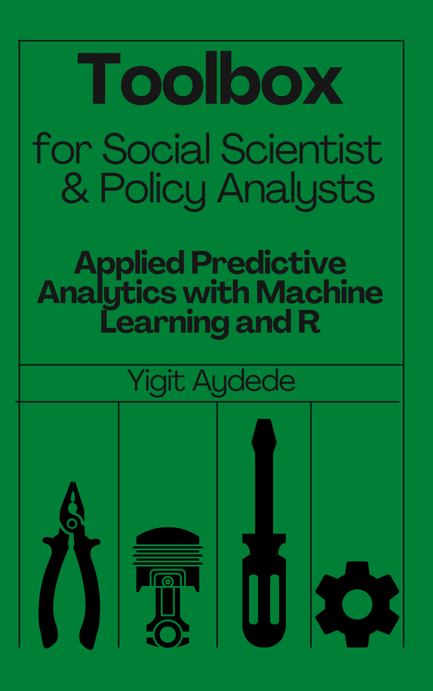

# Preface {.unnumbered}

Our lives are shaped by predictions that we make daily. The process of predicting is not static. We want to improve our predictions to avoid catastrophes in our lives ... We learn from our mistakes. We are all self-learning walking machines with a very limited processing capacity. Can we develop a self-learning algorithm for a high-capacity machine that can make prediction more efficiently and accurately for us? Yes, we can! With the well-developed statistical models programmed in very effective algorithms run by high-capacity computers.

This book takes on the first part, **statistical models**, without too much abstraction. It doesn't teach all aspects of **programming** but enough coding skills that you can find your way in building predictive algorithms with R. All gets into a computer. So, we also need to know enough about the "machines" with which we can facilitate a better efficiency. We have enough of it too ...

```{r, echo=FALSE}

```

According to Leo Breiman [@Breiman_2001], [Statistical Modeling: The Two Cultures](https://projecteuclid.org/download/pdf_1/euclid.ss/1009213726), there are two goals in analyzing the data:

> **Prediction**: To be able to predict what the responses are going to be to future input variables; **Information**: To extract some information about how nature is associating the response variables to the input variables.

And there are two approaches towards those goals:

**The Data Modeling Culture** : One assumes that the data are generated by a given stochastic data model (econometrics) ...\
**Algorithmic Modeling Culture**: One uses algorithmic models and treats the data mechanism as unknown (machine learning) ...

And he describes the current state:

> ...With the insistence on data models, multivariate analysis tools in statistics are frozen at discriminant analysis and logistic regression in classification and multiple linear regression in regression. Nobody really believes that multivariate data is multivariate normal, but that data model occupies a large number of pages in every graduate text book on multivariate statistical analysis...

Broadly speaking, many social scientists look at a statistical analysis from the window of causal inference. They don't focus on predictions, even if "ice cream sales predict crime rates" very well (Pearl et al. 2016). They know that a higher ice cream sales do not cause higher crime rates. What's missing here is that, although a predictive model that accurately predicts outcomes is great, most of the time we don't just need predictions but we want to be able to find the important predictors.  This is specially important when we have unconventional or high-dimensional data. For example, if you build a model of house prices, knowing which features are most predictive of price tells us which features people are willing to pay for. In fact, the use of machine learning models as a means of variable selection is growing in many classification tasks beyond those "*Netflix problems*". Bioinformatics is one the few scientific fields extensively using machine learning methods to select a subset of genetic markers relevant for the prediction of a certain disease, for example.   

Solving these problems requires more than an application of predictive models - a "function" in R or Python.  As I tried to look at predictions from economists' perspective, the book has become a "**toolbox**" for social scientists and policy analysts beyond machine learning "code" applications. It starts with describing a formal distinction between causal inference and prediction and adds many other tools that cannot be easily found in "econometrics" textbooks: nonparametric methods, unbiased variable importance measures, penalized regressions, model selection with sparsity, dimension reduction methods, nonparametric time-series predictions, graphical network analysis, algorithmic optimization methods, classification with imbalanced data, and so on. These are not new, but I collect and cover them from scratch in one book with less abstraction and more applications using R.

## Who {.unnumbered}

This book is targeted at *motivated* students and researchers who have a background in inferential statistics using parametric models. It is applied because I skip many theoretical proofs and justifications that can easily be found elsewhere. I do not assume a previous experience with R but some familiarity with coding.

## Acknowledgements {.unnumbered}

This book was made possible by Mutlu Yuksel, Tolga Kaya, Mehmet Caner, Juri Marcucci, Atul Dar, Andrea Guisto and my wife Isik Aydede. This work is greatly inspired by following books and people:

1.  [Introduction to Statistical Learning](http://faculty.marshall.usc.edu/gareth-james/ISL/) by Gareth James, Daniela Witten, Trevor Hastie and Robert Tibshirani.
2.  [Introduction to Data Science](https://rafalab.github.io/dsbook/) by Rafael A. Irizarry.\
3.  [Applied Statistics with R](https://daviddalpiaz.github.io/appliedstats/) by David Dalpiaz
4.  [R for Statistical Learning](https://daviddalpiaz.github.io/r4sl/) by David Dalpiaz

I also benefited from my participation in the Summer School of [SiDe](https://www.side-iea.it/events/summer-schools) in 2019 on *Machine Learning Algorithms for Econometricians* by [Arthur Carpentier](https://freakonometrics.github.io) and [Emmanuel Flachaire](https://www.amse-aixmarseille.fr/fr/membres/flachaire) and in 2017 on *High-Dimensional Econometrics* by [Anders Bredahl Kock](https://sites.google.com/site/andersbkock/) and [Mehmet Caner](https://poole.ncsu.edu/people/mehmet-caner/).

Finally, I thank my research assistant Kyle Morton. Without him, this book wouldn't be possible.

## License {.unnumbered}

.](png/cc.png)

```{r include=FALSE}
# automatically create a bib database for R packages
knitr::write_bib(c(
  .packages(), 'bookdown', 'knitr', 'rmarkdown'
), 'packages.bib')
```

